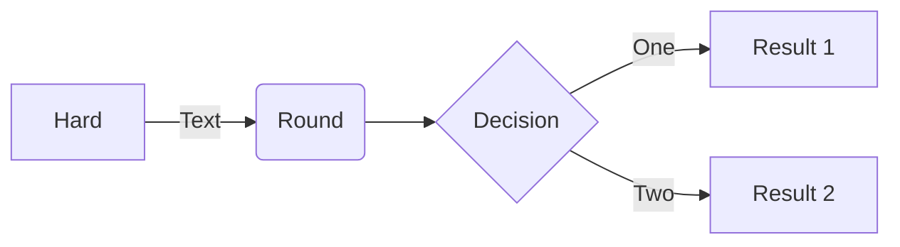
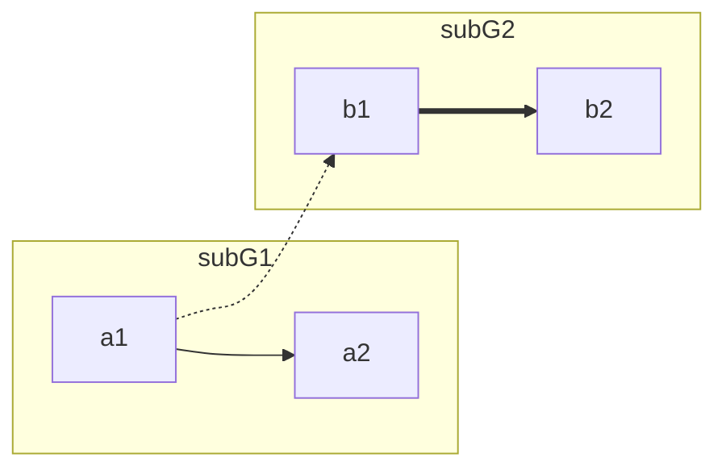

# Flowchart

## OrientationPermalink

- 그림이 그려지는 방향

1. `TD` (or `TB`) : Top to Down
2. `LR` : Left to Right
3. `BT` : Bottom to Top
4. `RL` : Right to Left

## Node and ShapePermalink

1. `nodeID[text]` : nodeID를 ID로 가지고 text를 표시해주는 직사각형 node를 만듬
2. `nodeID(text)` : 코너가 둥그런 직사각형 node를 만듬
3. `nodeID[(text)]` : 원통형 node를 만듬 (ex. Database)
4. `nodeID((text))` : 원 모양의 node를 만듬
5. `nodeID{text}` : 마름모 모양의 node를 만듬

## EdgePermalink

- 화살표 모양을 길게 하면 실제로 길어짐
    - `==>`보다 `=====>`로 하면 훨씬 길게 그려짐

1. `nodeID1 --> nodeID2` : nodeID1와 nodeID2를 화살표로 연결함
2. `nodeID1 --- nodeID2` : nodeID1와 nodeID2를 직선으로 연결함
3. `nodeID1 ---|Text| nodeID2` : nodeID1와 nodeID2를 직선으로 text와 함께 연결함
4. `nodeID1 -->|Text| nodeID2` : nodeID1와 nodeID2를 화살표로 text와 함께 연결함
5. `nodeID1 -.-> nodeID2` : nodeID1와 nodeID2를 점선 화살표로 text와 함께 연결함
6. `nodeID1 ==> nodeID2` : nodeID1와 nodeID2를 두꺼운 화살표로 text와 함께 연결함

## Example

<pre>

</pre>

<pre>

</pre>

---

# Reference

- https://github.com/mermaid-js/mermaid#sequence-diagram-docs---live-editor
- https://frhyme.github.io/mermaid/mermaid_basic00/