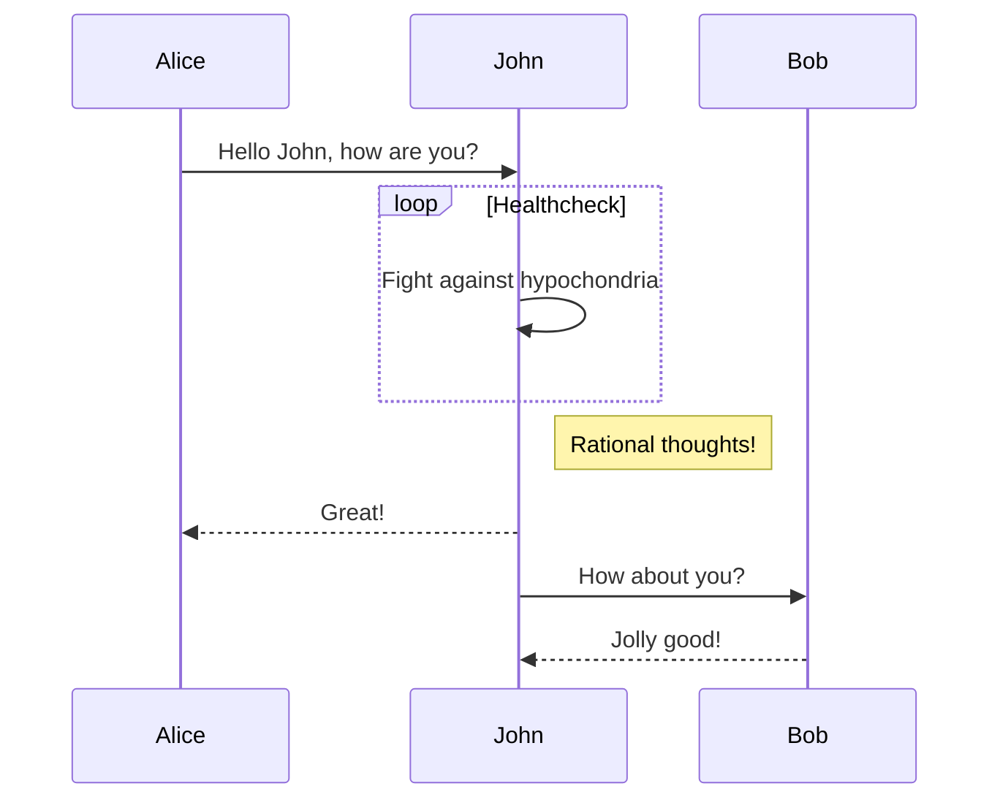

# Sequence diagram



<pre>

</pre>

- 위의 ```loop```는 ```alt```, ```opt```로 바꿔서 rectangle container를 생성할 수도 있음


---


# Reference

- https://github.com/mermaid-js/mermaid#sequence-diagram-docs---live-editor