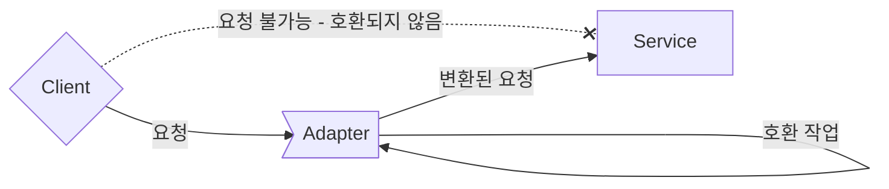
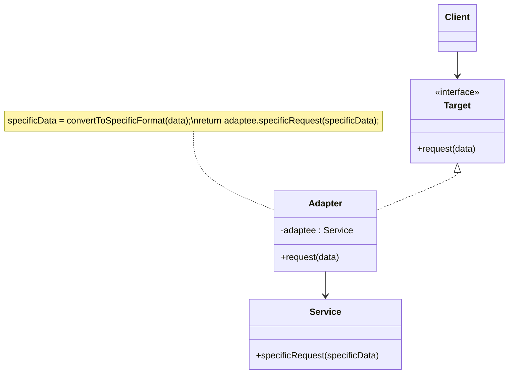
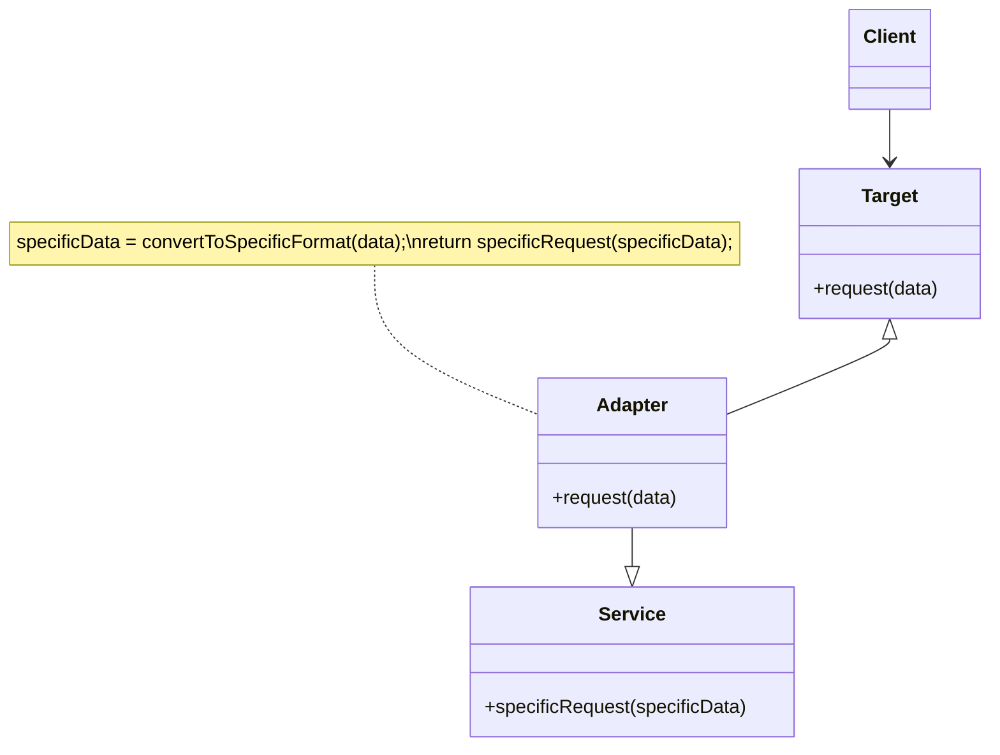

- Adapter Pattern은 **서로 다른 인터페이스를 가지는 두 객체를 연결**하여 사용할 수 있도록 하는 design pattern입니다.
    - interface가 호환되지 않아서 함께 동작할 수 없는 클래스들을 함께 사용할 수 있도록 변환합니다.
    - e.g., 원래 객체와 호환되지 않는 외부 라이브러리나 API를 사용해야 하는 경우, 어댑터 패턴을 적용하면 기존 코드를 재사용하면서 외부 라이브러리나 API를 사용할 수 있습니다.



- Adapter Pattern은 서로 다른 인터페이스를 가진 클래스들이 상호 작용할 수 있도록 합니다.
    - Adapter Pattern을 사용하면 클래스의 인터페이스를 다른 인터페이스로 변환할 수 있습니다.
    - 기존의 클래스를 수정하지 않고도 특정 인터페이스를 변환하여 다른 코드에서 그대로 사용하는 것이 가능합니다.

- interface를 변환하는 adapter를 만들어, 호환되지 않는 interface를 사용하는 client를 그대로 활용할 수 있습니다.
    - client와 구현된 interface를 분리시킬 수 있습니다.
        - client를 특정 구현이 아닌 interface에 연결시키기 때문입니다.
        - target interface만 제대로 지킨다면, 나중에 다른 구현을 추가하는 것도 가능합니다.
    - 나중에 interface가 바뀌더라도 변경할 부분은 adapter에 캡슐화(encapsulation)되어 있기 때문에 client는 바뀔 필요가 없습니다.
    - 여러 interface를 모두 지원하는 adapter를 Two Way Adapter(다중 Adapter)라고 부릅니다.

- Adapter Pattern은 adapter가 legacy 인터페이스를 감싸서 새로운 인터페이스로 변환하기 때문에 Wrapper Pattern이라고도 합니다.

- MVC 디자인 패턴에서도 어댑터 패턴이 사용됩니다.
    - MVC 디자인 패턴에서 모델과 뷰 사이에 컨트롤러를 두어 모델과 뷰를 연결합니다.
    - 이때, 어댑터 패턴을 이용하여 모델과 뷰의 인터페이스를 변환하면, 컨트롤러에서 모델과 뷰를 쉽게 연결할 수 있습니다.

- 어댑터 패턴을 다른 패턴과 결합하여 더욱 효과적으로 사용할 수 있습니다.
    - 어댑터 패턴은 다른 패턴들과 결합하여 사용하기 좋습니다.
    - e.g., 빌더 패턴과 어댑터 패턴을 결합하여, 새로운 객체를 생성하면서 외부 라이브러리나 API와 연결할 수 있습니다.

- Adapter Pattern은 Facade pattern, Decorator Pattern과 비슷합니다.
    - 세 pattern 모두 객체를 감싸서 호환되지 않는 interface를 client가 사용할 수 있게 합니다.
    - 그러나 목적에 차이가 있기 때문에 다른 pattern으로 분류되어 있습니다.
        - Adapter Pattern는 한 interface를 다른 interface로 변환하는 것이 목적입니다.
        - Decorator Pattern은 interface는 바꾸지 않고 책임(기능)만 추가하는 것이 목적입니다.
        - Facade pattern는 interface를 간단하게 바꾸는 것이 목적입니다.


---


## Class 구조

- client는 target interface와 adapter를 통해 adaptee service를 사용합니다.
    1. client에서 target interface를 사용하여 method를 호출함으로써 adapter에 요청을 합니다.
    2. adapter는 adaptee interface를 사용하여 client의 요청을 adaptee service에 대한 하나 이상의 method 호출로 변환합니다.
        - client와 adaptee service는 분리되어 있기 때문에 서로를 알지 못합니다.
    3. client에서 호출 결과를 받습니다.
        - 중간에 adapter가 있는지는 전혀 알지 못합니다.
        
- `Client` : adaptee service를 adapter를 통해 이용합니다.
    - client는 target interface만 알고 있으며, target interface와 adapter를 통해 adaptee service를 이용할 수 있게 됩니다.

- `Target` : 클라이언트가 접근해서 사용할 고수준의 어댑터 모듈입니다.
    - client가 adapter를 사용할 수 있도록 합니다.
    - target interface의 구현은 adapter가 합니다.

- `Adapter` : client가 adaptee service를 사용할 수 있도록 합니다.
    - client와 adaptee service 중간에서 호환 작업을 맡습니다.
    - adapter는 구현 방식에 따라 Object Adapter와 Class Adapter로 나뉩니다.
        - Object Adapter는 합성(composition)을 이용하여 구현한 adapter입니다.
        - Class Adapter는 상속(inheritance)을 이용하여 구현한 adapter입니다.

- `Service` : adapter의 호환 작업 대상(adaptee)입니다.
    - client가 최종적으로 사용하고자 하는 service입니다.
        - 클라이언트에서 사용하고 싶지만, 호환이 안되서 바로 사용할 수 없는 service입니다.
    - 기존 system, 외부 system, third party library 등이 service에 해당됩니다.


### Object Adapter



- 합성(composition)된 adaptee service 객체에게 모든 **요청을 위임**하는 방식으로 변환 작업을 합니다.
    - 합성을 활용했기 때문에 runtime 중에 adaptee가 결정되어 상속 방식(Class Adapter)보다 유연합니다.
    - 그러나 adaptee 객체를 field 변수로 저장해야 하기 때문에, 공간(memory) 차지 비용이 듭니다.

```java
class Client {
    public static void main(String[] args) {
        Target adapter = new Adapter(new Service());    // 기존 service를 인자로 받아 호환 작업을 처리합니다.
        adapter.request(1);    // target interface의 spec에 따라 method를 호출하여 기존 service를 사용합니다.
    }
}
```

```java
interface Target {
    void request(int data);    // client는 adaptee service를 사용하기 위해 이 method에 접근합니다.
}
```

```java
class Adapter implements Target {
    Service adaptee;    // service 객체를 class field로 합성(composition)합니다.

    Adapter(Service adaptee) {
        this.adaptee = adaptee;    // 어댑터를 생성할 때 호환시킬 기존 서비스를 설정합니다.
    }

    public void request(int data) {
        adaptee.specificRequest(data);    // 어댑터의 메소드가 호출되면, adaptee(service)의 메소드를 호출하도록 '위임'합니다.
    }
}
```

```java
class Service {
    void specificRequest(int specificData) {
        System.out.println("기존 서비스 기능 호출 + " + specificData);
    }
}
```


### Class Adapter



- adaptee(service) 클래스를 상속(inheritance)받아, **부모의 method를 호출**하는 방식으로 변환 작업을 합니다.
    - 상속은 기존에 구현된 코드를 재사용하는 대표적인 방식입니다.
    - adapter가 adaptee와 target interface 모두를 상속받기 때문에, adapter는 객체 구현 없이 바로 adaptee의 code를 재사용할 수 있습니다.
    - 그러나 다중 상속을 지원하지 않는 언어(e.g., Java, C#)에서는 Class Adapter를 사용할 수 없습니다.

```java
class Client {
    public static void main(String[] args) {
        Target adapter = new Adapter();    // Object Adapter와 달리 기존 service를 인자로 받을 필요가 없습니다.
        adapter.request(1);
    }
}
```

```java
interface Target {
    void request(int data);
}
```

```java
class Adapter extends Service implements Target {
    public void request(int data) {
        specificRequest(data);    // 어댑터의 메소드가 호출되면, '상속'받은 부모 클래스 adaptee(service)의 메소드를 호출합니다.
    }
}
```

```java
class Service {
    void specificRequest(int specificData) {
        System.out.println("기존 서비스 기능 호출 + " + specificData);
    }
}
```


---


## Example : 오리 Adapter로 감싼 칠면조

- 오리처럼 걷고 꽥꽥거린다면, 반드시 오리가 아니라 오리 adapter로 감싼 칠면조일 수도 있습니다.
- 이 예제는 `Duck`을 `Turkey`로, `Turkey`를 `Duck`으로, `Duck`을 `Dron`으로 변환합니다.

### Client

```java
public class DuckTestDrive {
    public static void main(String[] args) {
        Duck duck = new MallardDuck();

        Turkey turkey = new WildTurkey();
        Duck turkeyAdapter = new TurkeyAdapter(turkey);

        System.out.println("The Turkey says...");
        turkey.gobble();
        turkey.fly();

        System.out.println("\nThe Duck says...");
        testDuck(duck);

        System.out.println("\nThe TurkeyAdapter says...");
        testDuck(turkeyAdapter);
        

        Drone drone = new SuperDrone();
        Duck droneAdapter = new DroneAdapter(drone);
        testDuck(droneAdapter);
    }

    static void testDuck(Duck duck) {
        duck.quack();
        duck.fly();
    }
}
```

```java
public class TurkeyTestDrive {
    public static void main(String[] args) {
        MallardDuck duck = new MallardDuck();
        Turkey duckAdapter = new DuckAdapter(duck);
 
        for (int i = 0; i < 10; i++) {
            System.out.println("The DuckAdapter says...");
            duckAdapter.gobble();
            duckAdapter.fly();
        }
    }
}
```

### Adapter

```java
public class DuckAdapter implements Turkey {
    Duck duck;
    Random rand;
 
    public DuckAdapter(Duck duck) {
        this.duck = duck;
        rand = new Random();
    }
    
    public void gobble() {
        duck.quack();
    }
  
    public void fly() {
        if (rand.nextInt(5)  == 0) {
             duck.fly();
        }
    }
}
```

```java
public class TurkeyAdapter implements Duck {
    Turkey turkey;
 
    public TurkeyAdapter(Turkey turkey) {
        this.turkey = turkey;
    }
    
    public void quack() {
        turkey.gobble();
    }
  
    public void fly() {
        for (int i = 0; i < 5; i++) {
            turkey.fly();
        }
    }
}
```

```java
public class DroneAdapter implements Duck {
    Drone drone;
 
    public DroneAdapter(Drone drone) {
        this.drone = drone;
    }
    
    public void quack() {
        drone.beep();
    }
  
    public void fly() {
        drone.spinRotors();
        drone.takeOff();
    }
}
```

### Duck

```java
public interface Duck {
    public void quack();
    public void fly();
}
```

```java
public class MallardDuck implements Duck {
    public void quack() {
        System.out.println("Quack");
    }
 
    public void fly() {
        System.out.println("I'm flying");
    }
}
```

### Turkey

```java
public interface Turkey {
    public void gobble();
    public void fly();
}
```

```java
public class WildTurkey implements Turkey {
    public void gobble() {
        System.out.println("Gobble gobble");
    }
 
    public void fly() {
        System.out.println("I'm flying a short distance");
    }
}
```

### Dron

```java
public interface Drone {
    public void beep();
    public void spinRotors();
    public void takeOff();
}
```

```java
public class SuperDrone implements Drone {
    public void beep() {
        System.out.println("Beep beep beep");
    }
    public void spinRotors() {
        System.out.println("Rotors are spinning");
    }
    public void takeOff() {
        System.out.println("Taking off");
    }
}
```


---


## Reference

- Head First Design Patterns - Eric Freeman, Elisabeth Robson, Bert Bates, Kathy Sierra
- <https://inpa.tistory.com/entry/GOF-💠-어댑터Adaptor-패턴-제대로-배워보자>
