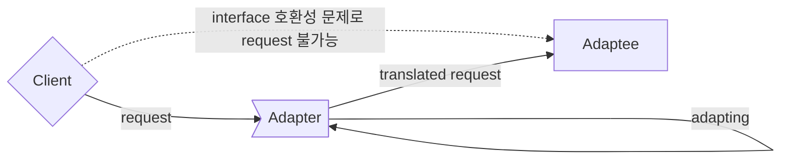
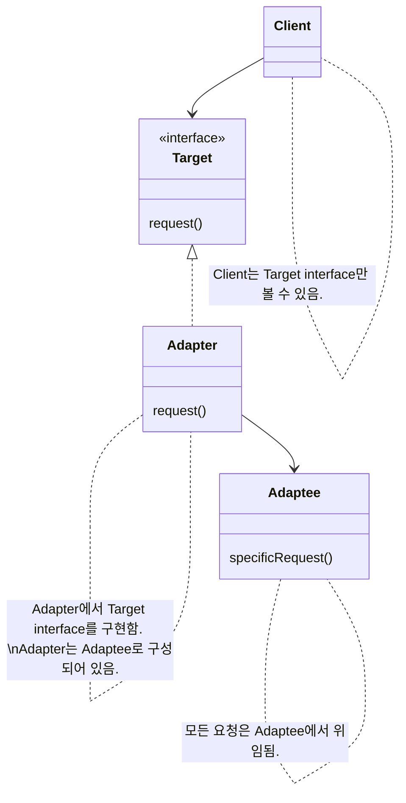
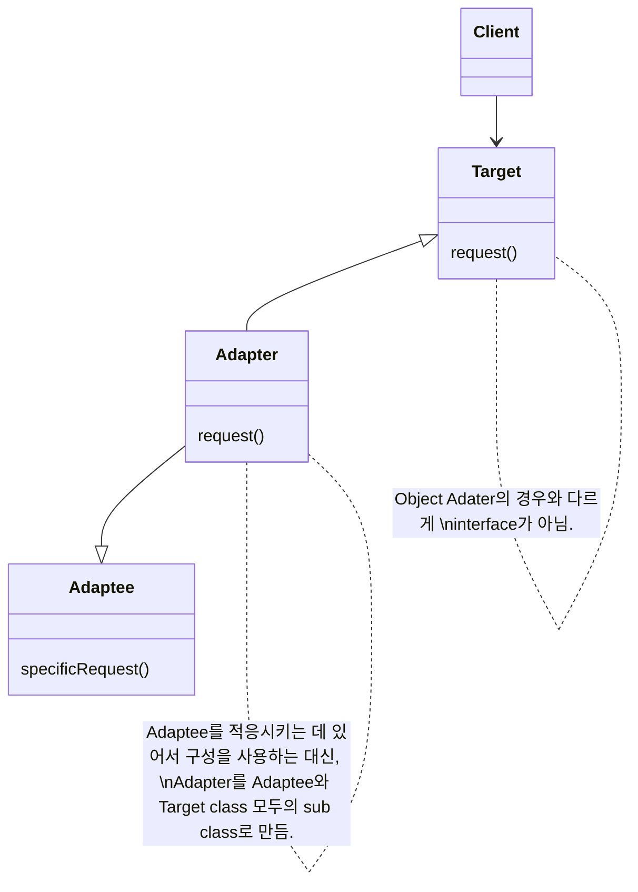

- Adapter Pattern은 서로 다른 인터페이스를 가지는 두 객체를 연결하여 사용할 수 있도록 하는 design pattern입니다.
    - interface가 호환되지 않아서 함께 동작할 수 없는 클래스들을 함께 사용할 수 있도록 변환합니다.
    - e.g., 원래 객체와 호환되지 않는 외부 라이브러리나 API를 사용해야 하는 경우, 어댑터 패턴을 적용하면 기존 코드를 재사용하면서 외부 라이브러리나 API를 사용할 수 있습니다.



- Adapter Pattern은 서로 다른 인터페이스를 가진 클래스들이 상호 작용할 수 있도록 합니다.
    - Adapter Pattern을 사용하면 클래스의 인터페이스를 다른 인터페이스로 변환할 수 있습니다.
    - 기존의 클래스를 수정하지 않고도 특정 인터페이스를 변환하여 다른 코드에서 그대로 사용하는 것이 가능합니다.

- Adapter Pattern은 adapter가 legacy 인터페이스를 감싸서 새로운 인터페이스로 변환하기 때문에 Wrapper Pattern이라고도 합니다.

- MVC 디자인 패턴에서도 어댑터 패턴이 사용됩니다.
    - MVC 디자인 패턴에서 모델과 뷰 사이에 컨트롤러를 두어 모델과 뷰를 연결합니다.
    - 이때, 어댑터 패턴을 이용하여 모델과 뷰의 인터페이스를 변환하면, 컨트롤러에서 모델과 뷰를 쉽게 연결할 수 있습니다.

- 어댑터 패턴을 다른 패턴과 결합하여 더욱 효과적으로 사용할 수 있습니다.
    - 어댑터 패턴은 다른 패턴들과 결합하여 사용하기 좋습니다.
    - e.g., 빌더 패턴과 어댑터 패턴을 결합하여, 새로운 객체를 생성하면서 외부 라이브러리나 API와 연결할 수 있습니다.

- Adapter Pattern은 Facade pattern, Decorator Pattern과 비슷합니다.
    - 세 pattern 모두 객체를 감싸서 호환되지 않는 interface를 client가 사용할 수 있게 합니다.
    - 그러나 목적에 차이가 있기 때문에 다른 pattern으로 분류합니다.
        - Adapter Pattern는 한 interface를 다른 interface로 변환하는 것이 목적입니다.
        - Decorator Pattern은 interface는 바꾸지 않고 책임(기능)만 추가하는 것이 목적입니다.
        - Facade pattern는 interface를 간단하게 바꾸는 것이 목적입니다.


## Class 구조

- 여러 interface를 모두 지원하는 adapter를 'Two Way Adapter (다중 Adapter)'라고 부릅니다.


- class의 interface를 client에서 사용하고자 하는 다른 interface로 변환합니다.
    - adapter를 이용하면 interface 호환성 문제 때문에 같이 쓸 수 없는 class들을 연결해서 쓸 수 있습니다.
    - 기존의 클래스 인터페이스를 사용자가 기대하는 다른 인터페이스로 변환시켜, 인터페이스 호환성 문제 없이 서로 다른 클래스들을 결합하여 사용할 수 있도록 합니다.

- 'adaptee'는 호환 작업이 끝난 interface를 사용하는 class입니다.
    - adapter를 가운데 두고 client와 정반대 위치에 있습니다.

- interface를 변환하는 adapter를 만들어, 호환되지 않는 interface를 사용하는 client를 그대로 활용할 수 있습니다.
    - client와 구현된 interface를 분리시킬 수 있음
        - Client를 특정 구현이 아닌 interface에 연결 시키기 때문
        - Target interface만 제대로 지킨다면, 나중에 다른 구현을 추가하는 것도 가능함
    - 나중에 interface가 바뀌더라도 변경 내역은 Adapter에 캡슐화(encapsulation)되기 때문에 Client는 바뀔 필요가 없음


### Client에서 Adapter를 사용하는 방법

1. client에서 target interface를 사용하여 method를 호출함으로써 adapter에 요청을 합니다.
2. adapter에서는 adaptee interface를 사용하여 그 요청을 adaptee에 대한 (하나 이상의) method 호출로 변환합니다.
    - client와 adaptee는 분리되어 있기 때문에 서로를 알지 못합니다.
3. Client에서 호출 결과를 받습니다.
    - 중간에 adapter가 있는지는 전혀 알지 못합니다.


### Object Adapter

- 객체의 구성(composition)을 사용합니다.

- 장점
    - Adaptee의 어떤 sub class에 대해서도 Adapter로 쓸 수 있음
    - 유연함
- 단점
    - Adaptee의 sub class에 새로운 행동을 추가하면, sub class reference 참고하여 구현해야 함
        - Class Adapter는 이 과정이 필요 없음




### Class Adapter

- 다중 상속을 사용합니다.

- 장점
    - Adaptee 전체를 다시 구현하지 않아도 됨
    - sub class기 때문에 Adaptee의 행동을 override할 수 있음
        - 변경할 때 많은 곳을 수정하지 않아도 됨
- 단점
    - 특정 Adaptee class에만 적용됨
    - Java 등의 다중 상속을 지원하지 않는 언어에서는 사용할 수 없음




---


## Example : 오리 Adapter로 감싼 칠면조

- 오리처럼 걷고 꽥꽥거린다면, 반드시 오리가 아니라 오리 adapter로 감싼 칠면조일 수도 있습니다.
- 이 예제는 Duck을 Turkey로, Turkey를 Duck으로, Duck을 Dron으로 변환합니다.


### Code

#### Client

```java
public class DuckTestDrive {
    public static void main(String[] args) {
        Duck duck = new MallardDuck();

        Turkey turkey = new WildTurkey();
        Duck turkeyAdapter = new TurkeyAdapter(turkey);

        System.out.println("The Turkey says...");
        turkey.gobble();
        turkey.fly();

        System.out.println("\nThe Duck says...");
        testDuck(duck);

        System.out.println("\nThe TurkeyAdapter says...");
        testDuck(turkeyAdapter);
        

        Drone drone = new SuperDrone();
        Duck droneAdapter = new DroneAdapter(drone);
        testDuck(droneAdapter);
    }

    static void testDuck(Duck duck) {
        duck.quack();
        duck.fly();
    }
}
```

```java
public class TurkeyTestDrive {
    public static void main(String[] args) {
        MallardDuck duck = new MallardDuck();
        Turkey duckAdapter = new DuckAdapter(duck);
 
        for (int i = 0; i < 10; i++) {
            System.out.println("The DuckAdapter says...");
            duckAdapter.gobble();
            duckAdapter.fly();
        }
    }
}
```

#### Adapter

```java
public class DuckAdapter implements Turkey {
    Duck duck;
    Random rand;
 
    public DuckAdapter(Duck duck) {
        this.duck = duck;
        rand = new Random();
    }
    
    public void gobble() {
        duck.quack();
    }
  
    public void fly() {
        if (rand.nextInt(5)  == 0) {
             duck.fly();
        }
    }
}
```

```java
public class TurkeyAdapter implements Duck {
    Turkey turkey;
 
    public TurkeyAdapter(Turkey turkey) {
        this.turkey = turkey;
    }
    
    public void quack() {
        turkey.gobble();
    }
  
    public void fly() {
        for (int i = 0; i < 5; i++) {
            turkey.fly();
        }
    }
}
```

```java
public class DroneAdapter implements Duck {
    Drone drone;
 
    public DroneAdapter(Drone drone) {
        this.drone = drone;
    }
    
    public void quack() {
        drone.beep();
    }
  
    public void fly() {
        drone.spinRotors();
        drone.takeOff();
    }
}
```

#### Duck

```java
public interface Duck {
    public void quack();
    public void fly();
}
```

```java
public class MallardDuck implements Duck {
    public void quack() {
        System.out.println("Quack");
    }
 
    public void fly() {
        System.out.println("I'm flying");
    }
}
```

#### Turkey

```java
public interface Turkey {
    public void gobble();
    public void fly();
}
```

```java
public class WildTurkey implements Turkey {
    public void gobble() {
        System.out.println("Gobble gobble");
    }
 
    public void fly() {
        System.out.println("I'm flying a short distance");
    }
}
```

#### Dron

```java
public interface Drone {
    public void beep();
    public void spinRotors();
    public void takeOff();
}
```

```java
public class SuperDrone implements Drone {
    public void beep() {
        System.out.println("Beep beep beep");
    }
    public void spinRotors() {
        System.out.println("Rotors are spinning");
    }
    public void takeOff() {
        System.out.println("Taking off");
    }
}
```


---


## Reference

- Head First Design Patterns - Eric Freeman, Elisabeth Robson, Bert Bates, Kathy Sierra
- <https://inpa.tistory.com/entry/GOF-💠-어댑터Adaptor-패턴-제대로-배워보자>
