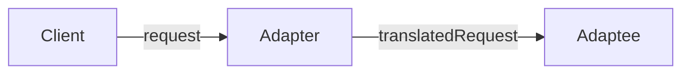

- Adapter Pattern은 호환되지 않는 인터페이스들을 연결하는 구조적 design pattern입니다.
    - 기존의 클래스를 수정하지 않고도, 특정 인터페이스를 필요로 하는 코드에서 사용할 수 있게 해줍니다.
    - 또한 클래스의 인터페이스를 다른 인터페이스로 변환할 수도 있습니다.
    - 이를 통해 서로 다른 인터페이스를 가진 클래스들이 상호 작용할 수 있도록 해서 코드의 재사용성을 높입니다.
    


- 어댑터 패턴(Adapter Pattern)은 서로 다른 인터페이스를 가지는 두 객체를 연결하여 사용할 수 있도록 하는 구조적인 패턴입니다.
- 어댑터 패턴을 이용하면, 기존에 작성된 코드를 재사용할 수 있으며, 객체 간의 결합도를 낮출 수 있습니다.

어댑터 패턴은 서로 다른 인터페이스를 가지는 두 객체를 연결하여 사용할 수 있도록 하는 패턴입니다. 어댑터 패턴을 이용하면, 기존 코드를 재사용할 수 있으며, 객체 간의 결합도를 낮출 수 있습니다. 하지만, 어댑터 패턴 적용 시 추가적인 객체 생성이 필요하므로 메모리 사용량이 증가할 수 있으며, 기존 코드를 재사용하지만, 인터페이스를 변환하기 위한 코드가 추가됩니다. 따라서, 어댑터 패턴을 적용할 때에는, 상황에 맞게 적절한 패턴을 선택하여 사용해야 합니다.

어댑터 패턴의 예시로는, 원래 객체와 호환되지 않는 외부 라이브러리나 API를 사용해야 하는 경우가 있습니다. 이런 경우, 어댑터 패턴을 이용하여 기존 코드를 재사용하면서 외부 라이브러리나 API를 사용할 수 있습니다.

또한, 어댑터 패턴은 MVC 디자인 패턴에서도 사용됩니다. MVC 디자인 패턴에서 모델과 뷰 사이에 컨트롤러를 두어 모델과 뷰를 연결합니다. 이때, 어댑터 패턴을 이용하여 모델과 뷰의 인터페이스를 변환하면, 컨트롤러에서 모델과 뷰를 쉽게 연결할 수 있습니다.

어댑터 패턴은 다른 패턴들과 결합하여 사용될 수 있습니다. 예를 들어, 빌더 패턴과 어댑터 패턴을 결합하여, 새로운 객체를 생성하면서 외부 라이브러리나 API와 연결할 수 있습니다. 따라서, 어댑터 패턴은 다른 패턴들과 함께 사용하여 더욱 강력한 솔루션을 제공할 수 있습니다.
    


- class의 interface를 client에서 사용하고자 하는 다른 interface로 변환합니다.
    - adapter를 이용하면 interface 호환성 문제 때문에 같이 쓸 수 없는 class들을 연결해서 쓸 수 있습니다.
    - 기존의 클래스 인터페이스를 사용자가 기대하는 다른 인터페이스로 변환시켜, 인터페이스 호환성 문제 없이 서로 다른 클래스들을 결합하여 사용할 수 있도록 합니다.

- 'adaptee'는 호환 작업이 끝난 interface를 사용하는 class입니다.
    - adapter를 가운데 두고 client와 정반대 위치에 있습니다.




- interface를 변환하는 adapter를 만들어, 호환되지 않는 interface를 사용하는 client를 그대로 활용할 수 있습니다.
    - client와 구현된 interface를 분리시킬 수 있음
        - Client를 특정 구현이 아닌 interface에 연결 시키기 때문
        - Target interface만 제대로 지킨다면, 나중에 다른 구현을 추가하는 것도 가능함
    - 나중에 interface가 바뀌더라도 변경 내역은 Adapter에 캡슐화(encapsulation)되기 때문에 Client는 바뀔 필요가 없음


- Client에서 Adapter를 사용하는 방법
    1. Client에서 Target interface를 사용하여 method를 호출함으로써 Adapter에 요청을 함
    2. Adapter에서는 Adaptee interface를 사용하여 그 요청을 Adaptee에 대한 (하나 이상의) method 호출로 변환함
        - Client와 Adaptee는 분리되어 있기 때문에 서로를 알지 못함
    3. Client에서 호출 결과를 받음
        - 중간에 Adapter가 껴 있는지는 전혀 알지 못함

- 여러 interface를 모두 지원하는 adapter를 'Two Way Adapter (다중 Adapter)"라고 부릅니다.

- Target interface의 크기와 구조에 따라 coding해야할 분량이 결정됨

- Decorator Pattern & Adapter Pattern & Facade pattern
    - 공통점
        - 객체를 감싸서 호환되지 않는 interface를 Client가 사용할 수 있게 함
    - 차이점
        - Decorator Pattern : interface는 바꾸지 않고 책임(기능)만 추가
        - Adapter Pattern : 한 interface를 다른 interface로 변환
        - Facade pattern : interface를 간단하게 바꿈


## Object Adapter & Class Adapter

### Object Adapter

- 객체 구성(composition)을 사용함
    - 장점
        - Adaptee의 어떤 sub class에 대해서도 Adapter로 쓸 수 있음
        - 유연함
    - 단점
        - Adaptee의 sub class에 새로운 행동을 추가하면, sub class reference 참고하여 구현해야 함
            - Class Adapter는 이 과정이 필요 없음


### Class Adapter

- 다중 상속을 사용함
    - 장점
        - Adaptee 전체를 다시 구현하지 않아도 됨
        - sub class기 때문에 Adaptee의 행동을 override할 수 있음
            - 변경할 때 많은 곳을 수정하지 않아도 됨
    - 단점
        - 특정 Adaptee class에만 적용됨
        - 다중 상속을 지원하지 않는 언어(ex. Java)에서는 사용할 수 없음


---


# Example : 오리 Adapter로 감싼 칠면조

- 오리처럼 걷고 꽥꽥거린다면, 반드시 오리가 아니라 오리 Adapter로 감싼 칠면조일 수도 있습니다.

- Duck <-> Turkey 변환
- Duck <-> Dron 변환


## Code


### Client

```java
public class DuckTestDrive {
    public static void main(String[] args) {
        Duck duck = new MallardDuck();

        Turkey turkey = new WildTurkey();
        Duck turkeyAdapter = new TurkeyAdapter(turkey);

        System.out.println("The Turkey says...");
        turkey.gobble();
        turkey.fly();

        System.out.println("\nThe Duck says...");
        testDuck(duck);

        System.out.println("\nThe TurkeyAdapter says...");
        testDuck(turkeyAdapter);
        

        Drone drone = new SuperDrone();
        Duck droneAdapter = new DroneAdapter(drone);
        testDuck(droneAdapter);
    }

    static void testDuck(Duck duck) {
        duck.quack();
        duck.fly();
    }
}
```

```java
public class TurkeyTestDrive {
    public static void main(String[] args) {
        MallardDuck duck = new MallardDuck();
        Turkey duckAdapter = new DuckAdapter(duck);
 
        for (int i = 0; i < 10; i++) {
            System.out.println("The DuckAdapter says...");
            duckAdapter.gobble();
            duckAdapter.fly();
        }
    }
}
```


### Adapter

```java
public class DuckAdapter implements Turkey {
    Duck duck;
    Random rand;
 
    public DuckAdapter(Duck duck) {
        this.duck = duck;
        rand = new Random();
    }
    
    public void gobble() {
        duck.quack();
    }
  
    public void fly() {
        if (rand.nextInt(5)  == 0) {
             duck.fly();
        }
    }
}
```

```java
public class TurkeyAdapter implements Duck {
    Turkey turkey;
 
    public TurkeyAdapter(Turkey turkey) {
        this.turkey = turkey;
    }
    
    public void quack() {
        turkey.gobble();
    }
  
    public void fly() {
        for (int i = 0; i < 5; i++) {
            turkey.fly();
        }
    }
}
```

```java
public class DroneAdapter implements Duck {
    Drone drone;
 
    public DroneAdapter(Drone drone) {
        this.drone = drone;
    }
    
    public void quack() {
        drone.beep();
    }
  
    public void fly() {
        drone.spinRotors();
        drone.takeOff();
    }
}
```


### Duck

```java
public interface Duck {
    public void quack();
    public void fly();
}
```

```java
public class MallardDuck implements Duck {
    public void quack() {
        System.out.println("Quack");
    }
 
    public void fly() {
        System.out.println("I'm flying");
    }
}
```


### Turkey

```java
public interface Turkey {
    public void gobble();
    public void fly();
}
```

```java
public class WildTurkey implements Turkey {
    public void gobble() {
        System.out.println("Gobble gobble");
    }
 
    public void fly() {
        System.out.println("I'm flying a short distance");
    }
}
```


### Dron

```java
public interface Drone {
    public void beep();
    public void spinRotors();
    public void takeOff();
}
```

```java
public class SuperDrone implements Drone {
    public void beep() {
        System.out.println("Beep beep beep");
    }
    public void spinRotors() {
        System.out.println("Rotors are spinning");
    }
    public void takeOff() {
        System.out.println("Taking off");
    }
}
```


---


## Reference

- Head First Design Patterns - Eric Freeman, Elisabeth Robson, Bert Bates, Kathy Sierra
