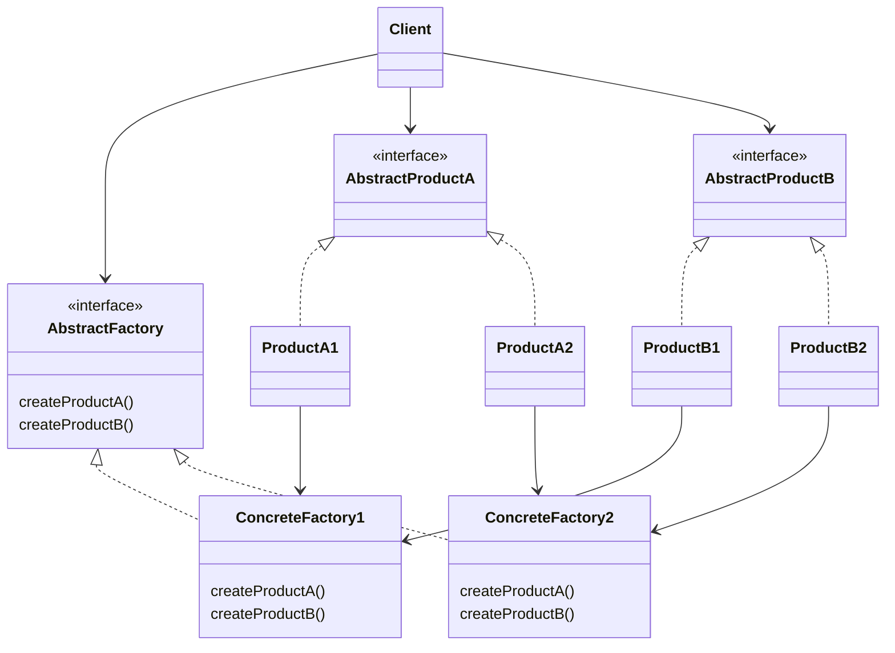
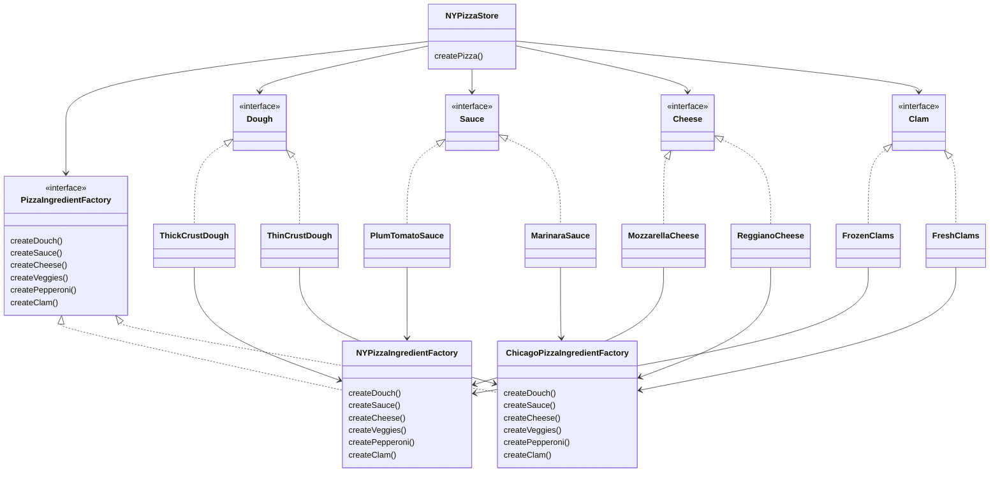

## Abstract Factory Pattern

```
Abstract Factory Pattern에서는 interface를 이용하여 서로 연관된, 또는 의존하는 객체를 concrete class를 지정하지 않고도 생성할 수 있습니다.
```

- Abstract Factory Pattern를 사용하면, client가 concrete class에 직접 의존하지 않고, 서로 관련된 객체들로 이루어진 제품군을 만들 수 있습니다.
    - interface 또는 abstract class를 통해서 일련의 제품들을 공급받을 수 있습니다.
    - client는 실제로 어떤 제품이 생산되는지는 전혀 알 필요가 없습니다.
    - client와 factory에서 생산되는 제품을 분리시킬 수 있습니다.


---


## Class Diagram




---


## Abstract Factory Pattern Example : Pizza 가게


### Factory Method Pattern -> Abstract Factory Pattern

- pizza 가게들이 pizza의 원재료를 다른 것을 사용하지 못하도록 강제하기 위해 재료 factory를 추가하는 상황입니다.
- 추상 factory(abstract factory)를 도입해서 서로 다른 pizza에서 필요로 하는 원재료군을 생산하기 위한 방법을 구축함
    - 제품군을 생성하기 위한 interface를 제공함
    - 이 interface를 이용하느 code를 만들면 code를 제품을 생산하는 실제 factory와 분리시킬 수 있음


### Class Diagram




### Code


#### Main

```java
public class PizzaTestDrive {
 
    public static void main(String[] args) {
        PizzaStore nyStore = new NYPizzaStore();
        PizzaStore chicagoStore = new ChicagoPizzaStore();
 
        Pizza pizza = nyStore.orderPizza("cheese");
        System.out.println("Ethan ordered a " + pizza + "\n");
 
        pizza = chicagoStore.orderPizza("cheese");
        System.out.println("Joel ordered a " + pizza + "\n");

        pizza = nyStore.orderPizza("clam");
        System.out.println("Ethan ordered a " + pizza + "\n");
 
        pizza = chicagoStore.orderPizza("clam");
        System.out.println("Joel ordered a " + pizza + "\n");

        pizza = nyStore.orderPizza("pepperoni");
        System.out.println("Ethan ordered a " + pizza + "\n");
 
        pizza = chicagoStore.orderPizza("pepperoni");
        System.out.println("Joel ordered a " + pizza + "\n");

        pizza = nyStore.orderPizza("veggie");
        System.out.println("Ethan ordered a " + pizza + "\n");
 
        pizza = chicagoStore.orderPizza("veggie");
        System.out.println("Joel ordered a " + pizza + "\n");
    }
}
```


#### PizzaStore

```java
public abstract class PizzaStore {
 
    protected abstract Pizza createPizza(String item);
 
    public Pizza orderPizza(String type) {
        Pizza pizza = createPizza(type);
        System.out.println("--- Making a " + pizza.getName() + " ---");
        pizza.prepare();
        pizza.bake();
        pizza.cut();
        pizza.box();
        return pizza;
    }
}
```


#### PizzaStore Sub Class

```java
public class NYPizzaStore extends PizzaStore {
 
    protected Pizza createPizza(String item) {
        Pizza pizza = null;
        PizzaIngredientFactory ingredientFactory = 
            new NYPizzaIngredientFactory();
 
        if (item.equals("cheese")) {
  
            pizza = new CheesePizza(ingredientFactory);
            pizza.setName("New York Style Cheese Pizza");
  
        } else if (item.equals("veggie")) {
 
            pizza = new VeggiePizza(ingredientFactory);
            pizza.setName("New York Style Veggie Pizza");
 
        } else if (item.equals("clam")) {
 
            pizza = new ClamPizza(ingredientFactory);
            pizza.setName("New York Style Clam Pizza");
 
        } else if (item.equals("pepperoni")) {

            pizza = new PepperoniPizza(ingredientFactory);
            pizza.setName("New York Style Pepperoni Pizza");
 
        } 
        return pizza;
    }
}
```

```java
public class ChicagoPizzaStore extends PizzaStore {

    protected Pizza createPizza(String item) {
        Pizza pizza = null;
        PizzaIngredientFactory ingredientFactory =
        new ChicagoPizzaIngredientFactory();

        if (item.equals("cheese")) {

            pizza = new CheesePizza(ingredientFactory);
            pizza.setName("Chicago Style Cheese Pizza");

        } else if (item.equals("veggie")) {

            pizza = new VeggiePizza(ingredientFactory);
            pizza.setName("Chicago Style Veggie Pizza");

        } else if (item.equals("clam")) {

            pizza = new ClamPizza(ingredientFactory);
            pizza.setName("Chicago Style Clam Pizza");

        } else if (item.equals("pepperoni")) {

            pizza = new PepperoniPizza(ingredientFactory);
            pizza.setName("Chicago Style Pepperoni Pizza");

        }
        return pizza;
    }
}
```


#### Pizza

```java
public abstract class Pizza {
    String name;

    Dough dough;
    Sauce sauce;
    Veggies veggies[];
    Cheese cheese;
    Pepperoni pepperoni;
    Clams clam;

    abstract void prepare();

    void bake() {
        System.out.println("Bake for 25 minutes at 350");
    }

    void cut() {
        System.out.println("Cutting the pizza into diagonal slices");
    }

    void box() {
        System.out.println("Place pizza in official PizzaStore box");
    }

    void setName(String name) {
        this.name = name;
    }

    String getName() {
        return name;
    }

    public String toString() {
        StringBuffer result = new StringBuffer();
        result.append("---- " + name + " ----\n");
        if (dough != null) {
            result.append(dough);
            result.append("\n");
        }
        if (sauce != null) {
            result.append(sauce);
            result.append("\n");
        }
        if (cheese != null) {
            result.append(cheese);
            result.append("\n");
        }
        if (veggies != null) {
            for (int i = 0; i < veggies.length; i++) {
                result.append(veggies[i]);
                if (i < veggies.length-1) {
                    result.append(", ");
                }
            }
            result.append("\n");
        }
        if (clam != null) {
            result.append(clam);
            result.append("\n");
        }
        if (pepperoni != null) {
            result.append(pepperoni);
            result.append("\n");
        }
        return result.toString();
    }
}
```


#### Pizza Sub Class

```java
public class CheesePizza extends Pizza {
    PizzaIngredientFactory ingredientFactory;
 
    public CheesePizza(PizzaIngredientFactory ingredientFactory) {
        this.ingredientFactory = ingredientFactory;
    }
 
    void prepare() {
        System.out.println("Preparing " + name);
        dough = ingredientFactory.createDough();
        sauce = ingredientFactory.createSauce();
        cheese = ingredientFactory.createCheese();
    }
}
```

```java
public class PepperoniPizza extends Pizza {
    PizzaIngredientFactory ingredientFactory;
 
    public PepperoniPizza(PizzaIngredientFactory ingredientFactory) {
        this.ingredientFactory = ingredientFactory;
    }
 
    void prepare() {
        System.out.println("Preparing " + name);
        dough = ingredientFactory.createDough();
        sauce = ingredientFactory.createSauce();
        cheese = ingredientFactory.createCheese();
        veggies = ingredientFactory.createVeggies();
        pepperoni = ingredientFactory.createPepperoni();
    }
}
```

```java
public class ClamPizza extends Pizza {
    PizzaIngredientFactory ingredientFactory;
 
    public ClamPizza(PizzaIngredientFactory ingredientFactory) {
        this.ingredientFactory = ingredientFactory;
    }
 
    void prepare() {
        System.out.println("Preparing " + name);
        dough = ingredientFactory.createDough();
        sauce = ingredientFactory.createSauce();
        cheese = ingredientFactory.createCheese();
        clam = ingredientFactory.createClam();
    }
}
```

```java
public class VeggiePizza extends Pizza {
    PizzaIngredientFactory ingredientFactory;
 
    public VeggiePizza(PizzaIngredientFactory ingredientFactory) {
        this.ingredientFactory = ingredientFactory;
    }
 
    void prepare() {
        System.out.println("Preparing " + name);
        dough = ingredientFactory.createDough();
        sauce = ingredientFactory.createSauce();
        cheese = ingredientFactory.createCheese();
        veggies = ingredientFactory.createVeggies();
    }
}
```


#### PizzaIngredientFactory

```java
public interface PizzaIngredientFactory {
 
    public Dough createDough();
    public Sauce createSauce();
    public Cheese createCheese();
    public Veggies[] createVeggies();
    public Pepperoni createPepperoni();
    public Clams createClam();
 
}
```


#### PizzaIngredientFactory Sub Class

```java
public class NYPizzaIngredientFactory implements PizzaIngredientFactory {
 
    public Dough createDough() {
        return new ThinCrustDough();
    }
 
    public Sauce createSauce() {
        return new MarinaraSauce();
    }
 
    public Cheese createCheese() {
        return new ReggianoCheese();
    }
 
    public Veggies[] createVeggies() {
        Veggies veggies[] = { new Garlic(), new Onion(), new Mushroom(), new RedPepper() };
        return veggies;
    }
 
    public Pepperoni createPepperoni() {
        return new SlicedPepperoni();
    }

    public Clams createClam() {
        return new FreshClams();
    }
}
```

```java
public class ChicagoPizzaIngredientFactory 
    implements PizzaIngredientFactory 
{

    public Dough createDough() {
        return new ThickCrustDough();
    }

    public Sauce createSauce() {
        return new PlumTomatoSauce();
    }

    public Cheese createCheese() {
        return new MozzarellaCheese();
    }

    public Veggies[] createVeggies() {
        Veggies veggies[] = { new BlackOlives(), 
                              new Spinach(), 
                              new Eggplant() };
        return veggies;
    }

    public Pepperoni createPepperoni() {
        return new SlicedPepperoni();
    }

    public Clams createClam() {
        return new FrozenClams();
    }
}
```


#### Ingredient

```java
public interface Dough {
    public String toString();
}
```

```java
public interface Sauce {
    public String toString();
}
```

```java
public interface Cheese {
    public String toString();
}
```

```java
public interface Veggies {
    public String toString();
}
```

```java
public interface Pepperoni {
    public String toString();
}
```

```java
public interface Clams {
    public String toString();
}
```


#### Ingredient Sub Class

```java
public class ThickCrustDough implements Dough {
    public String toString() {
        return "ThickCrust style extra thick crust dough";
    }
}
```

```java
public class ThinCrustDough implements Dough {
    public String toString() {
        return "Thin Crust Dough";
    }
}
```

```java
public class PlumTomatoSauce implements Sauce {
    public String toString() {
        return "Tomato sauce with plum tomatoes";
    }
}
```

```java
public class MarinaraSauce implements Sauce {
    public String toString() {
        return "Marinara Sauce";
    }
}
```

```java
public class MozzarellaCheese implements Cheese {

    public String toString() {
        return "Shredded Mozzarella";
    }
}
```

```java
public class ReggianoCheese implements Cheese {

    public String toString() {
        return "Reggiano Cheese";
    }
}
```

```java
public class ParmesanCheese implements Cheese {

    public String toString() {
        return "Shredded Parmesan";
    }
}
```

```java
public class Spinach implements Veggies {

    public String toString() {
        return "Spinach";
    }
}
```

```java
public class RedPepper implements Veggies {

    public String toString() {
        return "Red Pepper";
    }
}
```

```java
public class Onion implements Veggies {

    public String toString() {
        return "Onion";
    }
}
```

```java
public class Mushroom implements Veggies {

    public String toString() {
        return "Mushrooms";
    }
}
```

```java
public class Garlic implements Veggies {

    public String toString() {
        return "Garlic";
    }
}
```

```java
public class Eggplant implements Veggies {

    public String toString() {
        return "Eggplant";
    }
}
```

```java
public class BlackOlives implements Veggies {

    public String toString() {
        return "Black Olives";
    }
}
```

```java
public class SlicedPepperoni implements Pepperoni {

    public String toString() {
        return "Sliced Pepperoni";
    }
}
```

```java
public class FrozenClams implements Clams {

    public String toString() {
        return "Frozen Clams from Chesapeake Bay";
    }
}
```

```java
public class FreshClams implements Clams {

    public String toString() {
        return "Fresh Clams from Long Island Sound";
    }
}
```


---


## Reference

- Head First Design Patterns - Eric Freeman, Elisabeth Robson, Bert Bates, Kathy Sierra
