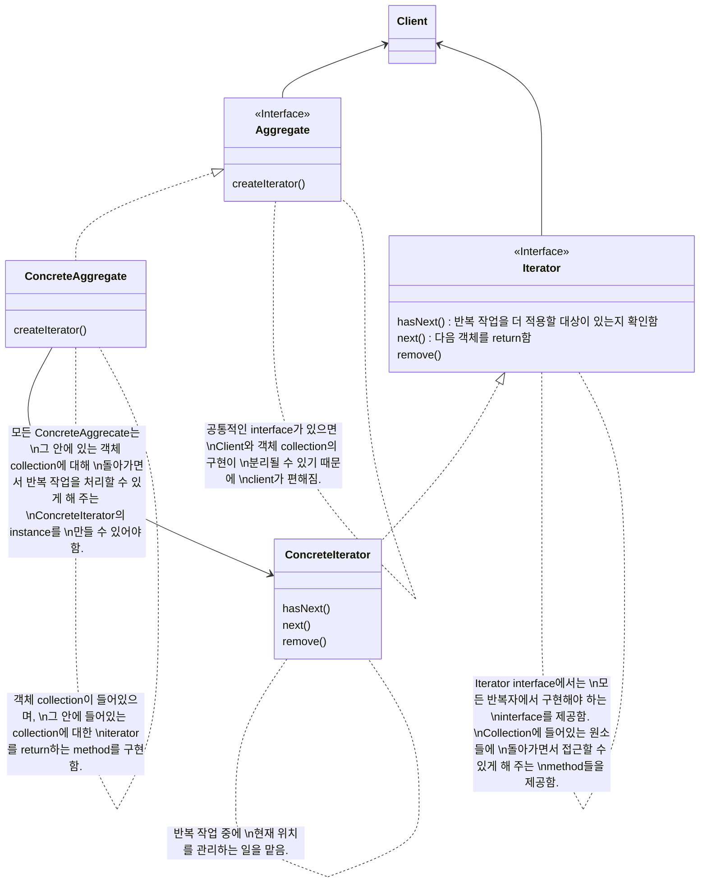
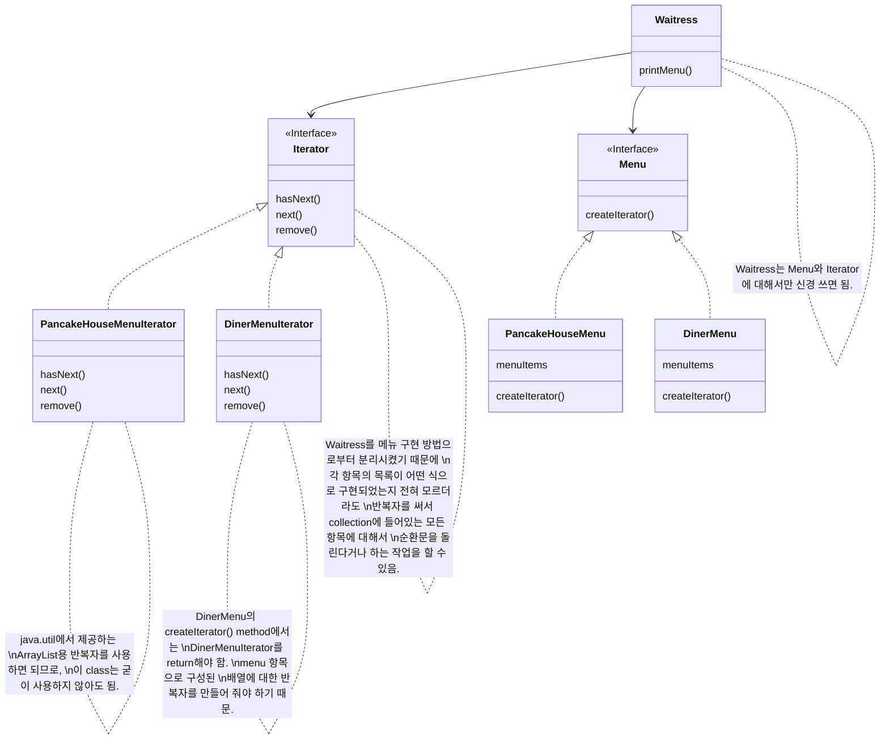

# Iterator Pattern

```
collection 구현 방법을 노출시키지 않으면서도 그 집합체 안에 들어있는 모든 항목에 접근할 수 있게 해 주는 방법을 제공해 줍니다.
```

- 내부적인 구현 방법을 외부로 노출시키지 않으면서도, 집합체에 있는 모든 항목에 일일이 접근할 수 있음
    - 각 항에 일일이 접근할 수 있게 해주는 기능을 `collection(집합체)`이 아닌 `iterator(반복자)` 객체에서 책임지게 됨
        - `반복(바뀌는 부분)`을 iterator로 캡슐화(encapsulation)하여 collection으로 부터 일부 책임을 분리함
            - 집합체 내에서 어떤 식으로 일이 처리되는지는 모르는 상태에서 그 안의 항목들에 대해 반복 작업을 수행할 수 있음
        - 집합체 interface 및 구현이 간단해지고, 각자 중요한 일만 잘 처리할 수 있게 함
            - 집합체는 반복 작업으로부터 손을 떼고 자신의 일(객체 collection 관리)을 할 수 있게 되므로

- Iterator method : `옛날`과 `지금(java iterator 기준)`
    - method 종류
        - 옛날 : first(), next(), isDone(), currentItem() 
        - 지금 : next(), hasNext(), remove()
    - 옛날의 next()와 currentItem()은 지금의 next() 하나로 합쳐짐
    - 옛날의 isDone()은 지금의 hasNext()와 같은 기능임
    - 옛날의 first()는 지금 없음
        - java에서는 처음부터 다시 돌리고 싶은 경우에 그냥 반복자를 새로 만드는 방식을 주로 사용하기 때문
    - 지금의 remove()는 확장된 method임

- 내부(internal) 반복자 & 외부(external) 반복자
    - 외부 반복자
        - client가 반복 작업을 제어함
            - client에서 next()를 호출해서 다음 항목을 가져오기 때문
    - 내부 반복자
        - 반복자 자신에 의해서 제어됨
            - client가 반복자한테 모든 원소에 대해서 어떤 일을 할 것인지 알려줘야 함
                - 반복자가 다음 원소에 대해서 작업을 직접 처리하기 때문
        - 외부 반복자를 쓰는 경우에 비해 유연성이 떨어짐
            - client가 반복 작업을 마음대로 제어할 수 없기 때문
        - 할 일을 넘겨주기만 하면 나머지는 반복자에서 알아서 해 주기 때문에 더 편리할 때도 있음

- 반대 방향으로 움직이는 반복자
    - 이전 항목으로 가기 위한 method와 원소 collection에서 첫 번째 원소 위치에 있는지를 알려주는 method가 추가적으로 필요함

- 반복자를 이용하면 다형적인 code를 만들 수 있는 이유
    - iterator를 지원하기만 하면 어떤 collection에 대해서도 사용할 수 있는 code를 만드는 것이기 때문
        - iterator를 지원하기 위해서는 iterator를 매개변수로 받아들이는 method를 만들어야 함
    - collection의 구체적인 구현 방식에는 신경쓰지 않아도 됨
        - 어차피 iterator를 지원하면 원하는 반복 작업을 할 수 있기 때문

- Enumeration & Iterator
    | Enumeration | Iterator |
    | - | - |
    | hasMoreElements() | hasNext() |
    | nextElement() | next() |
    - 옛날에는 Iterator 용도로 Enumeration을 사용했음
    - java에서는 반복자의 용도로 대부분 Iterator를 사용함
    - Enumeration에서 Iterator로, 또는 그 반대로 변환해야 하는 경우에는 Adapter Pattern을 사용하기


## Class Diagram




---


# Example : 'Pancake House'와 '객체마을 식당'의 합병

- 'Pancake House'와 '객체마을 식당'를 한 곳으로 합치게 됨
    - 아침에는 Pancake House의 menu를 사용하고, 점심에는 '객체마을 식당'의 menu를 사용하도록 해야 함

- 두 가게 모두 메뉴 항목을 나타내는 MenuItem은 통일함
- 그러나 여러 MenuItem을 저장하는 집합체의 자료구조가 다름
    - 'Pancake House'는 menu를 만들 때 ArrayList에 저장함
    - '객체마을 식당'은 menu를 만들 때 배열에 저장함

- Waitress가 갖춰야 할 능력
    - menu 출력하기
    - 채식주의자용 menu만 출력하기

- Iterator Pattern을 사용해서 Waitress가 집합체의 자료구조에 구애받지 않고 일할 수 있도록 하기
    - Iterator Pattern을 사용하지 않는다면, Waitress는 서로 자료구조이 다른 두 가게의 menu를 출력하기 위해서 반복 작업을 할 때 자료구조에 따라 다른 처리를 해주어야 함


## Class Diagram




## Code


### Client

```java
import java.util.*;

public class MenuTestDrive {
	public static void main(String args[]) {
        Menu pancakeHouseMenu = new PancakeHouseMenu();
        Menu dinerMenu = new DinerMenu();
 
		Waitress waitress = new Waitress(pancakeHouseMenu, dinerMenu);
		
		// With iterators
		waitress.printMenu();
		
		printMenus();
	}
	
	/*
	 * Without the Waitress, we need the code below...
	 */
	public static void printMenus() {
		PancakeHouseMenu pancakeHouseMenu = new PancakeHouseMenu();
		DinerMenu dinerMenu = new DinerMenu();

		List<MenuItem> breakfastItems = pancakeHouseMenu.getMenuItems();
		MenuItem[] lunchItems = dinerMenu.getMenuItems();
		
		// print as Iterable
		printMenu(breakfastItems);
		printMenu(Arrays.asList(lunchItems));
		
		// print with forEach
		System.out.println("=== forEach ===");
		breakfastItems.forEach(item -> System.out.println(item));
		Arrays.asList(lunchItems).forEach(item -> System.out.println(item));
		System.out.println("=== forEach ===");
		
		// Using enhanced for loop
		System.out.println("USING ENHANCED FOR");
		for (MenuItem menuItem : breakfastItems) {
			System.out.print(menuItem.getName());
			System.out.println("\t\t" + menuItem.getPrice());
			System.out.println("\t" + menuItem.getDescription());
		}
		for (MenuItem menuItem : lunchItems) {
			System.out.print(menuItem.getName());
			System.out.println("\t\t" + menuItem.getPrice());
			System.out.println("\t" + menuItem.getDescription());
		}
 
		// Exposing implementation
		System.out.println("USING FOR LOOPS");
		for (int i = 0; i < breakfastItems.size(); i++) {
			MenuItem menuItem = (MenuItem)breakfastItems.get(i);
			System.out.print(menuItem.getName());
			System.out.println("\t\t" + menuItem.getPrice());
			System.out.println("\t" + menuItem.getDescription());
		}

		for (int i = 0; i < lunchItems.length; i++) {
			MenuItem menuItem = lunchItems[i];
			System.out.print(menuItem.getName());
			System.out.println("\t\t" + menuItem.getPrice());
			System.out.println("\t" + menuItem.getDescription());
		}
	}
	
	public static void printMenu(Iterable<MenuItem> a) {
		for (MenuItem menuItem : a) {
			System.out.print(menuItem.getName());
			System.out.println("\t\t" + menuItem.getPrice());
			System.out.println("\t" + menuItem.getDescription());
		}
	}
}
```


### Waitress

```java
public class Waitress {
	Menu pancakeHouseMenu;
	Menu dinerMenu;
 
	public Waitress(Menu pancakeHouseMenu, Menu dinerMenu) {
		this.pancakeHouseMenu = pancakeHouseMenu;
		this.dinerMenu = dinerMenu;
	}
 
	public void printMenu() {
		Iterator pancakeIterator = pancakeHouseMenu.createIterator();
		Iterator dinerIterator = dinerMenu.createIterator();

		System.out.println("MENU\n----\nBREAKFAST");
		printMenu(pancakeIterator);
		System.out.println("\nLUNCH");
		printMenu(dinerIterator);

	}
 
	private void printMenu(Iterator iterator) {
		while (iterator.hasNext()) {
			MenuItem menuItem = iterator.next();
			System.out.print(menuItem.getName() + ", ");
			System.out.print(menuItem.getPrice() + " -- ");
			System.out.println(menuItem.getDescription());
		}
	}
 
	public void printVegetarianMenu() {
		printVegetarianMenu(pancakeHouseMenu.createIterator());
		printVegetarianMenu(dinerMenu.createIterator());
	}
 
	public boolean isItemVegetarian(String name) {
		Iterator breakfastIterator = pancakeHouseMenu.createIterator();
		if (isVegetarian(name, breakfastIterator)) {
			return true;
		}
		Iterator dinnerIterator = dinerMenu.createIterator();
		if (isVegetarian(name, dinnerIterator)) {
			return true;
		}
		return false;
	}


	private void printVegetarianMenu(Iterator iterator) {
		while (iterator.hasNext()) {
			MenuItem menuItem = iterator.next();
			if (menuItem.isVegetarian()) {
				System.out.print(menuItem.getName());
				System.out.println("\t\t" + menuItem.getPrice());
				System.out.println("\t" + menuItem.getDescription());
			}
		}
	}

	private boolean isVegetarian(String name, Iterator iterator) {
		while (iterator.hasNext()) {
			MenuItem menuItem = iterator.next();
			if (menuItem.getName().equals(name)) {
				if (menuItem.isVegetarian()) {
					return true;
				}
			}
		}
		return false;
	}
}
```


### Menu

```java
public interface Iterator {
	boolean hasNext();
	MenuItem next();
}
```

```java
public class ArrayIterator implements Iterator {
	MenuItem[] items;
	int position = 0;
 
	public ArrayIterator(MenuItem[] items) {
		this.items = items;
	}
 
	public MenuItem next() {
		MenuItem menuItem = items[position];
		position = position + 1;
		return menuItem;
	}
 
	public boolean hasNext() {
		if (position >= items.length || items[position] == null) {
			return false;
		} else {
			return true;
		}
	}
}
```

```java
import java.util.ArrayList;

public class ArrayListIterator implements Iterator {
	ArrayList<MenuItem> items;
	int position = 0;
 
	public ArrayListIterator(ArrayList<MenuItem> items) {
		this.items = items;
	}
 
	public MenuItem next() {
		MenuItem item = items.get(position);
		position = position + 1;
		return item;
	}
 
	public boolean hasNext() {
		if (position >= items.size()) {
			return false;
		} else {
			return true;
		}
	}
}
```

```java
import java.util.ArrayList;
import java.util.List;

public class PancakeHouseMenuIterator implements Iterator {
	List<MenuItem> items;
	int position = 0;
 
	public PancakeHouseMenuIterator(List<MenuItem> items) {
		this.items = items;
	}
 
	public MenuItem next() {
		/* 
		MenuItem item = items.get(position);
		position = position + 1;
		return item;
		*/
		// or shorten to:
		return items.get(position++);
	}
 
	public boolean hasNext() {
		/*
		if (position >= items.size()) {
			return false;
		} else {
			return true;
		}
		*/
		// or shorten to:
		return items.size() > position;
	}
}
```

```java
public class DinerMenuIterator implements Iterator {
	MenuItem[] items;
	int position = 0;
 
	public DinerMenuIterator(MenuItem[] items) {
		this.items = items;
	}
 
	public MenuItem next() {
		/*
		MenuItem menuItem = items[position];
		position = position + 1;
		return menuItem;
		*/
		
		// or shorten to 
		return items[position++];
	}
 
	public boolean hasNext() {
		/*
		if (position >= items.length || items[position] == null) {
			return false;
		} else {
			return true;
		}
		*/
		
		// or shorten to
		return items.length > position;
	}
}
```

```java
import java.util.Calendar;

public class AlternatingDinerMenuIterator implements Iterator {
	MenuItem[] list;
	int position;

	public AlternatingDinerMenuIterator(MenuItem[] list) {
		this.list = list;
		position = Calendar.DAY_OF_WEEK % 2;
	}
	public MenuItem next() {
		MenuItem menuItem = list[position];
		position = position + 2;
		return menuItem;
	}
	public boolean hasNext() {
		if (position >= list.length || list[position] == null) {
			return false;
		} else {
			return true;
		}
	}
	public String toString() {
		return "Alternating Diner Menu Iterator";
	}
}
```


### Menu

```java
public interface Menu {
	public Iterator createIterator();
}
```

```java
import java.util.ArrayList;
import java.util.List;

public class PancakeHouseMenu implements Menu {
	List<MenuItem> menuItems;
 
	public PancakeHouseMenu() {
		menuItems = new ArrayList<MenuItem>();
    
		addItem("K&B's Pancake Breakfast", 
			"Pancakes with scrambled eggs and toast", 
			true,
			2.99);
 
		addItem("Regular Pancake Breakfast", 
			"Pancakes with fried eggs, sausage", 
			false,
			2.99);
 
		addItem("Blueberry Pancakes",
			"Pancakes made with fresh blueberries",
			true,
			3.49);
 
		addItem("Waffles",
			"Waffles with your choice of blueberries or strawberries",
			true,
			3.59);
	}

	public void addItem(String name, String description,
	                    boolean vegetarian, double price)
	{
		MenuItem menuItem = new MenuItem(name, description, vegetarian, price);
		menuItems.add(menuItem);
	}
 
	public List<MenuItem> getMenuItems() {
		return menuItems;
	}
  
	public Iterator createIterator() {
		return new PancakeHouseMenuIterator(menuItems);
	}
  
	public String toString() {
		return "Objectville Pancake House Menu";
	}

	// other menu methods here
}
```

```java
public class DinerMenu implements Menu {
	static final int MAX_ITEMS = 6;
	int numberOfItems = 0;
	MenuItem[] menuItems;
  
	public DinerMenu() {
		menuItems = new MenuItem[MAX_ITEMS];
 
		addItem("Vegetarian BLT",
			"(Fakin') Bacon with lettuce & tomato on whole wheat", true, 2.99);
		addItem("BLT",
			"Bacon with lettuce & tomato on whole wheat", false, 2.99);
		addItem("Soup of the day",
			"Soup of the day, with a side of potato salad", false, 3.29);
		addItem("Hotdog",
			"A hot dog, with sauerkraut, relish, onions, topped with cheese",
			false, 3.05);
		addItem("Steamed Veggies and Brown Rice",
			"Steamed vegetables over brown rice", true, 3.99);
		addItem("Pasta",
			"Spaghetti with Marinara Sauce, and a slice of sourdough bread",
			true, 3.89);
	}
  
	public void addItem(String name, String description, 
	                     boolean vegetarian, double price) 
	{
		MenuItem menuItem = new MenuItem(name, description, vegetarian, price);
		if (numberOfItems >= MAX_ITEMS) {
			System.err.println("Sorry, menu is full!  Can't add item to menu");
		} else {
			menuItems[numberOfItems] = menuItem;
			numberOfItems = numberOfItems + 1;
		}
	}
 
	public MenuItem[] getMenuItems() {
		return menuItems;
	}
  
	public Iterator createIterator() {
		return new DinerMenuIterator(menuItems);
		// To test Alternating menu items, comment out above line,
		// and uncomment the line below.
		//return new AlternatingDinerMenuIterator(menuItems);
	}
 
	// other menu methods here
}
```


### MenuItem

```java
public class MenuItem {
	String name;
	String description;
	boolean vegetarian;
	double price;
 
	public MenuItem(String name, 
	                String description, 
	                boolean vegetarian, 
	                double price) 
	{
		this.name = name;
		this.description = description;
		this.vegetarian = vegetarian;
		this.price = price;
	}
  
	public String getName() {
		return name;
	}
  
	public String getDescription() {
		return description;
	}
  
	public double getPrice() {
		return price;
	}
  
	public boolean isVegetarian() {
		return vegetarian;
	}
	public String toString() {
		return (name + ", $" + price + "\n   " + description);
	}
}
```


---


## Reference

- Head First Design Patterns - Eric Freeman, Elisabeth Robson, Bert Bates, Kathy Sierra
