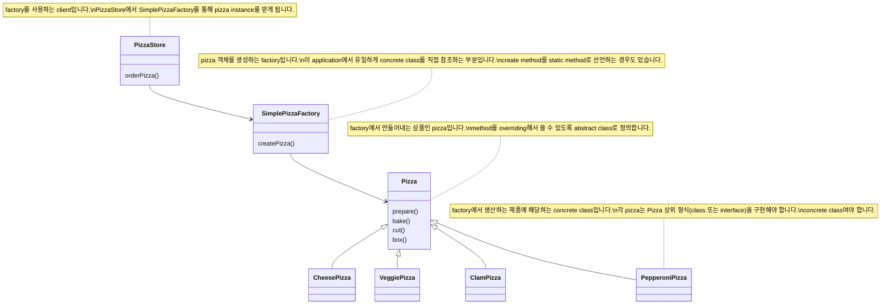

- Simple Factory는 design pattern은 아니지만 Factory Pattern의 기본이 되는 개념입니다.

- Simple Factory는 객체를 생성하는 부분을 캡슐화(encapsulation)합니다.
    - 객체 생성을 처리하는 class를 **factory**라고 부릅니다.

- 객체 생성하는 작업을 한 class에 캡슐화(encapsulation)시켜 놓으면, 구현을 변경해야 하는 경우에 factory class 하나만 고치면 됩니다.
    - 객체 생성을 캡슐화(encapsulation)해서 application의 결합을 느슨하게 만들고, 특정 구현에 덜 의존하도록 합니다.
    - 또한 code에서 중복되는 내용을 제거할 수 있습니다.

- Simple Factory로부터 두 Factory Pattern(Factory Method Pattern, Abstract Factory Pattern)이 파생됩니다.
    - Factory Method Pattern은 상속(inheritance)을 통해서 객체를 생성합니다.
    - Abstract Factory Pattern은 합성(composition)을 통해서 객체를 생성합니다.


### Static Factory Method

- Static Factory Method는 
- Simple Factory를 static method로 정의하는 기법입니다.

- 장점 : 객체를 생성하기 위한 method를 실행시키기 위해서 객체의 instance를 만들지 않아도 됩니다.
- 단점 : sub class를 만들어서 객체 생성 method의 행동을 변경시킬 수 없습니다.


### Interface로 개발하기

- interface(또는 abstract class)를 사용하여 개발하면 system에서 일어나는 여러 변화에 유연하게 대응할 수 있습니다.
- Simple Factory는 interface에 맞춰서 개발할 수 있게 해줍니다.

| Interface로 개발하기 | Concrete Class로 개발하기 |
| --- | --- |
| 변경 가능성이 있는 부분이 분리되어 있습니다. | 변경 가능성이 있는 부분이 분리되어 있지 않습니다. |
| 다형성 덕분에 어떤 class든 특정 interface만 구현하면 사용할 수 있습니다. | 나중에 code를 수정해야 할 가능성이 높아지고 유연성이 떨어집니다. |


---


## Simple Factory Example : Pizza 가게


### Class Diagram




### Code

#### Main

```java
public class PizzaTestDrive {
 
    public static void main(String[] args) {
        SimplePizzaFactory factory = new SimplePizzaFactory();
        PizzaStore store = new PizzaStore(factory);

        Pizza pizza = store.orderPizza("cheese");
        System.out.println("We ordered a " + pizza.getName() + "\n");
        System.out.println(pizza);
 
        pizza = store.orderPizza("veggie");
        System.out.println("We ordered a " + pizza.getName() + "\n");
        System.out.println(pizza);
    }
}
```

#### PizzaStore

```java
public class PizzaStore {
    SimplePizzaFactory factory;
 
    public PizzaStore(SimplePizzaFactory factory) { 
        this.factory = factory;
    }
 
    public Pizza orderPizza(String type) {
        Pizza pizza;
 
        pizza = factory.createPizza(type);
 
        pizza.prepare();
        pizza.bake();
        pizza.cut();
        pizza.box();

        return pizza;
    }

}
```

#### SimplePizzaFactory

```java
public class SimplePizzaFactory {

    public Pizza createPizza(String type) {
        Pizza pizza = null;

        if (type.equals("cheese")) {
            pizza = new CheesePizza();
        } else if (type.equals("pepperoni")) {
            pizza = new PepperoniPizza();
        } else if (type.equals("clam")) {
            pizza = new ClamPizza();
        } else if (type.equals("veggie")) {
            pizza = new VeggiePizza();
        }
        return pizza;
    }
}
```

#### Pizza

```java
abstract public class Pizza {
    String name;
    String dough;
    String sauce;
    List<String> toppings = new ArrayList<String>();

    public String getName() {
        return name;
    }

    public void prepare() {
        System.out.println("Preparing " + name);
    }

    public void bake() {
        System.out.println("Baking " + name);
    }

    public void cut() {
        System.out.println("Cutting " + name);
    }

    public void box() {
        System.out.println("Boxing " + name);
    }

    public String toString() {
        // code to display pizza name and ingredients
        StringBuffer display = new StringBuffer();
        display.append("---- " + name + " ----\n");
        display.append(dough + "\n");
        display.append(sauce + "\n");
        for (String topping : toppings) {
            display.append(topping + "\n");
        }
        return display.toString();
    }
}
```

#### Pizza의 Concrete Class

```java
public class CheesePizza extends Pizza {
    public CheesePizza() {
        name = "Cheese Pizza";
        dough = "Regular Crust";
        sauce = "Marinara Pizza Sauce";
        toppings.add("Fresh Mozzarella");
        toppings.add("Parmesan");
    }
}
```

```java
public class VeggiePizza extends Pizza {
    public VeggiePizza() {
        name = "Veggie Pizza";
        dough = "Crust";
        sauce = "Marinara sauce";
        toppings.add("Shredded mozzarella");
        toppings.add("Grated parmesan");
        toppings.add("Diced onion");
        toppings.add("Sliced mushrooms");
        toppings.add("Sliced red pepper");
        toppings.add("Sliced black olives");
    }
}
```

```java
public class ClamPizza extends Pizza {
    public ClamPizza() {
        name = "Clam Pizza";
        dough = "Thin crust";
        sauce = "White garlic sauce";
        toppings.add("Clams");
        toppings.add("Grated parmesan cheese");
    }
}
```


```java
public class PepperoniPizza extends Pizza {
    public PepperoniPizza() {
        name = "Pepperoni Pizza";
        dough = "Crust";
        sauce = "Marinara sauce";
        toppings.add("Sliced Pepperoni");
        toppings.add("Sliced Onion");
        toppings.add("Grated parmesan cheese");
    }
}
```


---


## Reference

- Head First Design Patterns - Eric Freeman, Elisabeth Robson, Bert Bates, Kathy Sierra
- <https://refactoring.guru/ko/design-patterns/factory-comparison>
- <https://tecoble.techcourse.co.kr/post/2020-05-26-static-factory-method/>
