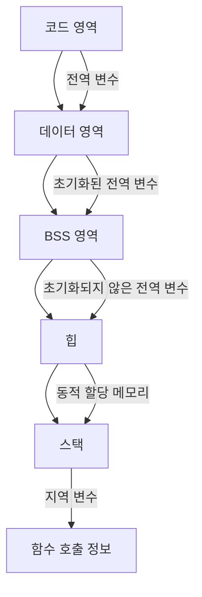

C 언어의 메모리 영역과 동적 할당에 대해 공부하는 것은 매우 중요합니다. 이 주제는 프로그램의 효율성 및 안정성과 직접적으로 관련이 있기 때문입니다. 아래는 C 언어에서의 메모리 영역과 동적 할당에 대한 자세한 설명과 예제입니다.

### 메모리 영역

C 언어 프로그램이 실행될 때 사용되는 메모리 영역은 크게 다음과 같이 나뉩니다:

1. **코드 영역 (Text Segment)**: 프로그램의 실행 코드를 저장하는 메모리 영역입니다.
2. **데이터 영역 (Data Segment)**: 초기화된 전역 변수와 정적 변수가 저장되는 메모리 영역입니다.
3. **BSS 영역 (BSS Segment)**: 초기화되지 않은 전역 변수와 정적 변수가 저장되는 메모리 영역입니다.
4. **힙 (Heap)**: 동적으로 할당된 메모리가 저장되는 영역입니다. 런타임 시 `malloc`, `calloc`, `realloc`, `free` 등의 함수를 통해 관리됩니다.
5. **스택 (Stack)**: 함수 호출 시 지역 변수와 함수 호출 정보를 저장하는 메모리 영역입니다. 함수가 호출될 때마다 스택 프레임이 추가되고, 함수가 종료되면 스택 프레임이 제거됩니다.

### 메모리 구조 도표



### 동적 할당

동적 할당은 프로그램 실행 중에 필요한 메모리를 할당하고 해제하는 기능을 제공합니다. C 언어에서는 `malloc`, `calloc`, `realloc`, `free` 함수를 통해 동적 메모리를 관리합니다.

- **`malloc`**: 지정된 크기만큼의 메모리를 할당하고, 성공하면 포인터를 반환합니다.
- **`calloc`**: 지정된 개수와 크기만큼의 메모리를 할당하고, 모든 비트를 0으로 초기화한 후 포인터를 반환합니다.
- **`realloc`**: 기존에 할당된 메모리의 크기를 변경합니다.
- **`free`**: 할당된 메모리를 해제합니다.

### 예제 코드

아래는 동적 메모리 할당과 관련된 예제 코드입니다.

```c
#include <stdio.h>
#include <stdlib.h>

int main() {
    int *arr;
    int n;

    printf("Enter the number of elements: ");
    scanf("%d", &n);

    // 메모리 할당
    arr = (int*)malloc(n * sizeof(int));
    if (arr == NULL) {
        printf("Memory allocation failed!\n");
        return 1;
    }

    // 배열 초기화
    for (int i = 0; i < n; i++) {
        arr[i] = i + 1;
    }

    // 배열 출력
    printf("Array elements: ");
    for (int i = 0; i < n; i++) {
        printf("%d ", arr[i]);
    }
    printf("\n");

    // 메모리 해제
    free(arr);

    return 0;
}
```

### 설명

1. **메모리 할당**: `malloc` 함수를 사용하여 `n`개의 정수 공간을 동적으로 할당합니다.
2. **초기화 및 출력**: 할당된 배열을 초기화하고 출력합니다.
3. **메모리 해제**: `free` 함수를 사용하여 동적으로 할당된 메모리를 해제합니다.

이 예제는 동적 메모리 할당의 기본적인 사용 방법을 보여줍니다. 동적 할당을 통해 프로그램의 유연성과 효율성을 높일 수 있습니다. 다만, 메모리 누수를 방지하기 위해 할당된 메모리를 사용 후 반드시 `free` 함수를 통해 해제해야 합니다.


좋습니다. "C 언어의 메모리 영역(Memory Layout)"과 "동적 메모리 할당: 메모리 영역 관점"으로 내용을 나누어 설명하겠습니다.

### C 언어의 메모리 영역(Memory Layout)

C 프로그램이 실행될 때 사용하는 메모리 영역은 다음과 같이 나뉩니다:

1. **코드 영역 (Text Segment)**: 프로그램의 실행 코드를 저장하는 메모리 영역입니다. 함수와 같은 기계어 코드가 여기에 저장됩니다.
2. **데이터 영역 (Data Segment)**: 초기화된 전역 변수와 정적 변수가 저장되는 메모리 영역입니다.
3. **BSS 영역 (BSS Segment)**: 초기화되지 않은 전역 변수와 정적 변수가 저장되는 메모리 영역입니다. 프로그램이 시작될 때 0으로 초기화됩니다.
4. **힙 (Heap)**: 동적으로 할당된 메모리가 저장되는 영역입니다. 런타임 시 `malloc`, `calloc`, `realloc`, `free` 등의 함수에 의해 관리됩니다.
5. **스택 (Stack)**: 함수 호출 시 지역 변수와 함수 호출 정보를 저장하는 메모리 영역입니다. 함수 호출 시마다 스택 프레임이 추가되고, 함수가 종료되면 스택 프레임이 제거됩니다.

### 메모리 구조 도표

```mermaid
graph TD;
    A[코드 영역 (Text Segment)] --> B[데이터 영역 (Data Segment)]
    B --> C[BSS 영역 (BSS Segment)]
    C --> D[힙 (Heap)]
    D --> E[스택 (Stack)]

    A -->|실행 코드| B
    B -->|초기화된 전역 변수와 정적 변수| C
    C -->|초기화되지 않은 전역 변수와 정적 변수| D
    D -->|동적 할당 메모리| E
    E -->|지역 변수 및 함수 호출 정보| F[스택 프레임]
```

### 동적 메모리 할당: 메모리 영역 관점

동적 메모리 할당은 프로그램 실행 중에 필요한 메모리를 힙 영역에 할당하고 해제하는 과정입니다. C 언어에서는 `malloc`, `calloc`, `realloc`, `free` 함수를 사용하여 동적 메모리를 관리합니다. 아래 각 함수의 사용법과 예제를 살펴보겠습니다.

1. **`malloc`**: 지정된 크기만큼의 메모리를 할당하고, 성공하면 포인터를 반환합니다.
2. **`calloc`**: 지정된 개수와 크기만큼의 메모리를 할당하고, 모든 비트를 0으로 초기화한 후 포인터를 반환합니다.
3. **`realloc`**: 기존에 할당된 메모리의 크기를 변경합니다.
4. **`free`**: 할당된 메모리를 해제합니다.

### 예제 코드

아래는 동적 메모리 할당과 관련된 예제 코드입니다.

```c
#include <stdio.h>
#include <stdlib.h>

int main() {
    int *arr;
    int n;

    printf("Enter the number of elements: ");
    scanf("%d", &n);

    // malloc을 사용한 메모리 할당
    arr = (int*)malloc(n * sizeof(int));
    if (arr == NULL) {
        printf("Memory allocation failed!\n");
        return 1;
    }

    // 배열 초기화
    for (int i = 0; i < n; i++) {
        arr[i] = i + 1;
    }

    // 배열 출력
    printf("Array elements using malloc: ");
    for (int i = 0; i < n; i++) {
        printf("%d ", arr[i]);
    }
    printf("\n");

    // calloc을 사용한 메모리 할당 및 초기화
    int *arr2 = (int*)calloc(n, sizeof(int));
    if (arr2 == NULL) {
        printf("Memory allocation failed!\n");
        free(arr); // 할당된 메모리 해제
        return 1;
    }

    // 배열 출력
    printf("Array elements using calloc: ");
    for (int i = 0; i < n; i++) {
        printf("%d ", arr2[i]); // calloc은 0으로 초기화
    }
    printf("\n");

    // realloc을 사용한 메모리 크기 변경
    int new_size = n * 2;
    int *arr3 = (int*)realloc(arr, new_size * sizeof(int));
    if (arr3 == NULL) {
        printf("Memory reallocation failed!\n");
        free(arr);
        free(arr2);
        return 1;
    }

    // 새로운 크기에 대한 배열 초기화
    for (int i = n; i < new_size; i++) {
        arr3[i] = i + 1;
    }

    // 배열 출력
    printf("Array elements after realloc: ");
    for (int i = 0; i < new_size; i++) {
        printf("%d ", arr3[i]);
    }
    printf("\n");

    // 메모리 해제
    free(arr2);
    free(arr3);

    return 0;
}
```

### 설명

1. **`malloc`**: `n`개의 정수 공간을 할당하고 초기화합니다.
2. **`calloc`**: `n`개의 정수 공간을 할당하고 0으로 초기화합니다.
3. **`realloc`**: 기존 할당된 메모리 공간을 두 배로 늘립니다.
4. **`free`**: 할당된 메모리를 해제합니다.

이 예제는 동적 메모리 할당의 기본적인 사용 방법을 보여줍니다. 동적 할당을 통해 프로그램의 유연성과 효율성을 높일 수 있습니다. 다만, 메모리 누수를 방지하기 위해 할당된 메모리를 사용 후 반드시 `free` 함수를 통해 해제해야 합니다.


---


## Reference

- <https://blog.naver.com/PostView.naver?blogId=nsj6646&logNo=221498290964&parentCategoryNo=&categoryNo=38&viewDate=&isShowPopularPosts=false&from=postView>
- <https://blog.naver.com/PostView.naver?blogId=nsj6646&logNo=221503866808&parentCategoryNo=&categoryNo=38&viewDate=&isShowPopularPosts=false&from=postView>
