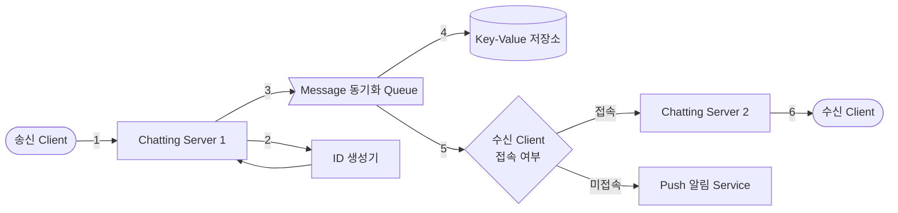
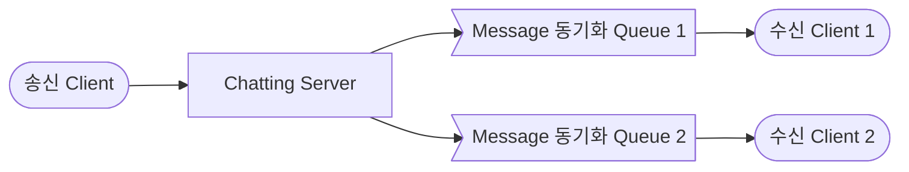
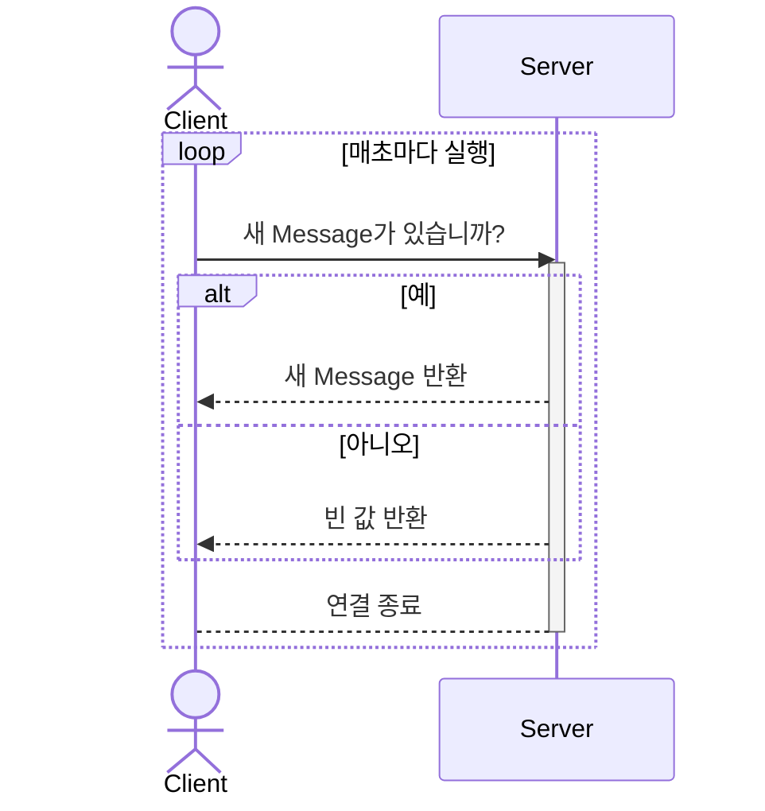
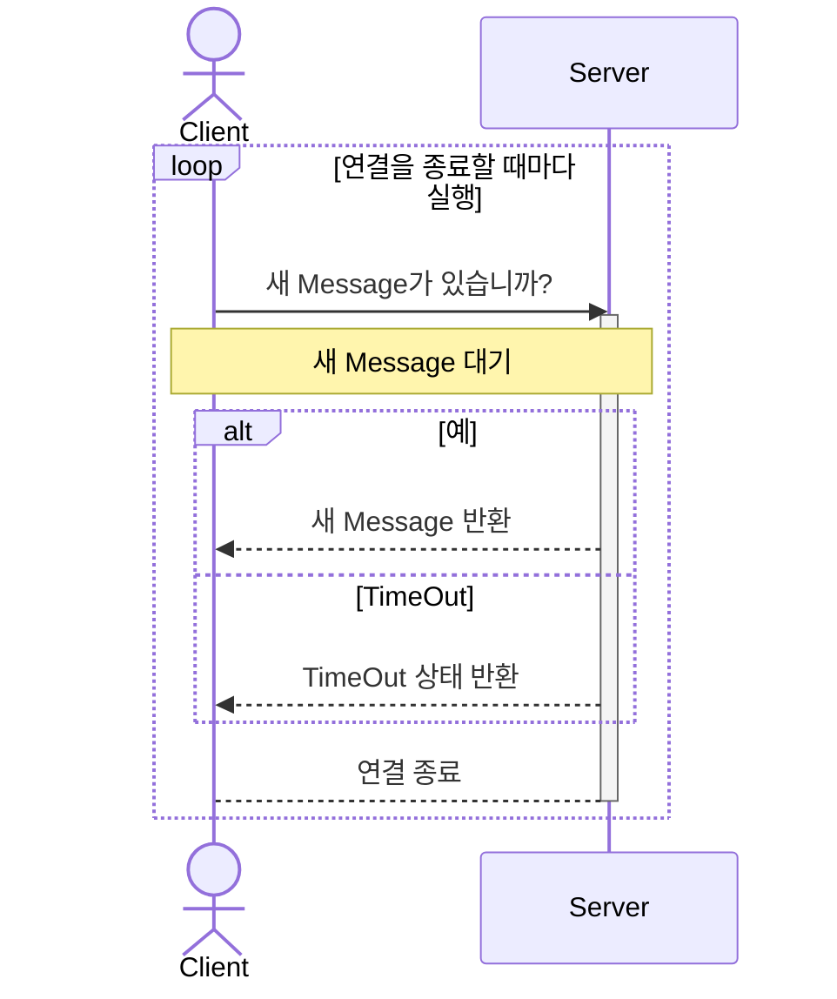
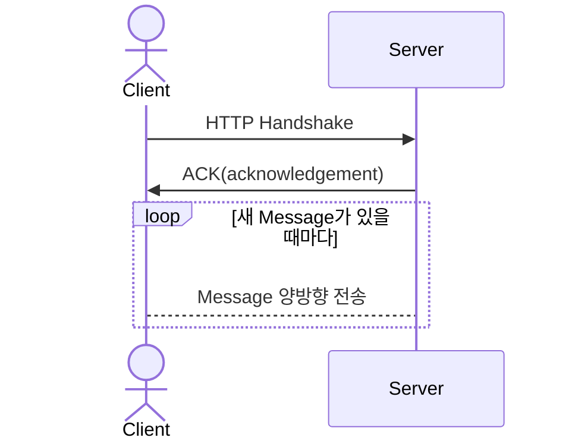

- text chatting system을 설계합니다.
    - chatting은 크게 1:1 chatting, group chatting으로 나뉩니다.
    - 대표적인 text chatting service로 KakaoTalk, Line, Slack, Facebook messenger 등이 있습니다.

- chatting system의 server는 **chatting server**와 **API server**로 이루어집니다.
    1. chatting server는 'client 간의 통신'과 'message 저장'을 위해 존재합니다.
        - 이 중 client 간의 통신을 위한 client-server 간의 연결 유지는 상태 유지(stateful) service입니다.
    2. API server는 'login', '회원 가입', '사용자 profile 표시', 'service 탐색' 등의 무상태(stateless) service를 위해 존재합니다.
        - service 탐색(discovery)은 client가 접속할 chatting server의 DNS Hostname을 client에게 알려주는 역할을 합니다.

- message push 알림 등의 추가적인 기능은 제 3자(third-party) service를 사용합니다.

---

## Chatting Message 처리 흐름

- 송신 Client가 message를 보내면, chatting service에서는 message를 저장하고, 수신 client에게 message를 전달합니다.

### 1:1 Chatting Message 처리 흐름

1. `송신 Client`가 `Chatting Server 1`로 message를 전송합니다.
2. `Chatting Server 1`은 `ID 생성기`를 사용해 'message ID'를 결정합니다.
3. 해당 message를 `Message 동기화 Queue`로 전송합니다.
4. message를 `Key-Value 저장소`에 보관합니다.
5. `수신 Client`의 접속 여부에 따라 message 전송 방식을 결정하고 처리합니다.
    - `수신 Client`가 접속 중인 경우, `수신 Client`가 사용 중인 `Chatting Server 2`로 message를 전송합니다.
    - `수신 Client`가 접속 중이 아닌 경우, `Push 알림 Service`로 message를 전송합니다.
6. `수신 Client`와 `Chatting Server 2` 사이에 연결된 WebSocket을 통해 message를 전송합니다.

### Group Chatting Message 처리 흐름

- group chatting은 1:1 chatting과 달리 송신 client나 수신 client가 여러 개입니다.
- 그래서 client와 connection을 유지하는 chatting server와 그에 따라 관리되는 message queue가 1:1 chatting보다 더 많습니다.
- 상세한 message 처리 흐름은 1:1 chatting과 동일합니다.

#### Group Chatting : Message를 여러 Client에게 송신하는 경우

- group chatting에서 message를 송신할 때는 모든 수신 client에게 message를 보내야 합니다.

#### Group Chatting : Message를 여러 Client로부터 수신하는 경우

- group chatting에서 message를 수신할 때는 모든 송신 client의 message를 받을 수 있어야 합니다.

---

## Client <-> Chatting Server : 연결 유지하기

- **HTTP**는 Request/Response 기반의 Stateless Protocol이며, **client가 server와의 연결을 생성하는** 가장 대중적인 통신 방식입니다.
    - 대부분의 client/server application은 **client가 server에 요청을 보내고 server가 응답**하는 단방향의 HTTP 통신으로도 충분합니다.

- 따라서 송신 client가 message를 chatting server에 보낼 때에는 일반적인 HTTP 통신을 사용할 수 있습니다.
    - 송신 client가 server에게 요청하는 것이기 때문에 일반적인 application과 비슷합니다.

- 그러나 **server에서 수신 client로 message를 전송**하는 것은 일반적인 HTTP 통신만으로 구현할 수 없습니다.
    - HTTP 통신의 상태를 유지하지 않는(Stateless) 특성 때문에 연속된 data의 실시간 갱신에 한계가 있기 때문입니다.
    - 새로운 message 송신 요청을 받으면, **chatting server는 임의 시점에 수신 client에게 상태 변경(data update)을 요청**해야 합니다.
        - 이는 client가 server에 요청하던 일반적인 HTTP 사용 방식과 차이가 있습니다.
    - server가 수많은 client 중 임의의 client를 찾아서 요청하는 것은 어렵고 비효율적이기 때문에, **client가 server에 요청하면 client와 server 간의 network 연결(connection)을 끊지 않고 유지하는 방식을 사용**합니다.
        - server는 client와 server 사이에 유지되고 있는 connection을 통해 원하는 시점에 client에게 data를 전달할 수 있습니다.

- server가 수신 client에 message를 보내기 위해서 client와 server 간의 연결을 유지할  임의 시점에 server가 연결을 만들 수 있는 방법엔 크게 3가지가 있습니다.
    1. Polling : 주기적으로 server에 data를 요청하는 방식.
    2. Long Polling : server에 새로운 data가 생길 때까지 요청을 유지하는 방식.
    3. WebSocket : 양방향 통신을 가능하게 하는 protocol로, 실시간 data 교환에 최적화되어 있음.

### 1. Polling

- Polling은 **client가 정해진 시간 간격으로 server에게 최신 data를 요청**하여 상태를 동기화하는 기법입니다.
    - HTTP를 사용합니다.

- Polling은 구현이 간단하지만, **server에 불필요한 부하**를 줄 수 있고, **data을 실시간으로 갱신하는 데에 한계**가 있습니다.
    - Polling 주기를 짧게 하여 요청을 자주할수록, network 통신 비용이 올라갑니다.
        - 또한 동기화할 필요가 없는 경우에도 요청하기 때문에, server 자원이 불필요하게 낭비됩니다.
    - Polling의 주기를 길게 하는 경우, 실시간성에 위배됩니다.

### 2. Long Polling

- Long Polling은 Polling의 효율성, 실시간성에 대한 한계를 극복하기 위한 방법입니다.
    - 일반 Polling과 마찬가지로 HTTP를 사용합니다.

- Long Polling 방식에서 client는 **새 message가 반환되거나 timeout될 때까지 연결을 유지**합니다.
    - **client가 새 message를 받으면** 기존 연결을 종료하고, server에 새로운 요청을 보내어 모든 절차를 다시 시작합니다.
        - server는 새로운 data가 있을 때까지 요청을 보류하고, 새로운 data가 생기면 그제서야 응답을 반환합니다.
    - **connection timeout이 발생하면** client는 즉시 새로운 요청을 보내어 연결을 유지합니다.

- Long Polling은 data가 존재할 때만 통신을 하므로 일반 Polling보다 효율적이지만, 몇 가지 단점이 있습니다.
    1. server 입장에서는 client가 연결을 해제했는지 해제하지 않았는지 알 수 있는 방법이 없습니다.
        - HTTP을 사용하기 때문에 연결의 주체가 client이기 때문입니다.
    2. message를 많이 받지 않는 client도 timeout이 일어날 때마다 주기적으로 서버에 접속하기 때문에, 여전히 비효율적입니다.

### 3. WebSocket

- WebSocket은 **server와 client 간에 양방향 통신(Full-Duplex)을 가능하게 하는 통신 Protocol**로, Socket Connection을 유지해서 지속적으로 data를 주고받을 수 있습니다.
    - Socket Connection은 Handshake를 통해 맺어지고, 연결이 끊어질 때까지 유지됩니다.
    - 전통적인 HTTP 기반 통신 방식에 비해 서버 부하와 지연 시간을 크게 줄일 수 있으며, 주로 Real-Time(실시간) Web Application을 구현하기 위해 사용됩니다.
        - HTTP 통신을 사용하는 Polling이나 Long Polling보다 양방향 data 교환에 있어서 더 효율적입니다.

- WebSocket Protocol은 TCP Socket과 이름만 유사할 뿐 browser의 Socket이며, HTTP와 동일한 Application Layer(application 계층)에 위치합니다.
    - 또한 TCP의 양방향 전이중 통신을 사용하기 때문에 Transport Layer(전송 계층)에 의존하고 있기도 합니다.

- WebSocket은 상태 유지(Stateful) 통신을 제공하며, 한 번 연결되면 해당 connection line을 사용하여 양방향으로 데이터를 주고받을 수 있습니다.
    - 기존의 HTTP 통신은 클라이언트가 서버에 요청을 보내고 서버가 응답하는 단방향 통신이었으며, 이는 상태를 유지하지 않는(Stateless) 특성 때문에 연속된 data의 실시간 update에 한계가 있었습니다.
    
- 웹소켓 연결은 처음에는 클라이언트가 HTTP 연결을 통해 시작되며, 특정 Handshake 절차를 거쳐 WebSocket 연결로 upgrade됩니다.
    - WebSocket Protocol은 접속 확립에 HTTP를 사용하지만, 그 후의 통신은 WebSocket 독자적인 프로토콜로 이루어집니다.
    - 만약 연결이 정상적으로 이루어 진다면 서버와 클라이언트 간에 WebSocket연결이 이루어지고 일정 시간이 지나면 HTTP연결은 자동으로 끊어집니다.
    - 웹소켓(Web Socket) 프로토콜은 HTTP와는 다른 통신 프로토콜로 웹 서버와 웹 브라우저가 서로 실시간 메시지를 교환하는 데에 사용된다.
    - 웹소켓 연결을 맺기 위한 첫 번째 핸드셰이크를 주고받은 이후 지속적으로 연결이 유지되는 것이 특징이며, 매번 메시지 전송 시에 새롭게 연결을 맺을 필요가 없어 빠르고 효율적이다. 
        - 이렇게 한번 연결된 연결은 영구적이며, 양방향 통신이 가능하다.
        - 또한 웹 소켓은 HTTP 프로토콜이 사용하는 기본 포트번호를 그대로 사용하기에, 방화벽이 있는 환경에서도 일반적으로 잘 동작한다.

- 이 과정을 통해 얻어지는 연결은 영구적이며, 양방향 통신을 가능하게 합니다.
- 또한, 웹소켓은 HTTP와 같은 포트(80 혹은 443)를 사용하기 때문에, 방화벽이 있는 환경에서도 문제없이 동작합니다.
    - 그리고 평문 메시지 전송 방식이므로, SSL/TLS 보안 계층으로 암호화되어야 데이터 탈취를 방지할 수 있다. 

- 웹소켓 프로토콜은 HTTP와 다르게 독자적인 프로토콜로 통신하며, 헤더가 상당히 작아 오버헤드가 적다는 특징을 가집니다.
- 이러한 특성은 장시간 동안의 연결을 전제로 하기 때문에, 연결된 상태에서는 클라이언트나 서버로부터 언제든지 데이터 송신이 가능하며, 데이터의 송수신에 별도의 연결 설정이 필요 없습니다.
- 이는 양방향 통신, 실시간 네트워킹을 가능하게 하며, 통신의 효율성과 속도를 크게 개선합니다.
- 더불어 데이터의 송신과 수신에 각각 커넥션을 맺을 필요가 없어 하나의 커넥션으로 데이터를 송수신 할 수 있다. 

- 웹소켓은 현재 인터넷 환경, 특히 HTML5에서 큰 역할을 하며, 웹소켓을 지원하는 브라우저는 이 프로토콜을 통해 서버와 실시간으로 통신할 수 있습니다.
- W3C와 IETF에 의해 표준화된 이 기술은 웹 개발에서 중요한 위치를 차지하고 있으며, 실시간 데이터 교환의 필요성이 점점 증가함에 따라 그 중요성이 더욱 커지고 있습니다.

- 웹 소켓의 경우 양방향 통신이 가능하기에, 메시지를 수신하는 데서만 사용하는 것이 아닌 메시지를 전송하는데서도 사용할 수 있다.
    - 이는 메시지를 보낼 때나 받을 때나 같은 프로토콜을 사용할 수 있게 되므로, 구현이 단순해지고 직관적이게 된다.

    - HTTP 사용시 필요없이 발생되는 HTTP와 TCP연결 트래픽을 피할 수 있다.

---

## Database 설계

### Database 종류

### Data Model

#### Message의 식별값 : `message_id`

---

## Reference

- <https://jjingho.tistory.com/161>

