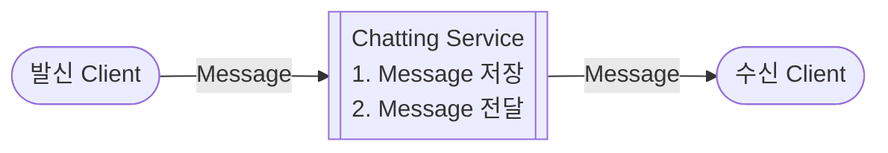
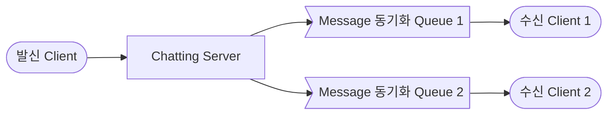
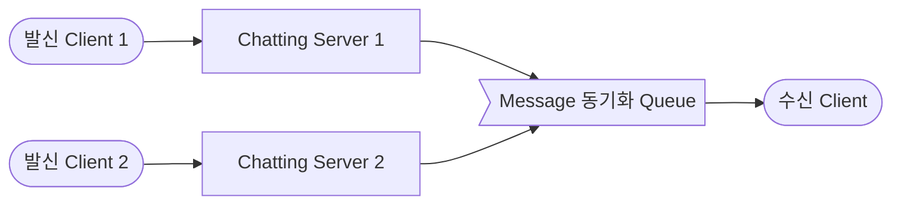

- text chatting system을 설계합니다.
    - chatting은 크게 1:1 chatting, group chatting으로 나뉩니다.
    - 대표적인 text chatting service로 KakaoTalk, Line, Slack, Facebook Messenger 등이 있습니다.

- chatting system의 server는 **chatting server**와 **API server**로 이루어집니다.
    1. chatting server는 'client 간의 통신'과 'message 저장'을 위해 존재합니다.
        - 이 중 client 간의 통신을 위한 client-server 간의 연결 유지는 상태 유지(stateful) service입니다.
    2. API server는 'login', '회원 가입', '사용자 profile 표시', 'service 탐색' 등의 무상태(stateless) service를 위해 존재합니다.
        - service 탐색(discovery)은 client가 접속할 chatting server의 DNS Hostname을 client에게 알려주는 역할을 합니다.

- message push 알림 등의 추가적인 기능은 제 3자(third-party) service를 사용합니다.

---

## Chatting Message 처리 흐름

- 발신 Client가 message를 보내면, chatting service에서는 message를 저장하고, 수신 client에게 message를 전달합니다.

### 1:1 Chatting Message 처리 흐름

1. `발신 Client`가 `Chatting Server 1`로 message를 전송합니다.
2. `Chatting Server 1`은 `ID 생성기`를 사용해 'message ID'를 결정합니다.
3. 해당 message를 `Message 동기화 Queue`로 전송합니다.
4. message를 `Key-Value 저장소`에 보관합니다.
5. `수신 Client`의 접속 여부에 따라 message 전송 방식을 결정하고 처리합니다.
    - `수신 Client`가 접속 중인 경우, `수신 Client`가 사용 중인 `Chatting Server 2`로 message를 전송합니다.
    - `수신 Client`가 접속 중이 아닌 경우, `Push 알림 Service`로 message를 전송합니다.
6. `수신 Client`와 `Chatting Server 2` 사이에 연결된 WebSocket을 통해 message를 전송합니다.

### Group Chatting Message 처리 흐름

- group chatting은 1:1 chatting과 달리 발신 client나 수신 client가 여러 개입니다.
- 그래서 client와 connection을 유지하는 chatting server와 그에 따라 관리되는 message queue가 1:1 chatting보다 더 많습니다.
- 상세한 message 처리 흐름은 1:1 chatting과 동일합니다.

#### Group Chatting : Message를 여러 Client에게 발신하는 경우

- group chatting에서 message를 발신할 때는 모든 수신 client에게 message를 보내야 합니다.

#### Group Chatting : Message를 여러 Client로부터 수신하는 경우

- group chatting에서 message를 수신할 때는 모든 발신 client의 message를 받을 수 있어야 합니다.

---

## Client와 Chatting Server 간의 연결 유지하기

### Polling

### Long Polling

### Web Socket

---

## Database 설계

### Database 종류

### Data Model

#### Message의 식별값 : `message_id`

---

## Reference

- <https://jjingho.tistory.com/161>

