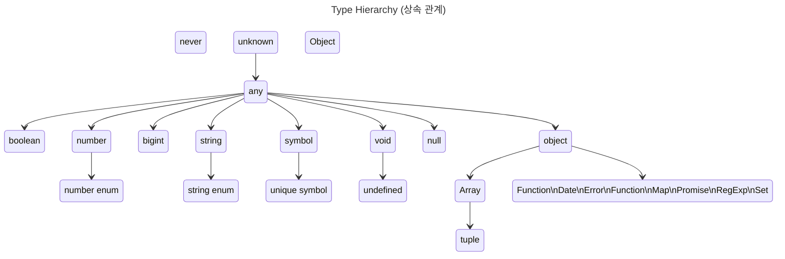

## TypeScript의 Primitive Type

- TypeScript는 정적 Type 언어이며, JavaScript에는 없는 여러 type들을 추가로 지원합니다.
    - TypeScript를 사용함으로써 개발자는 변수, 매개 변수, 반환 값 등의 type을 명시적으로 선언할 수 있어, code의 안정성을 높이고 bug를 미리 방지할 수 있습니다.

- TypeScript는 ES5, ES6의 Superset(상위 확장)이므로 **JavaScript의 type을 그대로 사용할 수 있습니다.**
- JavaScript의 type 외에도, **TypeScript 고유의 type이 추가로 제공됩니다.**
- **type은 소문자와 대문자를 구별**하며, **TypeScript가 제공하는 기본 type은 모두 소문자**입니다.

| Type | JS | TS | 설명 |
| --- | --- | --- | --- |
| boolean | O | O | true/false 값 |
| null | O | O | 값이 없다는 것을 명시함 |
| undefined | O | O | 값을 할당하지 않은 변수의 초기값 |
| number | O | O | 숫자 값 (정수, 실수, Infinity, NaN) |
| string | O | O | 문자열 |
| symbol | O | O | 고유하고 수정 불가능한 data type (주로 객체 속성들의 식별자로 사용함) |
| object | O | O | 객체형 (참조형) |
| array |  | O | 배열 |
| tuple |  | O | 고정된 요소 수 만큼의 type을 미리 선언 후 배열을 표현 |
| enum |  | O | 열거형 (숫자 값 집합에 이름을 지정한 것) |
| any |  | O | 모든 type에 대응 가능한 type (type 추론할 수 없거나 type check가 필요 없는 변수에 사용함) |
| void |  | O | 반환 값이 없는 함수의 반환 type |
| never |  | O | 절대 발생하지 않는 값 |

---

- `unknown` Type : 모든 type의 할당이 가능한 최상위 type 중 하나입니다.
    - 어떤 값이든지 할당할 수 있지만, `unknown` type의 변수를 직접적으로 사용하기 전에 먼저 type을 좁혀야 합니다.

- `any` Type : 모든 type의 최상위 type으로, TypeScript의 type 검사를 비활성화하는 탈출구 역할을 합니다.
    - `any`는 모든 type을 할당할 수 있으며, 할당된 변수는 type check 없이 사용할 수 있습니다.

- Primitive Type : `boolean`, `number`, `bigint`, `string`, `symbol`, `void`, `null`, `undefined`가 있습니다.
    - primitive(원시) type은 모두 `any` type에서 파생되며, 각각의 고유한 특성과 용도가 있습니다.
    - `number`와 `string` type은 각각 숫자와 문자열 열거형(enum)을 포함할 수 있습니다.
    - `symbol` type은 유일한 symbol 값을 생성할 수 있으며, `unique symbol`은 상수 symbol에 사용됩니다.
    - `void` type은 함수가 값을 반환하지 않을 때 사용되며, `undefined`는 `void`의 하위 type으로, 변수가 값이 할당되지 않은 상태를 나타냅니다.

- `object` Type : 소문자로 시작하는 'object'는 **non-primitive(primitive가 아닌) type**을 나타냅니다.
    - `number`, `string`, `boolean`, `bigint`, `symbol`, `null`, `undefined`를 제외한 모든 type(**객체, 배열, 함수 등**)을 포함합니다.
    - `Array`, `Function`, `Date`, `Error`, `Map`, `Promise`, `RegExp`, `Set` 등 JavaScript의 내장 객체 type들이 여기에 속합니다.
        - `Array` type은 `tuple` type을 포함하며, `tuple`은 고정된 길이의 배열을 나타내고 각 요소의 type을 지정할 수 있습니다.

- `Object` Type : 대문자로 시작하는 'Object'는 **JavaScript의 모든 객체가 기본적으로 상속받는 최상위 class**입니다.
    - 이 type은 모든 '객체'를 나타내지만, **null을 제외한 모든 type(primitive type 포함)을 포함**합니다.
    - `Object` type은 `.toString()`이나 `.hasOwnProperty()`와 같은 JavaScript의 기본 객체 method에 접근할 수 있게 해 줍니다.
    - 그러나 TypeScript에서는 더 구체적인 type을 사용하여 type의 안전성을 보장하는 것이 좋습니다.

- `never` Type : 어떤 type도 할당될 수 없는 빈 집합입니다.
    - `never` type은 '절대 발생하지 않는 값'을 의미하며, type system에서 code의 안전성을 높이고 논리적 오류를 줄이는 데 도움을 줍니다.
        - exhaustive check(철저한 검사) 또는 type guard에서 유용하게 사용됩니다.
    - TypeScript의 `never` type은 함수가 정상적으로 종료되지 않는다는 것을 나타냅니다.
        - 함수가 예외를 발생시켜 정상적으로 반환되지 않을 때, 종료 지점에 도달하지 않고 반환 값을 생성하지 않기 때문에, 함수의 반환 type은 `never`가 됩니다.
        - 함수가 무한 loop에 빠지게 설계되었다면, 함수는 정상적인 종료 조건 없이 계속해서 실행되기 때문에, 함수의 반환 type은 `never`가 됩니다.

---

## Reference

- <https://inpa.tistory.com/entry/TS-📘-타입스크립트-타입-선언-종류-💯-총정리>
