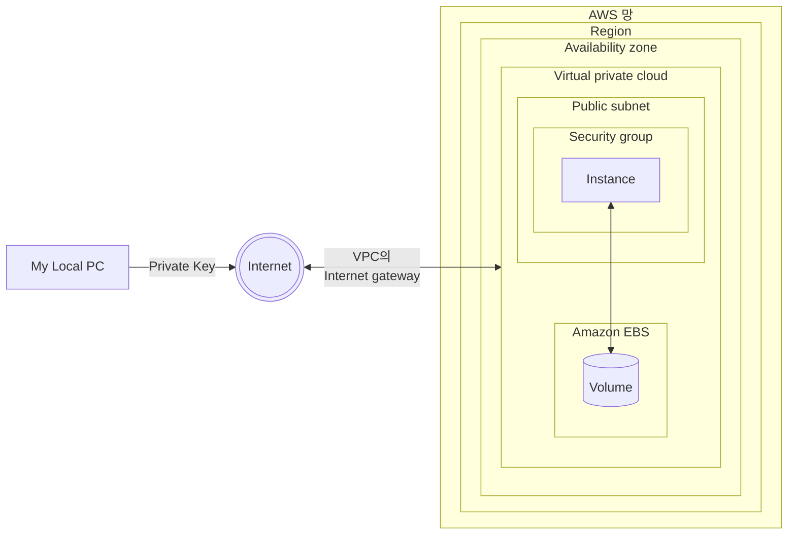

## EC2 : Elastic Compute Cloud

- EC2는 안전하고 크기 조정이 가능한 computing 자원(resource)을 Cloud에서 제공하는 Web service입니다.
    - Amazon의 검증된 computing 환경에서 application을 실행할 수 있습니다.
    - Web 규모의 Cloud computing 작업을 쉽게 할 수 있도록 설계되었습니다.

- EC2는 CPU와 Memory를 주로 제공합니다.
    - 'Elastic Compute Cloud'의 'Compute'가 '연산'을 의미하기 때문에, computing 자원에 대한 포괄적인 제어권을 제공합니다.


---


## 가동 중인 Instance에 접속하기 위한 환경

- endpoint(local PC)의 위치는 AWS 망 밖에 있기 때문에, internet으로 접근해야 합니다.
- VPC엔 Internet gateway를 통해 접속합니다.
    - 접속 시, local PC에 저장해둔 Privte Key를 사용합니다.



| 구성 | 설명 |
| - | - |
| AWS 망 | AWS 기능을 사용할 수 있는 망입니다. |
| Region | service 지역입니다. data center들이 있는 곳을 의미합니다. 서울 region은 `ap-northeast-2`라는 id로 구분됩니다. |
| Availability zone (AZ) | 가용 영역입니다. 한 region에 여러 개의 가용 영역을 포함됩니다. 하나의 가용 영역은 하나의 data center를 의미합니다. 서울에는 총 4개의 가용 영역이 있으며, `ap-northeast-2a`, `ap-northeast-2b`, `ap-northeast-2c`, `ap-northeast-2d`라는 id로 구분됩니다. |
| Virtual private cloud (VPC) | 가상 network입니다. |
| Internet gateway | VPC 접속 router입니다. |
| Public subnet | IP 통신을 할 수 있도록 설정된 network입니다. |
| Security group | 방화벽입니다. |
| Instance | EC2로 실행한 VM(Virtual Machine)입니다. |
| Amazon EBS | 저장 장치를 관리하는 service입니다. |
| Volume | 저장 장치입니다. Instance와 연결되어 있습니다. On-premise와 달리 저장 장치가 Instance 밖에 위치합니다. |


---


## Instance의 IP 종류

- EC2 Instance에는 외부 IP와 내부 IP가 있습니다.
- 외부 IP와 내부 IP는 1대1로 routing됩니다.


### 외부 IP : Public IP

- 외부 IP(Public IP)는 Internet gateway라는 router에 설정되어 있습니다.
- Instance(VM)은 이 외부 IP는 알지 못합니다.


### 내부 IP : Private IP

- 실제 Instance(VM)에 설정된 IP입니다.


---


## Instance에 연결하기

- `ssh` 명령어에 `-i` option을 주어 접속할 수 있습니다.
    - `-i` option을 추가하면, key file로 접속 인증을 받을 수 있습니다.

```sh
ssh -i [private_key] [user_name]@[public_ip]
ssh -i ./my-key.pem ec2-user@3.38.246.115
```


### Key 권한 오류

- 접속할 때 권한 오류가 발생한다면, key에 권한을 부여해주어야 합니다.

```sh
chmod 400 [private_key]
chmod 400 my-key.pem
```


---


## EC2의 Resource


### Security group

- Security group은 방화벽입니다.
- 방화벽은 기본적으로 하나가 준비되어 있습니다.
- Security group는 비용 없이 여러 개를 만들 수 있습니다.


### Key pair

- Key pair는 AWS 망 외부에서 Instance에 Instance에 안전하게 연결하기 위한 private key입니다.
- Key pair는 비용 없이 여러 개를 만들 수 있습니다.

- Key pair가 'pair'인 이유는 두 개의 key(public key, private key)이기 때문입니다.
    - public key는 server에 저장하고, private key는 사용자가 가지고 있어야 합니다.
    - Instance에 연결할 때 두 개의 key pair를 맞추어 인증합니다.


---


## EC2의 Instance 유형

- Instance의 CPU의 갯수와 Memory의 용량을 선택할 수 있습니다.
- Windows는 license가 있기 때문에 Linux보다 시간 당 비용이 더 비쌉니다.


---


## Instance 만드는 법

1. EC2 Dashboard에서 `Launch Instances` button을 눌러 생성 page로 이동합니다.

2. (Optional) Instance의 이름을 입력합니다.
    - 이름을 반드시 입력할 필요는 없지만, 다른 server와의 구별을 위해 명시적으로 지어주는 것이 좋습니다.
    - 생성을 완료한 후에도 수정할 수 있습니다.

3. Instance 유형을 설정합니다.
    - CPU, Memory, AMI을 선택합니다.
    - AMI(Amazon Machine Image)는 운영 체제를 의미합니다.
        - 실제 업무에는 가장 최신 version의 OS보다는 최신 바로 전의 검증된 version을 사용하는 것을 권장합니다.
        - Amazon Linux는 CentOS와 유사한 AWS에 특화된 OS입니다.

4. Key pair를 지정합니다.
    - Key pair가 없다면 새 Key pair를 생성합니다.
        - Key pair 유형은 `RSA`, key file 형식은 `.pem`으로 지정하는 것이 일반적입니다.

5. (Optional) Network를 설정합니다.
    - 수정 button을 누르지 않으면, 기본 network로 설정되기 때문에 아래의 상세 설정은 건너뛰고 그대로 사용해도 됩니다.
    1. VPC를 설정합니다.
        - 기본 VPC를 사용해도 됩니다.
            - 이전에 기본 VPC를 삭제했다면, VPC Console로 들어가 기본 VPC를 생성합니다.
    2. Subnet을 설정합니다.
        - AZ(Availability Zone, 가용 영역)에 대한 Subnet을 선택합니다.
    3. Public IP 자동 할당 여부를 설정합니다.
        - 활성화하면 공인 IP를 생성할 Instance에 자동으로 할당할 수 있습니다.
        - 비활성화하면 공인 IP를 직접 구매하여 연결해야 합니다.
    4. 방화벽을 설정합니다.
        - Security group을 지정합니다.
            - Security group는 VPC 별로 존재합니다.
            - VPC마다 default Security group이 있지만, 새로 만들어 사용하는 것을 권장합니다.
        - 기존의 Security group이 없다면 새로 만듭니다.
            - Security group 규칙을 추가해야 합니다.
            - Web server를 만드는 것이라면, Inbound 규칙에 `HTTP`, `HTTPS`를 Source 유형 `Anyware`로 추가합니다.
            - `ping` test를 위해 Inbound 규칙에 `모든 ICMP`를 Source 유형 `Anyware`로 추가합니다.
                -  `ping` 명령은 ICMP(Internet Control Message Protocol)을 통해 동작하기 때문입니다.

6. Storage를 설정합니다.
    - 용량과 종류를 선택하고 새로운 volumn을 추가합니다.
    - 종류는 목적에 맞게 선택합니다.
        - e.g., `gp`는 General Purpost를 의미합니다.

7. (Optional) 고급 세부 정보를 설정합니다.
    - `User data` 설정 항목에 Instance를 가동할 때 실행할 script를 지정할 수도 있습니다.
        - e.g., `yum install -y httpd`.

8. `Launch Instance` button을 눌러 최종적으로 Instance를 생성합니다.
    - 만약 생성에 실패했고 자신이 free-tier를 사용하고 있다면, 선택한 Subnet이 free-tier를 지원하는 Subnet인지 확인합니다.
        - seoul region의 경우, free-tier는 `a`와 `c`로 끝나는 Subnet만 사용할 수 있습니다.


---


# Reference

- AWS Cloud 핵심 Service 활용 및 ECS EKS 개발 환경 구축 (강의) - 이한기
