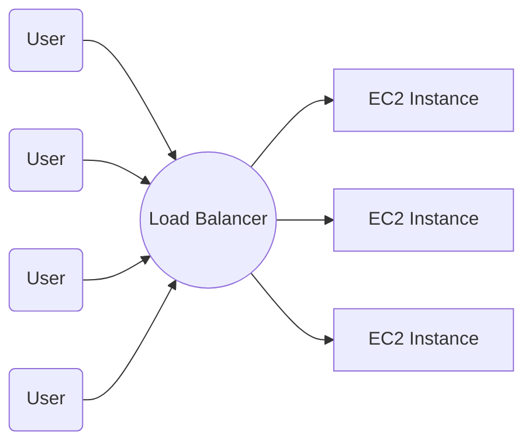

## ELB : Elastic Load Balancing

- 요청들을 여러 개의 server로 부하를 분산시킵니다.

---

## Load balancer의 종류

### ALB : Application Load Balancer

### NLB : Network Load Balancer

### GLB : Gateway Load Balancer

- 각종 보안 도구를 third party로 구성할 수 있음

### CLB : Classic Load Balanver

- ALB와 유사합니다.
- AWS에서 이 유형은 사용을 권장하지 않습니다.
    - ALB에 흡수되어 사라질 가능성이 있습니다.

---

## CLB 생성 과정

### 1. Load balancer 이름 정하기

### 2. 접속 체계(`Scheme`) 설정하기

| Internet-facing (Internet 경계) | Internal (내부) |
| --- | --- |
| 외부 접속에 대한 load balancing입니다. | 내부 망 간의 load balancing입니다. |

### 3. VPC 선택하기

### 4. Subnet들을 선택하기

- load balancing 대상 server가 있는 subnet들을 선택합니다.

### 5. Security group 선택하기

### 6. Listener 및 Routing 설정하기

- Listener(frontend)와 Instance(backend)를 설정합니다.
- 만약 HTTPS를 선택했다면 아래 Secure listener 설정에서 인증서를 함꼐 설정합니다.

### 7. Ping 경로 설정

- backend에 있는 server들의 상태 검사를 할 때 사용할 경로를 설정합니다.

### 8. Instance 설정하기

- backend의 server들을 선택합니다.

---

# Reference

- AWS Cloud 핵심 Service 활용 및 ECS EKS 개발 환경 구축 (강의) - 이한기
