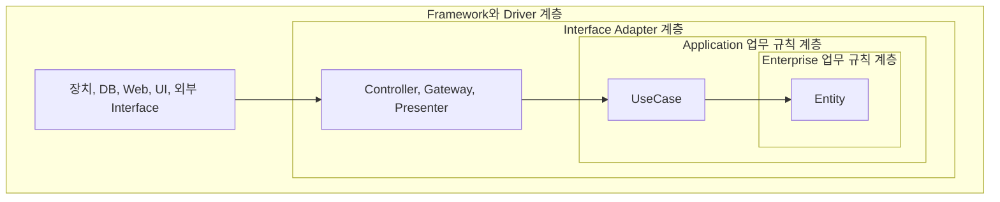
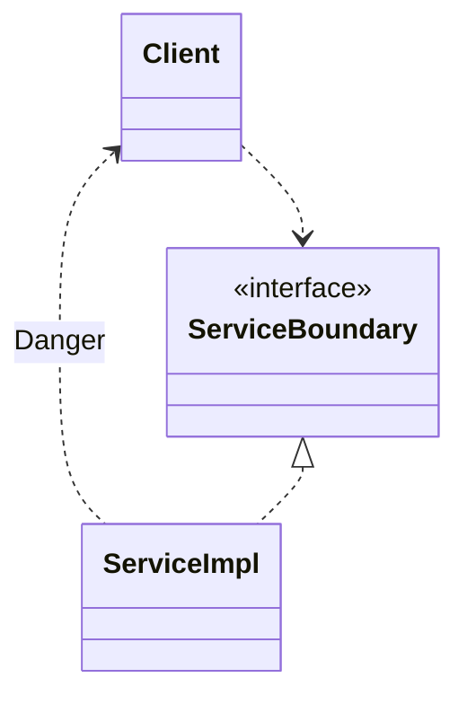
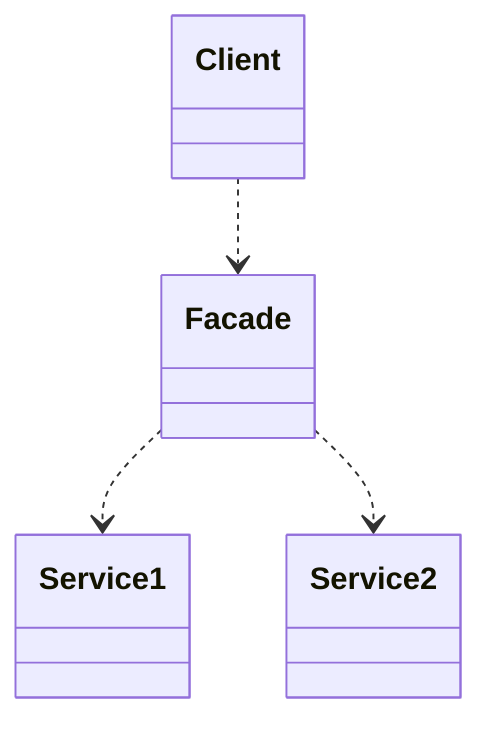

# 업무 규칙 (Business Logic)

- **사업적으로 수익을 얻거나 비용을 줄일 수 있는 규칙 또는 절차**


<!-- 
- 업무 규칙은 system에서 가장 독립적이며 가장 많이 재사용할 수 있는 code여야 합니다.

- 업무 규칙이 요구하는 data를 **업무 data**라고 합니다.
    - e.g., 대출에 일정 비율의 이자를 부과한다는 사실은 은행이 돈을 버는 업무 규칙이며, 대출 잔액이나 이자율 등은 업무 data입니다.

- 핵심 업무 규칙(Critical Business Rule)은 사업 자체에 핵심적인 규칙입니다.
    - 규칙을 자동화하는 system이 없더라도 그대로 존재하며, 사람이 수동으로 직접 수행하더라도 마찬가지로 그대로 존재합니다.

- 핵심 업무 data (Critical Business Data)는 핵심 업무 규칙에 필요한 data입니다.
    - system으로 자동화하지 않은 경우에도 존재하는 data입니다.
    - 핵심 규칙과 핵심 data는 본질적으로 결합되어 있고, 이것으로 만든 객체를 Entity라고 함
-->


<br>
<br>
<br>
<br>
<br>
<br>
<br>
<br>
<br>
<br>


## 업무 규칙 구현에 필요한 세 가지 요소

1. Entity
2. UseCase
3. Request/Response Model


<br>
<br>
<br>
<br>
<br>
<br>
<br>
<br>
<br>
<br>


## 1. Entity

- 핵심 업무 규칙과 핵심 업무 data를 객체로 만든 것
- Entity class는 **Business의 대표자**
- 반드시 객체 지향 언어를 사용할 필요 없음
- 업무 규칙 구현에 필요한 Entity는 **Domain Entity**

<!--
- 사업에 중요한 **핵심 업무 규칙**과 핵심 업무 규칙이 요구하는 **핵심 업무 data**는 본질적으로 결합되어 있으므로 객체로 만들기 좋은 후보입니다.

- Entity는 computer system 내부의 객체로서, **핵심 업무 data를 기반으로 동작하는 일련의 핵심 업무 규칙을 구체화**합니다.
    - Entity 객체는 핵심 업무 data를 직접 포함하거나, 핵심 업무 data에 매우 쉽게 접근할 수 있습니다.
    - Entity의 interface는 핵심 업무 data를 기반으로 동작하는 핵심 업무 규칙을 구현한 함수들로 구현됩니다.

- Entity class는 **business의 대표자**로서 독립적으로 존재하며, **순전히 업무에 대한 것**이어야 합니다.
    - Entity class는 업무 이외의 database, 사용자 interface, third party framework 등에 대한 고려 사항들로 인해 오염되어서는 안 됩니다.
    - 어떠한 system에서도 Entity의 업무를 수행할 수 있어야 합니다.
        - system의 표현 형식이나 data 저장 방식, computer가 배치되는 방식과도 무관해야 합니다.
    - 따라서 Entity는 핵심 업무 data와 규칙을 하나로 묶어서 **별도의 software module**로 만들어야 합니다.

- Entity를 만들 때 반드시 객체 지향 언어를 사용할 필요는 없습니다.
    - 단지 핵심 업무 data와 핵심 업무 규칙을 하나로 묶어서 별도의 software module로 만들면 됩니다.

- 업무 규칙 구현에 필요한 Entity는 **Domain Entity**입니다.
    - Entity라는 단어는 여러 곳에서 다른 의미로 쓰이고 있으며, 대표적으로 **business의 Domain Entity**와 **JPA의 영속성 Entity**가 있습니다.
    - JPA Entity는 DB와 mapping되는 영속성 Entity이므로 핵심 업무 규칙을 가지는 Domain Entity의 개념과는 다릅니다.
        - 하지만 JPA Entity가 업무 규칙을 가져 Domain Entity 역할까지 가질 수도 있습니다.
-->


<br>
<br>
<br>
<br>
<br>
<br>
<br>
<br>
<br>
<br>


## 2. UseCase

- **Application에 특화된 업무 규칙**
    - 자동화된 system이 동작하는 방법을 정의하고 제약함
- 사용자와 Entity 사이의 상호 작용을 규정함


<!--
- 사용자가 제공해야 하는 입력, 사용자에게 보여줄 출력, 그리고 해당 출력을 생성하기 위한 처리 단계를 기술합니다.
- UseCase는 Entity 내부의 핵심 규칙을 언제 어떻게 호출할지 명시하는 규칙을 담습니다.
    - 입/출력 data를 형식 없이 명시한다는 점을 제외하고 UI를 기술하지 않습니다.
- system이 사용자에게 어떻게 보이는지는 설명하지 않습니다.
    - system에서 data가 들어오고 나가는 방식은 UseCase와는 무관하며, 그 역할은 Request/Response Model이 맡습니다.

- UseCase는 자동화된 system이 사용되는 방법을 설명합니다.
    - UseCase는 자동화된 system의 요소로 존재해야만 의미가 있으므로, Entity처럼 수동 환경에서는 사용할 수 없습니다.
- Entity가 어떻게 동작할지 제어하기 위해 system을 알아야 하기 때문에, Entity보다 덜 순수합니다.
    - UseCase는 Entity 내의 핵심 업무 규칙과는 반대되는 성격을 가집니다.

- UseCase는 객체이며, 함수와 data 요소를 포함합니다.
    - application에 특화된 업무 규칙을 구현하는 하나 이상의 함수를 제공합니다.
    - 입력 data, 출력 data, UseCase가 상호 작용하는 Entity에 대한 참조 data 등의 data 요소를 포함합니다.
        - 이를 통해 사용자와 entity 사이의 상호 작용을 규정합니다.
-->

### 신규 대출을 위한 신상 정보를 수집하는 UseCase

```txt
• 입력 : 이름, 주소, 생일, 운전 면허 번호, 주민 번호 등
• 출력 : 사용자 확인을 위한 동일한 정보, 신용도
• 기본 과정
    1. 이름을 받아서 검증한다.
    2. 주소, 생일, 운전 면허 번호, 주민 번호 등을 검증한다.
    3. 신용도를 얻는다.
    4. 신용도가 500보다 낮으면, Denial(거절)을 활성화한다.
    5. 높으면 Customer(고객)를 생성하고 Loan Estimation(대충 견적)을 활성화한다.
```

<br>
<br>
<br>
<br>
<br>


### UseCase와 Entity 사이의 의존성

- DIP 준수

<!--
- UseCase와 entity의 의존성 방향은 DIP(의존성 역전 원칙)를 준수합니다.
    - UseCase는 Entity에 의존하는 반면, Entity는 UseCase에 의존하지 않습니다.
- 고수준인 Entity는 저수준인 UseCase에 대해 알지 못하지만, 저수준인 UseCase는 고수준인 Entity를 알고 있습니다.
    - UseCase는 단일 application에 특화되어 있으며, system의 입/출력에 보다 가깝게 위치하기 때문에 저수준입니다.
    - Entity는 다양한 application에서 사용될 수 있도록 일반화한 것이며, 입/출력에서 더 멀리 떨어져 있으므로 고수준입니다.
-->


<br>
<br>
<br>
<br>
<br>
<br>
<br>
<br>
<br>
<br>


## 3. Request/Response Model

- System의 가장 저수준 영역
- 사용자와의 통신 입/출력 형식 변환 및 제어
- UseCase의 독립성을 보장함


<!--
- UseCase는 입력 data로부터 출력 data를 생성하지만, 다른 component와 data를 주고 받는 방식은 몰라야 합니다.
- UseCase class의 code가 HTML이나 SQL에 대해 알아서는 안 되며, Web이나 UI에 종속되지 않아야 합니다.
- Request/Response Model이 독립적이지 않다면, 그 Model에 의존하는 UseCase도 결국 Model이 수반하는 의존성에 간접적으로 결합됩니다.

- Entity와 Request/Response Model은 많은 부분이 겹치지만, 통합해서 사용해서는 안 됩니다.
    - Entity와 Request/Response Model 객체는 존재의 목적이 다르며, 시간이 지나면 두 객체는 완전히 다른 이유로 변경될 것입니다.
    - 따라서 Entity와 Request/Response Model 객체를 함께 묶는 것은 OCP(공통 폐쇄 원칙)와 SRP(단일 책임 원칙)을 위반하는 것입니다.
-->


<br>
<br>
<br>
<br>
<br>
<br>
<br>
<br>
<br>
<br>


---


<br>
<br>
<br>
<br>
<br>
<br>
<br>
<br>
<br>
<br>


# Architecture 계층 분리

- 계층 분리를 통한 관심사의 분리
    - Hexagona Architecture
    - DCI(Data, Context, Interaction)
    - BCE(Boundary-Control-Entity)

1. Framework 독립성
2. Test 용이성
3. UI 독립성
4. Database 독립성
5. 외부 Agency에 대한 독립성


<!--
- Hexagona Architecture, DCI(Data, Context, Interaction), BCE(Boundary-Control-Entity)와 같은 system architecture에 관련된 여러 생각들은 모두 **계층 분리를 통한 관심사의 분리**를 목표로 하며, 비슷한 특징을 가지고 있습니다.

| 계층 분리의 장점 | 설명 |
| --- | --- |
| Framework 독립성 | framework를 도구로 사용하며, framework가 지닌 제약 사항으로 system을 강제하지 않습니다. |
| Test 용이성 | 업무 규칙은 UI, DB, Web server 및 다른 외부 요소 없이도 test할 수 있습니다. |
| UI 독립성 | system의 나머지를 변경하지 않고도 UI를 쉽게 변경할 수 있습니다. |
| Database 독립성 | Oracle이나 MS-SQL server 등을 다른 DB로 교체할 수 있고, 업무 규칙은 DB에 결합되지 않습니다. |
| 외부 Agency에 대한 독립성 | 업무 규칙은 외부의 interface에 대해 전혀 알지 못합니다. |
-->


<br>
<br>
<br>
<br>
<br>


## 계층 경계를 횡단하는 Data

- 내부의 계층에서 사용하기에 편리한 형태

<!--
- 경계를 가로질러 data를 전달할 때, **data는 항상 내부의 계층에서 사용하기에 가장 편리한 형태**여야 합니다.
    - 경계(계층)를 횡단하는 data는 간단한 data 구조로 이루어지며, 구조체나 DTO 등 원하는 형태를 선택할 수 있습니다.
    - 중요한 점은 격리되어 있는 간단한 data 구조가 경계를 가로질러 전달된다는 사실입니다.
    - data 구조가 의존성을 가져서 의존성 규칙을 어기게 해선 안 됩니다.
-->


<br>
<br>
<br>
<br>
<br>


## 의존성 규칙

- 의존성의 방향 : 외부 계층 -> 내부 계층
    - 외부 계층 : 저수준의 세부 사항이며
    - 내부 계층 : 범용적인 높은 수준의 정책

<!--
- source code 의존성은 항상 내부 계층을 향하며, 내부로 이동할수록 추상화와 정책의 수준이 높아집니다.
    - 가장 외부에 있는 계층은 저수준의 세부 사항이며, 내부로 이동할수록 점점 더 추상화되고 더 높은 수준의 정책들을 캡슐화합니다.
    - 가장 내부 계층은 가장 범용적이며, 높은 수준의 정책을 가지고 있습니다.

- 외부 계층에 위치한 어떤 것도 내부 계층에 영향을 주지 않아야 합니다.
    - 내부 계층에 속한 요소는 외부 계층에 속한 어떤 것(e.g., 함수, class, 변수 등의 모든 software entity)도 알지 못합니다.
-->




<!--
- 상황에 따라서 더 많은 계층이 필요할 수도 있으며, diagram은 예시입니다.


### Enterprise 업무 규칙 계층 : Entity

- Entity는 전사적인 핵심 업무 규칙을 캡슐화하며, method를 갖는 객체일 수도, data와 함수의 집합일 수도 있습니다.
    - 다양한 application에서 재사용만 가능하다면 형태는 중요하지 않습니다.

- 특정 application에 어떠한 변경이 필요하더라도 Entity에는 영향을 주면 안 됩니다.
    - 외부 계층의 무언가가 변경되더라도, Entity는 변경되어선 안 됩니다.
    - e.g., Entity는 핵심 업무 규칙(business logic)을 다루므로, UI 단의 paging 처리 등이 필요해도 변경이 일어나서는 안 됩니다.


### Application 업무 규칙 계층 : UseCase

- UseCase는 application에 특화된 업무 규칙을 포함하며, system의 모든 UseCase를 캡슐화하고 구현합니다.

- UseCase는 Entity로 들어오고 나가는 data 흐름을 조정합니다.
    - 또한 Entity가 자신의 핵심 업무 규칙을 사용해서 UseCase의 목적을 달성하도록 이끕니다.

- UseCase의 변경이 Entity에 영향을 줘선 안 되며, 외부 요소의 변경이 이 계층에 영향을 주는 것도 안 됩니다.
    - 하지만 운영 관점에서는 application이 변경된다면 UseCase가 영향을 받을 수 있기 때문에, UseCase 세부 사항이 변하면 일부 code는 영향을 받을 수 있습니다.


### Interface Adapter 계층 : Controller, Gateway, Presenter

- presenter나 controller 등과 같은 adapter들로 구성되며, controller에서 UseCase로 전달된 요청은 다시 controller로 되돌아 갑니다.

- adapter는 UseCase와 Entity에 맞는 data에서 DB나 Web 등과 같은 외부 요소에 맞는 data로 변환합니다.
    - 반대로, data를 외부 service에 맞는 형식에서 UseCase나 Entity에서 사용되는 내부적인 형식으로 변환하는 또 다른 adapter도 필요합니다.

- 특정 기술에 종속되는 역할(객체 변환)은 adapter가 맡게 하여, UseCase까지 세부 기술 의존성이 도달하지 않도록 합니다.
    - 만약 UseCase 계층에서 변환을 한다면 UseCase가 세부 기술에 의존하게 됩니다.


### Framework와 Driver : 장치, DB, Web, UI, 외부 Interface

- 가장 바깥쪽 계층은 database나 Web framework 같은 것들로 구성됩니다.
- 이 계층에서는 안쪽 원과 통신하기 위한 접합 code 외에는 특별히 더 작성할 것이 없습니다.
- 모든 세부 사항이 위치하는 곳으로, Web과 database도 세부 사항이므로 이를 외부에 위치시켜 피해를 최소화합니다.
-->


<br>
<br>
<br>
<br>
<br>
<br>
<br>
<br>
<br>
<br>


---

<br>
<br>
<br>
<br>
<br>
<br>
<br>
<br>
<br>
<br>


# Architecture 경계

- Software 요소를 서로 분리함
- 변경이 전파되는 것을 막는 방화벽
- 관련이 있는 것과 없는 것 사이에 정의함


<!--
- 경계(boundary)는 **software 요소를 서로 분리**하고, 경계 한편에 있는 요소가 **반대편에 있는 요소를 알지 못하도록** 막습니다.
    - 경계는 변경이 전파되는 것을 막는 방화벽을 구축하고 관리하는 수단입니다.

- 경계 중 일부는 project 초기에, 심지어 code가 작성되기도 전에 정의되며, 어떤 경계는 매우 나중에 정의되기도 합니다.
    - 초기에 정의되는 경계는 가능한 오랫동안 결정을 연기시켜, 이들 결정이 핵심적인 업무 규칙(business logic)을 오염시키지 못하게 하려는 목적입니다.

- 너무 일찍 내려진 결정에 대한 결합(coupling)은 인적 자원의 효율을 떨어뜨립니다.
    - 좋은 architecture는 system의 업무 요구 사항(UseCase)과 관련 없는 결정은 가능한 한 최후에 내릴 수 있게 해줍니다.
    - 업무 요구 사항(Usecase)과 관련 없는 것들로는 framework, database, web server, utility library, 의존성 주입 등이 있습니다.

- 경계는 **관련이 있는 것과 없는 것 사이**에 정의합니다.
    - e.g., GUI와 업무 규칙 사이에 긋고, database와 업무 규칙 사이에 긋습니다.

- 경계 선을 정의하려면 먼저 system을 component 단위로 분할해야 합니다.
    - plugin으로 분할된 component(저수준의 세부 사항)의 의존성의 방향은 핵심 업무 규칙 component(고수준의 추상화)를 향하도록 합니다.
-->


<br>
<br>
<br>
<br>
<br>


## 부분적 경계

- 완벽한 경계 -> 높은 비용
- YAGNI : You are not going to need it


<!--
- 경계를 제대로 구현하려면 비용이 많이 듭니다.
- 또한 경계가 무시되었다면 나중에 다시 추가하는 비용도 큽니다.

- Agile 기법 관점에서는 'YAGNI(You Are not Going to Need It)' 원칙을 위배하는 선행적인 설계(architecture 경계를 완벽히 하는 것)는 좋지 않습니다.
    - 추상화가 필요할 것이라고 미리 함부로 예측해서는 안 됩니다.
    - 오버 엔지니어링이 언더 엔지니어링보다 나쁠 때가 훨씬 많습니다.

- 반대로 아키텍처 경계가 필요하다는 사실을 너무 늦게 발견할 수도 있습니다.
    - 이때 경계를 추가하려면 비용이 많이 들고 큰 위험을 감수해야 합니다.

- 경계 구축의 투자 대비 효용(ROI, Return On Investment)을 따져봐야 합니다.
    - clean architecture는 변경에 매우 유연하지만, 추상화하여 이를 전부 구현하려면 ROI가 떨어집니다.
    - trade-off가 필요하며, 추상화의 조짐이 보이는 시점에 비용을 예상해보는 것이 좋습니다.
    - 추상화 도입으로 비용이 더 커진다면, 그대로 두는 것이 더 낫습니다.
        - e.g., 잠깐 사용하고 삭제할 code는 굳이 interface를 두고 구현체를 나누지 않습니다.

- 소프트웨어 아키텍트는 미래를 내다보고 현명하게 추측해야 합니다.
    - 비용을 산정하고, 어디에 경계를 둘지, 그리고 완벽하게 구현할 경계와 부분적으로 구현할 경계, 무시할 경계를 결정해야 합니다.
    - 이는 일회성 결정이 아니며, 프로젝트 초반에는 구현할 경계와 무시할 경계인지를 쉽게 결정할 수 없으므로 빈틈없이 지켜봐야 합니다.
    - 경계가 필요할 수도 있는 부분에 주목하고, 경계가 존재하지 않아 생기는 마찰의 어렴풋한 첫 조짐을 신중하게 관찰해야 합니다.
    - 첫 조짐이 보이는 시점에 해당 경계를 구현하는 비용과 무시할 때 감수할 비용을 가늠해보고, 결정 사항을 자주 검토해야 합니다.
    - 목표는 경계의 구현 비용이 무시해서 생기는 비용보다 적어지는 그 변곡점에서 경계를 구현하는 것입니다.

- architecture의 선행적인 설계가 필요할지도 모르겠다는 생각이 든다면, 부분적 경계(partial boundary)를 구현해 볼 수 있습니다.
    - 무조건 원칙에 맞추어 양방향 interface를 만들어서 경계를 완벽하게 구분해야 하는 것은 아닙니다.
    - 상황에 맞추어 architecture 경계가 언제, 어디에 존재해야 할지, 그 경계를 완벽하게 혹은 부분적으로 구현할지를 결정해야 합니다.

-->

 

<br>
<br>
<br>
<br>
<br>


## 부분적 경계를 구현하는 3가지 방법

<!--
- architecture 경계를 부분적으로 구현하는 간단한 3가지 방법이 있습니다.
- 부분적 경계를 구현할 수 있는 방법은 더 다양하며, 3가지는 순전히 예시입니다.
-->

<br>
<br>
<br>


### 1. 단일 배포

- Source code 수준에서의 완벽한 경계
- 쉬운 배포

<!--
- 단일 배포는 source code에서는 완벽한 경계를 구현하지만, 단일 component로 컴파일해서 배포하는 것입니다.
    - 독립적으로 compile 및 배포가 가능한 component로 만들고, 단일 component에 그대로 모아둡니다.

- 이렇게 하면 code는 간단해지지 않지만, component 간 의존성 관리와 version 관리를 하지 않아도 됩니다.
--> 

<br>
<br>
<br>


### 2. 일차원 경계

<!--
- 양방향 boundary interface가 아닌 한방향만 경계를 interface로 격리합니다.
    - Web application을 구축하는 데에 사용하는 Spring framework의 Controller, Service의 전형적인 구조와 닮아 있습니다.

- 일차원 경계는 추후 완벽한 경계를 구축해야 하는 상황에 대비를 하면서, 당장 경계도 구분할 수 있는 간단한 구조의 구현 방식입니다.
 
- 일차원 경계 구조는 `Client`로 부터 `ServiceImpl`을 분리합니다.
    - 다만, `Danger`라고 표시되어 있는 점선 화살표와 같은 의존성을 사용하지 않도록 유의해야 합니다.
-->




<br>
<br>
<br>


### 3. Facade

<!--
- Facade 자체가 경계가 되는, 일차원 경계보다 더 간단한 전략입니다.
    - `Facade` class에 모든 service class를 method 형태로 정의하고, 호출이 발생하면 해당 service class로 전달합니다.
    - `Client`는 `Service1`, `Service2`에 직접 접근할 수 없고, `Facade` class를 이용해 `Service1`, `Service2`의 method를 호출합니다.
 
- 이런 의존성 구조에서 `Client`는 `Service1`, `Service2`에 대해 추이 종속성을 가지게 됩니다.
- 또한 개발자가 마음만 먹으면, 일차원 경계보다 더 위험한 의존성을 사용할 수도 있습니다.
-->




<br>
<br>
<br>
<br>
<br>
<br>
<br>
<br>
<br>
<br>

---

<br>
<br>
<br>
<br>
<br>
<br>
<br>
<br>
<br>
<br>


# Service Architecture에 대한 오해

- Service 지향 Architecture, MicroService architecture

<!--
- Service 지향 Architecture(SOA, Service Oriented Architecture)는 대규모 computer system을 구축할 때의 개념으로, 업무 상의 일 처리에 해당하는 software 기능을 service로 판단하여 그 service를 네트워크 상에 연동하여 system 전체를 구축해 나가는 방법론입니다.
- MicroService는 application을 느슨하게 결합된 service의 모임으로 구조화하는 service 지향 architecture(SOA) style의 일종인 software 개발 기법입니다.

- service를 사용하면, 상호 결합이 철저하게 분리되고 개발과 배포 독립성을 지원하는 것처럼 보이지만, 이는 일부만 맞는 말입니다.
- 단순히 application의 행위를 분리할 뿐인 service라면 값비싼 함수 호출에 불과하며, architecture 관점에서 꼭 중요하다고 볼 수 없습니다.
    - system architecture는 의존성 규칙을 준수하며 고수준의 정책을 저수준의 정책으로부터 분리하는 경계에 의해 정의됩니다.
        - service를 사용한다는 사실만으로는 본질적으로 architecture에 해당하지 않습니다.
    - architecture 관점에서 중요한 service도 있지만, 중요하지 않은 service도 존재하는데, architecture가 관심을 갖는 service는 architecture 관점에서 중요한 service입니다.
-->

<br>
<br>
<br>
<br>
<br>

## 결합 분리의 오류

- Network 상의 공유 자원

<!--
- system을 service들로 분리함으로써, **service 사이의 결합이 무조건적으로 분리되는 것은 아닙니다.**
    - 각 service는 다른 process와 프로세서에서 실행되므로, service는 개별 변수 수준에서는 각각 결합이 분리됩니다.
    - 하지만 **네트워크 상의 공유 자원** 때문에 결합될 가능성이 여전히 존재하며, **서로 공유하는 data에 의해 강력하게 결합**됩니다.
-->

<br>
<br>
<br>
<br>
<br>

## 개발 및 배포 독립성의 오류

- payssam-api-approval 배포 중에는, payssam-api-bill 결제 기능이 동작하지 않음
- ssampoint-api 배포 중에는, payssam-api-manager-java의 포인트 계산 기능이 동작하지 않음

<!--
- service를 사용함으로써, **개발 및 배포 독립성을 무조건적으로 가질 수는 없습니다.**
    - 전담 팀이 service를 소유하고, 작성하고, 유지보수하고, 운영하게 되기 때문에, 개발 및 배포 독립성이 유지된다고 생각할 수 있습니다.
    - 하지만 service가 **data나 행위에서 어느 정도 결합**되어 있다면, **결합된 정도에 맞게 개발, 배포, 운영을 조정**해야 합니다.
        - service가 나뉘어 있다고 해서 항상 독립적으로 개발, 배포 및 운영이 가능한 것이 아닙니다.
        - e.g., `A` service의 기능 `a()`가 `B` service의 기능 `b()`를 호출하여 사용한다면, `B`를 배포할 때 `a()` 기능도 동작하지 않게 됩니다.

- service는 확장 가능한 system을 구축하는 유일한 선택지가 아닙니다.
    - monolithic이나 component 기반으로도 대규모 enterprise system을 구축할 수 있다는 사실은 역사적으로 증명되어 왔습니다.
-->


<br>
<br>
<br>
<br>
<br>
<br>
<br>
<br>
<br>
<br>

---

<br>
<br>
<br>
<br>
<br>
<br>
<br>
<br>
<br>
<br>


# 세부 사항

- 정책과 소통할 때 필요한 것
- 정책이 갖는 행위에는 영향을 미치지 않음

1. Main Component
2. Database
3. Web
4. Framework

<!--
- 세부 사항은 사용자, 개발자, 외부 system이 **정책과 소통할 때 필요**하며, 정책이 갖는 행위에는 영향을 미치지 않습니다.

- 세부 사항에 대한 결정은 가능한 오래 미룰 수 있어야 합니다.
    - 세부 사항은 정책에 무관하기 때문에, 세부 사항의 결정을 뒤로 미뤄도 정책을 구현하는 데에 영향을 주어서는 안 됩니다.
        - e.g., DB table 추가가 미뤄져도, business logic에 대한 개발은 진행할 수 있어야 합니다.
    - 따라서 정책을 설계할 때는 세부 사항에 몰두하지 않고, 가능한 많은 선택지를 가능한 오래 남겨 두어야 합니다.

- 세부 사항에는 입출력 장치, database, web system, server, framework, 통신 protocol 등이 있습니다.
-->


<br>
<br>
<br>
<br>
<br>


<!--
## 세부 사항에 속하는 것들
-->


## 1. Main Component

- 나머지 Component를 생성/조정/관리하는 Component
- 궁극적인 세부 사항


<!--
- 모든 system에는 최소한 하나의 component가 존재하여 나머지 component를 생성/조정/관리하는데, 이 component를 main component라고 합니다.

- main component는 궁극적인 세부 사항으로, 가장 낮은 수준의 정책입니다.
    - main component는 system의 초기 진입점으로, 운영 체제를 제외하면 어떤 것도 main component에 의존하지 않습니다.

- main component는 초기 조건과 설정을 구성하고, 외부 자원을 모두 수집한 후 제어권을 application의 고수준 정책으로 넘기는 plugin입니다.
    - 고수준의 system을 위한 모든 것(factory, 전략, 기반 설비 등)을 load한 후, 제어권을 고수준의 system에게 넘깁니다.
    - plugin이므로 main component를 application의 설정 별로 하나씩 둬서 둘 이상의 main component를 만들 수도 있습니다.
        - main component를 plugin component로 여기고 architecture 경계 바깥에 위치시키면, 설정 관련 문제를 보다 쉽게 해결할 수 있습니다.

- 의존성 주입 framework를 이용해 의존성을 주입하는 일은 main component에서 이뤄져야 합니다.
    - main component에 의존성이 주입되고 나면, main은 의존성 주입 framework 없이도 의존성을 분배할 수 있어야 합니다.
-->

<br>
<br>
<br>
<br>
<br>

## 2. Database

- Data는 중요하지만 Database는 중요하지 않음

<!--
- architecture 관점에서 database는 entity가 아닌 세부 사항이기 때문에, architecture의 구성 요소 수준으로 끌어올릴 수 없습니다.
    - 체계화된 data 구조와 data model은 architecture에서 중요하지만, database는 data model이 아닙니다.
    - data를 회전식 자기 disk 표면에서 이리저리 옮길 뿐인 기술과 system(database)은 architecture에 중요하지 않습니다.
        - database는 software이자 utility일 뿐입니다.

- 관계형 database는 data를 저장하고 접근하는데 탁월한 기술이지만, 결국 기술일 뿐입니다.
    - data를 table에 행 단위로 배치한다는 자체는 architecture 관점에서 중요하지 않습니다.
    - 유스케이스는 data 저장 방식을 알아서는 안되며 관여해서도 안 됩니다.
    - data가 table 구조를 가진다는 사실은 오직 architecture 경계의 외부에 위치한 최하위 수준의 utility 함수만 알아야 합니다.

- data는 중요하지만 database는 세부 사항입니다.


#### Application 성능과 Database

- application의 성능은 architecture의 관심사입니다.
- 하지만 data 저장소의 측면에서는 완전히 캡슐화하여 업무 규칙과 분리할 수 있는 관심사입니다.
    - data 저장소에서 data를 빠르게 넣고 뺄 수 있어야 하는 것은 맞지만, 이는 저수준의 관심사입니다.
    - 저수준의 data 접근 mechanism 단에서 다룰 수 있고, 성능은 전반적인 architecture와는 관련이 없습니다.
-->


<br>
<br>
<br>
<br>
<br>


## 3. Web

- Web은 입출력 장치
- Application이 전달되는 방식에 불과함

<!--
- Web은 전달 mechanism(입출력 장치)이며, 언제 변할지 모르는 세부 사항입니다.
    - application이 Web으로 전달된다는 사실은 세부 사항(미루어야 할 결정 사항)이며, system 구조를 지배해서는 안 됩니다.
        - system architecture는 system을 어떻게 전달할지 몰라야 합니다.
    - 현대에는 Web 기반의 API(RESTful API)로 입력을 받고 출력을 보내는 것이 당연하지만, 입출력 장치는 계속해서 변해 왔습니다.

- 따라서 Web은 핵심 업무 규칙(business logic)에 결합되지 않도록, 분리하여 architecture 경계 바깥에 둡니다.
    - 분리를 위해 UI와 application 사이에 추상화된 경계를 정의해야 합니다.
-->

<br>
<br>
<br>
<br>
<br>


## 4. Framework

- 강력하고 유용한 도구
- 업무 규칙과 결합되기 쉬움

<!--
- framework는 세부 사항으로 남겨 두어야 합니다.
    - architecture는 system을 이야기해야 하며, system에 적용된 framework에 대해 얘기해서는 안 됩니다.
        - 어떻게 해야 architecture를 UseCase에 중점을 둔 채 그대로 보존할 수 있을지를 생각해야 합니다.
        - 새로 합류한 programmer는 system이 어떻게 전달될 지 알지 못한 상태에서도 system의 모든 UseCase를 이해할 수 있어야 합니다.

- framework를 사용할 수는 있지만 결합해서는 안 되고, 적당히 거리를 두어야 합니다.
    - framework는 강력하고 유용하며, 그래서 업무 규칙과 결합되기 쉽지만, 한번 결합하면 그 관계를 깨기가 매우 어렵습니다.
    - 이후에 기술적인 이유 등으로 framework는 변경될 수 있기 때문에, 세부 사항으로 취급해야 합니다.

- framework를 architecture의 바깥쪽 원에 속하는 세부 사항으로 취급하고, architecture의 중심부로 들어오지 못하게 해야 합니다.
    - framework가 자신의 class로부터 파생을 요구한다면 proxy를 만들고, 업무 규칙에 plugin할 수 있는 component에 위치시켜야 합니다.
    - 핵심 code에 plugin할 수 있는 component에 framework를 통합하고, 의존성 규칙을 준수해야 합니다.
        - e.g., Spring은 훌륭한 의존성 주입 framework이지만, 업무 객체는 `@Autowired` 등을 포함하여 절대로 Spring에 대해 알아서는 안 됩니다.
-->

