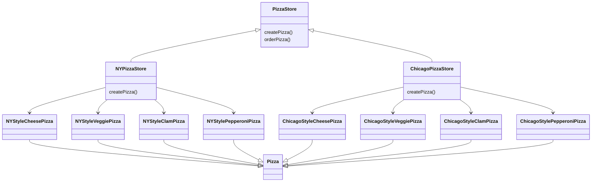
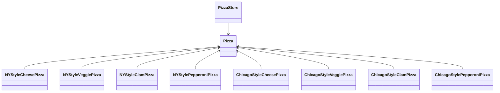

# Factory Method Pattern

```
factory method pattern에서는 객체를 생성하기 위한 interface를 정의하는데, 이떤 class의 instance를 만들지는 sub class에서 결정하게 만듭니다.
factory method pattern을 이용하면 class의 instance를 만드는 일을 sub class에게 맡기는 것이죠.
```

- 구상 형식의 instance를 만드는 작업을 캡슐화할 수 있음
    - client 입장에서는 '객체 instance를 만들 때 필요한 구상 class'가 아닌 'interface'만 필요로 하게 됨
        - 구현이 아닌 interface를 바탕으로 programming을 할 수 있음
        - 유연성, 확장성이 좋아짐

- 상속을 활용
    - 객체 생성이 sub class에게 위임됨
    - sub class에서는 factory method를 구현하여 객체를 생산함

- factory method
    - factory method는 객체 생성을 처리함
    - factory method를 이용하면 객체를 생성하는 작업을 sub class에 캡슐화시킬 수 있음
        - super class에 있는 client code와 sub class에 있는 객체 생성 code를 분리시킬 수 있음
    ```java
    abstract Product factoryMethod(String type)
    ```
    - `abstract` : factory method는 추상 method로 선언하여 sub class에서 객체 생성을 책임지도록 함
    - `Product` : factory method에서는 특정 제품(객체)를 return하면, 그 객체는 보통 super class에서 정의한 method 내에서 쓰이게 됨
    - `factoryMethod()` : factory method는 client(super class에 있는 공통 code)에서 실제로 생성되는 구상 객체가 무엇인지 알 수 없게 만드는 역할을 함
    - `String type` : factory method를 만들 때 매개변수를 써서 만들어낼 객체 종류를 선택할 수 있음

## Class Diagram


## Simple Factory & Factory Method Pattern

- 구상 class의 instance를 만들 때
    - simple factory : 한 객체에서 전부 처리함
    - factory method pattern : 일련의 sub class에서 처리함

- factory method pattern을 사용하면 simple factory의 문제를 해결할 수 있음
    - simple factory에서 만든 객체를 사용하긴 하나, method를 마음대로 바꿔서 사용할 수 있었음
        - 일련의 method들을 사용하는 과정을 하나로 묶어줄 필요가 있음
    - factory method pattern는 유연성을 잃지 않으면서 과정을 강제하기 위한 framework

---


# Example : Pizza 가게


## simple factory -> factory method pattern

- createPizza() method를 PizzaStore class에 다시 집어넣고, 추상 method로 선언함
    - 각 지역의 style에 맞게 PizzaStore의 sub class를 만들어 과정을 강제하게 됨

- PizzaStore class
    - orderPizza() method는 super class에서 구현
        - 주문 system 자체는 모든 분점에서 똑같이 진행되어야 함
        - orderPizza() method는 무슨 pizza를 만드는지 알지 못함
            - 어떤 sub class를 사용해서 어떤 Pizza 객체를 사용하느냐 따라 다름
                - 어떤 sub class를 사용하는지 : factory에서 결정
                - 어떤 Pizza 객체를 사용하는지 : factory로 만들어진 구상 sub class에서 결정
    - createPizza() method는 sub class에서 구현
        - createPizza() method는 factory method임
            - Pizza instance를 만드는 일을 하기 때문
        - 각 분점마다 달라질 수 있는 것은 pizza style 뿐
        - 이 다른 점들을 createPizza() method에 집어넣음
        - createPizza() method에서 해당 style pizza를 만드는 것을 모두 책임지도록 함
        - sub class에서 구현하기 때문에 분점 마다 다른 pizza 제조 과정을 강제할 수 있게 됨


## Class Diagram




## Dependency

### No Factory : 심하게 의존적인 PizzaStore


- PizzaStore가 pizza class 구현에 의존함
    - PizzaStore에서 모든 pizza 객체들을 직접 생성해야 하므로, 모든 pizza 객체들에게 직접적으로 의존함
        - pizza라는 개념을 추상화(pizza 추상 class 사용)할 수 없기 때문에 의존성을 뒤집을 수 없음
    - pizza class들의 구현이 변경되면 PizzaStore까지 고쳐야할 수도 있음
    - 다른 style이나 pizza 종류를 새로 추가하면 PizzaStore는 더 많은 pizza 구상 객체에 의존하게 됨
        - 의존해야 할 객체의 수가 계속 늘어남

### Factory : 의존성 뒤집기 원칙



- 고수준 구성요소인 PizzaStore와 저수준 구성요소인 pizza 객체들이 모두 추상 class인 Pizza에 의존하게 됨
    - 다양한 구상 pizza 형식이 추상화된 Pizza에 의존하게 될테고, 마찬가지로 pizza 가게도 추상화된 Pizza에 의존하게 됨
- factory method pattern은 의존성 뒤집기 원칙을 준수하기 위해 사용할 수 있는 방법
    - factory를 사용하지 않았을 때는 pizza 가게가 pizza에 의존했지만, factory를 사용하고 나서는 그 의존성이 뒤집힘


## Code

### Main

```java
public class PizzaTestDrive {
 
    public static void main(String[] args) {
        SimplePizzaFactory factory = new SimplePizzaFactory();
        PizzaStore store = new PizzaStore(factory);

        Pizza pizza = store.orderPizza("cheese");
        System.out.println("We ordered a " + pizza.getName() + "\n");
        System.out.println(pizza);
 
        pizza = store.orderPizza("veggie");
        System.out.println("We ordered a " + pizza.getName() + "\n");
        System.out.println(pizza);
    }
}
```

### PizzaStore

```java
public abstract class PizzaStore {
 
    abstract Pizza createPizza(String item);
 
    public Pizza orderPizza(String type) {
        Pizza pizza = createPizza(type);
        System.out.println("--- Making a " + pizza.getName() + " ---");
        pizza.prepare();
        pizza.bake();
        pizza.cut();
        pizza.box();
        return pizza;
    }
}
```

### PizzaStore sub class

```java
public class NYPizzaStore extends PizzaStore {

    Pizza createPizza(String item) {
        if (item.equals("cheese")) {
            return new NYStyleCheesePizza();
        } else if (item.equals("veggie")) {
            return new NYStyleVeggiePizza();
        } else if (item.equals("clam")) {
            return new NYStyleClamPizza();
        } else if (item.equals("pepperoni")) {
            return new NYStylePepperoniPizza();
        } else return null;
    }
}
```

```java
public class ChicagoPizzaStore extends PizzaStore {

    Pizza createPizza(String item) {
            if (item.equals("cheese")) {
                    return new ChicagoStyleCheesePizza();
            } else if (item.equals("veggie")) {
                    return new ChicagoStyleVeggiePizza();
            } else if (item.equals("clam")) {
                    return new ChicagoStyleClamPizza();
            } else if (item.equals("pepperoni")) {
                    return new ChicagoStylePepperoniPizza();
            } else return null;
    }
}
```

### Pizza

```java
public abstract class Pizza {
    String name;
    String dough;
    String sauce;
    ArrayList<String> toppings = new ArrayList<String>();
 
    void prepare() {
        System.out.println("Prepare " + name);
        System.out.println("Tossing dough...");
        System.out.println("Adding sauce...");
        System.out.println("Adding toppings: ");
        for (String topping : toppings) {
            System.out.println("   " + topping);
        }
    }
  
    void bake() {
        System.out.println("Bake for 25 minutes at 350");
    }
 
    void cut() {
        System.out.println("Cut the pizza into diagonal slices");
    }
  
    void box() {
        System.out.println("Place pizza in official PizzaStore box");
    }
 
    public String getName() {
        return name;
    }

    public String toString() {
        StringBuffer display = new StringBuffer();
        display.append("---- " + name + " ----\n");
        display.append(dough + "\n");
        display.append(sauce + "\n");
        for (String topping : toppings) {
            display.append(topping + "\n");
        }
        return display.toString();
    }
}
```

### Pizza sub class

```java
public class NYStyleCheesePizza extends Pizza {

    public NYStyleCheesePizza() { 
        name = "NY Style Sauce and Cheese Pizza";
        dough = "Thin Crust Dough";
        sauce = "Marinara Sauce";
 
        toppings.add("Grated Reggiano Cheese");
    }
}
```

```java
public class NYStylePepperoniPizza extends Pizza {

    public NYStylePepperoniPizza() {
        name = "NY Style Pepperoni Pizza";
        dough = "Thin Crust Dough";
        sauce = "Marinara Sauce";
 
        toppings.add("Grated Reggiano Cheese");
        toppings.add("Sliced Pepperoni");
        toppings.add("Garlic");
        toppings.add("Onion");
        toppings.add("Mushrooms");
        toppings.add("Red Pepper");
    }
}
```

```java
public class NYStyleClamPizza extends Pizza {

    public NYStyleClamPizza() {
        name = "NY Style Clam Pizza";
        dough = "Thin Crust Dough";
        sauce = "Marinara Sauce";
 
        toppings.add("Grated Reggiano Cheese");
        toppings.add("Fresh Clams from Long Island Sound");
    }
}
```

```java
public class NYStyleVeggiePizza extends Pizza {

    public NYStyleVeggiePizza() {
        name = "NY Style Veggie Pizza";
        dough = "Thin Crust Dough";
        sauce = "Marinara Sauce";
 
        toppings.add("Grated Reggiano Cheese");
        toppings.add("Garlic");
        toppings.add("Onion");
        toppings.add("Mushrooms");
        toppings.add("Red Pepper");
    }
}
```

```java
public class ChicagoStyleCheesePizza extends Pizza {

    public ChicagoStyleCheesePizza() { 
        name = "Chicago Style Deep Dish Cheese Pizza";
        dough = "Extra Thick Crust Dough";
        sauce = "Plum Tomato Sauce";
 
        toppings.add("Shredded Mozzarella Cheese");
    }
 
    void cut() {
        System.out.println("Cutting the pizza into square slices");
    }
}
```

```java
public class ChicagoStylePepperoniPizza extends Pizza {
    public ChicagoStylePepperoniPizza() {
        name = "Chicago Style Pepperoni Pizza";
        dough = "Extra Thick Crust Dough";
        sauce = "Plum Tomato Sauce";
 
        toppings.add("Shredded Mozzarella Cheese");
        toppings.add("Black Olives");
        toppings.add("Spinach");
        toppings.add("Eggplant");
        toppings.add("Sliced Pepperoni");
    }
 
    void cut() {
        System.out.println("Cutting the pizza into square slices");
    }
}
```

```java
public class ChicagoStyleClamPizza extends Pizza {
    public ChicagoStyleClamPizza() {
        name = "Chicago Style Clam Pizza";
        dough = "Extra Thick Crust Dough";
        sauce = "Plum Tomato Sauce";
 
        toppings.add("Shredded Mozzarella Cheese");
        toppings.add("Frozen Clams from Chesapeake Bay");
    }
 
    void cut() {
        System.out.println("Cutting the pizza into square slices");
    }
}
```

```java
public class ChicagoStyleVeggiePizza extends Pizza {
    public ChicagoStyleVeggiePizza() {
        name = "Chicago Deep Dish Veggie Pizza";
        dough = "Extra Thick Crust Dough";
        sauce = "Plum Tomato Sauce";
 
        toppings.add("Shredded Mozzarella Cheese");
        toppings.add("Black Olives");
        toppings.add("Spinach");
        toppings.add("Eggplant");
    }
 
    void cut() {
        System.out.println("Cutting the pizza into square slices");
    }
}
```

### No Factory : 심하게 의존적인 PizzaStore

```java
public class DependentPizzaStore {
 
    public Pizza createPizza(String style, String type) {
        Pizza pizza = null;
        if (style.equals("NY")) {
            if (type.equals("cheese")) {
                pizza = new NYStyleCheesePizza();
            } else if (type.equals("veggie")) {
                pizza = new NYStyleVeggiePizza();
            } else if (type.equals("clam")) {
                pizza = new NYStyleClamPizza();
            } else if (type.equals("pepperoni")) {
                pizza = new NYStylePepperoniPizza();
            }
        } else if (style.equals("Chicago")) {
            if (type.equals("cheese")) {
                pizza = new ChicagoStyleCheesePizza();
            } else if (type.equals("veggie")) {
                pizza = new ChicagoStyleVeggiePizza();
            } else if (type.equals("clam")) {
                pizza = new ChicagoStyleClamPizza();
            } else if (type.equals("pepperoni")) {
                pizza = new ChicagoStylePepperoniPizza();
            }
        } else {
            System.out.println("Error: invalid type of pizza");
            return null;
        }
        pizza.prepare();
        pizza.bake();
        pizza.cut();
        pizza.box();
        return pizza;
    }
}
```


---

# Reference

- Head First Design Patterns - Eric Freeman, Elisabeth Robson, Bert Bates, Kathy Sierra
