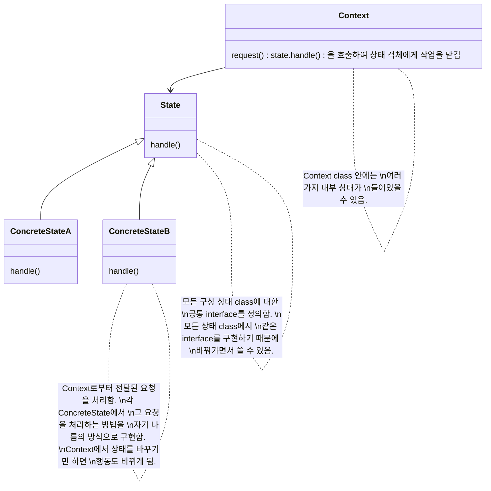
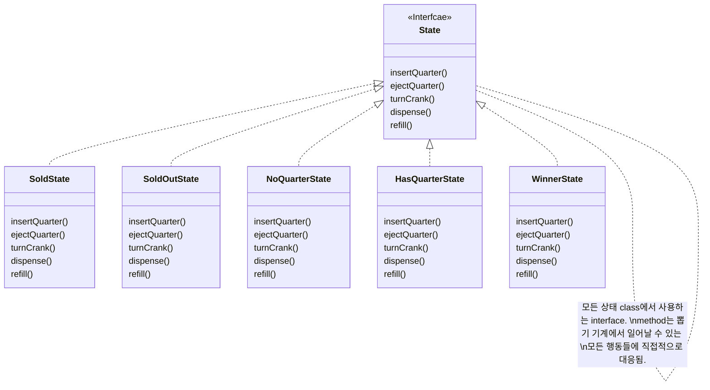

# State Pattern

```
State Pattern을 이용하면 객체의 내부 상태가 바뀜에 따라서 객체의 행동을 바꿀 수 있습니다. 마치 객체의 class가 바뀌는 것과 같은 결과를 얻을 수 있습니다.
```

- 각 상태를 별도의 class로 캡슐화함
    - 동일한 상황에 대해서 어떤 상태인지에 따라 다른 행동을 할 수 있도록 함
    - 나중에 변경시켜야 하는 내용을 국지화시킬 수 있음
    - 상태가 늘어남에 따라 class의 갯수가 늘어남

- Context 객체에서는 현재 상태를 나타내는 객체에게 행동을 위임함
    - 구성을 통해 여러 상태 객체를 바꿔가면서 사용함
        - 상속을 사용하지 않음
    - 내부 상태가 바뀜에 따라서 행동이 달라짐
        - 내부 상태를 바탕으로 여러 가지 서로 다른 행동을 사용할 수 있음
    - Context에 정의해야 하는 if문을 없앨 수 있음

- 상태 전환은 State class에 의해서 제어할 수도 있고, Context class에 의해서 제어할 수도 있음

- State class를 여러 Context 객체의 instance에서 공유하도록 design할 수도 있음

- Strategy Pattern & State Pattern
    - class diagram이 같으나, 서로 용도와 목적이 다름
    - Strategy Pattern
        - Context class를 만들 때 행동 또는 algorithm을 설정함
            - 객체에서 어떤 전략을 사용하는지는 보통 Context 객체가 직접 결정함
    - State Pattern
        - Context의 내부 상태가 바뀜에 따라서 알아서 행동을 바꿈
            - Context 객체에서는 미리 정해진 상태 전환 규칙을 바탕으로 알아서 자기 상태를 변경함
                - 상황에 따라서 상태를 바꾸는 것을 염두에 둔 design


## Class Diagram




---


# Example : 뽑기

- 뽑기 기계
    - 동전을 넣고 손잡이를 돌리면 알맹이가 나옴

- 당첨 기능 : 10% 확률로 알맹이를 하나씩 더 줌


## State Diagram


## Class Diagram




## Code

### Test code

```java
public class GumballMachineTestDrive {

    public static void main(String[] args) {
        GumballMachine gumballMachine = 
            new GumballMachine(10);

        System.out.println(gumballMachine);

        gumballMachine.insertQuarter();
        gumballMachine.turnCrank();
        gumballMachine.insertQuarter();
        gumballMachine.turnCrank();

        System.out.println(gumballMachine);

        gumballMachine.insertQuarter();
        gumballMachine.turnCrank();
        gumballMachine.insertQuarter();
        gumballMachine.turnCrank();

        System.out.println(gumballMachine);

        gumballMachine.insertQuarter();
        gumballMachine.turnCrank();
        gumballMachine.insertQuarter();
        gumballMachine.turnCrank();

        System.out.println(gumballMachine);

        gumballMachine.insertQuarter();
        gumballMachine.turnCrank();
        gumballMachine.insertQuarter();
        gumballMachine.turnCrank();

        System.out.println(gumballMachine);

        gumballMachine.insertQuarter();
        gumballMachine.turnCrank();
        gumballMachine.insertQuarter();
        gumballMachine.turnCrank();

        System.out.println(gumballMachine);
    }
}
```

### Context

```java
public class GumballMachine {
 
    State soldOutState;
    State noQuarterState;
    State hasQuarterState;
    State soldState;
    State winnerState;
 
    State state = soldOutState;
    int count = 0;
 
    public GumballMachine(int numberGumballs) {
        soldOutState = new SoldOutState(this);
        noQuarterState = new NoQuarterState(this);
        hasQuarterState = new HasQuarterState(this);
        soldState = new SoldState(this);
        winnerState = new WinnerState(this);

        this.count = numberGumballs;
         if (numberGumballs > 0) {
            state = noQuarterState;
        } 
    }
 
    public void insertQuarter() {
        state.insertQuarter();
    }
 
    public void ejectQuarter() {
        state.ejectQuarter();
    }
 
    public void turnCrank() {
        state.turnCrank();
        state.dispense();
    }

    void setState(State state) {
        this.state = state;
    }
 
    void releaseBall() {
        System.out.println("A gumball comes rolling out the slot...");
        if (count > 0) {
            count = count - 1;
        }
    }
 
    int getCount() {
        return count;
    }
 
    void refill(int count) {
        this.count += count;
        System.out.println("The gumball machine was just refilled; its new count is: " + this.count);
        state.refill();
    }

    public State getState() {
        return state;
    }

    public State getSoldOutState() {
        return soldOutState;
    }

    public State getNoQuarterState() {
        return noQuarterState;
    }

    public State getHasQuarterState() {
        return hasQuarterState;
    }

    public State getSoldState() {
        return soldState;
    }

    public State getWinnerState() {
        return winnerState;
    }
 
    public String toString() {
        StringBuffer result = new StringBuffer();
        result.append("\nMighty Gumball, Inc.");
        result.append("\nJava-enabled Standing Gumball Model #2004");
        result.append("\nInventory: " + count + " gumball");
        if (count != 1) {
            result.append("s");
        }
        result.append("\n");
        result.append("Machine is " + state + "\n");
        return result.toString();
    }
}
```

### State

```java
public interface State {
 
    public void insertQuarter();
    public void ejectQuarter();
    public void turnCrank();
    public void dispense();
    
    public void refill();
}
```

```java
public class SoldState implements State {
    GumballMachine gumballMachine;
 
    public SoldState(GumballMachine gumballMachine) {
        this.gumballMachine = gumballMachine;
    }
       
    public void insertQuarter() {
        System.out.println("Please wait, we're already giving you a gumball");
    }
 
    public void ejectQuarter() {
        System.out.println("Sorry, you already turned the crank");
    }
 
    public void turnCrank() {
        System.out.println("Turning twice doesn't get you another gumball!");
    }
 
    public void dispense() {
        gumballMachine.releaseBall();
        if (gumballMachine.getCount() > 0) {
            gumballMachine.setState(gumballMachine.getNoQuarterState());
        } else {
            System.out.println("Oops, out of gumballs!");
            gumballMachine.setState(gumballMachine.getSoldOutState());
        }
    }
    
    public void refill() { }
 
    public String toString() {
        return "dispensing a gumball";
    }
}
```

```java
public class SoldOutState implements State {
    GumballMachine gumballMachine;
 
    public SoldOutState(GumballMachine gumballMachine) {
        this.gumballMachine = gumballMachine;
    }
 
    public void insertQuarter() {
        System.out.println("You can't insert a quarter, the machine is sold out");
    }
 
    public void ejectQuarter() {
        System.out.println("You can't eject, you haven't inserted a quarter yet");
    }
 
    public void turnCrank() {
        System.out.println("You turned, but there are no gumballs");
    }
 
    public void dispense() {
        System.out.println("No gumball dispensed");
    }
    
    public void refill() { 
        gumballMachine.setState(gumballMachine.getNoQuarterState());
    }
 
    public String toString() {
        return "sold out";
    }
}
```

```java
import java.util.Random;

public class HasQuarterState implements State {
    Random randomWinner = new Random(System.currentTimeMillis());
    GumballMachine gumballMachine;
 
    public HasQuarterState(GumballMachine gumballMachine) {
        this.gumballMachine = gumballMachine;
    }
  
    public void insertQuarter() {
        System.out.println("You can't insert another quarter");
    }
 
    public void ejectQuarter() {
        System.out.println("Quarter returned");
        gumballMachine.setState(gumballMachine.getNoQuarterState());
    }
 
    public void turnCrank() {
        System.out.println("You turned...");
        int winner = randomWinner.nextInt(10);
        if ((winner == 0) && (gumballMachine.getCount() > 1)) {
            gumballMachine.setState(gumballMachine.getWinnerState());
        } else {
            gumballMachine.setState(gumballMachine.getSoldState());
        }
    }

    public void dispense() {
        System.out.println("No gumball dispensed");
    }
    
    public void refill() { }
 
    public String toString() {
        return "waiting for turn of crank";
    }
}
```

```java
public class NoQuarterState implements State {
    GumballMachine gumballMachine;
 
    public NoQuarterState(GumballMachine gumballMachine) {
        this.gumballMachine = gumballMachine;
    }
 
    public void insertQuarter() {
        System.out.println("You inserted a quarter");
        gumballMachine.setState(gumballMachine.getHasQuarterState());
    }
 
    public void ejectQuarter() {
        System.out.println("You haven't inserted a quarter");
    }
 
    public void turnCrank() {
        System.out.println("You turned, but there's no quarter");
     }
 
    public void dispense() {
        System.out.println("You need to pay first");
    } 
    
    public void refill() { }
 
    public String toString() {
        return "waiting for quarter";
    }
}
```

```java
public class WinnerState implements State {
    GumballMachine gumballMachine;
 
    public WinnerState(GumballMachine gumballMachine) {
        this.gumballMachine = gumballMachine;
    }
 
    public void insertQuarter() {
        System.out.println("Please wait, we're already giving you a Gumball");
    }
 
    public void ejectQuarter() {
        System.out.println("Please wait, we're already giving you a Gumball");
    }
 
    public void turnCrank() {
        System.out.println("Turning again doesn't get you another gumball!");
    }
 
    public void dispense() {
        gumballMachine.releaseBall();
        if (gumballMachine.getCount() == 0) {
            gumballMachine.setState(gumballMachine.getSoldOutState());
        } else {
            gumballMachine.releaseBall();
            System.out.println("YOU'RE A WINNER! You got two gumballs for your quarter");
            if (gumballMachine.getCount() > 0) {
                gumballMachine.setState(gumballMachine.getNoQuarterState());
            } else {
                System.out.println("Oops, out of gumballs!");
                gumballMachine.setState(gumballMachine.getSoldOutState());
            }
        }
    }
 
    public void refill() { }
    
    public String toString() {
        return "despensing two gumballs for your quarter, because YOU'RE A WINNER!";
    }
}
```


## State Pattern을 사용하지 않은 Code

```java
public class GumballMachineTestDrive {

    public static void main(String[] args) {
        GumballMachine gumballMachine = new GumballMachine(5);

        System.out.println(gumballMachine);

        gumballMachine.insertQuarter();
        gumballMachine.turnCrank();

        System.out.println(gumballMachine);

        gumballMachine.insertQuarter();
        gumballMachine.ejectQuarter();
        gumballMachine.turnCrank();

        System.out.println(gumballMachine);

        gumballMachine.insertQuarter();
        gumballMachine.turnCrank();
        gumballMachine.insertQuarter();
        gumballMachine.turnCrank();
        gumballMachine.ejectQuarter();

        System.out.println(gumballMachine);

        gumballMachine.insertQuarter();
        gumballMachine.insertQuarter();
        gumballMachine.turnCrank();
        gumballMachine.insertQuarter();
        gumballMachine.turnCrank();
        gumballMachine.insertQuarter();
        gumballMachine.turnCrank();

        System.out.println(gumballMachine);
    }
}
```

```java
public class GumballMachine {
 
    final static int SOLD_OUT = 0;
    final static int NO_QUARTER = 1;
    final static int HAS_QUARTER = 2;
    final static int SOLD = 3;
 
    int state = SOLD_OUT;
    int count = 0;
  
    public GumballMachine(int count) {
        this.count = count;
        if (count > 0) {
            state = NO_QUARTER;
        }
    }
  
    public void insertQuarter() {
        if (state == HAS_QUARTER) {
            System.out.println("You can't insert another quarter");
        } else if (state == NO_QUARTER) {
            state = HAS_QUARTER;
            System.out.println("You inserted a quarter");
        } else if (state == SOLD_OUT) {
            System.out.println("You can't insert a quarter, the machine is sold out");
        } else if (state == SOLD) {
            System.out.println("Please wait, we're already giving you a gumball");
        }
    }

    public void ejectQuarter() {
        if (state == HAS_QUARTER) {
            System.out.println("Quarter returned");
            state = NO_QUARTER;
        } else if (state == NO_QUARTER) {
            System.out.println("You haven't inserted a quarter");
        } else if (state == SOLD) {
            System.out.println("Sorry, you already turned the crank");
        } else if (state == SOLD_OUT) {
            System.out.println("You can't eject, you haven't inserted a quarter yet");
        }
    }
 
    public void turnCrank() {
        if (state == SOLD) {
            System.out.println("Turning twice doesn't get you another gumball!");
        } else if (state == NO_QUARTER) {
            System.out.println("You turned but there's no quarter");
        } else if (state == SOLD_OUT) {
            System.out.println("You turned, but there are no gumballs");
        } else if (state == HAS_QUARTER) {
            System.out.println("You turned...");
            state = SOLD;
            dispense();
        }
    }
 
    private void dispense() {
        if (state == SOLD) {
            System.out.println("A gumball comes rolling out the slot");
            count = count - 1;
            if (count == 0) {
                System.out.println("Oops, out of gumballs!");
                state = SOLD_OUT;
            } else {
                state = NO_QUARTER;
            }
        } else if (state == NO_QUARTER) {
            System.out.println("You need to pay first");
        } else if (state == SOLD_OUT) {
            System.out.println("No gumball dispensed");
        } else if (state == HAS_QUARTER) {
            System.out.println("No gumball dispensed");
        }
    }
 
    public void refill(int numGumBalls) {
        this.count = numGumBalls;
        state = NO_QUARTER;
    }

    public String toString() {
        StringBuffer result = new StringBuffer();
        result.append("\nMighty Gumball, Inc.");
        result.append("\nJava-enabled Standing Gumball Model #2004\n");
        result.append("Inventory: " + count + " gumball");
        if (count != 1) {
            result.append("s");
        }
        result.append("\nMachine is ");
        if (state == SOLD_OUT) {
            result.append("sold out");
        } else if (state == NO_QUARTER) {
            result.append("waiting for quarter");
        } else if (state == HAS_QUARTER) {
            result.append("waiting for turn of crank");
        } else if (state == SOLD) {
            result.append("delivering a gumball");
        }
        result.append("\n");
        return result.toString();
    }
}
```


---


# Reference

- Head First Design Patterns - Eric Freeman, Elisabeth Robson, Bert Bates, Kathy Sierra
