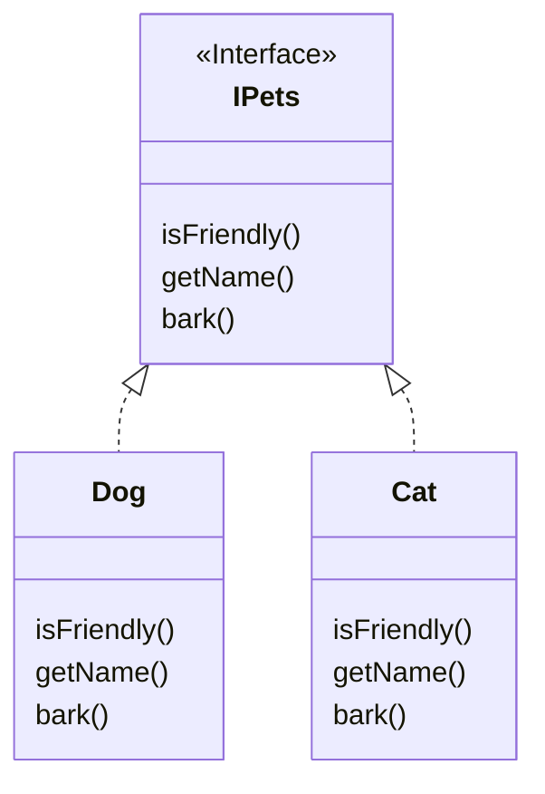
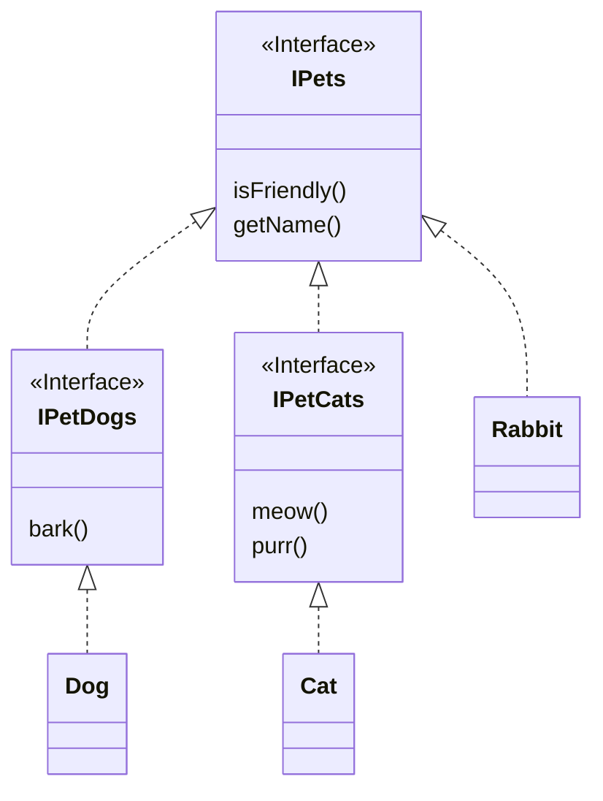
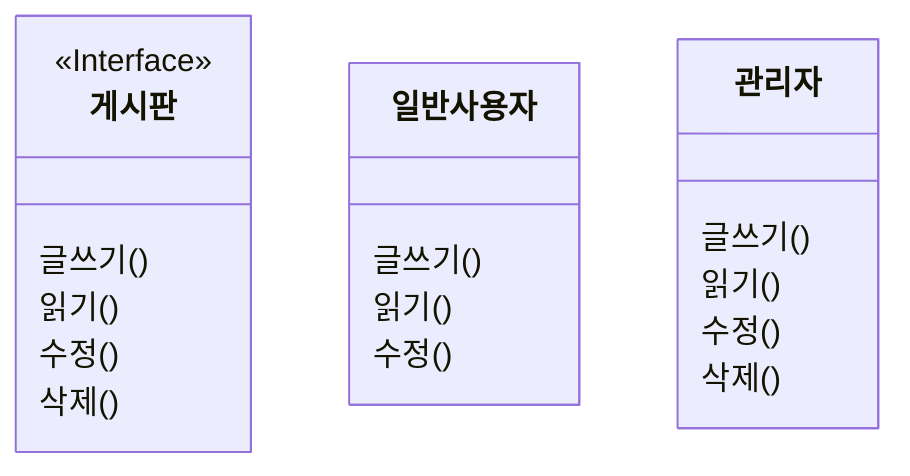

## ISP (Interface Segregation Principle) : Interface 분리 원칙

```txt
client가 자신이 이용하지 않는 method에 의존하지 않아야 합니다.
```

- client는 객체를 사용하는 소비자를 의미합니다.
    - e.g method, class 등.

- 기능이 많은 큰 덩어리의 interface를 구현하는 대신, 구체적이고 작은 단위들로 분리시켜 사용합니다.
    - client들이 꼭 필요한 method들만 이용할 수 있도록 합니다.

- ISP를 통해 system의 내부 의존성을 약화시켜 refactoring, 수정, 재배포를 쉽게 할 수 있습니다.
    - 결합도를 낮춘다는 말과 같습니다.
    

- Interface 분리 원칙은 **범용적인 interface보다는 client(사용자)가 실제로 사용하는 interface를 만들어야 한다**는 원칙입니다.
    - interface를 잘게 분리함으로써, client의 목적과 용도에 적합한 interface만을 제공할 수 있습니다.
    - ISP를 적용하면 class의 기능을 쉽게 파악할 수 있고, 객체의 기능을 유연하게 확장/수정할 수 있게 됩니다.

- 만약 interface의 추상 method들을 범용적으로 여러가지를 구현하면, 그 interface를 상속받는 class는 자신이 사용하지 않는 interface도 억지고 구현해야 합니다.
    - 또한 사용하지도 않는 interface의 추상 method가 변경된다면, class에서도 수정이 필요하게 됩니다.


### ISP(Interface 분리 원칙)와 SRP(단일 책임 원칙)
 
- Interface 분리 원칙은 단일 책임 원칙과 비슷합니다.
    - SRP는 class의 단일 책임을 강조합니다.
    - ISP는 interface의 단일 책임을 강조합니다.

- 다만, interface는 class와 달리 추상화이기 때문에 여러 역할을 가지는 데에 제약이 없습니다.

- SRP의 목표가 class 분리를 통해 이루어진다면, ISP의 목표는 interface 분리를 통해 이루어집니다.
    - SRP를 적용할 때 class 책임 범위를 분리하는 기준이 다르듯이, interface를 분리하는 기준도 상황에 따라 다릅니다.
    - ISP 적용의 핵심은 관련된 기능을 하나의 interface에 모으되, 지나치게 커지지 않도록 크기를 제한하라는 점입니다.


### Example : Interface 분리하기

#### Interface 분리 전

- 고양이는 "멍멍" 짖지 않기 때문에, `IPets` interface에 `bark()` method가 있는 것은 적합하지 않습니다.



#### Interface 분리 후

- `IPets` interface에서 고양이와 개의 특징을 분리하여 `IPetDogs`와 `IPetCats` interface를 따로 만들었기 때문에, `IPets` interface는 토끼를 만들 때 사용할 수도 있습니다.




---


## Example : ISP 적용해보기


### 적용 전

- 스마트폰 종류에 대한 class를 구현하기 위해 interface로 스마트폰을 추상화합니다.
- 스마트폰 interface는 통화나 message 기능 외에도, 무선 충전, AR viewer, 생체 인식 등의 최신 기능을 포함하고 있습니다.

- 만일 Galaxy S20이나 S21 class를 구현한다면, 최신 기종이기 때문에 객체의 동작 모두가 필요하므로 ISP 원칙을 만족하게 됩니다.

- 그러나 Galaxy S8 등의 구형 기종 class에는 최신 기능(무선 충전, AR viewer, 생체인식)이 들어가지 않습니다.
- Galaxy S8 class는 추상 method 구현 규칙에 따라 반드시 overriding하여 구현해야 합니다.
    - 보통 method 내부를 빈 공간으로 두거나, 혹은 예외(Exception)을 발생시키도록 구현합니다.

- 필요하지도 않은 기능을 어쩔 수 없이 구현해야 하기 때문에, 이는 ISP를 위반합니다.


```java
interface ISmartPhone {
    void call(String number);    // 통화
    void message(String number, String text);    // message 전송
    void wirelessCharge();    // 무선 충전
    void AR();    // 증강 현실
    void biometrics();    // 생체 인식
}
```

```java
class GalaxyS20 implements ISmartPhone {
    public void call(String number) {
        // ...
    }

    public void message(String number, String text) {
        // ...
    }

    public void wirelessCharge() {
        // ...
    }

    public void AR() {
        // ...
    }

    public void biometrics() {
        // ...
    }
}

class GalaxyS21 implements ISmartPhone {
    public void call(String number) {
        // ...
    }

    public void message(String number, String text) {
        // ...
    }

    public void wirelessCharge() {
        // ...
    }

    public void AR() {
        // ...
    }

    public void biometrics() {
        // ...
    }
}

// 옛날 기종은 최신 기능을 지원하지 않습니다.
class GalaxyS8 implements ISmartPhone {
    public void call(String number) {
        // ...
    }

    public void message(String number, String text) {
        // ...
    }

    public void wirelessCharge() {
        System.out.println("지원하지 않는 기능입니다.");
    }

    public void AR() {
        System.out.println("지원하지 않는 기능입니다.");
    }

    public void biometrics() {
        System.out.println("지원하지 않는 기능입니다.");
    }
}
```


### 적용 후

- 각각의 기능에 맞게 interface를 잘게 분리합니다.
- 그리고 해당 스마트폰에 지원되는 기능(interface)만을 구현(`implements`)합니다.

```java
interface IPhone {
    void call(String number);    // 통화
    void message(String number, String text);    // message 전송
}

interface WirelessChargable {
    void wirelessCharge();    // 무선 충전
}

interface ARable {
    void AR();    // 증강 현실
}

interface Biometricsable {
    void biometrics();    // 생체 인식
}
```

```java
class GalaxyS21 implements IPhone, WirelessChargable, ARable, Biometricsable {
    public void call(String number) {
        // ...
    }

    public void message(String number, String text) {
        // ...
    }

    public void wirelessCharge() {
        // ...
    }

    public void AR() {
        // ...
    }

    public void biometrics() {
        // ...
    }
}

class GalaxyS8 implements IPhone {
    public void call(String number) {
        // ...
    }

    public void message(String number, String text) {
        // ...
    }
}
```

    
    

---


## ISP 원칙 적용 주의 사항


### SRP와 구분하기
 
- SRP가 class의 단일 책임 원칙이라면, ISP는 interface의 단일 책임 원칙입니다.

- 하지만 SRP를 만족한다고 해서 반드시 ISP가 성립되는 것은 아닙니다.
    - 책임을 준수하여 SRP를 만족하더라도, ISP는 만족하지 않는 경우가 있습니다.

#### SRP는 만족하지만 ISP는 만족하지 않는 경우



- 게시판 interface에는 글쓰기, 읽기, 수정, 삭제라는 추상 method가 정의되어 있습니다.
- 이 method들은 모두 게시판에 필요한 기능들이며, 단일 책임 원칙에 위배되지 않습니다.

- SRP는 준수하지만 ISP는 위반하고 있습니다.
    - 일반 사용자는 게시글 삭제 기능를 사용할 수 없기 때문입니다.

- 언뜻 보면 책임을 잘 구성해 놓은 것 같지만, 실제 적용되는 객체에겐 부합되지 않을 수 있기 때문에 책임을 더 분리해야 합니다.


### Interface 분리는 한 번만 하기

- 본래 interface라는 것은 변경이 잦으면 안 되는 정책과 같은 개념입니다.
- 이미 interace를 분리하여 구현한 project에서 또 interface를 분리하면, 해당 interface를 구현하고 있는 class들과 interface를 사용하고 있는 client(사용자)에서 문제가 생길 수 있습니다.
- 따라서 처음 설계부터 기능의 변화를 고려하고 interface를 설계해야 합니다.


---


# Reference

- <https://ko.wikipedia.org/wiki/SOLID_(객체_지향_설계)>
- <https://inpa.tistory.com/entry/OOP-%F0%9F%92%A0-%EC%95%84%EC%A3%BC-%EC%89%BD%EA%B2%8C-%EC%9D%B4%ED%95%B4%ED%95%98%EB%8A%94-ISP-%EC%9D%B8%ED%84%B0%ED%8E%98%EC%9D%B4%EC%8A%A4-%EB%B6%84%EB%A6%AC-%EC%9B%90%EC%B9%99?category=967430#isp_%EC%9B%90%EC%B9%99_%EC%9C%84%EB%B0%98_%EC%98%88%EC%A0%9C%EC%99%80_%EC%88%98%EC%A0%95%ED%95%98%EA%B8%B0>
