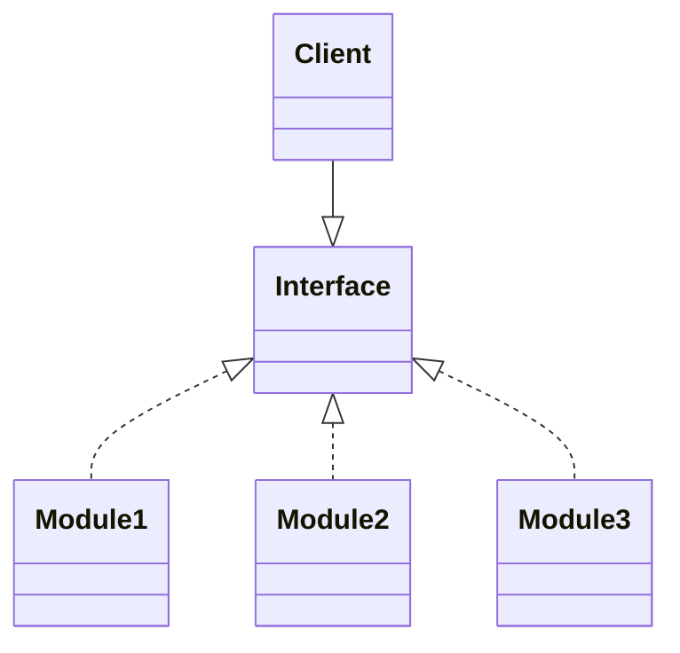

## DIP (Dependency Inversion Principle) : 의존 관계 역전 원칙

```txt
고수준 module은 저수준 module의 구현에 의존해서는 안되며, 저수준 module이 고수준 module에서 정의한 추상 type에 의존해야 합니다.
```

| 고수준 Module | 저수준 Module |
| --- | --- |
| 의미있는 기능을 제공하는 module입니다. | 고수준 module을 구현하기 위해 필요한 하위 기능의 실제 구현체입니다. |

- DIP는 객체가 다른 class를 참조해서 사용해야 할 때, 대상 class를 직접 참조하는 것이 아니라, **대상의 상위 요소(abstract class, interface)로 참조**하라는 원칙입니다.
    - client(사용자)가 상속 관계로 이루어진 module을 사용할 때, 하위 module instance을 직접 사용하지 말라는 뜻입니다.
        - 하위 module의 구체적인 내용에 client가 의존하게 되어, 하위 module에 변화가 있을 때마다 client나 상위 module을 수정해야 되기 때문입니다.
    - 추상성이 낮은 class와 통신하기 보단 **추상성이 높은 class와 통신**해야 합니다.
        - 상위의 interface type 객체로 통신하는 것이 좋습니다.



- DIP는 다형성을 이용한 DI(Dependency Injection, 의존성 주입)를 통해 구현할 수 있습니다.
    - 객체들이 서로 정보를 주고 받을 때는 의존 관계가 형성됩니다.
    - class 간에 의존한다는 말은, 한 class가 어떤 기능을 수행할 때 다른 class의 service가 필요한 경우를 의미합니다.
        - e.g., A class의 method에서 B class type의 parameter를 받아 B 객체의 method를 사용한다면, A class는 B class에 의존하고 있는 것입니다.

- 추상화된 interface나 상위 class에 의존하여, 변하기 쉬운 것의 변화에 영향을 받지 않게 하는 것이 의존 관계 역전 원칙입니다.
    - 상위 class일수록, sinterface일수록, 추상 class일수록, 변하지 않을 가능성이 높습니다.
    - 그래서 하위 class나 구체 class가 아닌 상위 class, interface, 추상 class를 통해 의존해야 하는 것입니다.
    - 결국 추상화를 이용하라는 말이며, 이는 개방 폐쇄 원칙(OCP)와 통하는 부분입니다.


### Example : 아이와 장난감

```java
// interface
interface Toy {}

class Robot implements Toy {}
class Lego implements Toy {}
class Doll implements Toy {}

// client
class Kid {
	Toy toy;    // composition
    
    void setToY(Toy toy) {
    	this.toy = toy;
    }
    
    void play() {}
}

// main method
public class Main {
	public static void main(String[] args) {
        Kid boy = Kid();
        
        Toy toy = new Robot();
        boy.setToy(toy);
        boy.play();
        
        Toy toy = new Lego();
        boy.setToy(toy);
        boy.play();
    }
}
```


### Example : Java Collection

- 보통 `ArrayList`나 `HashSet` 자료형을 사용할 때, 변수 type을 `ArrayList`, `HashSet`와 같은 구체 class type으로 선언하는 것이 아닌, `List`나 `Set` 같은 interface type으로 선언하는데, 이것도 DIP 원칙을 따른 code입니다.

```java
// 변수 type을 고수준 module인 interface type으로 선언하여 저수준의 module을 할당합니다.
List<String> myList = new ArrayList()<>;
Set<String> mySet = new HashSet()<>;
Map<int, String> myMap = new HashMap()<>;
```


---


## DIP 적용해보기


---


# Reference

- <https://inpa.tistory.com/entry/OOP-%F0%9F%92%A0-%EC%95%84%EC%A3%BC-%EC%89%BD%EA%B2%8C-%EC%9D%B4%ED%95%B4%ED%95%98%EB%8A%94-DIP-%EC%9D%98%EC%A1%B4-%EC%97%AD%EC%A0%84-%EC%9B%90%EC%B9%99?category=967430>
