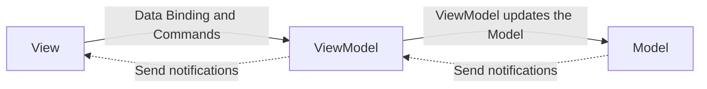

# MVVM Pattern

- Model-View-ViewModel
    - Software Architecture Pattern 중 하나

- 'MarkUp 언어 또는 GUI code로 구현하는 graphic user interface'(View)의 개발을 'business logic 또는 back-end logic'(Model)로부터 분리시킴
    - View가 어느 특정한 Model platform에 종속되지 않도록 해줌

- UI로부터 business logic과 presentation logic을 분리하는 것이 MVVM Pattern의 목적임
    - View는 ViewModel을 알지만, ViewModel은 View를 알지 못함
    - ViewModel은 Model을 알지만, Model은 ViewModel을 알지 못함

- Model-View-ViewModel은 Model-View-Binder라고도 함
    - 특히 .NET platform과 상관없이 구현된 경우를 지칭함
    - ZK(java로 작성된 web framework)와 KnockoutJS(javascript library)는 Model-View-Binder를 사용함





## Model

- `Business Logic`을 다룸
- app의 domain model (business logic, 유효성 검사, data)
    - app에서 사용할 data에 관련된 행위와 data를 다룸

- Model의 접근법
    - 객체 지향 접근법
        - 실제 상태 내용을 표현하는 domain model을 참조
    - Data 중심 접근법
        - 내용을 표현하는 data 접근 계층을 참조함


## View

- `UI Logic`을 다룸
    - UI에 관련된 것(사용자가 화면에서 보는 것들에 대한 구조, 배치, 외관 등)을 다룸
    - animation 같은 UI logic을 포함하되 business logic을 포함하면 안 됨
    - == MVC(Model-View-Controller) Pattern의 View
    - == MVP(Model-View-Presenter) Pattern의 View

- Model을 사용자가 볼 수 있게 표현해 주는 역할
- 사용자와 View의 상호 작용(click, keyboard, 동작 등)을 수신함
- 상호 작용에 대한 처리를 data binding을 통해 ViewModel에 전달함
    - View와 ViewModel은 속성이나 event callback 함수 등으로 data binding되어 있음


## ViewModel

- `Presentation Logic`, View를 위한 `상태`를 다룸
- 공용 속성과 공용 명령을 노출하는 View에 대한 추상화(abstraction)
- Model에 있는 data의 상태

- ViewModel의 역할 : View가 사용할 method와 field를 구현하고, View에게 상태 변화를 알리는 것
    - View는 ViewModel의 상태 변화를 observing함
    - ViewModel에서 제공하는 method와 field가 UI에서 제공할 기능을 정의함
        - 이 기능을 어떻게 보여줄 것인지는 View가 결정함

- 일반적으로 ViewModel과 Model은 1:N 관계를 형성함
    - ViewModel은 View가 쉽게 사용할 수 있도록 Model의 data를 가공해서 View에게 제공
    - ex) View에서 서로 다른 두 Model의 data를 활용한 data가 필요할 때
        - ViewModel에서 두 Model의 data를 가공하고 View에서는 오직 UI만 다루도록 함
            - View에서 Model의 값을 조작해서 사용하는 것이 아님

- Good/Bad Case of ViewModel Use
    ```mermaid
    flowchart RL

    MA[Model A]
    MB[Model B]

    VMAB[ViewModel AB]

    VC[View C]

    VC --> VMAB;

    subgraph Bad
        VMAB --> MA
        VMAB --> MB
    end
    ```
    ```mermaid
    flowchart RL

    MA[Model A]
    MB[Model B]

    VMC[ViewModel C]

    VC[View C]

    subgraph Good
        VC --> VMC;
    end

    VMC --> MA
    VMC --> MB
    ```

- ViewModel == 값 변환기
    - ViewModel이 Model에 있는 data 객체를 노출(변환)하는 책임을 지기 때문에 객체를 관리하고 표현하기가 쉬워짐
    - ViewModel은 View보다는 Model에 더 가까움
        - 모든 View들의 display logic을 제외한 대부분의 것들을 처리함
    - ViewModel은 중재자 pattern으로 구현할 수도 있음
        - 'back-end logic에 대한 접근'과 그 주변부의 'View에서 지원하는 usecase 집합'으로 구성

- ViewModel에 있는 View에 연결된 속성과 View 사이의 통신을 자동화하기 위해 'Binder'라는 것이 필요함
- Binder (연결자)
    - == MVC Pattern의 Controller
    - == MVP Pattern의 Presenter
    - ViewModel(MVVM)과 Presenter(MVP)의 차이점
        - Presenter는 View에 대한 참조를 가지고 있지만, ViewModel은 그렇지 않음
        - ViewModel은 View 속성에 직접 binding된 채로 update를 주고 받음


---


# Reference

- https://ko.wikipedia.org/wiki/모델-뷰-뷰모델
    - wikipedia
- https://velog.io/@k7120792/Model-View-ViewModel-Pattern