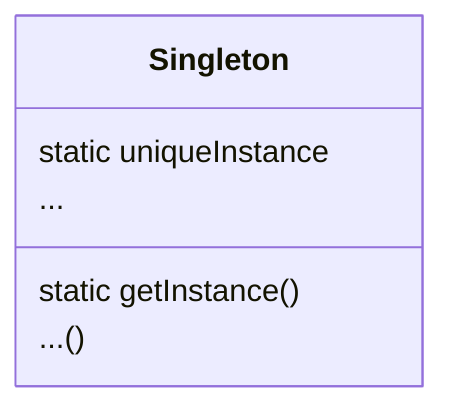

# Singleton Pattern

```
Singleton Pattern은 해당 class의 instance가 하나만 만들어지고, 어디서든지 그 instance에 접근할 수 있도록 하기 위한 pattern
```

- 다른 어떤 class에서도 instance를 추가로 만들지 못하도록 해야 함
    - 객체의 생성자를 private으로 지정함
    - instance가 필요하면 반드시 singleton class를 거치도록 함
        - client는 instance를 직접 만들지 않고, instance를 달라고 요청하도록 구현함
            - getInstance() method

- 하나만 있어도 되는 객체의 예시
    - Connection pool
    - Thread pool
    - Cache
    - 대화 상자
    - 사용자 설정 & Registry 설정 객체
    - Log 기록용 객체
    - Device driver (Printer, Graphic card)

- 결과적으로 'singleton class'는 '모든 method와 변수가 static으로 선언된 class'와 같으나, 'singleton class'가 더 나음
    - '모든 method와 변수가 static으로 선언된 class'는 필요한 내용이 class에 다 들어있고, 복잡한 초기화가 필요없는 경우에만 사용할 수 있음
        - java에서 정적 초기화를 할 때, 초기화 순서와 관련된 bug가 생길 수 있음
            - 초기화 순서와 관련된 bug는 찾아내기 어렵고 복잡미묘함
            - 차라리 singleton을 만드는 것이 나음

- 전역 변수의 단점 (singleton 객체와 비교했을 때)
    - 게으른 instance 생성을 할 수 없음
        - application이 시작될 때 객체가 생성됨
        - 처음부터 끝까지 instance를 가지고 있어야 함
        - 만약 이 객체가 자원을 많이 차지하고 application이 끝날 때까지 이 객체를 한 번도 사용하지 않는다면 자원만 잡아먹는 객체가 됨
        - 예외) 어떤 platform에서는 객체를 나중에 만들기도 함
    - java의 전역 변수는 객체에 대한 정적 reference임
        - 간단한 객체에 대한 전역 reference를 자꾸 만들게 되어 namespace를 지저분하게 만듬
            - singleton도 남용될 수 있지만, namespace를 지저분해지게 만드는 정도까진 아님

- singleton class의 subclass를 만드는 것은 좋지 않음
    - singleton을 subclass로 확장할 이유가 없음
        - application을 만들 때, singleton을 꽤 많이 사용하고 있다면 전반적인 design을 다시 생각해 보는 것이 좋음
            - singleton은 제한된 용도로 특수한 상황에서 사용하기 위해 만들어진 것이기 때문
    - singleton은 생성자가 private으로 선언되어 있어, 확장할 수 없음
        - subclass를 만들기 위해서는 public 또는 protected로 선언해야 함
            - 이렇게 하면 다른 곳에서 instance를 만들 수 있기 때문에 더 이상 singleton이 아니게 됨
    - singleton은 정적 변수를 바탕으로 구현하기 때문에 모든 subclass들이 똑같은 instance 변수를 공유하게 됨
        - subclass를 만들려면 base class에서 registry 같은 걸 구현해 놓아야 함


## Class Diagram



- 생성자
    - private으로 선언함
    - Singleton에서만 class의 instance를 만들 수 있음
- uniqueInstance
    - 유일한 instance를 저장하기 위한 정적 변수
- getInstance()
    - 정적 method(class method)
        - 언제 어디서든 이 method를 호출할 수 있음
    - 전역 변수만큼 쉽게 접근할 수 있음
    - 게으른 instance 생성을 활용할 수 있음
        - 자원을 많이 잡아먹는 경우에 유용함
- 기타 method
    - singleton pattern을 구현한다고 해서 꼭 간단해야 하는 것은 아님
    - 일반적인 class를 만들 때와 마찬가지로 다양한 data와 method를 사용할 수 있음


## 구현


### Classic Singleton Pattern

- 주의 : thread safe하지 않음

```java
// This is not thread safe.
public class Singleton {
	private static Singleton uniqueInstance;
 
	private Singleton() {}
 
	public static Singleton getInstance() {
		if (uniqueInstance == null) {
			uniqueInstance = new Singleton();
		}
		return uniqueInstance;
	}
 
	// other useful methods here
	public String getDescription() {
		return "I'm a classic Singleton!";
	}
}
```

```java
public class SingletonClient {
	public static void main(String[] args) {
		Singleton singleton = Singleton.getInstance();
		System.out.println(singleton.getDescription());
	}
}
```


### Thread Safe Singleton Pattern 1

- getInstance() method를 동기화시켜 multi threading 문제를 해결할 수 있음
- 단점 : 불필요한 overhead가 증가함
    - 동기화가 꼭 필요한 시점은 이 method가 시작되는 때 뿐임
    - 일단 uniqueInstance 변수에 Singleton instance를 대입하고 나면 이 method를 굳이 동기화된 상태로 유지시킬 필요가 없음
    - getInstance()의 속도가 중요하지 않다면 그냥 둬도 됨
        - 만약 getInstance()가 application에서 병목으로 작용한다면 다른 방법을 생각해봐야 함

```java
public class Singleton {
	private static Singleton uniqueInstance;
 
	// other useful instance variables here
 
	private Singleton() {}
 
	public static synchronized Singleton getInstance() {
		if (uniqueInstance == null) {
			uniqueInstance = new Singleton();
		}
		return uniqueInstance;
	}
 
	// other useful methods here
	public String getDescription() {
		return "I'm a thread safe Singleton!";
	}
}
```

```java
public class SingletonClient {
	public static void main(String[] args) {
		Singleton singleton = Singleton.getInstance();
		System.out.println(singleton.getDescription());
	}
}
```


### Thread Safe Singleton Pattern 2

- instance를 필요할 때 생성하지 않고, 처음부터 만들기
- getInstance() method에 `synchronized`를 사용하지 않아도 thread safe함
    - `synchronized`를 사용함으로써 생기는 부담을 줄일 수 있음
- class가 loading될 때 JVM에서 Singleton의 유일한 instance를 생성해 줌
    - JVM에서 유일한 instance를 생성하지 전에는 어떤 thread도 uniqueInstance 정적 변수에 접근할 수 없음
- 유용한 상황
    - application에서 반드시 Singleton의 instance를 생성해야 하는 경우
    - instance를 실행 중에 수시로 만들고 관리하기 성가신 경우

```java
public class Singleton {
	private static Singleton uniqueInstance = new Singleton();
 
	private Singleton() {}
 
	public static Singleton getInstance() {
		return uniqueInstance;
	}
	
	// other useful methods here
	public String getDescription() {
		return "I'm a statically initialized Singleton!";
	}
}
```

```java
public class SingletonClient {
	public static void main(String[] args) {
		Singleton singleton = Singleton.getInstance();
		System.out.println(singleton.getDescription());
	}
}
```


### Thread Safe Singleton Pattern 3

- DCL(Double-Checking Locking)을 사용하기
    - instance가 생성되어 있는지 확인한 다음, 생성되어 있지 않을 때만 동기화를 할 수 있음
        - getInstance()에서 동기화되는 부분이 줄어들게 됨
    - 처음에만 동기화를 하고 나중에는 동기화를 하지 않아도 됨
- 이 방법은 Java 5 이상에서만 사용할 수 있음
    - Java 1.4와 그 전 version의 JVM에서는 `volatile` keyward를 사용하더라도 동기화가 잘 안되는 경우가 많음
- getInstance() method를 사용할 때 속도가 문제가 된다면, 이 방법으로 overhead를 크게 줄일 수 있음

```java
// Danger! This implementation of Singleton not guaranteed to work prior to Java 5

public class Singleton {
	private volatile static Singleton uniqueInstance;
 
	private Singleton() {}
 
	public static Singleton getInstance() {
		if (uniqueInstance == null) {
			synchronized (Singleton.class) {
				if (uniqueInstance == null) {
					uniqueInstance = new Singleton();
				}
			}
		}
		return uniqueInstance;
	}
}
```

```java
public class SingletonClient {
	public static void main(String[] args) {
		Singleton singleton = Singleton.getInstance();
	}
}
```


---


# Example : Chocolate 공장의 Chcolate Boiler

- Chocolate boiler 가동을 따로 제어하면 안 됨
    - instance가 하나만 있어야 함


## Code

```java
public class ChocolateBoiler {
	private boolean empty;
	private boolean boiled;
	private static ChocolateBoiler uniqueInstance;
  
	private ChocolateBoiler() {
		empty = true;
		boiled = false;
	}
  
	public static ChocolateBoiler getInstance() {
		if (uniqueInstance == null) {
			System.out.println("Creating unique instance of Chocolate Boiler");
			uniqueInstance = new ChocolateBoiler();
		}
		System.out.println("Returning instance of Chocolate Boiler");
		return uniqueInstance;
	}

	public void fill() {
		if (isEmpty()) {
			empty = false;
			boiled = false;
			// fill the boiler with a milk/chocolate mixture
		}
	}
 
	public void drain() {
		if (!isEmpty() && isBoiled()) {
			// drain the boiled milk and chocolate
			empty = true;
		}
	}
 
	public void boil() {
		if (!isEmpty() && !isBoiled()) {
			// bring the contents to a boil
			boiled = true;
		}
	}
  
	public boolean isEmpty() {
		return empty;
	}
 
	public boolean isBoiled() {
		return boiled;
	}
}
```

```java
public class ChocolateController {
	public static void main(String args[]) {
		ChocolateBoiler boiler = ChocolateBoiler.getInstance();
		boiler.fill();
		boiler.boil();
		boiler.drain();

		// will return the existing instance
		ChocolateBoiler boiler2 = ChocolateBoiler.getInstance();
	}
}
```


---


# Reference

- Head First Design Patterns