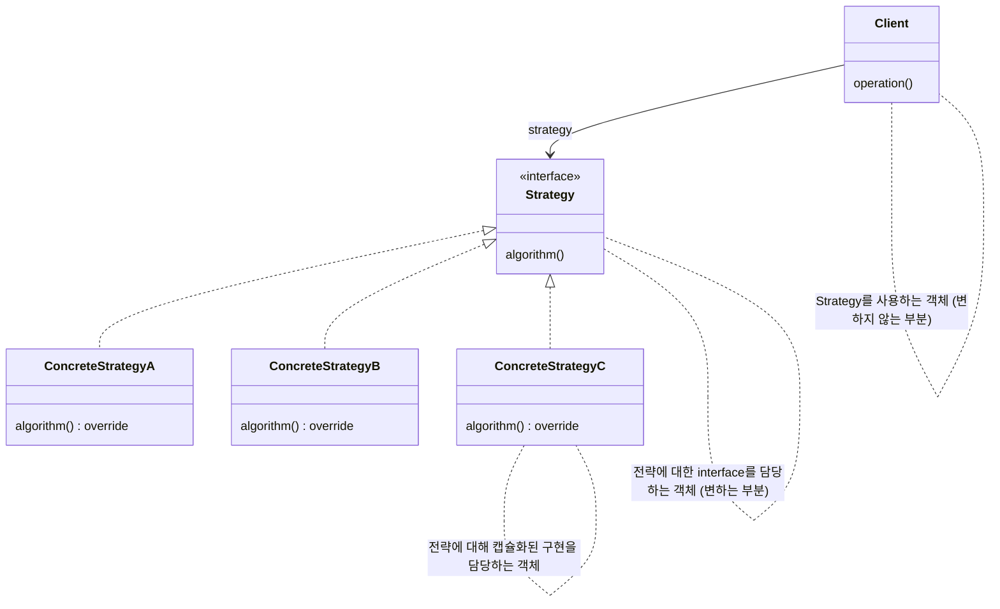
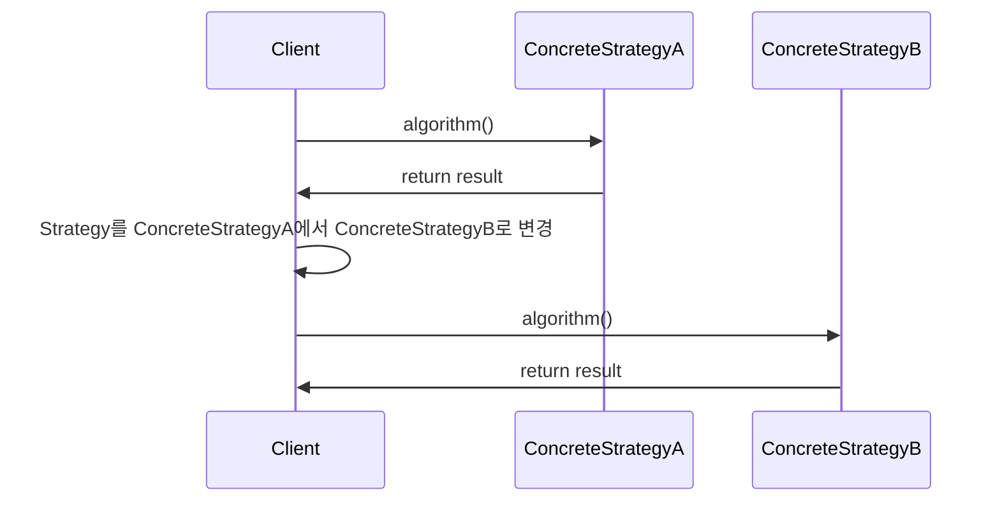
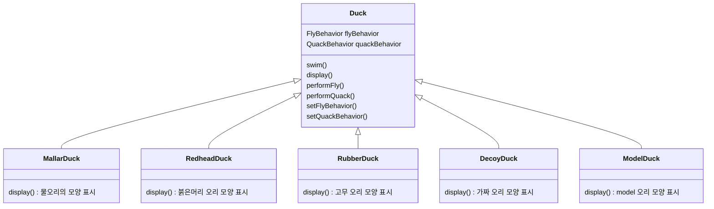
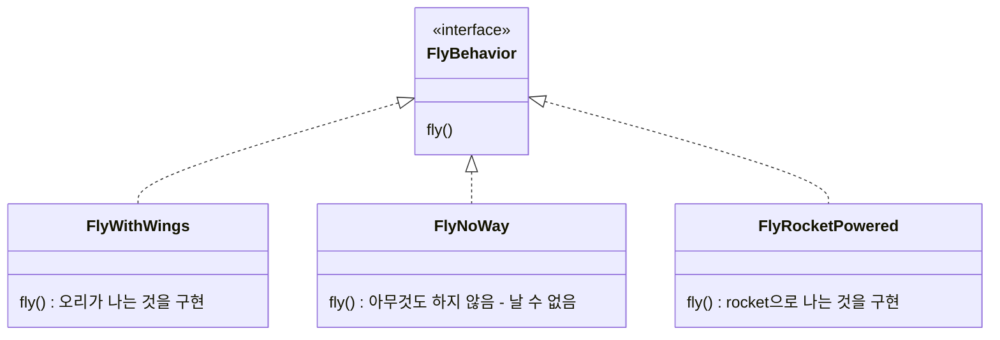
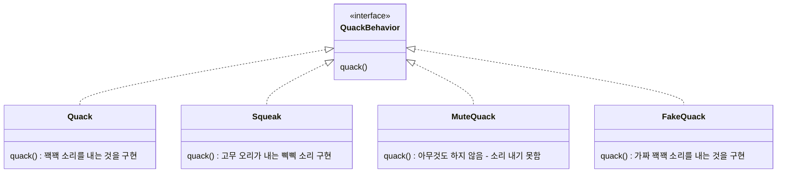

# Strategy Pattern

- 동일한 목적을 지닌 algorithm군을 interface로 묶고 캡슐화하여 서로 대체가 가능하게 사용하는 것
    - 특정 client에서 algorithm을 별도로 분리함
    - algorithm군을 정의하고 각각을 캡슐화하여 교환해서 사용할 수 있도록 만듬
    - algorithm을 사용하는 client와는 독립적으로 algorithm을 변경할 수 있음

- 구현된 algorithm은 다르지만 동일한 목적을 지닌 class들이 존재할 때 사용하기
    - 평소에 한 가지 algorithm을 사용하더라도 algorithm을 변경해야 할 때가 있음
        - 참조하는 class가 변경/제거될 때 (compile time)
        - 사용하는 시점에 따라서 적용할 algorithm이 다를 때 (runtime)
    - 이런 경우 strategy pattern을 사용하면 좋음
        - 새로운 algorithm을 추가하는 확장이 용이함
        - 언제든지 algorithm을 쉽게 대체할 수 있음


## 장단점

- 장점
    - algorithm마다 사용되는 code의 중복을 방지할 수 있음
        - algorithm의 변경 부분만 concrete strategy로 빼내어 구현했기 때문
    - 새로운 전략을 추가하더라도 기존 code를 변경하지 않음
    - 상속 대신 구성(composition)을 사용함
        - 공통 logic이 super class에 있지 않고, 별도의 client class에 존재하기 때문에 구현체들에 대한 영향도가 적음
        - client가 strategy interface에 의존하고 있기 때문에 strategy 구현체를 갈아끼우기 쉬움
    - Runtime에 strategy(algorithm)를 변경할 수 있음

- 단점
    - 복잡도가 증가함
        - algorithm이 늘어날 수록 객체도 무한히 늘어남
        - logic을 단순히 client에 if-else로 분리해서 그 안에 구현하는 게 보기 편할 수도 있음
            - 한 눈에 들어오는 짧은 code에서는 strategy pattern을 사용하는 것이 오히려 가독성을 떨어뜨림
            - ex) 분기가 2개인 경우
        - logic이 늘어날 때마다 구현체 class가 늘어남
    - client가 구체적인 전략(concrete strategy)을 알아야 함
        - client가 사용할 전략 객체를 직접 결정해야 함
            - 많은 algorithm에 대한 성능과 효율을 알고 있어야 함
        - client와 strategy를 한번 조립하면 전략을 변경하기 힘듬


## Class Diagram




## Sequence Diagram




---


# Example : 오리 Class

- client에서는 '나는 행동'과 '꽥꽥거리는 행동' 모두에 대해서 캡슐화된 algorithm군을 '활용'함
    - client는 setter로 행동 변수를 설정하고 perform 함수를 사용하면 됨
        - setFlyBehavior() -> performFly()
- 각 행동의 집합을 algorithm군으로 생각하면 됨

## Class Diagram

### Client



### Strategy : 나는 행동



### Strategy : 꽥꽥거리는 행동



## Code

## Main

```java
public class MiniDuckSimulator {
    public static void main(String[] args) {
 
        Duck mallard = new MallardDuck();
        mallard.performQuack();
        mallard.performFly();
   
        Duck model = new ModelDuck();
        model.performFly();
        model.setFlyBehavior(new FlyRocketPowered());
        model.performFly();
    }
}
```

```java
public class MiniDuckSimulator {
    public static void main(String[] args) {
 
        MallardDuck mallard = new MallardDuck();
        FlyBehavior cantFly = () -> System.out.println("I can't fly");
        QuackBehavior squeak = () -> System.out.println("Squeak");
        RubberDuck rubberDuckie = new RubberDuck(cantFly, squeak);
        DecoyDuck decoy = new DecoyDuck();
 
        Duck model = new ModelDuck();

        mallard.performQuack();
        rubberDuckie.performQuack();
        decoy.performQuack();
   
        model.performFly();    
        model.setFlyBehavior(new FlyRocketPowered());
        model.performFly();
    }
}
```

### Client

```java
public abstract class Duck {
    FlyBehavior flyBehavior;
    QuackBehavior quackBehavior;

    public Duck() {
    }

    public void setFlyBehavior(FlyBehavior fb) {
        flyBehavior = fb;
    }

    public void setQuackBehavior(QuackBehavior qb) {
        quackBehavior = qb;
    }

    abstract void display();

    public void performFly() {
        flyBehavior.fly();
    }

    public void performQuack() {
        quackBehavior.quack();
    }

    public void swim() {
        System.out.println("All ducks float, even decoys!");
    }
}
```

```java
public class MallardDuck extends Duck {
    public MallardDuck() {
        quackBehavior = new Quack();
        flyBehavior = new FlyWithWings();
    }

    public void display() {
        System.out.println("I'm a real Mallard duck");
    }
}
```

```java
public class RedHeadDuck extends Duck {
    public RedHeadDuck() {
        flyBehavior = new FlyWithWings();
        quackBehavior = new Quack();
    }
 
    public void display() {
        System.out.println("I'm a real Red Headed duck");
    }
}
```

```java
public class RubberDuck extends Duck {
    public RubberDuck() {
        flyBehavior = new FlyNoWay();
        //quackBehavior = new Squeak();
        quackBehavior = () -> System.out.println("Squeak");
    }
    
    public RubberDuck(FlyBehavior flyBehavior, QuackBehavior quackBehavior) {
        this.flyBehavior = flyBehavior;
        this.quackBehavior = quackBehavior; 
    }
 
    public void display() {
        System.out.println("I'm a rubber duckie");
    }
}
```

```java
public class DecoyDuck extends Duck {
    public DecoyDuck() {
        setFlyBehavior(new FlyNoWay());
        setQuackBehavior(new MuteQuack());
    }

    public void display() {
        System.out.println("I'm a duck Decoy");
    }
}
```

```java
public class ModelDuck extends Duck {
    public ModelDuck() {
        flyBehavior = new FlyNoWay();
        quackBehavior = new Quack();
    }

    public void display() {
        System.out.println("I'm a model duck");
    }
}
```

### Strategy : 나는 행동

```java
public interface FlyBehavior {
    public void fly();
}
```

```java
public class FlyWithWings implements FlyBehavior {
    public void fly() {
        System.out.println("I'm flying!!");
    }
}
```

```java
public class FlyNoWay implements FlyBehavior {
    public void fly() {
        System.out.println("I can't fly");
    }
}
```

```java
public class FlyRocketPowered implements FlyBehavior {
    public void fly() {
        System.out.println("I'm flying with a rocket");
    }
}
```

### Strategy : 꽥꽥거리는 행동

```java
public interface QuackBehavior {
    public void quack();
}
```

```java
public class Quack implements QuackBehavior {
    public void quack() {
        System.out.println("Quack");
    }
}
```

```java
public class Squeak implements QuackBehavior {
    public void quack() {
        System.out.println("Squeak");
    }
}
```

```java
public class MuteQuack implements QuackBehavior {
    public void quack() {
        System.out.println("<< Silence >>");
    }
}
```

```java
public class FakeQuack implements QuackBehavior {
    public void quack() {
        System.out.println("Qwak");
    }
}
```


---


# Reference

- Head First Design Patterns
- https://gmlwjd9405.github.io/2018/07/06/strategy-pattern.html
- https://scorpio-mercury.tistory.com/21