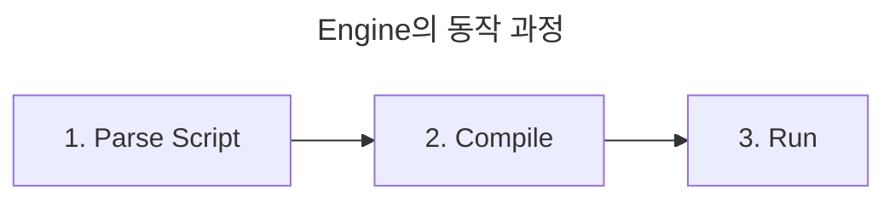

- JavaScript는 browser interface를 만들 때 가장 널리 사용되는 scripting 또는 programming 언어입니다.
    - JavaScript를 사용하여 정적인 web page에 동적인 기능을 추가할 수 있습니다.
        - HTML, CSS로 정보를 표시(정적)하고, JavaScript로 복잡한 기능(동적)을 구현합니다.
        - 실시간으로 변경되는 contents를 만들고, multimedia를 제어하고, image에 animation을 적용하는 등의 모든 작업을 수행할 수 있습니다.
    - JavaScript만으로 HTML, CSS code를 완전히 대체할 수도 있습니다.

- JavaScript로 작성한 프로그램은 'script'라고 부릅니다.
    - script는 web page의 HTML 안에 작성할 수 있으며, web page를 불러올 때 script가 자동으로 실행됩니다.
    - script는 특별한 준비나 compile 없이 보통의 문자 형태로 작성할 수 있고, 실행도 할 수 있습니다.

- JavaScript는 HTML, CSS와 함께 표준 web 기술에 속합니다.
    - Internet Explorer, Chrome, Safari, FireFox, Opera 등 모든 주요 browser에서 JavaScript를 기본 언어로 지원합니다.
    - HTML은 문단, 제목, data 표를 정의하거나 page에 image와 동영상을 삽입하는 등, web contents를 구성하고 의미를 부여하는 데 사용하는 MarkUp 언어입니다.
    - CSS는 배경색과 글꼴을 설정하고 contents를 여러 열에 배치하는 등, HTML contents에 style을 적용하는 데에 사용하는 style 규칙 언어입니다.

- JavaScript는 browser에서만 쓸 목적으로 고안된 언어이지만, 지금은 다양한 환경에서 쓰이고 있습니다.
    - JavaScript를 이용해 server나 mobile app 등을 만드는 것도 가능합니다.

---

## JavaScript의 특징

### 동적인 언어

- '동적'이라는 단어는 web page/app의 화면을 갱신하여 상황에 따라 다른 내용을 표시하고, 필요에 따라 새 contents를 생성하는 기능을 의미합니다.
    - 동적으로 바뀌는 내용이 없는 web page를 정적인 page라고 하며, 항상 동일한 내용만 표시합니다.

- server-side에서 JavaScript는 server에서 새 contents를 동적으로 생성합니다.
    - e.g., database에서 data를 가져와 새로운 자료구조 또는 객체를 생성합니다.
- client-side에서 JavaScript는 browser 내부에서 새 contents를 동적으로 생성합니다.
    - e.g., 새 HTML table을 생성하고, server에서 요청한 data로 채운 다음, web page에 table을 표시합니다.

### Interpreter 언어

- JavaScript는 interpreter를 사용하는 가벼운 programming 언어입니다.
    - web browser는 JavaScript code를 원문 text 형식으로 입력받아 실행합니다.
    - interpreter 언어이기 때문에, code가 위에서 아래로 실행되고 code 실행 결과가 즉시 반환됩니다.
        - browser에서 code를 실행하기 전에 code를 다른 형태로 변환(compile)할 필요가 없습니다.

- 현대의 JavaScript interpreter들은 성능 향상을 위해 JIT compile(just-in-time compile)이라는 기술을 사용합니다.
    - JIT compile은 script의 실행과 동시에 source code를 더 빠르게 실행할 수 있는 이진 형태로 변환(compile)하여 최대한 높은 실행 속도를 얻는 방법입니다.
    - 하지만 compile이 미리 처리되는 것이 아니라 runtime에 처리되기 때문에, JavaScript는 여전히 interpreter 언어로 분류됩니다.

### 높은 범용성 (Client-Side, Server-Side)

- JavaScript는 browser뿐만 아니라 server에서도 실행할 수 있습니다.
    - server 외에도 JavaScript engine이 탑재된 모든 device에서 동작합니다.

- client-side code는 사용자의 장비에서 실행되는 code입니다.
    - 사용자의 장비에 source code를 사용자 측에서 실행하여 browser에 표시합니다.
        - source code는 사용자의 장비에 download 받습니다.

- server-side code는 server에서 실행되는 code입니다.
    - server에서 source code를 실행하고, 그 결과를 사용자 측에서 받아 browser에 표시합니다.
        - source code는 server에 있습니다.
    - e.g., Node.js를 사용하여 server application을 만들 수 있습니다.

---

## JavaScript 표준

- 1996년 11월, Netscape Communications는 JavaScript를 국제 표준안으로 만들기 위해 ECMA(European Computer Manufacturers Association) International에 제출합니다.
    - 여러 회사에서 다른 기능이 탑재된 browser를 만들면서, browser에 따라 web page가 동작하거나 동작하지 않는 cross browsing issue가 발생하기 시작한 시점입니다.
    - JavaScript의 파편화를 방지하고, 모든 browser에서 동일하게 동작하는 표준화된 JavaScript를 정의하기 위해 Netscape가 ECMA에 요청했습니다.

- 1997년 7월, ECMA는 ECMAScript라는 새로운 표준을 제정하였고, ECMA-262라는 JavaScript 초판(ECMAScript 1) 명세(specification)를 공표합니다.
    - 상표권 문제로 JavaScript는 ECMAScript로 명명되었습니다.

- 특히, 2015년에 공개된 ECMAScript 6(ECMAScript 2015)에서는 큰 변화가 있었습니다.
    - 범용 programming 언어로서 갖추어야 할 let/const keyword, 화살표 함수, class, module 등과 같은 기능들이 도입되었습니다.

| Version | 출시년도 | 특징 |
| --- | --- | --- |
| ES1 | 1997 | 초판. |
| ES2 | 1998 | ISO/IEC 16262 국제 표준과 동일한 규격을 적용. |
| ES3 | 1999 | 정규 표현식, `try-catch` 예외 처리. |
| ES5 | 2009 | HTML5와 함께 출현한 표준안. JSON, strict mode, 접근자 property(`getter`, `setter`), 향상된 배열 조작 기능(`forEach`, `map`, `filter`, `reduce`, `some`, `every`). |
| ES6 (ECMAScript 2015) | 2015 | `let`, `const`, `class`, 화살표 함수(arrow function), template literal, destructuring 할당, spread 문법, rest parameter, `Symbol`, `Promise`, `Map`/`Set`, iterator/generator, module import/export. |
| ES7 (ECMAScript 2016) | 2016 | 지수(`**`) 연산자, `Array.prototype.includes`, `String.prototype.includes`. |
| ES8 (ECMAScript 2017) | 2017 | async/await, Object 정적 method(`Object.values`, `Object.entries`, `Object.getOwnPropertyDescriptors`). |
| ES9 (ECMAScript 2018) | 2018 | Object Rest/Spread property. |

---

## JavaScript와 Browser

- JavaScript는 '안전한' programming 언어입니다.
    - memory나 CPU 같은 저수준 영역의 조작을 허용하지 않습니다.
    - browser를 대상으로 만든 언어이기 때문에, 저수준 영역에 접근이 필요하지 않습니다.

- JavaScript의 능력은 실행 환경에 크게 영향을 받습니다.
    - browser 환경에선 web page 조작, client와 server의 상호 작용에 관한 모든 일을 할 수 있습니다.
    - Node.js 환경에선 임의의 file을 읽거나 쓰고, network 요청을 수행하는 함수를 지원합니다.

### Browser에서 가능한 것들

1. page에 새로운 HTML을 추가하거나, 기존 HTML, 혹은 style 수정합니다.
2. mouse click이나 pointer의 움직임, keyboard의 key 눌림 등과 같은 사용자 행동에 반응합니다.
3. network를 통해 원격 server에 요청을 보내거나, file을 download, upload합니다.
    - AJAX나 COMET과 같은 기술 사용합니다.
4. cookie를 가져오거나 설정합니다.
5. 사용자에게 질문하거나 message 보여줍니다.
6. client-side에 data를 저장합니다.
    - e.g., local storage.

### Browser에서 제약받는 것들

- browser는 보안을 위해 JavaScript의 기능에 제약을 걸어 놓았습니다.
    - 이런 제약은 악성 web page가 개인 정보에 접근하거나 사용자의 data를 손상하는 것을 막기 위해 만들어졌습니다.

1. web page 내 script는 disk에 저장된 임의의 file을 읽거나 쓰고, 복사하거나 실행할 때 제약을 받을 수 있습니다.
    - 운영 체제가 지원하는 기능을 browser가 직접 사용하지 못하게 막아 두었기 때문입니다.
    - modern browser를 사용하면 file을 다룰 수는 있지만 접근이 제한됩니다.
        - 사용자가 browser 창에 file을 '끌어다 두거나(drag & drop)', `<input>` tag를 통해 file을 선택할 때와 같이, 특정 상황에서만 file 접근을 허용합니다.

2. camera나 mike 같은 device와 상호 작용하려면 사용자의 명시적인 허가가 있어야 합니다.
    - JavaScript가 활성화된 page라도 사용자 몰래 web camera를 작동시켜 수집한 정보를 국가안보국(NSA)과 같은 곳에 몰래 전송할 수 없습니다.
    - browser에서 사용자가 허용 설정을 해주어야 사용할 수 있습니다.

3. browser 내의 tab과 창(window)은 대개 서로의 정보를 알 수 없습니다.
    - JavaScript를 사용해 한 창에서 다른 창을 열 때는 예외가 적용되어 page의 정보에 접근할 수 있습니다.
    - 하지만 JavaScript를 사용해 창을 열었다고 하더라도, domain, protocol, port가 다르다면 다른 page에 접근할 수 없습니다.
        - 이런 제약사항을 '동일 출처 정책(Same Origin Policy)'이라고 합니다.
        - 동일 출처 정책을 피하려면 두 page는 data 교환에 동의해야 하고, 동의와 관련된 특수한 JavaScript code를 포함하고 있어야 합니다.
        - 이 제약사항은 사용자의 보안을 위해 만들어졌습니다.
            - 'http://anysite.com'에서 받아온 page가 'http://gmail.com'에서 받아온 page 상의 정보에 접근해 중요한 개인정보를 훔치는 걸 막기 위함입니다.
    - JavaScript를 이용하면 page를 생성한 server와 쉽게 정보를 주고받을 수 있지만, 다른 site나 domain에서 data를 받아오는 건 불가능합니다.
        - 통신을 가능하게 하려면, HTTP header 등을 이용하여 원격 server에서 명확히 승인해 줘야 합니다.
        - 이 제약사항 역시 사용자의 보안을 위해 만들어졌습니다.

---

## JavaScript의 API

- API(Application Programming Interface)는 client 측 JavaScript 언어 위에 미리 구현한 기능을 개발자에게 제공합니다.
    - API는 개발자가 구현하기 어렵거나 구현이 불가능한 program을 쉽게 만들 수 있게 해줍니다.
    - e.g., 기성품 가구 제작 kit로 가구를 만드는 것과 같은 방식으로 개발할 수 있습니다.
        - 직접 설계하고, 목재를 찾고, 자르고, 나사를 박아서 책장을 만드는 것보다, 기성품을 조립하여 책장을 만드는 것이 훨씬 쉽습니다.

### Browser API

- Browser API는 web browser에 내장되어 있습니다.

1. DOM(Document Object Model) API를 사용하면 HTML과 CSS를 동적으로 조작할 수 있습니다.
    - 실시간으로 HTML을 생성/제거/변경합니다.
    - 실시간으로 style을 적용합니다.
    - e.g., page에 경고 창을 띄우거나, 새로운 정보를 page 전환 없이 표시합니다.

2. Geolocation API로 지리 정보를 가져올 수 있습니다.

3. Canvas와 WebGL API를 사용하면 animation과 2D/3D graphic을 만들 수 있습니다.

4. Audio와 Video API(HTMLMediaElement, WebRTC)를 사용하면 멀티미디어로 다양한 작업을 할 수 있습니다.
    - web page에서 바로 audio 및 video를 재생합니다.
    - web camera에서 video를 가져와 다른 사람의 computer에 표시합니다.

### Third-Party API

-  Third-Party API는 기본적으로 browser에 내장되어 있지 않으며, 일반적으로 web 어딘가에서 해당 code와 정보를 가져와야 합니다.

1. Twitter API로 최신 Tweet을 web site가 보여주도록 구현할 수 있습니다.

2. Google 지도 API와 OpenStreetMap API로 web site에 지도를 삽입하고, 지도 관련 기능을 추가할 수 있습니다.

---

## JavaScript를 구동하는 다양한 Engine

- browser엔 'JavaScript Virtual Machine’이라 불리는 engine이 내장되어 있습니다.
- engine의 종류는 다양하며, engine마다 특유의 code name이 있습니다.

| Engine | 사용하는 Browser |
| --- | --- |
| V8 | Chrome, Opera |
| SpiderMonkey | Firefox |
| SquirrelFish | Safari |
| Trident, Chakra | Internet Explorer |
| ChakraCore | Microsoft Edge |

1. parsing : engineo이 script를 읽습니다.
    - browser라면 engine은 내장 engine입니다.
2. compile : 읽어 들인 script를 기계어로 전환합니다.
3. run : 기계어로 전환된 code를 실행합니다.
    - 기계어로 전환되었기 때문에 실행 속도가 빠릅니다.

- engine은 process 각 단계마다 최적화를 진행합니다.
    - compile이 끝나고 실행 중인 code를 감시하면서, 이 code로 흘러가는 data를 분석하고, 분석 결과를 토대로 기계어로 전환된 code를 다시 최적화하기도 합니다.
    - 최적화 과정을 거치면서 script 실행 속도는 더욱 더 빨라집니다.

---

## JavaScript로 변환이 가능한 다른 언어들

- browser에서 실행하기 전에 JavaScript로 변환(transpile)할 수 있는 새로운 언어들이 만들어졌습니다.
    - 각 언어마다 고유한 기능을 제공하며, project의 요구사항에 맞추어 선택하면 됩니다.

1. CoffeeScript는 JavaScript를 위한 'syntactic sugar’입니다.
    - 짧은 문법을 도입하여 명료하고 이해하기 쉬운 code를 작성할 수 있습니다.
    - Ruby 개발자들이 선호합니다.

2. TypeScript는 개발을 단순화하고 복잡한 system을 지원하려는 목적으로 '자료형의 명시화(strict data typing)'에 집중해 만든 언어입니다.
    - Microsoft가 개발하였습니다.

3. Flow는 TypeScript처럼 자료형을 강제하지만, TypeScript와는 다른 방식을 사용합니다.
    - Facebook이 개발하였습니다.

4. Dart는 mobile app과 같이 browser가 아닌 환경에서 동작하는 고유의 engine을 가진 독자적 언어입니다.
    - Google이 개발하였습니다.

---

## Reference

- <https://ko.javascript.info/intro>
- <https://developer.mozilla.org/ko/docs/Learn/JavaScript/First_steps/What_is_JavaScript>

<!-- 
javascript 호이스팅이란?
템플릿 문자열 28
const let var 차이 (호이그팅 여부) 26
js 함수 선언과 함수 표현식 30

디폴트 파라미터 33

화살표 함수 34
화상표 함수 this 37

바벨 JavaScript compile링 도구 37

구조분해 39

배열 구조분해 41

갹체 리터럴 개선 (구조분해의ㅜ반대) 42

객체 메서드 정의 방법
스프레드 연산자

js promise 46

js 클래스

es6 모듈
커먼 js

함수형 프로그래밍 (람다 계산법) 57

고차함수 57
js에선 함수가 일급시민이기 때문에 함수형 프로그래밍으루지원한다
변수에 객체에 배열에 인자에 반환값에 함수를 넣을 수 있음
함수를 일반적인 data와 마찬가지로 취급함

함수형이란? 58

선언적 프로그래밍과 명령형 프로그래밍 61
리액트는 선언적이다 63

함수형 프로그래밍이란 64
    불변성 순수성(순수함수) data변환 고차함수(커링) 재귀 합성(체이닝, compose 함수 만들기) ~ 90
-->

