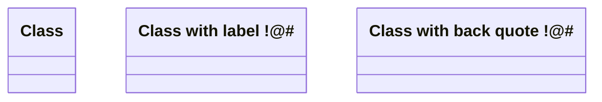
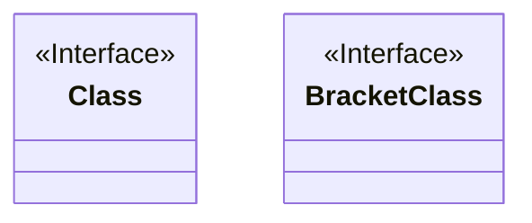
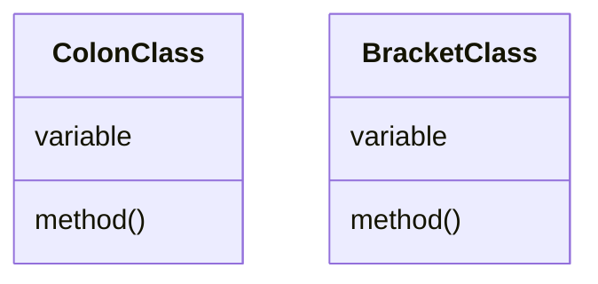
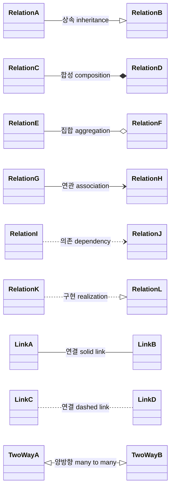
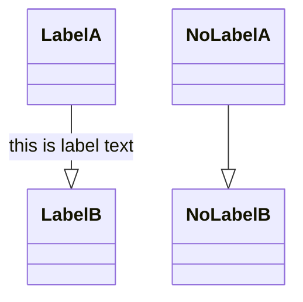
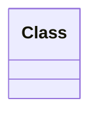
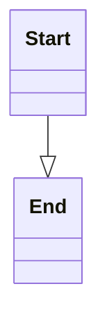
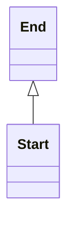
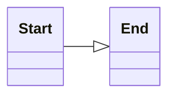
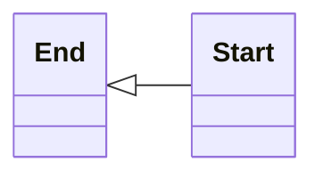

## Class 정의하기

- `class` 뒤에 class 이름을 작성하여 class를 정의합니다.
- label 방식과 back quote 방식으로 class 이름에 공백, 특수문자를 넣을 수 있습니다.

```txt
classDiagram

class Class
class LabelClass["Class with label !@#"]
class `Class with back quote !@#`
```




## Class에 annotation 넣기

- `<<`와 `>>`를 사용합니다.

| 종류 | 문법 |
| - | - |
| interface class | `<<Interface>>` |
| abstract class | `<<Abstract>>` |
| service class | `<<Service>>` |
| enum | `<<Enumeration>>` |
| custom annotation | `<<custom>>` |


```txt
classDiagram

class Class
<<Interface>> Class

class BracketClass {
    <<Interface>>
}
```




---


## Class member 정의하기

- class의 member는 중괄호(`{}`) 또는 colon(`:`)으로 정의할 수 있습니다.
- 변수와 함수의 구분은 소괄호(`()`)로 합니다.
    - 함수명 뒤에 소괄호를 붙입니다.

```txt
classDiagram

class ColonClass
ColonClass : variable
ColonClass : method()

class BracketClass {
    variable
    method()
}
```




## Class member에 접근 제한자 설정하기


## 자료형 설정하기

- 변수의 자료형과 함수 반환값의 자료형을 표시할 수 있습니다.
    - 변수의 자료형은 변수 앞에 작성합니다.
    - 함수 반환값의 자료형은 함수 뒤에 작성합니다.


## 함수에 parameter 넣기


---


## 관계 정의하기

```txt
classDiagram

RelationA --|> RelationB : 상속 inheritance
RelationC --* RelationD : 합성 composition
RelationE --o RelationF : 집합 aggregation
RelationG --> RelationH : 연관 association
RelationI ..> RelationJ : 의존 dependency
RelationK ..|> RelationL : 구현 realization

LinkA -- LinkB : 연결 solid link
LinkC .. LinkD : 연결 dashed link

TwoWayA <|--|> TwoWayB : 양방향 many to many
```




## 화살표에 label 작성하기

```txt
[class] [arrow] [target_class] : [label]
```

- label은 화살표 선 사이에 표시됩니다.
- colon(`:`) 뒤에 작성합니다.


```txt
classDiagram

LabelA --|> LabelB : this is label text
NoLabelA --|> NoLabelB
```




---


## 주석 작성하기

- percent 기호 두 개(`%%`)를 사용합니다.

```text
classDiagram

%% 주석입니다.
class Class
```




---


## Class diagram 화살표 방향 설정하기

- `direction` 명령어와 상하좌우를 의미하는 `T`, `B`, `L`, `R` code를 이용하여 화살표의 방향을 설정합니다.

```txt
direction [start_direction][end_direction]
```

| Code | 화살표의 방향 |
| - | - |
| `direction TB` | 상 -> 하 |
| `direction BT` | 하 -> 상 |
| `direction LR` | 좌 -> 우 |
| `direction RL` | 우 -> 좌 |


### 상 -> 하

```txt
classDiagram
direction TB
Start --|> End
```




### 하 -> 상

```txt
classDiagram
direction BT
Start --|> End
```




### 좌 -> 우

```txt
classDiagram
direction LR
Start --|> End
```




### 우 -> 좌

```txt
classDiagram
direction RL
Start --|> End
```




---


# Reference

- <https://mermaid.js.org/syntax/classDiagram.html>

