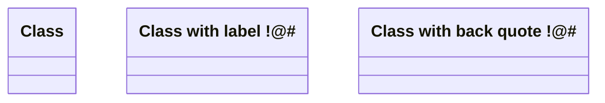
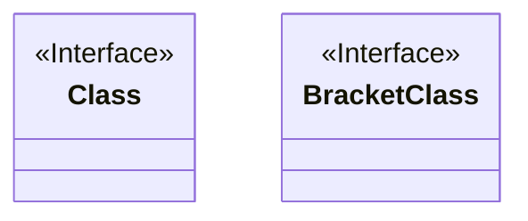
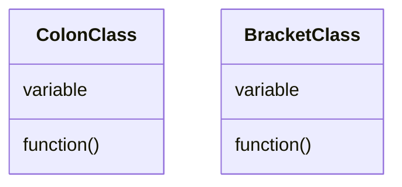
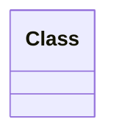

## class 정의하기

- `class` 뒤에 class 이름을 작성하여 class를 정의합니다.
- label 방식과 back quote 방식으로 class 이름에 공백, 특수문자를 넣을 수 있습니다.

```txt
classDiagram

class Class
class LabelClass["Class with label !@#"]
class `Class with back quote !@#`
```




### class에 annotation 넣기

- `<<`와 `>>`를 사용합니다.

| interface class | abstract class | service class | enum | custom annotation |
| - | - | - | - |
| `<<Interface>>` | `<<Abstract>>` | `<<Service>>` | `<<Enumeration>>` | `<<custom>>` |

```txt
classDiagram

class Class
<<Interface>> Class

class BracketClass {
    <<Interface>>
}
```




---


## class member 정의하기

- class의 member는 중괄호(`{}`) 또는 colon(`:`)으로 정의할 수 있습니다.
- 변수와 함수의 구분은 소괄호(`()`)로 합니다.
    - 함수명 뒤에 소괄호를 붙입니다.

```txt
classDiagram

class ColonClass
    ColonClass : variable
    ColonClass : function()
class BracketClass {
    variable
    function()
}
```




---


## 주석 작성하기

- percent 기호 두 개(`%%`)를 사용합니다.

```text
classDiagram

%% 주석입니다.
class Class
```




---


# Reference

- <https://mermaid.js.org/syntax/classDiagram.html>

