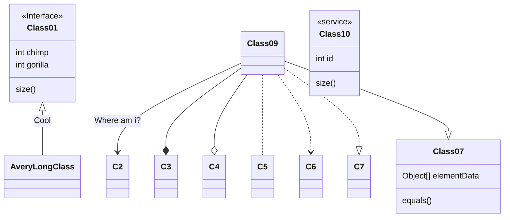

# Class diagram

```mermaid
classDiagram
Class01 <|-- AveryLongClass : Cool
<<Interface>> Class01
Class09 --> C2 : Where am i?
Class09 --* C3
Class09 --o C4
Class09 .. C5
Class09 ..> C6
Class09 ..|> C7
Class09 --|> Class07
Class07 : equals()
Class07 : Object[] elementData
Class01 : size()
Class01 : int chimp
Class01 : int gorilla
class Class10 {
  <<service>>
  int id
  size()
}
```

<pre>

```mermaid
classDiagram
Class01 <|-- AveryLongClass : Cool
<<Interface>> Class01
Class09 --> C2 : Where am i?
Class09 --* C3
Class09 --o C4
Class09 .. C5
Class09 ..> C6
Class09 ..|> C7
Class09 --|> Class07
Class07 : equals()
Class07 : Object[] elementData
Class01 : size()
Class01 : int chimp
Class01 : int gorilla
class Class10 {
  <<service>>
  int id
  size()
}
```
</pre>

---

# Reference

- https://github.com/mermaid-js/mermaid#sequence-diagram-docs---live-editor