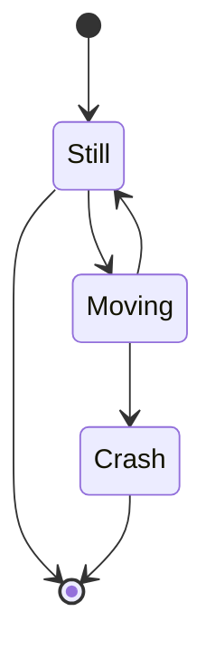

# State diagram

```mermaid
stateDiagram-v2
[*] --> Still
Still --> [*]
Still --> Moving
Moving --> Still
Moving --> Crash
Crash --> [*]
```

<pre>

```mermaid
stateDiagram-v2
[*] --> Still
Still --> [*]
Still --> Moving
Moving --> Still
Moving --> Crash
Crash --> [*]
```
</pre>

---

# Reference

- https://github.com/mermaid-js/mermaid#sequence-diagram-docs---live-editor
- https://mermaid.js.org/syntax/stateDiagram.html