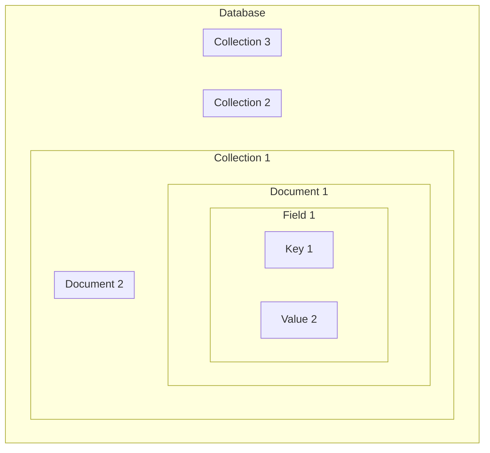

- MongoDB는 고성능, 고가용성 및 쉬운 확장성을 제공하는 NoSQL, Document 지향 database입니다.
    - NoSQL은 "Not Only SQL"의 약자로, 전통적인 SQL database와는 다른 특징을 가집니다.

- data를 JSON과 유사한 형식인 BSON(Binary JSON)으로 저장합니다.
    - JSON은 data를 배열 및 중첩 Document와 같은 복잡한 data 유형을 효율적으로 저장할 수 있는 형식입니다.
    - BSON도 이러한 JSON의 특징을 모두 가집니다.


---


## MongoDB의 구조 : Database, Collection, Document




### Database

- MongoDB는 여러 개의 데이터베이스를 지원합니다.
- 각 데이터베이스는 별개의 공간을 가지며, 서로 독립적으로 관리됩니다.
- database는 collection의 집합체입니다.


### Collection

- MongoDB의 컬렉션은 RDBMS에서의 테이블에 해당합니다.
- 컬렉션은 Document의 집합체입니다.


### Document

- 다큐먼트는 MongoDB에서의 기본 데이터 단위입니다.
- JSON 형식으로 표현되며, 필드(key-value)의 집합체입니다.
- 각 다큐먼트는 컬렉션에 저장되고, 고유한 식별자인 "ObjectId"를 가지고 있습니다.


### Field

- 필드는 다큐먼트 내에서의 데이터를 나타냅니다.
- 필드는 이름과 값(key-value) 쌍으로 이루어진 데이터 단위입니다.
    - 필드는 다큐먼트 내에서 고유한 이름(key)을 가지고 있으며, 필드의 이름(key)은 해당 필드를 식별하는 데에 사용됩니다.
    - key에 연결되는 field의 값(value)은 다양한 데이터 유형일 수 있습니다.


---


## MongoDB의 특징

- MongoDB는 대용량의 data를 관리해야 하거나, 유연한 data model이 필요한 경우에 유용합니다.


### Document-Oriented (문서 지향)

- MongoDB는 JSON 형태의 BSON(Binary JSON) 문서를 저장합니다.
- 각 문서는 key-value 쌍의 집합으로 이루어져 있으며, 이러한 문서들을 collection에 저장합니다.

- 문서 지향적이기 때문에 가지는 **schema-free**하고, **query가 유연**합니다.

#### Schema-Free

- MongoDB는 schema가 고정되어 있지 않아, 각 문서가 다른 구조를 가질 수 있습니다.
    - 이는 data model을 쉽게 변경하고 확장할 수 있도록 합니다.

- 같은 collection 안에서도 다른 schema의 문서를 넣을 수 있습니다.
    - 이는 NoSQL 데이터베이스의 주요 특징 중 하나로, 데이터 모델이 유연하게 조정될 수 있음을 의미합니다.
    - 유연성은 개발자가 애플리케이션의 요구 사항이나 데이터 모델을 쉽게 변경하고 확장할 수 있도록 합니다.
    - 개발자는 이러한 유연한 schema를 사용하면서도 data의 일관성을 유지해야 합니다.

```js
// 예시 : collection 내의 다른 schema
[
{
"_id": ObjectId("5ffdf95c4707303c4d6f57a0"),
"username": "john_doe",
"email": "john@example.com",
"age": 30
},
{
"_id": ObjectId("5ffdf95c4707303c4d6f57a1"),
"name": "Jane Doe",
"email": "jane@example.com",
"address": {
  "city": "New York",
  "state": "NY"
}
},
{
"_id": ObjectId("5ffdf95c4707303c4d6f57a2"),
"username": "bob_smith",
"age": 25,
"skills": ["JavaScript", "Python", "MongoDB"]
}
]
```


### 유연한 Query 언어

- MongoDB는 강력하고 유연한 쿼리 언어를 제공합니다.
    - 데이터를 검색하고 조작하는 다양한 기능(연산자, 배열 조작, 단어 검색, 정렬, 정규 표현식 등)이 있습니다.


### Indexing

- 다양한 index 기능을 사용하여 쿼리 성능을 향상시킬 수 있습니다.
    - e.g., Single Field Index, Compound Index, Text Index, Hashed Index, Geospatial Index, Wildcard Index.


### 분산 Database

- MongoDB는 분산 데이터베이스로서 여러 서버에 데이터를 분산하여 저장할 수 있습니다.
- 분산 데이터베이스는 수평 확장성을 제공하기 때문에, 대량의 데이터 처리에 적합합니다.


### Auto-Sharding

- MongoDB는 auto-sharding을 지원하여 데이터베이스가 자동으로 분할되고 여러 머신에 분산 저장됩니다.
- 이를 통해 대용량 데이터 처리와 높은 가용성을 실현할 수 있습니다.


### 높은 가용성과 복구

- MongoDB는 데이터의 복제를 통해 높은 가용성을 제공하며, 장애 발생 시 자동으로 복구됩니다.


### 강력한 집계 Framework

- MongoDB는 집계 프레임워크를 통해 복잡한 집계 작업을 수행할 수 있습니다.
- 이를 통해 데이터를 유연하게 분석할 수 있습니다.


### Open Source

- MongoDB는 오픈 소스로 제공되며, 커뮤니티에서 다양한 지원과 개선이 이루어지고 있습니다.
- MongoDB는 다양한 프로그래밍 언어를 위한 드라이버를 지원하며, 개발자가 선호하는 언어로 데이터베이스에 접근할 수 있습니다.


---


## Reference

- <https://colevelup.tistory.com/45>
