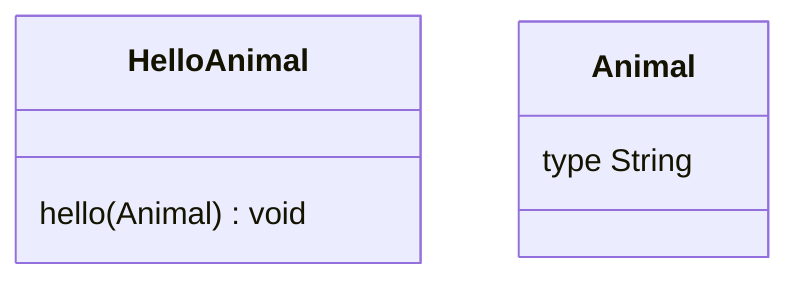
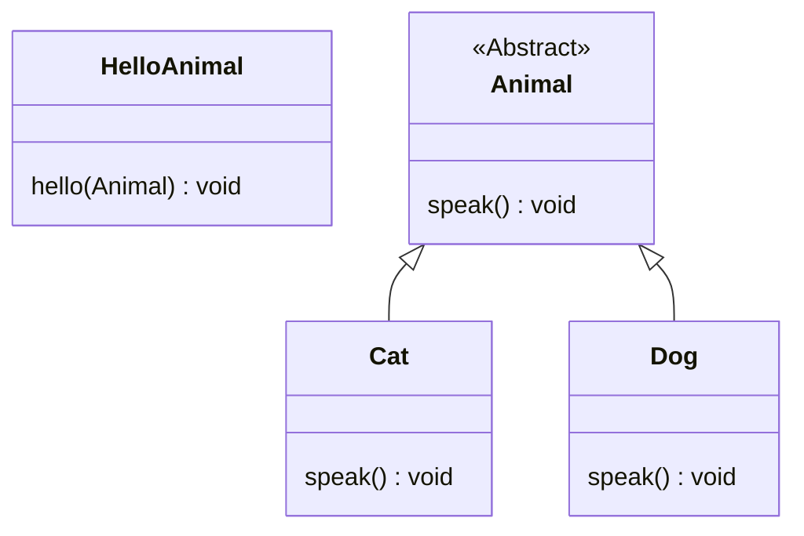

## OCP (Open Closed Principle) : 개방 폐쇄 원칙

```txt
Software 개체(class, module 등)는 확장에는 열려 있어야 하고, 변경에는 닫혀 있어야 한다.
```

- 개방 폐쇄 원칙(OCP)이란 기존의 code를 변경하지 않으면서, 기능을 추가할 수 있도록 설계가 되어야 한다는 원칙입니다.

- software 개발 작업에 이용된 많은 개체 중 하나에 수정(변경)을 일으킬 때, 그 개체를 이용하는 다른 개체들을 모두 수정해야 하는 것은 옳지 않습니다.
    - 수정 작업 자체가 자원을 사용하며, 수정 과정에서 다른 개체들에 추가적인 문제가 발생할 수 있기 때문입니다.

- OCP는 그 자체로 **추상화**를 의미합니다.
    - 개방 폐쇄 원칙은 다형성이라는 객체지향의 장점을 극대화하는 설계 원칙입니다.
    - 객체지향 언어에서 객체를 추상화하고, 기능을 추가할 땐 상속 관계에 맞춰 적절한 class를 추가만 하는 방식 자체가 OCP를 적용한 것입니다.


### Open : 확장에 열려 있음

- 확장에 대해서는 개방적(open)이어야 합니다.
    - module의 확장성을 보장해야 합니다.
    - '확장'은 새로운 기능의 추가를 의미합니다.

- 변경 사항이 생겼을 때 code를 추가함으로써, 적은 자원으로 유연하게 기능을 확장할 수 있습니다.


### Closed : 변경에 닫혀 있음
 
- 수정에 대해서는 폐쇄적(closed)이어야 합니다.
    - 객체를 직접적으로 수정하는 것을 제한해야 합니다.

- 변경 사항이 생겼을 때 객체를 직접적으로 수정해야 한다면, 변경 사항에 대해 유연하게 대응할 수 없습니다.
    - 따라서 유지보수의 비용이 증가합니다.

- **객체를 직접 수정하지 않고도(변경에 닫혀 있어도)** 변경 사항을 적용할 수 있도록 설계해야 합니다.
 


---


## OCP 적용해보기 (추상화 설계)

- OCP를 적용하기 위해서는 적절한 추상화 class를 구성하고, 이를 상속하여 확장시키는 관계로 구성해야 합니다.
    1. 변경(확장)될 것과 변하지 않을 것을 엄격히 구분합니다.
    2. 구분한 두 module이 만나는 지점에 추상화(`abstract class` or `interface`)를 정의합니다.
    3. 구현체가 아닌 정의한 추상화에 의존하도록 코드를 작성합니다.


### 적용 전

- 개나 고양이 등의 동물 객체(`Animal`)를 만들고, `HelloAnimal` class의 `hello()` method를 실행하면, `Animal.type`을 구분하여 울음소리를 출력하는 program입니다.

- 만일 양이나 사자를 추가하게 된다면, `HelloAnimal` class의 `hello()` method를 수정하여, 각 객체의 field 변수에 맞춰 if문을 구성해주어야 합니다.
    - 동물이 추가될 때마다 계속 code를 변경해줘야 합니다.
    - 기능의 추가가 어려우므로, 확장에 열려 있지 않습니다.
    - 기존 code를 수정하므로, 변경에 닫혀 있지 않습니다.
    - 따라서 OCP를 위반합니다.



```java
class Animal {
	String type;
    
    Animal(String type) {
    	this.type = type;
    }
}

// 동물 유형을 받아, 각 동물에 맞춰 울음 소리를 내도록 하는 class module
class HelloAnimal {
    void hello(Animal animal) {
        if(animal.type.equals("Cat")) {
            System.out.println("냐옹");
        } else if(animal.type.equals("Dog")) {
            System.out.println("멍멍");
        }
        // else if (animal.type.equals("Sheep")) {
        //     System.out.println("메에에");
        // } else if (animal.type.equals("Lion")) {
        //     System.out.println("어흥");
        // }
        // ... 기능을 확장하기 위해서는 class 내부 구성을 계속해서 수정해야 합니다.
    }
}

public class Main {
    public static void main(String[] args) {
        HelloAnimal hello = new HelloAnimal();
        
        Animal cat = new Animal("Cat");
        Animal dog = new Animal("Dog");

        hello.hello(cat);    // 냐옹
        hello.hello(dog);    // 멍멍
        // hello.hello(sheep);    // 매에에
        // hello.hello(lion);    // 어흥

    }
}
```


### 적용 후



```java
// 추상화
abstract class Animal {
    abstract void speak();
}

class Cat extends Animal {    // 상속
    void speak() {
        System.out.println("냐옹");
    }
}

class Dog extends Animal {    // 상속
    void speak() {
        System.out.println("멍멍");
    }
}

// 추상 class를 상속 받고, method 강제 구현 규칙으로 규격화만 하면, 확장에 제한이 없습니다. (opened)
// class Sheep extends Animal {
//     void speak() {
//         System.out.println("매에에");
//     }
// }
// class Lion extends Animal {
//     void speak() {
//         System.out.println("어흥");
//     }
// }

class HelloAnimal {
    void hello(Animal animal) {
        animal.speak();    // 기능 확장으로 인한 동물 class가 추가되어도, 더 이상 수정할 필요가 없습니다. (closed)
    }
}

public class Main {
    public static void main(String[] args) {
        HelloAnimal hello = new HelloAnimal();

        Animal cat = new Cat();
        Animal dog = new Dog();
        // Animal sheep = new Sheep();
        // Animal lion = new Lion();

        hello.hello(cat);    // 냐옹
        hello.hello(dog);    // 멍멍
        // hello.hello(sheep);    // 매에에
        // hello.hello(lion);    // 어흥
    }
}
```


---


## OCP 적용 주의 사항

- 확장에는 열려 있고 변경에는 닫혀 있도록 하기 위해서는 추상화를 잘 설계해야 합니다.
- 그리고 추상화(abstract class, interface)를 정의할 때는 여러가지 경우의 수에 대한 고려와 예측이 필요합니다.

- 보통 추상화라는 개념에 대해 '구체적이지 않은' 정도의 의미로 느슨하게만 알고 있지만, 추상화란 사실 '다른 모든 종류의 객체로부터 식별될 수 있는 객체의 본질적인 특징'입니다.
    - 즉, 추상 method 설계에서 적당한 추상화 수준(level)을 선택하고, 행위에 대한 본질적인 정의를 하위 class에 전파하여, 관계가 성립되도록 하는 것입니다.

- 추상화에 따른 상속 구조를 어설프게 구성하면, 이는 LSP(Liskov 치환 원칙)와 ISP(Interface 분리 원칙)의 위반으로 이어지게 됩니다.
    - OCP는 DIP(의존 관계 역전 원칙)의 설계 기반이 되기도 합니다.

- 따라서 추상화는 "잘" 설계해야 합니다.

- 추상화는 오로지 개발자의 역량에 달려 있으며, 많은 경험과 경력이 이 역량을 키울 수 있습니다.


---


# Reference

- <https://inpa.tistory.com/entry/OOP-%F0%9F%92%A0-%EC%95%84%EC%A3%BC-%EC%89%BD%EA%B2%8C-%EC%9D%B4%ED%95%B4%ED%95%98%EB%8A%94-OCP-%EA%B0%9C%EB%B0%A9-%ED%8F%90%EC%87%84-%EC%9B%90%EC%B9%99>
