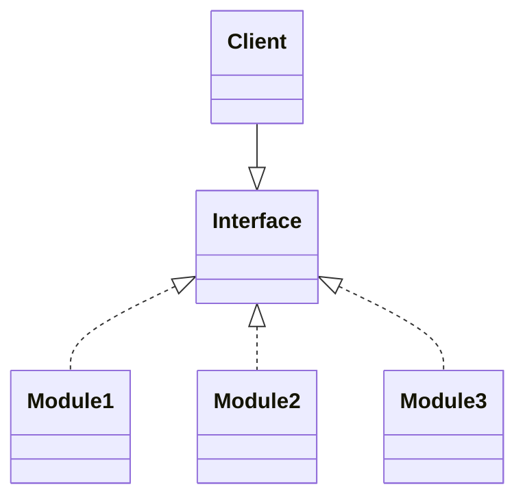
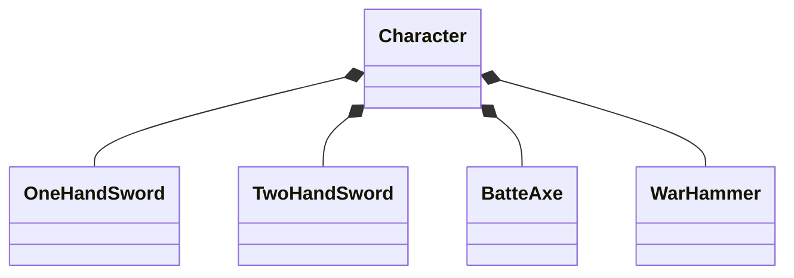
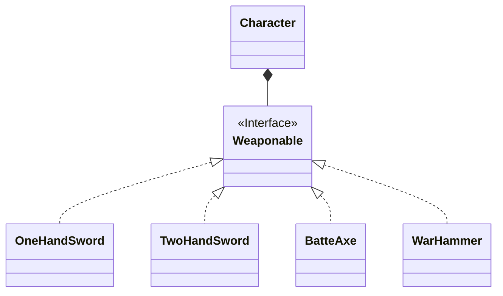

## DIP (Dependency Inversion Principle) : 의존 관계 역전 원칙

```txt
고수준 module은 저수준 module의 구현에 의존해서는 안되며, 저수준 module이 고수준 module에서 정의한 추상 type에 의존해야 합니다.
```

| 고수준 Module | 저수준 Module |
| --- | --- |
| 의미있는 기능을 제공하는 module입니다. | 고수준 module을 구현하기 위해 필요한 하위 기능의 실제 구현체입니다. |
| 정책에 가깝습니다. | 기술에 가깝습니다. |

- DIP는 객체가 다른 class를 참조해서 사용해야 할 때, 대상 class를 직접 참조하는 것이 아니라, **대상의 상위 요소(abstract class, interface)로 참조**하라는 원칙입니다.
    - client(사용자)가 상속 관계로 이루어진 module을 사용할 때, 하위 module instance을 직접 사용하지 말라는 뜻입니다.
        - 하위 module의 구체적인 내용에 client가 의존하게 되어, **하위 module에 변화가 있을 때마다 client나 상위 module을 수정해야 되기 때문**입니다.

- 의존 관계 역전 원칙은 추상화된 interface나 상위 class에 의존하여, **변하기 쉬운 것의 변화에 영향을 받지 않게** 하는 것입니다.
    - 하위 class일수록, 구체 class일수록, 변할 가능성이 높습니다.
    - 상위 class일수록, interface일수록, 추상 class일수록, 변하지 않을 가능성이 높습니다

- 결국 DIP는 추상화를 이용하라는 원칙이며, 이는 개방 폐쇄 원칙(OCP)과 통하는 부분입니다.




- DIP는 다형성을 이용한 DI(Dependency Injection, 의존성 주입)를 통해 구현할 수 있습니다.
    - 객체들이 서로 정보를 주고 받을 때는 의존 관계가 형성됩니다.
        - 변하지 않을 가능성이 높은 **추상성이 높은 class(상위 class, interface, 추상 class)와 통신**해야 합니다.
    - 의존 관계가 형성된다는 말(class 간에 의존한다는 말)은, 한 class가 어떤 기능을 수행할 때 다른 class의 service가 필요한 경우를 의미합니다.
        - e.g., A class의 method에서 B class type의 parameter를 받아 B 객체의 method를 사용한다면, A class는 B class에 의존하고 있는 것입니다.


### Example : 아이와 장난감

```java
// interface
interface Toy {}

class Robot implements Toy {}
class Lego implements Toy {}
class Doll implements Toy {}

// client
class Kid {
	Toy toy;    // composition
    
    void setToY(Toy toy) {
    	this.toy = toy;
    }
    
    void play() {}
}

// main method
public class Main {
	public static void main(String[] args) {
        Kid boy = Kid();
        
        Toy toy = new Robot();
        boy.setToy(toy);
        boy.play();
        
        Toy toy = new Lego();
        boy.setToy(toy);
        boy.play();
    }
}
```


### Example : Java Collection

- 보통 `ArrayList`나 `HashSet` 자료형을 사용할 때, 변수 type을 `ArrayList`, `HashSet`와 같은 구체 class type으로 선언하는 것이 아닌, `List`나 `Set` 같은 interface type으로 선언하는데, 이것도 DIP 원칙을 따른 code입니다.

```java
// 변수 type을 고수준 module인 interface type으로 선언하여 저수준의 module을 할당합니다.
List<String> myList = new ArrayList()<>;
Set<String> mySet = new HashSet()<>;
Map<int, String> myMap = new HashMap()<>;
```


---


## DIP 적용해보기


### 적용 전

- RPG game에는 character와 character가 장착할 수 있는 다양한 무기(한손검, 양손검, 전투도끼, 망치)들이 있습니다.
- `Character` class는 이름, 체력, 장착 있는 무기를 입력받아 초기화합니다.
- 한손검에도 하나의 종류만 있는 것이 아니라 목검, 강철검 등등 다양한 종류의 검이 있습니다.
    - 따라서 `Character` class의 field 변수로써 `OneHandSword` class type의 변수를 저장해두고, `attack()` method를 수행하여 `OneHandSword` class의 method를 실행합니다.

- `Character` class의 instance 생성 시, `OneHandSword`에 의존성을 가지게 되어, 공격 동작을 담당하는 `attack()` method도 `OneHandSword`에 의존하게 됩니다.
- 여러 무기들을 장착하게 하려면, `Character` class의 class field 변수 type을 아예 교체해줘야 하는 상황입니다.



```java
class OneHandSword {
    final String NAME;
    final int DAMAGE;

    OneHandSword(String name, int damage) {
        NAME = name;
        DAMAGE = damage;
    }

    int attack() {
        return DAMAGE;
    }
}

class TwoHandSword {
    // ...
}

class BatteAxe {
    // ...
}

class WarHammer {
    // ...
}
```

```java
class Character {
    final String NAME;
    int health;
    OneHandSword weapon;    // 저수준 객체에 의존하고 있습니다.

    Character(String name, int health, OneHandSword weapon) {
        this.NAME = name;
        this.health = health;
        this.weapon = weapon;
    }

    int attack() {
        return weapon.attack();    // 의존 객체에서 method를 실행합니다.
    }

    void chageWeapon(OneHandSword weapon) {
        this.weapon = weapon;
    }

    void getInfo() {
        System.out.println("이름 : " + NAME);
        System.out.println("체력 : " + health);
        System.out.println("무기 : " + weapon);
    }
}
```


### 적용 후

- 이미 완전하게 구현된 하위 module에 의존해서는 안 됩니다.
    - 구체 module에 의존하는 것이 아닌, 추상적인 고수준 module에 의존하도록 수정해야 합니다.

- 모든 무기들을 포함할 수 있는 고수준 module인 `Weaponable` interface를 생성합니다.
    - 모든 공격 가능한 무기 객체는 이 interface를 구현(`implements`)합니다.

- `Character` class의 무기 field 변수를 고수준 모듈인 `Weaponable` interface type으로 변경합니다.
    - 모든 공격 가능한 무기는 `Weaponable`을 구현하는 것으로 가정하기 때문에, `Character`는 공격 가능한 모든 무기를 할당받을 수 있습니다.

- DIP 원칙을 따름으로써 무기의 변경에 따라 `Character` class의 code를 변경할 필요가 없으며, 다른 type의 무기 확장에도 무리가 없기 때문에, OCP 원칙 또한 준수하게 됩니다.



```java
// 고수준 module
interface Weaponable {
    int attack();
}

class OneHandSword implements Weaponable {
    final String NAME;
    final int DAMAGE;

    OneHandSword(String name, int damage) {
        NAME = name;
        DAMAGE = damage;
    }

    public int attack() {
        return DAMAGE;
    }
}

class TwoHandSword implements Weaponable {
	// ...
}


class BatteAxe implements Weaponable {
	// ...
}

class WarHammer implements Weaponable {
	// ...
}
```

```java
class Character {
    final String NAME;
    int health;
    Weaponable weapon;    // 고수준의 module에 의존하게 합니다.

    Character(String name, int health, Weaponable weapon) {
        this.NAME = name;
        this.health = health;
        this.weapon = weapon;
    }

    int attack() {
        return weapon.attack();
    }

    void chageWeapon(Weaponable weapon) {
        this.weapon = weapon;
    }

    void getInfo() {
        System.out.println("이름 : " + NAME);
        System.out.println("체력 : " + health);
        System.out.println("무기 : " + weapon);
    }
}
```


---


# Reference

- <https://inpa.tistory.com/entry/OOP-%F0%9F%92%A0-%EC%95%84%EC%A3%BC-%EC%89%BD%EA%B2%8C-%EC%9D%B4%ED%95%B4%ED%95%98%EB%8A%94-DIP-%EC%9D%98%EC%A1%B4-%EC%97%AD%EC%A0%84-%EC%9B%90%EC%B9%99?category=967430>
