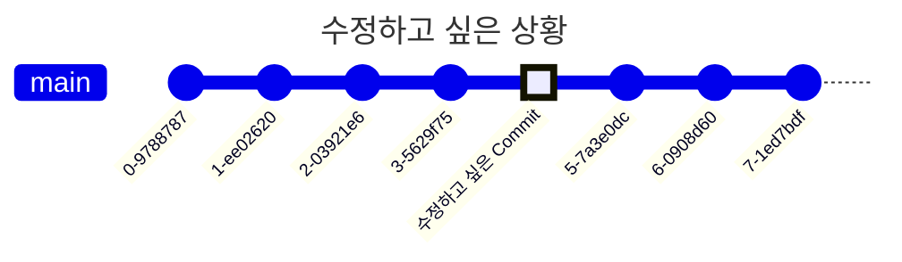

- `rebase` 명령으로 과거의 commit을 수정 이력 없이 수정할 수 있습니다.
    - 기존 commit의 수정본에 대한 새로운 commit을 만들어 교체하는 방식입니다.
        - 새로운 commit에 대해 새로운 hash 값이 만들어집니다.

- remote 저장소에 해당 commit을 `push`한 적이 있다면, 수정 후 `push`할 때 remote commit 내역과 충돌하게 됩니다.
    - 기존의 remote commit 내역과 local에서 수정한 commit 내역이 다르기 때문입니다.

---

## 과거의 Commit을 수정하는 법

### 1. `git log`

- 변경하려는 commit의 바로 이전 commit의 hash 값을 확인합니다.

### 2. `git rebase -i [past_commit_hash]`

- rebase할 때, `i` option으로 rebase interface에 진입할 수 있습니다.
- 수정하고 싶은 commit의 keyword를 `pick`에서 `edit`으로 수정하고, rebase interface에서 나옵니다.

### 3. File 수정

- 수정하려 했던 file을 수정합니다.

### 4. `git add [modified_file_name]`

### 5. `git commit --amend`

### 6. `git rebase --continue`

- 수정한 file에서 충돌이 발생하면 해결해야 합니다.

---

# Reference

- <https://git-scm.com/book/ko/v2>
