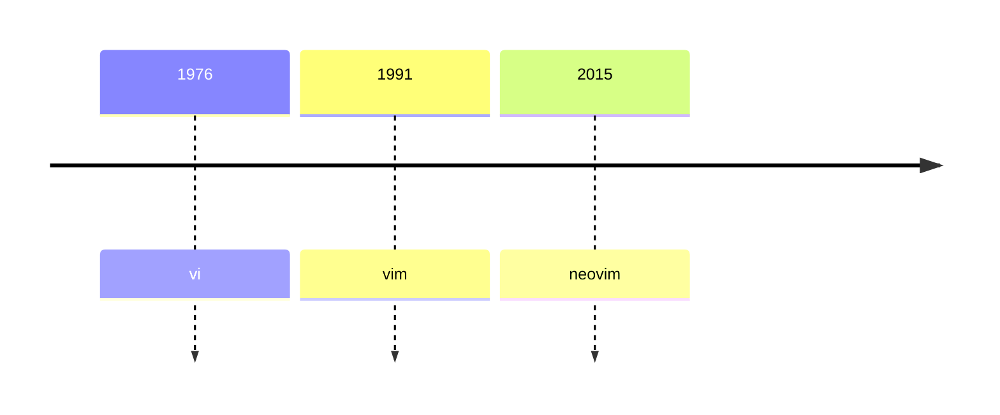

## vim : 개선된 vi

- Linux의 대표적인 편집기인 vi와 호환되는 text 편집기입니다.

- terminal에서 `vi`, `vim` 명령어로 편집기를 실행할 수 있습니다.
    - 최신 환경에서는 대부분 `vi`를 입력해도 자동으로 vim이 실행됩니다.

- neovim(`nvim`)은 개선된 vim입니다.

## Vim의 Mode

| Mode | 설명 |
| - | - |
| Command Mode | 명령을 수행합니다. 다른 mode에서 Command Mode로 되돌리고 싶다면 Escape key(`esc`)를 입력합니다. |
| Command Line Mode | 화면 하단에 colon(`:`) prompt에 명령 문장을 입력하거나, slash(`/`) prompt에 단어를 입력합니다. |
| Insert Mode | 문서에 내용을 삽입합니다. |
| Edit Mode | 문서의 내용을 수정합니다. |
| Visual Mode | 문자열을 선택합니다. |

---

## 사용법

- 아래의 명령어들을 입력하는 상황은 Command Mode를 기준으로 합니다.
    - 편집기를 실행하면, 최초의 mode는 Command Mode입니다.

### 저장하고 나가기

| 명령어 | 설명 |
| - | - |
| `:w` | 저장합니다. |
| `:q` | 종료합니다. 내용이 수정되었다면 종료할 수 없습니다. 저장했거나 수정한 내용이 없다면 종료할 수 있습니다. |
| `:q!` | 강제로 종료합니다. 내용이 수정되었더라도 저장하지 않고 바로 종료합니다. |
| `:wq` | 저장 후 종료합니다. |

### 작성하기

| 명령어 | 설명 |
| - | - |
| `i` | Insert Mode로 진입합니다. 문자의 앞에 삽입 cursor가 위치합니다. |
| `shift` + `i` | Insert Mode로 진입합니다. 문장의 앞에 삽입 cursor가 위치합니다. |
| `a` | Insert Mode로 진입합니다. 문자의 뒤에 삽입 cursor가 위치합니다. |
| `shift` + `a` | Insert Mode로 진입합니다. 문장의 뒤에 삽입 cursor가 위치합니다. |
| `o` | cursor의 아래에 새로운 line을 만들고, Insert Mode로 진입합니다. |
| `shift` + `o` | cursor의 위에 새로운 line을 만들고, Insert Mode로 진입합니다. |
| `s` | 선택한 문자를 삭제하고, Insert Mode로 진입합니다. |
| `shift` + `s` | cursor가 위치한 line의 문장을 삭제하고, Insert Mode로 진입합니다. |

### Cursor 이동하기

| 명령어 | 설명 |
| - | - |
| `h` or `←` | 왼쪽으로 이동합니다. |
| `l` or `→` | 오른쪽으로 이동합니다. |
| `j` or `↓` | 아래로 이동합니다. |
| `k` or `↑` | 위로 이동합니다. |
| `w` | 다음 단어로 이동합니다. |
| `b` | 이전 단어로 이동합니다. |
| `shift` + `h` | 화면 상단으로 이동합니다. |
| `shift` + `m` | 화면 중단으로 이동합니다. |
| `shift` + `l` | 화면 하단으로 이동합니다. |
| `0` | line의 왼쪽 끝(맨 앞)으로 이동합니다. |
| `shift` + `4` | line의 오른쪽 끝(맨 뒤)으로 이동합니다. |

### 검색하기

| 명령어 | 설명 |
| - | - |
| `/[keyword]` | 문자열을 위에서 아래로 검색합니다. |
| `?[keyword]` | 문자열을 아래에서 위로 검색합니다. |
| `n` | 다음 검색 결과로 넘어갑니다. |

### 화면 이동하기

| 명령어 | 설명 |
| - | - |
| `control` + `d` | 아래(down)로 이동합니다. |
| `control` + `u` | 위(up)로 이동합니다 |
| `control` + `e` | 한 줄씩 아래로 이동합니다. cursor의 위치는 유지합니다. |
| `control` + `y` | 한 줄씩 위로 이동합니다. cursor의 위치는 유지합니다. |
| `zz` | cursor의 위치가 화면 중단에 오도록 화면을 이동합니다. cursor의 위치는 유지합니다. |

### 설정하기

| 명령어 | 설명 |
| - | - |
| `:set hlsearch` | 검색한 문자열을 강조합니다. |
| `:set nu` | line number를 표시합니다. |
| `:set expandtab` | tab을 공백으로 바꿉니다. |
| `:set tabstop=4` | tab 너비를 4칸으로 설정합니다. |
| `:set shiftwidth=4` | `>>` 또는 `<<`로 들여쓸 때, 공백의 갯수를 4로 설정합니다. 기본값은 8입니다. |
| `:set autoindent` | 자동으로 들여쓰기합니다. 줄을 바꿀 때, 바로 아래로 cursor를 떨어뜨립니다. |
| `:set smartindent` | 자동으로 들여쓰기합니다. 줄을 바꿀 때, tabstop만큼 자동으로 더 띄어서 cursor를 위치시킵니다. |
| `:set encoding=utf-8` | encoding 방식을 utf-8로 설정합니다. |
| `:syntax on` | 문법 강조 색상을 적용합니다. |

---

# Reference

- <https://www.vim.org>
