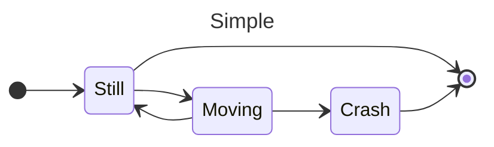
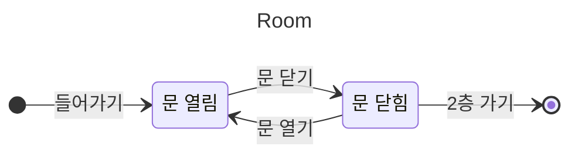
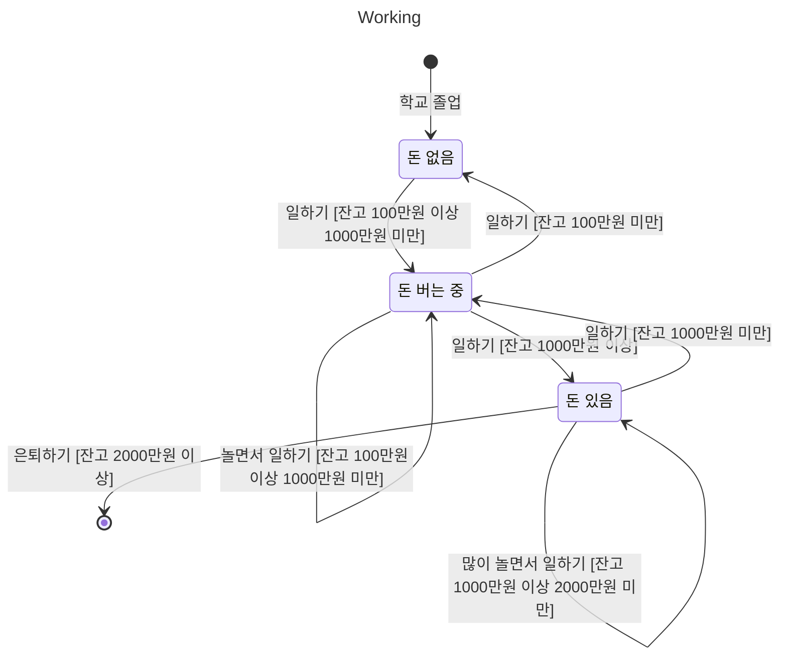
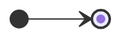
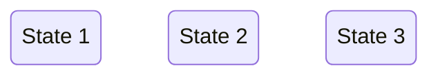
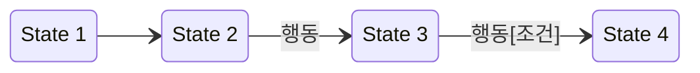

- State Diagram이란 하나의 객체가 생명 주기(life cycle) 동안 가질 수 있는 상태의 변화를 분석한 diagram입니다.

---

## Example

---

## 구성 요소

### 시작 상태와 종료 상태

|  | 시작 상태 (Initial state) | 종료 상태 (Final state) |
| - | - | - |
| 표기법 | 속이 채워진 원으로 표기합니다. | 속이 채워진 원의 바깥에 다른 원이 둘러싸고 있는 모양으로 표기합니다. |
| 설명 | 시작 상태는 객체의 상태 변화가 시작되는 곳을 의미합니다. 보통 객체의 생성 시점이 시작 상태가 됩니다. | 종료 상태는 객체 상태 변화가 종료되는 곳을 의미합니다. 보통 객체의 소멸 시점이 종료 상태가 됩니다. |

### 상태

|  | 상태 (State) |
| - | - |
| 표기법 | 모서리가 둥근 사각형으로 표기합니다. 상태의 이름은 사각형 안에 표기합니다. |
| 설명 | 상태란 객체가 가질 수 있는 조건이나 상황입니다. 생명 주기 동안 객체의 상태는 변화하며, 상태는 객체의 특정한 속성의 값으로 표현됩니다. |

### 전이

|  | 전이 (Transition) |
| - | - |
| 표기법 | 전이는 상태와 상태 사이에 화살표가 달린 실선으로 표기합니다. 행동과 조건은 선 위에 표기하며, 필요에 따라 생략할 수 있습니다. 하나의 전이로는 하나의 단방향만 표현할 수 있습니다. |
| 설명 | 전이란 하나의 상태에서 다른 상태로 변화하는 것이며, 상태 간의 관계를 의미합니다. |

---

## 주의 사항

### 하나의 객체에 대한 상태 변화를 표현하기

- 상태에 집중하다 보면, 객체라는 한계를 벗어나는 경우가 있습니다.
- 하나의 State Diagram은 하나의 객체에 대한 상태를 정의해야 합니다.

### Black Hole State

- 들어오는 전이만 있고 나가는 전이가 없는 경우 Black Hole 상태가 됩니다.
- Black Hole 상태가 있으면, 객체가 종료 상태에 이르지 못하고 무한 loop를 수행하게 됩니다.
- 상태는 들어오는 전이와 나가는 전이가 모두 정의되어야 합니다.

---

# Reference

- <https://ko-de-dev-green.tistory.com/96>
- <https://5dol.tistory.com/169>
- <https://mermaid.js.org/syntax/stateDiagram.html>
