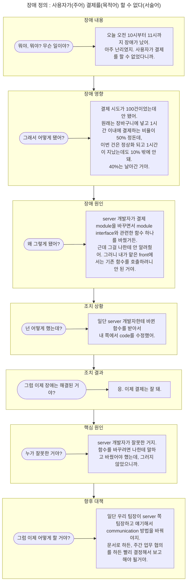

- 장애 보고서는 보통의 개발 문서와 크게 다릅니다.
- 그래서 장애 보고서는 그 특성을 충분히 이해하고 쓰지 않으면 쓸모가 없습니다.
- 장애 보고서는 **신속하게, 분석적으로, business 관점에서, 정치적으로** 작성해야 합니다.

---

## 신속한 글쓰기 : 질문에 대답하기

- 장애 보고서는 개발자가 원할 때 쓸 수 없습니다.

- 장애 보고서는 장애 발생을 인지하는 순간부터 쓸 수 있습니다.
    - 장애가 발생하기 전에 미리 쓸 수 없습니다.
    - 장애를 예상하고 써놓을 수 없습니다.

- 따라서 **신속한 글쓰기**가 필요합니다.
    - 장애 보고는 장애를 해결하면서도 해야 합니다.

- **대화를 글로 옮기는 방법**으로 글을 신속하게 쓸 수 있습니다.
    - 대화를 할 때는 일단 무슨 말이든 내뱉고 나서 생각을 정리하고, 질문을 받으면 답하면서 다음 생각으로 이어갑니다.

- 질문과 대답을 개조식으로 정리하여 사용합니다.
    - **질문은 장애 보고서의 항목**입니다.
    - **대답은 장애 보고서의 내용**입니다.

### 질문과 대답을 이용해 완성한 장애 보고서

제목 : Server Module 변경 문제로 사용자 결제 불가 (10~11 시)

| 항목 | 내용 |
| --- | --- |
| 항목 | 내용 |
| --- | --- |
| 장애 내용 | 사용자 결제 불가 (10:00 ~ 11:00, 1시간) |
| 장애 영향 | 장애 중 결제 시도 100건 -> 1시간 후 결제 비율 10% (평균 50%) |
| 장애 원인 | server 쪽 결제 module 변셩 시 module interface의 함수를 수정했으나, front에서는 기존 함수를 호출하여 오류 발생 |
| 조치 상황 | server 쪽의 바뀐 함수를 호출하도록 front code 수정 |
| 조치 결과 | 결제 기능 정상 작동 |
| 핵심 원인 | server 쪽과 front 쪽 communication 단절 |
| 향후 대책 | server, front 팀장이 소통 방법 협의하여 보고 |

---

## 분석적 글쓰기 : 원인과 이유를 찾기

- 장애의 1차 원인은 대부분 다른 원인의 결과입니다.

- 장애의 원인을 정확히 알아내려면, **원인의 원인**을 계속 찾아 나가야 합니다.
    - 더는 원인의 원인을 찾을 수 없을 때, 그 원인이 장애의 최초 원인입니다.

- 장애의 최초 원인을 찾았다면, 그 원인이 발생한 이유도 알아야 합니다.
    - 장애의 재발을 막으려면 원인만 해결해서는 안 됩니다.
    - 원인이 발생한 이유를 분석합니다.
        - 이유는 사람에게 있습니다.

- 원인과 이유를 찾는 **분석적 글쓰기**가 필요합니다.

---

## Business 관점의 글쓰기 : 상사를 고려하기

- 장애 보고를 받는 윗사람은 대부분 개발자가 아닙니다.

- 윗사람(e.g., 임원)은 장애를 곧 business에 주는 영향으로 봅니다.
    - 장애가 발생했다는 보고를 받으면, "그래서 손해가 얼마인가요?"라고 질문할 수 있습니다.

- 보고를 받는 사람과 소통하기 위한 **business 관점의 글쓰기**가 필요합니다.

---

## 정치적 글쓰기 : 원하는 것을 얻어내기

- 장애를 해결했다고 해서 100% 해결한 것은 아닙니다.

- 장애 조치를 했다고 해서 다시는 재발하지 않는다고 확정할 수 없습니다.
    - 장애는 항상 예상하지 못한 곳에서 발생하기 때문입니다.

- 그러나 윗사람에게 보고할 때는 확정적이고 신뢰할 만한 결단을 정치적으로 내려야 합니다.
    - 윗사람 입장에서는 확정적인 대답을 원하며, 애매한 표현을 싫어하기 때문입니다.

- 따라서 **정치적 글쓰기**가 필요합니다.

---

# Reference

- 개발자의 글쓰기 (도서) - 김철수
