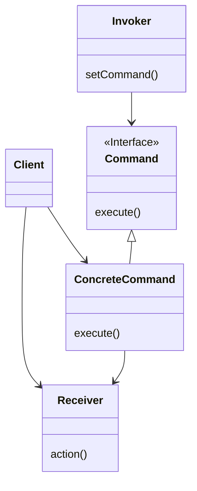
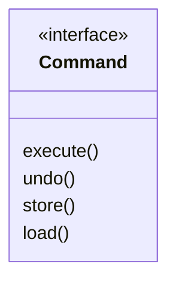
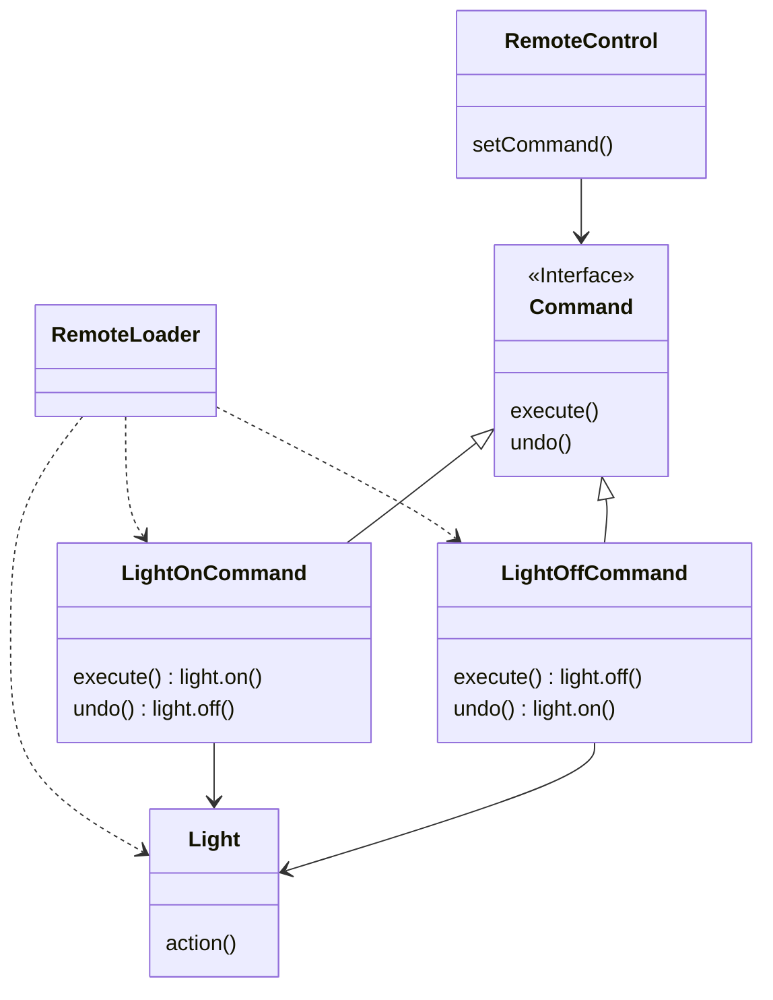

- Command Pattern은 실행될 기능 또는 작업을 캡슐화(encapsulation)하여, **기능의 실행을 요구하는 호출자**(invoker)와 **기능을 실행하는 수신자**(receiver) 간의 결합을 느슨하게 만들기 위해 사용됩니다.
- Command Pattern을 적용하면 명령을 쉽게 추가하거나 변경할 수 있으며, 실행 취소(undo), 재실행, queuing, logging 등 다양한 기능을 구현할 수 있습니다.


---


## Class 구조



- `Client` : ConcreteCommand를 생성하고 Receiver를 설정합니다.
    - note for Client "ConcreteCommand를 생성하고 Receiver를 설정합니다."

- `Invoker` : 명령을 실행하고자 하는 객체(호출자)입니다.
    - 이 객체는 커맨드 객체를 받아와 실행 메서드를 호출합니다.
    - 이 때, 호출자는 어떤 구체적인 명령을 실행할지 알 필요가 없으며, 커맨드 객체의 인터페이스만 이해하면 됩니다.
    - note for Invoker "명령이 들어있습니다. \nexecute() method를 호출함으로써 command 객체에 특정 작업을 수행해 달라는 요구를 합니다."

- `Command` : 실제 실행되어야 할 작업을 캡슐화하는 interface 또는 abstract class입니다.
    - 이 인터페이스는 실행 메서드를 정의하며, 구체적인 명령 클래스들이 이를 구현합니다.
    -  Receiver에 특정 작업을 처리하라는 지시를 전달함
    - note for Command "모든 command 객체에서 구현해야 하는 interface입니다.\n모든 명령은 execute() method 호출을 통해 수행됩니다."

- `ConcreteCommand` : Command 인터페이스를 구현한 실제 명령 클래스입니다.
    - 명령을 수행하기 위한 필요한 정보와 작업을 포함하며, 실제로 명령을 수행하는 로직을 가지고 있습니다.
    - `extute()` method 내에서는 `receiver.action()`을 실행합니다.
    - note for ConcreteCommand "특정 행동과 Receiver 사이를 연결해 줍니다.\nInvoker에서 execute() 호출을 통해 요청하면 ConcreteCommand 객체에서 Receiver에 있는 method를 호출함으로써 그 작업을 처리합니다."

- `Receiver` : 명령을 실제로 수행하는 객체(수신자)입니다.
    - 명령 객체가 수행되면, 이 객체가 작업을 실행하고 결과를 반환합니다.
    - note for Receiver "요구 사항을 수행하기 위해 어떤 일을 처리해야 하는지 알고 있는 객체입니다."

```java
public class Client {
    public static void main(String[] args) {
        Receiver receiver = new Receiver();

        Command command = new ConcreteCommand(receiver);
        Invoker invoker = new Invoker(command);
        invoker.invoke();

        // 다른 concreteCommand 객체를 set하여 동적으로 명령을 바꿔 수행할 수 있습니다.
        // Command otherCommand = new ConcreteCommand(receiver);
        // invoker.setCommand(otherCommand);
        // invoker.invoke();
    }
}
```

```java
public class Invoker {
    private Command command;

    public Invoker(Command command) {
        setCommand(command);
    }

    public void setCommand(Command command) {
        this.command = command;
    }

    public void invoke() {
        command.execute();
    }
}
```

```java
public interface Command {
    public abstract void execute();
}
```

```java
public class ConcreteCommand implements Command {
    private Receiver receiver;

    public ConcreteCommand(Receiver receiver) {
        this.receiver = receiver;
    }

    public void execute() {
        receiver.action();
    }
}
```

```java
public class Receiver {
    public void action() {
        System.out.println("Action");
    }
}
```


- Command Pattern을 이용하면 요구 사항을 객체로 캡슐화(encapsulation)할 수 있고, 매개변수를 써서 여러가지 다른 요구 사항을 집어넣을 수도 있습니다.

- 요청을 하는 객체와 그 요청을 수행하는 객체를 분리시킬 수 있음
    - 분리시키는 과정의 중심에는 Command 객체가 있음
        - Command 객체는 행동이 들어있는 Receiver를 캡슐화(encapsulation) 함
    - method 호출의 캡슐화(encapsulation)
        - 일련의 행동을 특정 Receiver하고 연결시킴으로써 요구 사항을 캡슐화(encapsulation)함
        - 행동과 Receiver를 한 객체에 집어넣고, execute()라는 method하나만 외부에 공개하는 방법을 사용함
        - 외부에서는 execute() method를 호출하면 요구 사항이 처리된다는 것만 알 수 있음
            - 어떤 객체가 Receiver 역할을 하는지, 그 Receiver에서 실제로 어떤 일을 하는지 알 수 없음
    - Invoker는 Command를 통해서 매개변수화될 수 있음
        - == 실행 중에 Command를 동적으로 설정할 수 있음

- 작업취소 기능을 지원할 수 있음

- Macro Command
    - Command를 확장해서 여러 개의 Command를 한꺼번에 호출할 수 있게 해 줌
    - Macro Command에서도 작업취소 기능을 지원할 수 있음

- Command Pattern을 활용하여 log 및 trasaction system을 구현하는 것도 가능함


## 동작 순서

### 1. Client에서 Invoker에 Command 설정하기

1. Command 객체 생성
    - `Client.createCommandObject();`
    - Command 객체
        - Receiver에 전달할 일련의 행동으로 구성됨 (행동 + Receiver에 대한 정보)
        - execute() : Command 객체에서 제공하는 유일한 method
            - 행동을 캡슐화(encapsulation)함
            - Receiver에 있는 특정 행동을 처리하기 위한 method를 호출하기 위한 method
            ```java
            public void execute {
                reveiber.action1();
                reveiber.action2();
            }
            ```
2. Invoker 객체에 Command 설정
    - `Invoker.setCommand();`
    - Client에서 Invoker 객체의 setCommand 객체를 호출하면서 Command 객체를 넘겨줌
        - Command 객체는 나중에 쓰이기 전까지 Invoker 객체에 보관됨

### 2. Client에서 Invoker에 설정된 Command 사용하기

1. Client가 Invoker에게 설정한 명령 실행을 요청함
    - Client에서 `Invoker.requestSomething();` 호출
2. Invoker가 Command에게 실행을 요청함
    - Invoker에서 `Command.execute();` 호출
3. Command 객체가 execute() 실행함
    - execute() method는 Receiver의 method를 사용하여 행동을 처리하고 있음
    - Command에서 `Receiver.action1();`, `Receiver.action2();` 호출
4. Receiver의 method 실행으로 명령 최종 처리


---


## Command Pattern 활용

- Command Pattern의 활용 예시
    1. 요청의 큐잉 또는 로깅 : 사용자의 요청을 객체로 캡슐화하여 나중에 실행하거나 로깅하는데 사용할 수 있습니다.
    2. 실행 취소 기능 : 사용자의 명령을 객체로 만들고, 나중에 실행 취소할 수 있는 기능을 제공할 때 유용합니다.
    3. 작업 순서 및 스케줄링 : 여러 개의 작업을 순서대로 실행하거나 특정 시간에 실행하고자 할 때 사용됩니다.


### 요청을 queue에 저장하기

- Command를 이용하면 client application에서 Command 객체를 생성하고 나서 한참 후에도 computation을 호출할 수 있음
    - computation의 한 부분(Receiver와 일련의 행동)을 package로 묶어서 일급 객체 형태로 전달하는 것이 가능하기 때문
    - 다른 thread에서 호출하는 것도 가능함
    - 사용 예) scheduler, thread pool, 작업 queue

### 요청을 log에 기록하기 (복구 기능)

- Command Pattern에 store()와 load()라는 method를 추가하여 복구 기능을 구현할 수 있습니다.



- data가 변경될 때마다 매번 저장할 수 없는 방대한 자료구조를 다루는 application의 복구 방식
    - 명령을 실행하면서 checkpoint 이후의 실행 history를 disk에 기록함
        - 마지막 checkpoint 이후로 한 모든 작업 저장함
    - system down 되었을 경우, checkpoint에 최근 수행한 작업을 다시 적용하면 복구할 수 있음
        - ex) Spread Sheet
    - 이 기술을 사용하여 transaction의 commit/rollback을 구현할 수 있습니다.
        - transaction : 모든 작업이 완벽하게 처리되도록 하거나, 그렇지 않으면 아무 것도 처리되지 않게 하는 것입니다.


---


## Example : Remote Controller

```txt
[remote controller]
    {slot1}
        (on button)
        (off button)
    {slot2}
        (on button)
        (off button)
    {slot3}
        (on button)
        (off button)
    ...

    {undo button}
```

- programming이 가능한 slot이 있음
- 각 slot에 원하는 제품을 연결할 수 있음
- 각 slot에는 on/off button이 있으며, 이 button을 가지고 조작할 수 있음
- undo button을 눌러 마지막으로 누른 button에 대한 명령을 취소할 수 있음


## Class Diagram

- Client : RemoteLoader
- Invoker : RemoteControl
- Command : Command
- ConcreteCommand : LightOnCommand, LightOffCommand
- Reciever : Light




## Code

### Client

```java
public class RemoteLoader {
 
    public static void main(String[] args) {
        RemoteControl remoteControl = new RemoteControl();
 
        Light livingRoomLight = new Light("Living Room");
        Light kitchenLight = new Light("Kitchen");
        Stereo stereo = new Stereo("Living Room");
  
        LightOnCommand livingRoomLightOn = new LightOnCommand(livingRoomLight);
        LightOffCommand livingRoomLightOff = new LightOffCommand(livingRoomLight);
        LightOnCommand kitchenLightOn = new LightOnCommand(kitchenLight);
        LightOffCommand kitchenLightOff = new LightOffCommand(kitchenLight);
        StereoOnWithCDCommand stereoOnWithCD = new StereoOnWithCDCommand(stereo);
        StereoOffCommand  stereoOff = new StereoOffCommand(stereo);
 
        remoteControl.setCommand(0, livingRoomLightOn, livingRoomLightOff);
        remoteControl.setCommand(1, kitchenLightOn, kitchenLightOff);
        remoteControl.setCommand(2, stereoOnWithCD, stereoOff);
  
        System.out.println(remoteControl);
 
        remoteControl.onButtonWasPushed(0);
        remoteControl.offButtonWasPushed(0);
        remoteControl.onButtonWasPushed(1);
        remoteControl.offButtonWasPushed(1);
        remoteControl.onButtonWasPushed(2);
        remoteControl.offButtonWasPushed(2);
    }
}
```

```java
public class RemoteLoader {

    public static void main(String[] args) {

        RemoteControl remoteControl = new RemoteControl();

        Light light = new Light("Living Room");
        TV tv = new TV("Living Room");
        Stereo stereo = new Stereo("Living Room");
        Hottub hottub = new Hottub();
 
        LightOnCommand lightOn = new LightOnCommand(light);
        StereoOnCommand stereoOn = new StereoOnCommand(stereo);
        TVOnCommand tvOn = new TVOnCommand(tv);
        HottubOnCommand hottubOn = new HottubOnCommand(hottub);
        LightOffCommand lightOff = new LightOffCommand(light);
        StereoOffCommand stereoOff = new StereoOffCommand(stereo);
        TVOffCommand tvOff = new TVOffCommand(tv);
        HottubOffCommand hottubOff = new HottubOffCommand(hottub);

        Command[] partyOn = {lightOn, stereoOn, tvOn, hottubOn};
        Command[] partyOff = {lightOff, stereoOff, tvOff, hottubOff};
  
        MacroCommand partyOnMacro = new MacroCommand(partyOn);
        MacroCommand partyOffMacro = new MacroCommand(partyOff);
 
        remoteControl.setCommand(0, partyOnMacro, partyOffMacro);
  
        System.out.println(remoteControl);
        System.out.println("--- Pushing Macro On---");
        remoteControl.onButtonWasPushed(0);
        System.out.println("--- Pushing Macro Off---");
        remoteControl.offButtonWasPushed(0);
    }
}
```

### Invoker

```java
public class RemoteControl {
    Command[] onCommands;
    Command[] offCommands;
    Command undoCommand;
 
    public RemoteControl() {
        onCommands = new Command[7];
        offCommands = new Command[7];
 
        Command noCommand = new NoCommand();
        for (int i = 0; i < 7; i++) {
            onCommands[i] = noCommand;
            offCommands[i] = noCommand;
        }
        undoCommand = noCommand;
    }
  
    public void setCommand(int slot, Command onCommand, Command offCommand) {
        onCommands[slot] = onCommand;
        offCommands[slot] = offCommand;
    }
 
    public void onButtonWasPushed(int slot) {
        onCommands[slot].execute();
        undoCommand = onCommands[slot];
    }
 
    public void offButtonWasPushed(int slot) {
        offCommands[slot].execute();
        undoCommand = offCommands[slot];
    }

    public void undoButtonWasPushed() {
        undoCommand.undo();
    }
 
    public String toString() {
        StringBuffer stringBuff = new StringBuffer();
        stringBuff.append("\n------ Remote Control -------\n");
        for (int i = 0; i < onCommands.length; i++) {
            stringBuff.append(
                "[slot " + i + "] "
                + onCommands[i].getClass().getName()
                + "    "
                + offCommands[i].getClass().getName()
                + "\n");
        }
        stringBuff.append(
            "[undo] "
            + undoCommand.getClass().getName()
            + "\n");
        return stringBuff.toString();
    }
}
```

### Command

```java
public interface Command {
    public void execute();
    public void undo();
}
```

### ConcreteCommand

```java
public class NoCommand implements Command {
    public void execute() { }
    public void undo() { }
}
```

```java
public class MacroCommand implements Command {
    Command[] commands;
 
    public MacroCommand(Command[] commands) {
        this.commands = commands;
    }
 
    public void execute() {
        for (int i = 0; i < commands.length; i++) {
            commands[i].execute();
        }
    }
 
    // NOTE : these commands have to be done backwards to ensure proper undo functionality
    public void undo() {
        for (int i = commands.length -1; i >= 0; i--) {
            commands[i].undo();
        }
    }
}
```

```java
public class LightOnCommand implements Command {
    Light light;

    public LightOnCommand(Light light) {
        this.light = light;
    }

    public void execute() {
        light.on();
    }

    public void undo() {
        light.off();
    }
}
```

```java
public class LightOffCommand implements Command {
    Light light;

    public LightOffCommand(Light light) {
        this.light = light;
    }

    public void execute() {
        light.off();
    }

    public void undo() {
        light.on();
    }
}
```

```java
public class LivingroomLightOnCommand implements Command {
    Light light;

    public LivingroomLightOnCommand(Light light) {
        this.light = light;
    }
    public void execute() {
        light.on();
    }
    public void undo() {
        light.off();
    }
}
```

```java
public class LivingroomLightOffCommand implements Command {
    Light light;

    public LivingroomLightOffCommand(Light light) {
        this.light = light;
    }
    public void execute() {
        light.off();
    }
    public void undo() {
        light.on();
    }
}
```

```java
public class TVOnCommand implements Command {
    TV tv;

    public TVOnCommand(TV tv) {
        this.tv= tv;
    }

    public void execute() {
        tv.on();
        tv.setInputChannel();
    }

    public void undo() {
        tv.off();
    }
}
```

```java
public class TVOffCommand implements Command {
    TV tv;

    public TVOffCommand(TV tv) {
        this.tv= tv;
    }

    public void execute() {
        tv.off();
    }

    public void undo() {
        tv.on();
    }
}
```

```java
public class StereoOnCommand implements Command {
    Stereo stereo;

    public StereoOnCommand(Stereo stereo) {
        this.stereo = stereo;
    }

    public void execute() {
        stereo.on();
    }

    public void undo() {
        stereo.off();
    }
}
```

```java
public class StereoOffCommand implements Command {
    Stereo stereo;
 
    public StereoOffCommand(Stereo stereo) {
        this.stereo = stereo;
    }
 
    public void execute() {
        stereo.off();
    }

    public void undo() {
        stereo.on();
    }
}
```

```java
public class StereoOnWithCDCommand implements Command {
    Stereo stereo;
 
    public StereoOnWithCDCommand(Stereo stereo) {
        this.stereo = stereo;
    }
 
    public void execute() {
        stereo.on();
        stereo.setCD();
        stereo.setVolume(11);
    }

    public void undo() {
        stereo.off();
    }
}
```

```java
public class HottubOnCommand implements Command {
    Hottub hottub;

    public HottubOnCommand(Hottub hottub) {
        this.hottub = hottub;
    }
    public void execute() {
        hottub.on();
        hottub.setTemperature(104);
        hottub.circulate();
    }
    public void undo() {
        hottub.off();
    }
}
```

```java
public class HottubOffCommand implements Command {
    Hottub hottub;

    public HottubOffCommand(Hottub hottub) {
        this.hottub = hottub;
    }

    public void execute() {
        hottub.setTemperature(98);
        hottub.off();
    }
    public void undo() {
        hottub.on();
    }
}
```

```java
public class CeilingFanHighCommand implements Command {
    CeilingFan ceilingFan;
    int prevSpeed;

    public CeilingFanHighCommand(CeilingFan ceilingFan) {
        this.ceilingFan = ceilingFan;
    }
    public void execute() {
        prevSpeed = ceilingFan.getSpeed();
        ceilingFan.high();
    }
    public void undo() {
        switch (prevSpeed) {
            case CeilingFan.HIGH: ceilingFan.high(); break;
            case CeilingFan.MEDIUM: ceilingFan.medium(); break;
            case CeilingFan.LOW: ceilingFan.low(); break;
            default: ceilingFan.off(); break;
        }
    }
}
```

```java
public class CeilingFanMediumCommand implements Command {
    CeilingFan ceilingFan;
    int prevSpeed;

    public CeilingFanMediumCommand(CeilingFan ceilingFan) {
        this.ceilingFan = ceilingFan;
    }
    public void execute() {
        prevSpeed = ceilingFan.getSpeed();
        ceilingFan.medium();
    }
    public void undo() {
        switch (prevSpeed) {
            case CeilingFan.HIGH: ceilingFan.high(); break;
            case CeilingFan.MEDIUM: ceilingFan.medium(); break;
            case CeilingFan.LOW: ceilingFan.low(); break;
            default: ceilingFan.off(); break;
        }
    }
}
```

```java
public class CeilingFanLowCommand implements Command {
    CeilingFan ceilingFan;
    int prevSpeed;

    public CeilingFanLowCommand(CeilingFan ceilingFan) {
        this.ceilingFan = ceilingFan;
    }
    public void execute() {
        prevSpeed = ceilingFan.getSpeed();
        ceilingFan.low();
    }
    public void undo() {
        switch (prevSpeed) {
            case CeilingFan.HIGH: ceilingFan.high(); break;
            case CeilingFan.MEDIUM: ceilingFan.medium(); break;
            case CeilingFan.LOW: ceilingFan.low(); break;
            default: ceilingFan.off(); break;
        }
    }
}
```

```java
public class CeilingFanOffCommand implements Command {
    CeilingFan ceilingFan;
    int prevSpeed;

    public CeilingFanOffCommand(CeilingFan ceilingFan) {
        this.ceilingFan = ceilingFan;
    }
    public void execute() {
        prevSpeed = ceilingFan.getSpeed();
        ceilingFan.off();
    }
    public void undo() {
        switch (prevSpeed) {
            case CeilingFan.HIGH: ceilingFan.high(); break;
            case CeilingFan.MEDIUM: ceilingFan.medium(); break;
            case CeilingFan.LOW: ceilingFan.low(); break;
            default: ceilingFan.off(); break;
        }
    }
}
```

### Reciever

```java
public class Light {
    String location;
    int level;

    public Light(String location) {
        this.location = location;
    }

    public void on() {
        level = 100;
        System.out.println("Light is on");
    }

    public void off() {
        level = 0;
        System.out.println("Light is off");
    }

    public void dim(int level) {
        this.level = level;
        if (level == 0) {
            off();
        }
        else {
            System.out.println("Light is dimmed to " + level + "%");
        }
    }

    public int getLevel() {
        return level;
    }
}
```

```java
public class TV {
    String location;
    int channel;

    public TV(String location) {
        this.location = location;
    }

    public void on() {
        System.out.println(location + " TV is on");
    }

    public void off() {
        System.out.println(location + " TV is off");
    }

    public void setInputChannel() {
        this.channel = 3;
        System.out.println(location + " TV channel is set for DVD");
    }
}
```

```java
public class Stereo {
    String location;

    public Stereo(String location) {
        this.location = location;
    }

    public void on() {
        System.out.println(location + " stereo is on");
    }

    public void off() {
        System.out.println(location + " stereo is off");
    }

    public void setCD() {
        System.out.println(location + " stereo is set for CD input");
    }

    public void setDVD() {
        System.out.println(location + " stereo is set for DVD input");
    }

    public void setRadio() {
        System.out.println(location + " stereo is set for Radio");
    }

    public void setVolume(int volume) {
        // code to set the volume
        // valid range: 1-11 (after all 11 is better than 10, right?)
        System.out.println(location + " Stereo volume set to " + volume);
    }
}
```

```java
public class Hottub {
    boolean on;
    int temperature;

    public Hottub() {
    }

    public void on() {
        on = true;
    }

    public void off() {
        on = false;
    }

    public void circulate() {
        if (on) {
            System.out.println("Hottub is bubbling!");
        }
    }

    public void jetsOn() {
        if (on) {
            System.out.println("Hottub jets are on");
        }
    }

    public void jetsOff() {
        if (on) {
            System.out.println("Hottub jets are off");
        }
    }

    public void setTemperature(int temperature) {
        if (temperature > this.temperature) {
            System.out.println("Hottub is heating to a steaming " + temperature + " degrees");
        }
        else {
            System.out.println("Hottub is cooling to " + temperature + " degrees");
        }
        this.temperature = temperature;
    }
}
```

```java
public class CeilingFan {
    public static final int HIGH = 3;
    public static final int MEDIUM = 2;
    public static final int LOW = 1;
    public static final int OFF = 0;
    String location;
    int speed;
 
    public CeilingFan(String location) {
        this.location = location;
    }
  
    public void high() {
        // turns the ceiling fan on to high
        speed = HIGH;
        System.out.println(location + " ceiling fan is on high");
    } 

    public void medium() {
        // turns the ceiling fan on to medium
        speed = MEDIUM;
        System.out.println(location + " ceiling fan is on medium");
    }

    public void low() {
        // turns the ceiling fan on to low
        speed = LOW;
        System.out.println(location + " ceiling fan is on low");
    }
 
    public void off() {
        // turns the ceiling fan off
        speed = OFF;
        System.out.println(location + " ceiling fan is off");
    }
 
    public int getSpeed() {
        return speed;
    }
}
```


---


## Reference

- Head First Design Patterns - Eric Freeman, Elisabeth Robson, Bert Bates, Kathy Sierra
