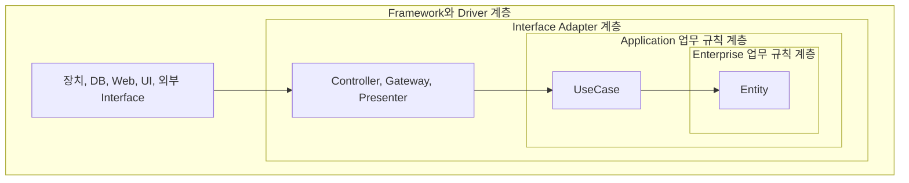
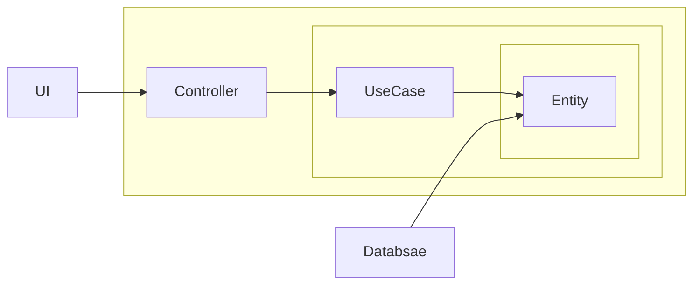

- Hexagona Architecture, DCI(Data, Context, Interaction), BCE(Boundary-Control-Entity)와 같은 system architecture에 관련된 여러 생각들은 모두 **계층 분리를 통한 관심사의 분리**를 목표로 하며, 비슷한 특징을 가지고 있습니다.

| 계층 분리의 장점 | 설명 |
| --- | --- |
| Framework 독립성 | framework를 도구로 사용하며, framework가 지닌 제약 사항으로 system을 강제하지 않습니다. |
| Test 용이성 | 업무 규칙은 UI, DB, Web server 및 다른 외부 요소 없이도 test할 수 있습니다. |
| UI 독립성 | system의 나머지를 변경하지 않고도 UI를 쉽게 변경할 수 있습니다. |
| Database 독립성 | Oracle이나 MS-SQL server 등을 다른 DB로 교체할 수 있고, 업무 규칙은 DB에 결합되지 않습니다. |
| 외부 Agency에 대한 독립성 | 업무 규칙은 외부의 interface에 대해 전혀 알지 못합니다. |

## 계층 경계를 횡단하는 Data

- 경계를 가로질러 data를 전달할 때, **data는 항상 내부의 계층에서 사용하기에 가장 편리한 형태**여야 합니다.
    - 경계(계층)를 횡단하는 data는 간단한 data 구조로 이루어지며, 구조체나 DTO 등 원하는 형태를 선택할 수 있습니다.
    - 중요한 점은 격리되어 있는 간단한 data 구조가 경계를 가로질러 전달된다는 사실입니다.
    - data 구조가 의존성을 가져서 의존성 규칙을 어기게 해선 안 됩니다.

## 의존성 규칙

- source code 의존성은 항상 내부 계층을 향하며, 내부로 이동할수록 추상화와 정책의 수준이 높아집니다.
    - 가장 외부에 있는 계층은 저수준의 세부 사항이며, 내부로 이동할수록 점점 더 추상화되고 더 높은 수준의 정책들을 캡슐화(encapsulation)합니다.
    - 가장 내부 계층은 가장 범용적이며, 높은 수준의 정책을 가지고 있습니다.

- 외부 계층에 위치한 어떤 것도 내부 계층에 영향을 주지 않아야 합니다.
    - 내부 계층에 속한 요소는 외부 계층에 속한 어떤 것(e.g., 함수, class, 변수 등의 모든 software entity)도 알지 못합니다.

## Architecture 계층 Diagram

- 상황에 따라서 더 많은 계층이 필요할 수도 있으며, 아래의 diagram은 예시입니다.

### Enterprise 업무 규칙 계층 : Entity

- Entity는 전사적인 핵심 업무 규칙을 캡슐화(encapsulation)하며, method를 갖는 객체일 수도, data와 함수의 집합일 수도 있습니다.
    - 다양한 application에서 재사용만 가능하다면 형태는 중요하지 않습니다.

- 특정 application에 어떠한 변경이 필요하더라도 Entity에는 영향을 주면 안 됩니다.
    - 외부 계층의 무언가가 변경되더라도, Entity는 변경되어선 안 됩니다.
    - e.g., Entity는 핵심 업무 규칙(business logic)을 다루므로, UI 단의 paging 처리 등이 필요해도 변경이 일어나서는 안 됩니다.

### Application 업무 규칙 계층 : UseCase

- UseCase는 application에 특화된 업무 규칙을 포함하며, system의 모든 UseCase를 캡슐화(encapsulation)하고 구현합니다.

- UseCase는 Entity로 들어오고 나가는 data 흐름을 조정합니다.
    - 또한 Entity가 자신의 핵심 업무 규칙을 사용해서 UseCase의 목적을 달성하도록 이끕니다.

- UseCase의 변경이 Entity에 영향을 줘선 안 되며, 외부 요소의 변경이 이 계층에 영향을 주는 것도 안 됩니다.
    - 하지만 운영 관점에서는 application이 변경된다면 UseCase가 영향을 받을 수 있기 때문에, UseCase 세부 사항이 변하면 일부 code는 영향을 받을 수 있습니다.

### Interface Adapter 계층 : Controller, Gateway, Presenter

- presenter나 controller 등과 같은 adapter들로 구성되며, controller에서 UseCase로 전달된 요청은 다시 controller로 되돌아 갑니다.

- adapter는 UseCase와 Entity에 맞는 data에서 DB나 Web 등과 같은 외부 요소에 맞는 data로 변환합니다.
    - 반대로, data를 외부 service에 맞는 형식에서 UseCase나 Entity에서 사용되는 내부적인 형식으로 변환하는 또 다른 adapter도 필요합니다.

- 특정 기술에 종속되는 역할(객체 변환)은 adapter가 맡게 하여, UseCase까지 세부 기술 의존성이 도달하지 않도록 합니다.
    - 만약 UseCase 계층에서 변환을 한다면 UseCase가 세부 기술에 의존하게 됩니다.

### Framework와 Driver : 장치, DB, Web, UI, 외부 Interface

- 가장 바깥쪽 계층은 database나 Web framework 같은 것들로 구성됩니다.
- 이 계층에서는 안쪽 원과 통신하기 위한 접합 code 외에는 특별히 더 작성할 것이 없습니다.
- 모든 세부 사항이 위치하는 곳으로, Web과 database도 세부 사항이므로 이를 외부에 위치시켜 피해를 최소화합니다.

---

## (번외) Component 기반의 분리

- 계층 분리가 아닌 component 기반으로 분리할 수도 있습니다.

---

## Reference

- Clean Architecture (도서) - Robert C. Martin
- <https://mangkyu.tistory.com/276>
- <https://www.youtube.com/watch?v=-VmhytwBZVs&ab_channel=SpringI%2FO>
