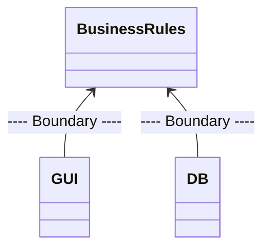
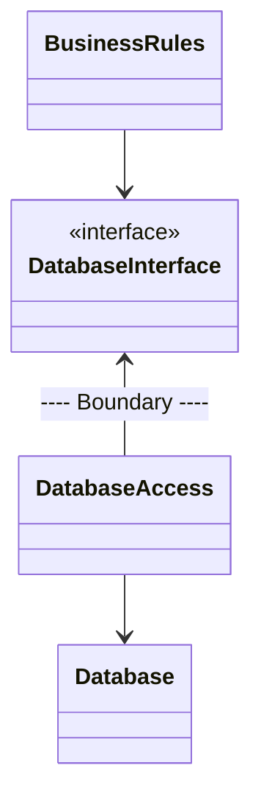
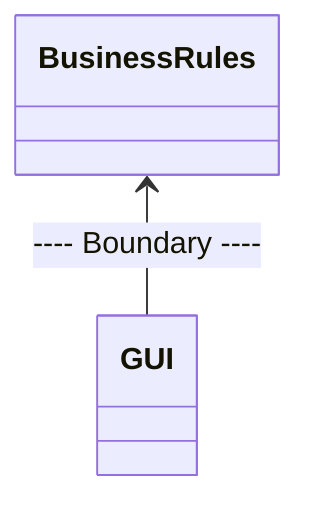

- 경계(boundary)는 **software 요소를 서로 분리**하고, 경계 한편에 있는 요소가 **반대편에 있는 요소를 알지 못하도록** 막습니다.
    - 경계는 변경이 전파되는 것을 막는 방화벽을 구축하고 관리하는 수단입니다.

- 경계 중 일부는 project 초기에, 심지어 code가 작성되기도 전에 정의되며, 어떤 경계는 매우 나중에 정의되기도 합니다.
    - 초기에 정의되는 경계는 가능한 오랫동안 결정을 연기시켜, 이들 결정이 핵심적인 업무 규칙(business logic)을 오염시키지 못하게 하려는 목적입니다.

- 너무 일찍 내려진 결정에 대한 결합(coupling)은 인적 자원의 효율을 떨어뜨립니다.
    - 좋은 architecture는 system의 업무 요구 사항(UseCase)과 관련 없는 결정은 가능한 한 최후에 내릴 수 있게 해줍니다.
    - 업무 요구 사항(Usecase)과 관련 없는 것들로는 framework, database, web server, utility library, 의존성 주입 등이 있습니다.

- 경계는 **관련이 있는 것과 없는 것 사이**에 정의합니다.
    - 예를 들어, GUI와 업무 규칙 사이에 긋고, database와 업무 규칙 사이에 긋습니다.

- 경계 선을 정의하려면 먼저 system을 component 단위로 분할해야 합니다.
    - plugin으로 분할된 component(저수준의 세부 사항)의 의존성의 방향은 핵심 업무 규칙 component(고수준의 추상화)를 향하도록 합니다.

### Plugin Architecture

- software 개발 기술의 역사는 **plugin을 손쉽게 생성**하여, **확장 가능하며 유지보수가 쉬운 system architecture를 확립**할 수 있게 만드는 방법에 대한 이야기입니다.
    - 그래서 plugin architecture가 탄생하였습니다.

- 경계 맞은 편의 component는 다른 시점에 다른 이유로 변경되므로 SRP(단일 책임 원칙)을 적용해야 합니다.
    - 경계의 한 쪽에 위치한 component는 경계 반대편의 component와는 다른 속도로 변경되므로, 둘 사이에는 반드시 경계가 필요합니다.
    - system을 plugin architecture로 배치함으로써 변경이 전파되지 않도록 방화벽을 생성할 수 있습니다.

#### 업무 규칙과 Database 사이의 경계

- 업무 규칙은 database와 관련된 나머지 세부 사항에 대해 어떤 것도 알아서는 안 됩니다.

#### 업무 규칙과 GUI 사이의 경계

- system의 행위를 입출력이 지닌 행위와 똑같이 생각해서는 안 됩니다.
    - system의 행위에서 입력과 출력은 중요하지 않습니다.
- `GUI`는 다른 종류의 interface로 얼마든지 교체할 수 있으며, `Business Rules`은 이에 대해 영향을 받지 않아야 합니다.

---

## Reference

- Clean Architecture (도서) - Robert C. Martin
- <https://mangkyu.tistory.com/276>
- <https://hwannny.tistory.com/37>
