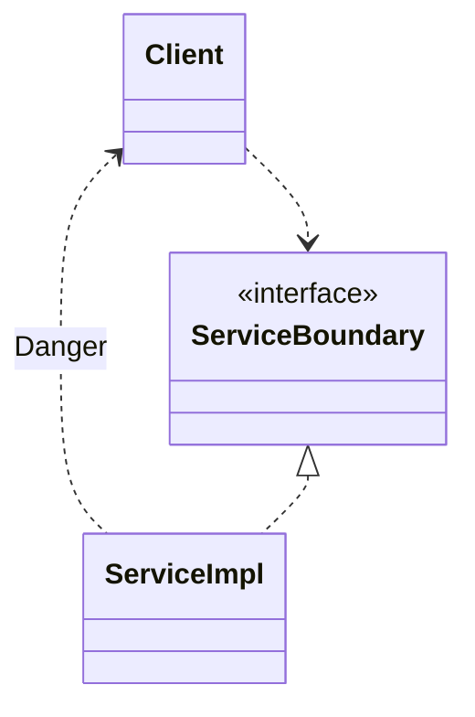
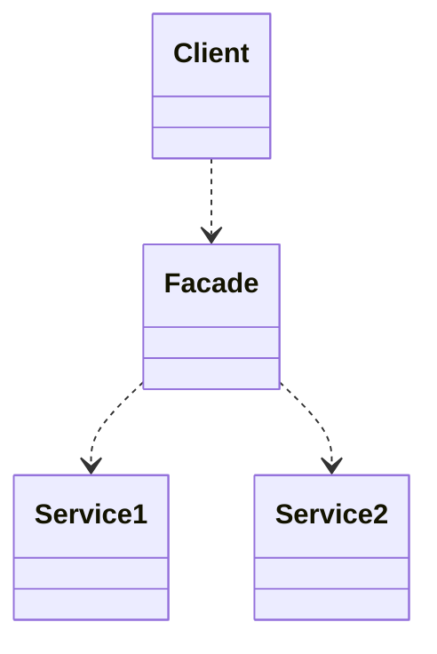

- architecture 경계를 완벽하게 만드는 데는 비용이 많이 들며, 유지하는 데에도 많은 노력이 필요합니다.
    - 쌍방향의 다형적 boundary interface, Input과 Output을 위한 데이터 구조를 만들어야 합니다.
    - 또한 두 영역을 독립적으로 compile하고 배포할 수 있는 component로 격리하는 데에 필요한 모든 의존성을 관리해야 합니다.

- 그럼에도 architecture의 선행적인 설계가 필요할지도 모르겠다는 생각이 든다면, 부분적 경계(partial boundary)를 구현해 볼 수 있습니다.
    - 무조건 원칙에 맞추어 양방향 interface를 만들어서 경계를 완벽하게 구분해야 하는 것은 아닙니다.
    - 상황에 맞추어 architecture 경계가 언제, 어디에 존재해야 할지, 그 경계를 완벽하게 혹은 부분적으로 구현할지를 결정해야 합니다.

 

---

## 부분적 경계를 구현하는 3가지 방법

- architecture 경계를 부분적으로 구현하는 간단한 3가지 방법이 있습니다.
- 부분적 경계를 구현할 수 있는 방법은 더 다양하며, 3가지는 순전히 예시입니다.

### 1. 단일 배포

- 단일 배포는 source code에서는 완벽한 경계를 구현하지만, 단일 component로 compile해서 배포하는 것입니다.
    - 독립적으로 compile 및 배포가 가능한 component로 만들고, 단일 component에 그대로 모아둡니다.

- 이렇게 하면 code는 간단해지지 않지만, component 간 의존성 관리와 version 관리를 하지 않아도 됩니다.
 

### 2. 일차원 경계

- 양방향 boundary interface가 아닌 한방향만 경계를 interface로 격리합니다.
    - Web application을 구축하는 데에 사용하는 Spring framework의 Controller, Service의 전형적인 구조와 닮아 있습니다.

- 일차원 경계는 추후 완벽한 경계를 구축해야 하는 상황에 대비를 하면서, 당장 경계도 구분할 수 있는 간단한 구조의 구현 방식입니다.
 
- 일차원 경계 구조는 `Client`로 부터 `ServiceImpl`을 분리합니다.
    - 다만, `Danger`라고 표시되어 있는 점선 화살표와 같은 의존성을 사용하지 않도록 유의해야 합니다.

### 3. Facade

- Facade 자체가 경계가 되는, 일차원 경계보다 더 간단한 전략입니다.
    - `Facade` class에 모든 service class를 method 형태로 정의하고, 호출이 발생하면 해당 service class로 전달합니다.
    - `Client`는 `Service1`, `Service2`에 직접 접근할 수 없고, `Facade` class를 이용해 `Service1`, `Service2`의 method를 호출합니다.
 
- 이런 의존성 구조에서 `Client`는 `Service1`, `Service2`에 대해 추이 종속성을 가지게 됩니다.
- 또한 개발자가 마음만 먹으면, 일차원 경계보다 더 위험한 의존성을 사용할 수도 있습니다.

---

## Reference

- Clean Architecture (도서) - Robert C. Martin
- <https://ocwokocw.tistory.com/44>
