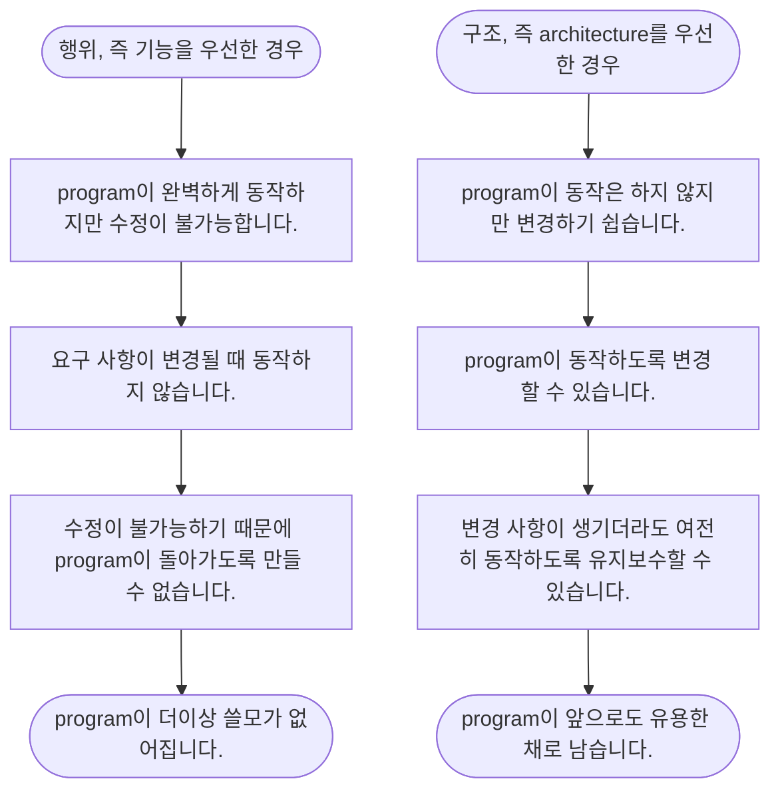

## Architecture

- software system의 architecture란 **system을 구축했던 사람들이 만들어낸 system의 형태**입니다.
    - architecture는 system을 component로 분할하는 방법, 분할된 component를 배치하는 방법, component의 의사소통하는 방식에 따라 정해집니다.
        - system의 architecture는 system 내부에 그어진 architecture 경계와 경계를 넘나드는 의존성에 의해 정의됩니다.
        - system의 구성 요소가 통신하고 실행되는 물리적인 mechanism에 의해 architecture가 정의되는 것은 아닙니다.

- code와 설계의 구조를 깔끔하게 만들려는 생각을 하지 않으면, 시간이 지날수록 비용이 높아지고, 개발자의 생산성은 0에 수렴하게 됩니다.
    - 엉망이 된 상황에 대처하기 위한 노력이 들어가기 때문입니다.
    - 빨리 가는 유일한 방법은 제대로 가는 것입니다.

- 설계 품질을 재는 척도는 고객의 요구를 만족시키는 데에 드는 비용을 재는 척도와 같습니다.
    - system의 수명이 다할 때까지 **비용을 낮게 유지할 수 있는 설계는 좋은 설계**입니다.
    - 새로운 기능을 출시할 때마다 **비용이 증가하는 설계는 나쁜 설계**입니다.


### Architecture의 목표

- software architecture의 목표는 필요한 system을 만들고 유지보수하는 데에 투입되는 인력을 최소화하는 것입니다.
    - 따라서 software system을 쉽게 개발하고, 쉽게 배포하고, 쉽게 운영하고, 쉽게 유지보수할 수 있도록 architecture를 만들어야 합니다.


### 좋은 Architecture

- UseCase가 중심이 되어, framework나 도구 등에 구애받지 않고 UseCase를 지원하는 구조를 가집니다.
- framework, database, web server, 여타 개발 환경 문제나 도구에 대한 결정을 미룰 수 있습니다.
- project의 훨씬 후반까지 결정을 하지 않아도 되도록 도와줄 뿐만 아니라, 결정을 쉽게 번복할 수 있습니다.
- UseCase에 중점을 두며, 지엽적인 관심사에 대한 결합은 분리시킵니다.


---


## 개발자가 지켜야 할 가치 : 행위와 구조

```txt
Software 개발자는 '행위'와 '구조'의 두 가치를 모두 높게 유지해야 합니다.
```

- **행위는 기능**(software의 동작)을, **구조는 architecture**(software system 변경의 용이성)을 의미합니다.


### 첫 번째 가치 : 행위 (Behavior)

- 개발자가 sofrware를 만드는 이유는 기계가 이해 관계자를 위해 수익을 창출하거나 비용을 절약하도록 만들기 위함입니다.
- 따라서 개발자는 요구 사항에 따라 개발하고, 요구 사항을 위반했을 때는 debugging합니다.
- 그러나 기능을 구현하는 것만이 개발자가 해야할 일의 전부는 아닙니다.


### 두 번째 가치 : 구조 (Structure)

```txt
Software는 Soft(부드러운)와 Ware(제품)의 합성어입니다.
```

- software는 변경하기 쉬워야 합니다.
    - software는 기계의 행위를 쉽게 변경할 수 있도록 하기 위해 만들어진 것입니다.
    - 이해 관계자가 기능에 대한 생각을 바꾸면, 변경 사항을 간단하고 쉽게 적용할 수 있어야 합니다.

- 변경 사항을 적용하는 데에 드는 어려움은 변경되는 범위(scope)에 비례해야 하며, 변경 사항의 형태(shape)와는 관련이 없어야 합니다.
    - 나쁜 architecture는 변경 사항의 범위가 같더라도, 시간이 지날수록 변경 비용이 더 많이 들게 됩니다.
        - code의 복잡도가 지속적으로 증가한 상태이기 때문입니다.
    - architecture가 특정 형태를 다른 형태보다 선호하면 선호할수록, 새로운 기능(요청 사항의 형태)을 그 구조(system의 형태)에 맞추는 것이 힘들어 집니다.
    - architecture는 형태에 독립적이어야 합니다.


### 개발자가 더 중요하게 여겨야 하는 가치 : 구조

- 업무 관리자는 기능(행위)을 우선할 수 있지만, **개발자는 구조를 더 우선해야 합니다**.
    - '기능의 동작'보다 '변경이 쉬운 구조'가 더 중요합니다.
    - '변경에 드는 비용'이 '변경으로 창출되는 수익'을 초과하는 경우, 현실적으로 수정이 불가능한 system이 됩니다.
    - 기능에만 집중하다 보면, 구조의 가치가 떨어져 현실적으로 변경이 불가능해지는 상황에 빠질 수 있습니다.

 


- 기능의 긴급성이 아닌 architecture의 중요성을 설득하는 일은 개발자가 책임져야 합니다.
    - 업무 관리자는 보통 architecture의 중요성을 평가할만한 능력을 가지지 못하기 때문입니다.


#### 개발 우선 순위

- 일반적으로, **긴급한 것은 기능**(동작)이고, **중요한 것은 architecture**(구조)입니다.

| 우선 순위 | 일의 종류 |
| --- | --- |
| 1 | 긴급하고 중요한 일 |
| 2 | 긴급하지는 않지만 중요한 일 |
| 3 | 긴급하지만 중요하지 않은 일 |
| 4 | 긴급하지도 중요하지도 않은 일 |

- 업무 관리자와 개발자가 흔히 하는 실수는 '긴급하지만 중요하지 않은 일'을 첫 번째로 격상시키는 것입니다.
- 기능의 긴급성이 아닌 architecture의 중요성을 설득하는 일은 software 개발팀이 책임져야 합니다.


##### Eisenhower Matrix

|  | 긴급한 일 | 긴급하지 않은 일 |
| --- | --- | --- |
| **중요한 일** | 1 | 2 |
| **중요하지 않은 일** | 3 | 4 |


---


## Architecture를 위한 투쟁

- 개발팀, 관리팀, 마케팅팀, 영업팀, 운영팀 등은 회사에서 가장 중요하다고 스스로 믿는 가치를 위해 투쟁합니다.
- 효율적인 개발팀은 뻔뻔함을 무릅쓰고 다른 이해 관계자들과 동등하게 논쟁하며 이러한 투쟁에서 정면으로 맞서 싸웁니다.
- 개발자는 software를 안전하게 보호해야 할 책임이 있는데, 이는 우리의 역할과 책무 중 하나이며 고용된 이유 중 하나이기도 합니다.
- architecture가 후순위가 되면 system 개발 비용은 더 많이 들고, 일부 또는 전체 system에 변경을 가하는 일이 현실적으로 불가능해집니다.
- 이러한 상황이 발생하도록 용납했다면, 이는 결국 개발팀이 스스로 옳다고 믿는 가치를 위해 충분히 투쟁하지 않았다는 뜻일 것입니다.


---


## Reference

- Clean Architecture (도서) - Robert C. Martin
