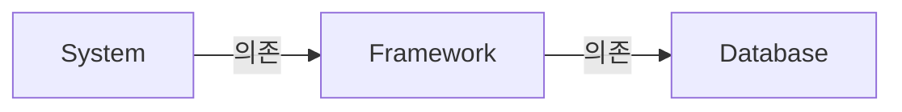

## 객체 지향적으로 Architecture를 설계하기

- 좋은 architecture를 만드는 일은 객체 지향(Object-Oriented, OO) 설계 원칙을 이해하고 응용하는 데에서 출발합니다.

### 객체 지향(OO, Object-Oriented)

- 객체 지향(OO)이란 다형성을 이용하여 전체 system의 모든 source code 의존성에 대한 절대적인 제어 권한을 획득할 수 있는 능력입니다.

- 객체 지향을 사용하면 다형성을 통해 언제 어디서든 Plugin Architect를 구성할 수 있습니다.
    - 고수준의 정책을 포함하는 module은 저수준의 세부사항을 포함하는 module에 대해 독립성을 보장할 수 있습니다.
    - 저수준의 세부사항은 중요도가 낮은 plugin module로 만들어, 고수준의 정책을 포함하는 module과는 독립적으로 개발하고 배포할 수 있습니다.

- OO는 결국 **다형성을 통해 의존성 방향을 제어**할 수 있도록 하는 것이며, 의존성의 방향을 제어하는 것은 architecture 설계에 매우 중요합니다.

### 의존성 역전과 객체 지향

- 의존성 역전은 **다형성을 안전하고 편리하게 적용할 수 있는 mechanism**이 등장한 이후로 많이 사용하기 시작했습니다.
    - **객체 지향**(OO)은 다형성을 안전하고 편리하게 제공합니다.

#### 다형성 Mechanism 등장 전

- 원래(예를 들어, C언어)는 source code의 의존성 방향은 반드시 제어 흐름(flow of control)을 따르게 됩니다.
    1. main 함수가 고수준 함수를 호출합니다.
    2. 고수준 함수가 중간 수준 함수를 호출합니다.
    3. 중간 수준 함수가 저수준 함수를 호출합니다.

- 제어 흐름은 system의 행위에 따라 결정되며, source code 의존성은 제어 흐름에 따라 결정됩니다.
- 이러한 제약 조건으로 인해 software architect에게는 선택지가 별로 없었습니다.

#### 다형성 Mechanism 등장 후

- 객체 지향 언어는 다형성을 안전하고 편리하게 제공하므로, source code 의존성을 어디에서든 역전시킬 수 있습니다.
    - source code 사이에서 interface를 사용하여 제어 흐름을 반대 방향으로 바꿀 수 있습니다.
    - source code의 제어 흐름과 의존성 방향에 대해 제한받지 않고, 원하는 대로 설정할 수 있습니다.

- 객체 지향의 등장으로 software architect는 system의 source code 의존성 전부에 대해 방향을 결정할 수 있는 절대적인 권한을 갖게 되었습니다.
    - 호출하는 module이든, 호출당하는 module이든, 원하는 방향으로 source code 의존성을 설정할 수 있습니다.

- 의존성을 역전시킴으로써 **배포 독립성**과 **개발 독립성**을 얻습니다.
    - business logic, UI, DB는 배포 가능한 단위로 compile이 가능하며, business logic은 UI와 DB component에 의존하지 않게 되었습니다.
        - component를 개별적이고 독립적으로 배포할 수 있습니다.
    - 배포 독립성 : 특정 component트의 source code가 변경되면 해당 code가 포함된 component만 다시 배포하면 됩니다.
    - 개발 독립성 : system의 module을 독립적으로 배포할 수 있게 되면, 서로 다른 team에서 각 module을 독립적으로 개발할 수 있습니다.

---

## Architecture 관점에서 보는 SOLID 원칙

- 좋은 software system은 clean code로부터 시작합니다.
    - 좋은 벽돌(code)을 사용하지 않으면 건물의 구조(architecture)가 좋고 나쁜 것은 큰 의미가 없는 것과 같습니다.
    - 그리고 SOLID 원칙은 clean code를 짜는 데에 도움이 됩니다.

- SOLID 원칙은 객체 지향 software에만 적용되는 것은 아닙니다.
    - SOLID 원칙은 함수와 data 구조를 class로 배치하는 방법과 class들을 서로 결합하는 방법을 설명합니다.
    - class는 단순히 함수와 data의 집합을 의미할 뿐이기 때문에, SOLID 원칙은 객체 지향 software가 아니더라도 적용될 수 있습니다.

- SOLID 원칙의 목적은 **중간 수준의 software 구조**를 **변경에 유연**하고, **이해하기 쉽게** 하고, 많은 software system에서 사용되는 **component의 기반이 되도록** 하는 데에 있습니다.
    - '중간 수준'이란 code보다 상위 수준인 module과 component의 내부를 의미합니다.
    - 'module'은 source code(하나의 class) 수준을, 'component'는 배포 가능한 가장 작은 단위를 의미합니다.

### 단일 책임 원칙 (SRP, Single Responsibility Principle)

- SRP는 **단일 module의 변경 이유는 오직 하나**여야만 한다는 원칙입니다.
- 단일 책임 원칙은 method와 class 수준의 원칙입니다.
- 하지만 상위 module과 component 수준의 공통 폐쇄 원칙(CCP, Common Closure Principle)에서도 단일 책임 원칙이 적용됩니다.
- architecture 수준에서는 architecture 경계의 생성을 책임지는 변경의 축이 됩니다.

### 개방-폐쇄 원칙 (OCP, Open-Closed Pinciple)

- OCP는 **software 개체(artifact)는 확장에는 열려 있어야 하고, 변경에는 닫혀 있어야 한다**는 원칙입니다.
    - OCP를 위해 서로 다른 목적으로 변경되는 요소를 적절하게 분리하고(SRP), 이 요소들 사이의 의존성을 체계화(DIP)해야 합니다.
    - 행위를 확장할 수 있어야 하지만 개체를 변경해서는 안 되며, 이것이 architecture를 공부하는 근본적인 이유입니다.

- OCP의 목표는 **system을 확장하기 쉬운 동시에, 변경으로 인해 system이 너무 많은 영향을 받지 않도록 하는 것**입니다.
    - 이를 위해 system을 component 단위로 분리하고, 저수준 component에서 발생한 변경으로부터 고수준 component를 보호할 수 있는 형태의 의존성 계층 구조가 만들어지도록 해야 합니다.

- OCP는 system의 architecture를 떠받치는 원동력 중 하나입니다.
    - software architecture가 훌륭하다면 변경되는 code의 양이 최소화될 것입니다.
    - 이상적인 code 변경량은 0입니다.

### Liskov 치환 원칙 (LSP, Liskov Subsitution Principle)

- LSP는 부모 객체와 자식 객체가 있을 때, **부모 객체를 호출하는 동작에서 자식 객체가 부모 객체를 완전히 대체할 수 있어야 한다**는 원칙입니다.
    - 올바른 상속을 위해, 자식 객체의 확장이 부모 객체의 방향을 온전히 따르도록 권고하는 원칙입니다.

- LSP는 architecture 수준까지 확장할 수 있고, 반드시 확장해야만 합니다.
    - 치환 가능성을 조금이라도 위배하면 system architecture가 오염되어 상당량의 별도 mechanism을 추가해야할 수 있기 때문입니다.

### Interface 분리 원칙 (ISP, Interface Segregation Principle)

- ISP는 **큰 덩어리의 interface들을 구체적이고 작은 단위들로 분리**시킴으로써, **client들이 꼭 필요한 method들만 이용**할 수 있도록 합니다.

- software 설계자는 사용하지 않은 것에 의존하지 않아야 합니다.
    - 일반적으로 필요 이상으로 많은 것을 포함하는 module에 의존하는 것은 해롭습니다.
    - source code의 의존성이 높다면, 변경 사항이 생길 때 불필요한 compile과 배포를 해야만 합니다.
    - 더 고수준인 architecture도 마찬가지입니다.

#### Architecture 입장에서 ISP를 어기는 경우

- System을 구축중인 architect가 Framework를 도입하길 원하고, 개발자는 Database를 반드시 사용해야 하는 상황입니다.
    - 따라서 System는 Framework에 의존하며, Framework는 다시 Database에 의존하는 상황입니다.

- Database에 기능이 추가됩니다.
    - Framework와 System에는 불필요한 기능입니다.
    - 이 기능은 Database에 포함되고, Framework와 System은 직간접적으로 Database에 의존하고 있습니다.
    - 그래서 **Database 내부가 변경되면 Framework를 재배포**해야 할 수 있고, **Framework를 재배포하기 때문에 System까지 재배포**해야 할 가능성이 있습니다.

- 또한 Database 내부의 기능 중 Framework와 System에서 불필요한 기능에 문제가 발생해도 Framework와 System이 영향을 받게 됩니다.

### 의존 관계 역전 원칙 (DIP, Dependency Inversion Principle)

- DIP는 **고수준 정책을 구현하는 code는 저수준 세부사항을 구현하는 code에 의존해서는 안 된다**는 원칙입니다.

- architecture의 입장에서 **유연성이 극대화된 system**이란 **의존성이 추상(abstraction)에 의존하며 구체(concretion)에는 의존하지 않는 system**을 의미합니다.
    - DIP는 architecture diagram에서 가장 눈에 잘 띄는 원칙이기도 합니다.
    - 의존성은 더 추상적인 entity가 있는 쪽으로만 향해야하며, 이 규칙을 의존성 규칙(Dependency Rule)이라 부릅니다.

- Java같은 정적 type 언어에서 `use`, `import`, `include` 구문은 오직 interface나 추상 class 같은 추상적인 선언만을 참조해야 합니다.
    - 구체적인 요소에 의존할 수는 있지만, 변동성이 큰(volatile) 구체적인 요소에는 절대로 의존해서는 안 됩니다.

- 안정된 software architecture란 **변동성이 큰(volatile) 구현체에 의존하는 일은 지양**하고, **안정된 추상 interface에 의존하는 것을 선호**하는 architecture입니다.
    - 뛰어난 software architect라면 interface의 변동성을 낮추고, interface를 변경하지 않고도 구현체에 기능을 추가할 수 있도록 architecture를 설계합니다.
        - interface에 변경이 생기면 구현체들도 수정해야하지만, 구현체들에는 변경이 생기더라도 interface는 대부분 변경될 필요가 없습니다.
    - interface는 구현체보다 변동성이 낮습니다.

#### DIP 위반이 허용되는 경우

- 원래 component, module, 객체는 구체가 아닌 추상에 의존해야 하지만, software system이라면 구체적인 많은 장치에 반드시 의존하게 됩니다.
- 이는 DIP를 위반하는 것이지만, DIP를 모든 곳에서 지키는 것은 비현실적이며, 경우에 따라서 위반을 허용하기도 합니다.

- 예를 들어, Java의 `String` class는 구체 class이며, 이를 추상화시키려는 의도는 현실성이 없습니다.
    - String 구체 class에 대한 source code 의존성은 벗어날 수 없고, 벗어나서도 안 됩니다.
    - String class는 매우 안정적이며, 변경되는 일은 거의 없습니다.
        - 변경이 있더라도 엄격하게 통제됩니다.
    - programmer와 architect는 String class에 변경이 자주 발생하리라고 염려할 필요가 없습니다.
    - 따라서 Java의 `String` class는 **개발자들의 암묵적 합의에 의해서 DIP를 위반이 허용**됩니다.

- `String` class 같이, DIP를 논할 때 운영 체제나 platform과 같이 **안정성이 보장된 환경**에 대해서는 무시합니다.
- DIP를 지켜서 의존하지 않도록 피해야 하는 것은 변동성이 큰 구체적인 요소(개발 중이라서 자주 변경될 수 밖에 없는 module들)입니다.

---

## Reference

- Clean Architecture (도서) - Robert C. Martin
- <https://mangkyu.tistory.com/272>
- <https://mangkyu.tistory.com/274>
