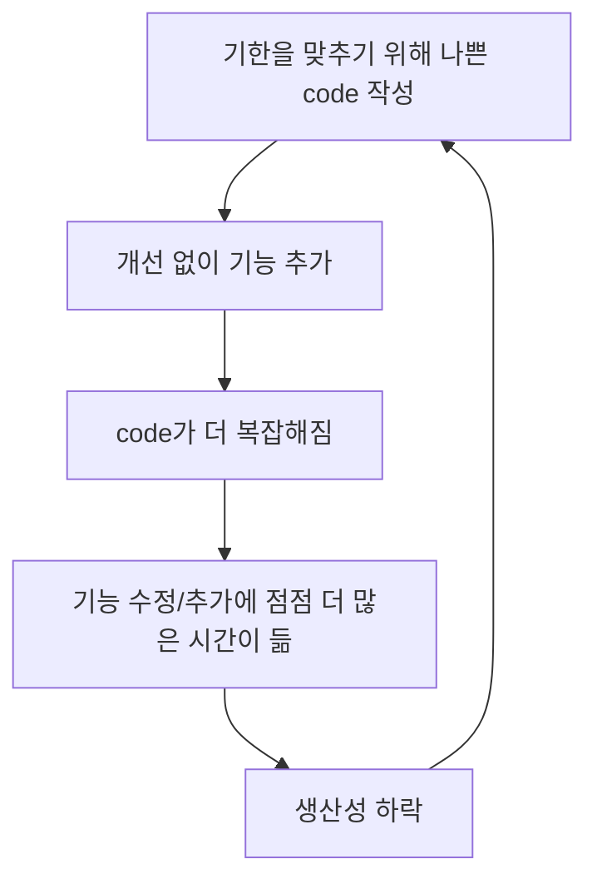

## Code를 작성하는 의미

- 기계가 실행할 수 있을 정도의 정밀한 표현을 하기 위해서는 code가 반드시 필요합니다.
    - code는 요구 사항을 표현하는 언어입니다.
    - programming은 기계가 실행할 정도로 상세하게 요구 사항을 명시하는 작업입니다.


---


## 나쁜 Code

- 나쁜 code가 지속되면 시간이 지날수록 상황이 더 악화됩니다.
- 기한을 맞추기 위해서 나쁜 code를 양산하지만, 이는 오히려 기한을 맞추지 못하도록 하는 원인이 됩니다.
    - 나쁜 code는 결과적으로 업무 속도를 늦춥니다.
    - 엉망진창인 상태로 인해 속도가 늦어지고, 기한을 놓칩니다.
    - 기한을 맞추는 유일한 방법은 언제나 code를 최대한 깨끗하게 유지하는 습관입니다.




---


## 깨끗한 Code란?

1. 보기에 즐거운 code입니다.

2. 효율적인 code입니다.

3. 세세한 사항까지 꼼꼼하게 처리하는 code입니다.
    - 오류 처리는 철저해야 합니다.
    - memory 누수, 경쟁 상태(race condition), 일관성 없는 명명법 등에 대해 꼼꼼히 처리합니다.

4. 한 가지에 집중하는 code입니다.
    - method는 한 가지 기능만 수행해야 합니다.

5. 가독성이 좋은 code입니다.
    - 깨끗한 code는 잘 쓴 문장처럼 읽힙니다.
    - 작성자가 아닌 사람이 읽기 쉽고 고치기 쉽습니다.
    - 의미있는 이름이 붙습니다.

6. 주의 깊게 작성한 code입니다.
    - 시간을 들여 깔끔하고 단정하게 정리합니다.

7. 중복을 피하는 code입니다.

8. 작게 추상화된 code입니다.

9. 짐작했던 기능을 그대로 수행하는 code입니다.


---


## Boy Scout 규칙

```txt
캠프장은 처음 왔을 때보다 더 깨끗하게 해놓고 떠나라.
```

- code는 시간이 지나도 언제나 깨끗하게 유지해야 합니다.
    - code의 퇴보를 막는 적극적인 노력이 필요합니다.

- code는 지속적으로 개선해야 합니다.
    - 한꺼번에 많은 시간과 노력을 투자해 code를 정리하기 보다, 항상 관리하는 것이 중요합니다.
    - 지속적인 개선한다면, code는 시간이 지날수록 좋아집니다.


---


## Reference

- Clean Code (도서) - Robert C. Martin
