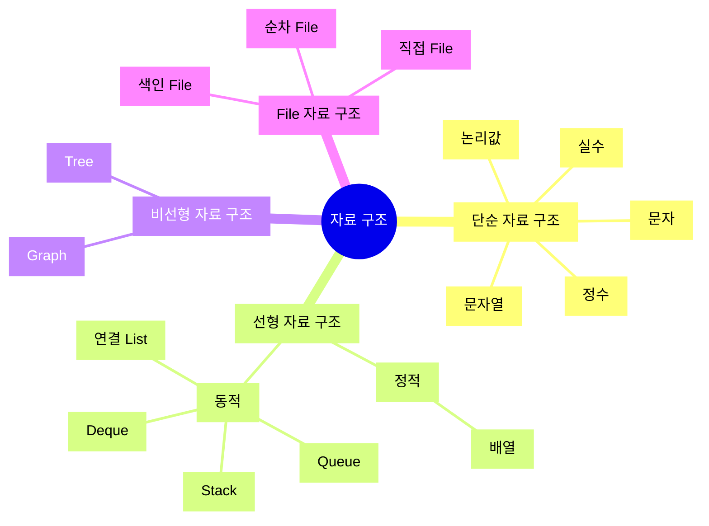

## 자료 구조 : "자료"를 효율적으로 관리하기 위한 "구조"

- **자료 구조(Data Structure)**는 computer 과학에서 **data를 효율적으로 저장하고 관리하기 위한 체계적 방식**입니다.
    - **자료(Data)**는 computer 과학에서 처리되는 **정보의 기본 단위**이며, 다양한 형태를 가질 수 있습니다.
        - 예를 들어, 정수(Integer), 실수(Floating Point Number), 문자(Character), 문자열(String), 논리값(Boolean).
        - 자료는 programming에서 변수를 통해 저장되고, 변수는 memory에 특정 공간을 차지하게 됩니다.
        - 자료는 program의 주요 입력 및 출력이 되며, 연산의 대상이 됩니다.
    - **구조(Structure)**는 **자료를 어떻게 조직하고 배치할 것인가**에 관한 것입니다.
        - 구조는 **자료를 효율적으로 저장, 관리, 접근, 수정하는 방법**을 정의합니다.
        - 구조는 자료의 논리적 관계와 이를 표현하는 방식을 의미하며, 따라서 "자료 구조"는 data를 효율적으로 다루기 위한 틀(frame)을 제공합니다.

- 자료 구조는 data를 조직화하고, 저장하고, 조작할 수 있는 다양한 방법을 제공하여 algorithm이 data를 효율적으로 처리할 수 있도록 합니다.
    1. **Data의 조직화** : data를 논리적이고 체계적으로 배치하여 접근과 수정이 용이하도록 합니다.
    2. **Data의 효율적 처리** : data의 검색, 삽입, 삭제 등의 작업을 효율적으로 수행할 수 있게 합니다.


### 자료 구조의 필요성

- **효율적인 Data 관리** : 대량의 data를 효율적으로 저장하고 관리할 수 있습니다.
- **빠른 Data 접근** : 특정 data를 신속하게 검색하고 접근할 수 있습니다.
- **Memory 효율성** : memory를 효과적으로 사용할 수 있습니다.
- **Algorithm의 성능 향상** : 자료 구조는 algorithm의 성능을 극대화할 수 있도록 도와줍니다.


---


## 자료 구조의 분류

- 자료 구조는 고유한 장점과 단점을 가지고 있으며, 사용 목적과 요구 사항에 따라 적절한 구조를 선택해야 합니다.




### 1. 단순 자료 구조 (Primitive Data Structure)

- 단순 자료 구조는 computer가 기본적으로 제공하는 자료형으로, **가장 기본적인 형태의 data** 저장 및 처리를 제공합니다.

| 자료 구조 | 설명 |
| --- | --- |
| 논리값 (Boolean) | True 또는 False 값을 가집니다. 조건문에서 주로 사용됩니다. |
| 정수 (Integer) | 음수, 0, 양수의 형태로 정수를 저장합니다. 예를 들어, -3, 0, 42. |
| 실수 (Floating Point Number) | 소수점을 포함한 실수를 저장합니다. 예를 들어, 3.14, -0.001, 2.718. |
| 문자 (Character) | 단일 문자를 저장합니다. 예를 들어, 'a', 'B', '3'. |
| 문자열 (String) | 여러 문자를 연속적으로 저장한 것입니다. 예를 들어, "hello", "world", "123abc". |


### 2. 선형 자료 구조 (Linear Data Structure)

- 선형 구조는 data가 **일렬로 저장**되는 형태의 자료 구조입니다.
- 각 요소는 이전 요소와 다음 요소가 존재하며, 순차적으로 접근할 수 있습니다.

| 자료 구조 | 설명 |
| --- | --- |
| 배열 (Array) | 동일한 타입의 data를 연속된 memory 공간에 저장합니다. index를 사용하여 요소에 빠르게 접근할 수 있습니다. |
| 연결 List (Linked List) | 각 node가 data와 다음 node에 대한 pointer를 포함합니다. 크기가 가변적이며, 삽입과 삭제가 효율적입니다. 단순 연결 List, 이중 연결 List, 원형 연결 List 등이 있습니다. |
| Stack | 후입선출(LIFO, Last In First Out) 구조로, 삽입과 삭제가 한쪽 끝에서만 일어납니다. 함수 호출 및 되돌리기 기능에 주로 사용됩니다. |
| Queue | 선입선출(FIFO, First In First Out) 구조로, 삽입은 한쪽 끝에서, 삭제는 다른 쪽 끝에서 일어납니다. 작업(task) scheduling에 주로 사용됩니다. |
| Deque | 양쪽 끝에서 삽입과 삭제가 모두 가능한 자료 구조입니다. |


### 3. 비선형 자료 구조 (Non-Linear Data Structure)

- 비선형 구조는 data가 **계층적 또는 network 형태로 저장**되는 자료 구조입니다.
- 각 요소는 여러 다른 요소와 연결될 수 있습니다.

| 자료 구조 | 설명 |
| --- | --- |
| Tree | 계층적 구조로, root node와 자식 node들로 구성됩니다. |
| Graph | 정점(node)과 간선(edge)으로 구성된 network 구조입니다. |


### 4. File 자료 구조 (File Data Structure)

- file 구조는 data를 **file system에 저장하고 관리**하는 방식입니다.
- 다양한 자료 구조의 data를 file에 저장하여 **영구적으로 보관**할 수 있습니다.

| 자료 구조 | 설명 |
| --- | --- |
| 순차 File (Sequential File) | data가 순차적으로 저장되는 file 구조입니다. 간단하고 접근이 빠르지만, 삽입과 삭제가 비효율적입니다. |
| 색인 File (Indexed File) | data 접근 속도를 높이기 위해 index를 사용하는 file 구조입니다. 특정 data에 빠르게 접근할 수 있습니다. |
| 직접 File (Direct File) | data의 물리적 위치를 계산하여 직접 접근하는 file 구조입니다. hash 함수를 사용하여 data를 저장하고 검색합니다. |


---


## 자료 구조 예시 : 배열과 연결 List 비교

- 대부분의 자료 구조가 **Array**와 **연결 List** 기반으로 구현됩니다.
    - 모든 자료 구조가 이 두 가지를 기반으로 하는 것은 아니며, 용도에 따라 다양한 자료 구조가 사용됩니다.


### 배열 (Array)

- 배열은 동일한 data 타입의 요소들을 연속된 memory 공간에 저장하는 자료 구조입니다.
- index를 사용하여 요소에 접근할 수 있습니다.

| 장점 | 단점 |
| --- | --- |
| index를 사용하여 빠른 접근이 가능합니다. | 크기가 고정되어 있으며, 삽입과 삭제가 비효율적입니다. |

```c
#include <stdio.h>

int main() {
    int arr[5] = {10, 20, 30, 40, 50};
    printf("The third element is %d\n", arr[2]);
    return 0;
}
```


### 연결 List (Linked List)

- 연결 List는 각 node가 data와 다음 node에 대한 pointer를 포함하는 동적 자료 구조입니다.
- 크기가 가변적이며, 삽입과 삭제가 용이합니다.

| 장점 | 단점 |
| --- | --- |
| 크기가 가변적이며, 삽입과 삭제가 효율적입니다. | index를 사용한 접근이 불가능하며, 검색이 비효율적입니다. |

```c
#include <stdio.h>
#include <stdlib.h>

struct Node {
    int data;
    struct Node* next;
};

struct Node* head = NULL;

void insert(int data) {
    struct Node* newNode = (struct Node*)malloc(sizeof(struct Node));
    newNode->data = data;
    newNode->next = head;
    head = newNode;
}

void printList() {
    struct Node* temp = head;
    while (temp != NULL) {
        printf("%d -> ", temp->data);
        temp = temp->next;
    }
    printf("NULL\n");
}

int main() {
    insert(10);
    insert(20);
    insert(30);
    printf("Linked List: ");
    printList();
    return 0;
}
```


---


## Reference

- <https://akcoding.com/classification-of-data-structures/>
- <https://velog.io/@filoscoder/%EC%9E%90%EB%A3%8C%EA%B5%AC%EC%A1%B0-%EC%A2%85%EB%A5%98%EC%99%80-%EB%B6%84%EB%A5%98>
