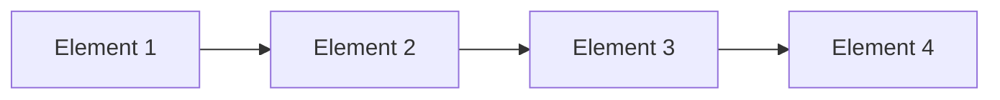

## 선형 자료 구조 : Data를 선형적으로 관리하기

- 선형 자료 구조는 data가 **일렬로 나열**된 형태의 자료 구조입니다.

- 선형 자료 구조에서는 각 data 요소가 **연속적으로 배치**되며, 각 요소는 그 이전 요소와 다음 요소에 대해 고유한 선형 순서를 가집니다.
    - 각 data 요소는 **이전 요소와 다음 요소와의 관계**를 가집니다.
    - data 요소들이 하나의 직선 형태로 배치되어 있기 때문에 **한 번에 한 방향으로만 탐색**이 가능합니다.

### 선형 자료 구조의 특징

1. **순차 접근** : 각 요소는 순차적으로 접근해야 하며, 중간 요소로 바로 접근할 수 없습니다.
2. **고정된 순서** : data 요소들이 특정 순서를 유지하며 배치됩니다.
3. **단순성** : 구현과 관리가 상대적으로 간단합니다.

### 선형 자료 구조의 종류

1. **Array** : **고정된 크기**의 **연속된 메모리 공간**에 data 요소를 저장하며, **index를 사용**하여 임의의 요소에 접근할 수 있습니다.
2. **연결(Linked) List** : 각 요소가 **다음 요소를 가리키는 pointer**를 포함하여 data를 저장하며, **동적 크기**를 가지며 요소 삽입 및 삭제가 용이합니다.
3. **Stack** : **후입선출(LIFO, Last In First Out)** 원칙을 따르며, 가장 최근에 추가된 요소가 가장 먼저 제거됩니다.
4. **Queue** : **선입선출(FIFO, First In First Out)** 원칙을 따르며, 가장 먼저 추가된 요소가 가장 먼저 제거됩니다.
5. **Deque (Double-ended Queue)** : **양쪽 끝**에서 삽입과 삭제가 모두 가능한 자료 구조로, **Stack과 Queue의 기능을 모두 포함**합니다.
