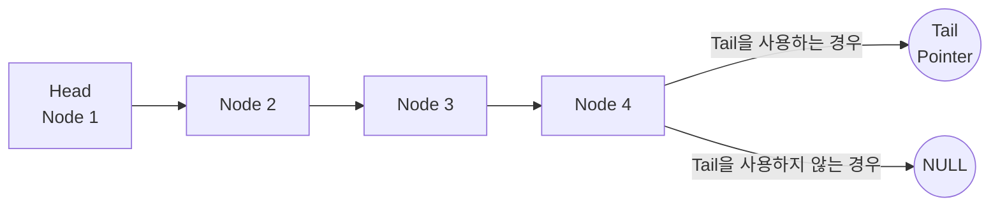
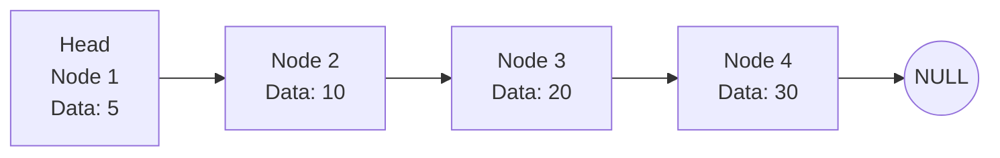
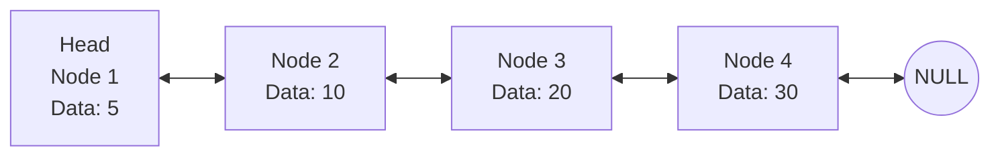
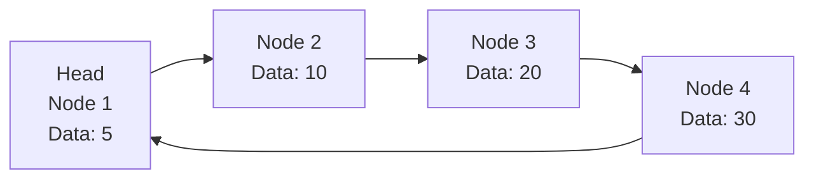
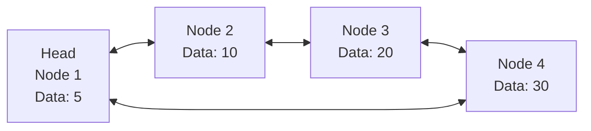

## 연결 List - 요소를 선형으로 저장하기

- 연결 List(Linked List)는 data 요소들이 선형으로 연결된 자료 구조입니다.
    - 각 요소는 node라고 불리며, 각 node는 data와 다음 node를 가리키는 pointer를 포함합니다.
    - 연결 List는 배열(Array)과 달리 요소들이 memory 상에 연속적으로 저장되지 않으며, node에 저장한 pointer로 연결됩니다.

- 연결 List는 node를 동적으로 추가하거나 삭제할 수 있어, list의 크기를 유연하게 조절할 수 있습니다.

- 연결 List는 node들이 서로 연결되는 방식에 따라 **단일 연결 List**, **이중 연결 List**, **원형 연결 List**로 나뉩니다.
    - 연결 List는 기본적으로 data를 저장하는 node들이 pointer를 통해 서로 연결된 구조를 가지며, 구조의 변형을 통해 다르게 구현될 수 있습니다.


### 연결 List의 장점

- **동적 크기 조절** : 배열과 달리 연결 List는 동적으로 크기를 조절할 수 있습니다.
- **삽입/삭제 효율** : list의 중간에 요소를 삽입하거나 삭제할 때, 배열보다 효율적입니다.


### 연결 List의 단점

- **추가 Memory 사용** : 각 node가 data 외에도 pointer를 저장하므로 추가 memory가 필요합니다.
- **순차 접근** : 배열과 달리 임의 접근(random access)이 불가능하며, 원하는 요소를 찾기 위해 처음부터 순회해야 합니다.
- **Cache 비효율성** : memory 상에서 node들이 분산되어 있어 cache 적중률이 낮을 수 있습니다.


### 연결 List의 기본 연산

- **Node 삽입(Insertion)** : list의 특정 위치에 새로운 node를 추가하는 연산. 앞, 끝, 중간에 삽입할 수 있습니다.
- **Node 삭제(Deletion)** : list에서 특정 node를 찾아 제거하는 연산. head, 마지막, 중간 node를 삭제할 수 있습니다.
- **Node 검색(Search)** : list에서 특정 값을 가진 node를 찾는 연산. 값을 비교하며 list를 순회합니다.
- **Node 순회(Traversal)** : list의 모든 node를 방문하며 data를 처리하는 연산. node의 data를 출력하거나 특정 조건을 확인할 수 있습니다.


---


## 연결 List의 기본 구조

- 연결 List는 node라는 기본 단위들이 서로 연결되어 이루어진 자료 구조입니다.
- 연결 List에는 여러 종류가 있지만, 기본적으로 **Node**, **Head**, **Tail**로 구성됩니다.

1. **Node** : 각 node는 자신의 data를 저장하고, 다음 node의 주소를 pointer로 가집니다.
   - pointer를 통해 node들이 chain처럼 연결됩니다.

2. **Head** : list의 첫 번째 node를 가리키는 pointer로, 연결 List의 시작 지점을 나타냅니다.
   - head를 통해 list를 순회하거나, 새로운 node를 삽입할 때 list의 맨 앞에 추가할 수 있습니다.

3. **Tail** : list의 마지막 node를 가리키는 pointer로, 주로 list의 끝에 node를 삽입할 때 효율적으로 사용됩니다.
   - tail pointer가 없으면, 끝에 node를 삽입할 때마다 list의 모든 node를 순회해야 합니다.
   - 선택적인 요소로, 필요에 따라 사용하지 않을 수도 있습니다.




### 1. Node

- node는 **연결 List의 기본 단위**로, data와 pointer의 두 부분으로 구성됩니다.
    - 연결 List의 각 요소를 저장하는 역할을 합니다.
    - data와 다음 node를 가리키는 pointer를 포함하여 list의 구조를 형성합니다.

```c
struct Node {
    int data;    // data 부분
    struct Node* next;    // 다음 node를 가리키는 pointer
};
```

1. **Data** : node가 저장하는 실제 값입니다.
    - 이는 정수, 문자열, 구조체 등 다양한 data 타입일 수 있습니다.

2. **Pointer** : 다음 node를 가리키는 pointer입니다.
    - 이 pointer를 통해 node들이 서로 연결됩니다.


### 2. Head

- head는 **연결 List의 첫 번째 node를 가리키는 pointer**입니다.
    - head는 list의 시작 지점을 나타내며, 이를 통해 list를 순회하거나, 삽입, 삭제 등의 연산을 수행할 수 있습니다.

- 대부분의 연결 List 연산은 head pointer를 통해 이루어집니다.
    - list의 시작점을 가리킴으로써, list의 첫 번째 node로 접근하는 데 사용됩니다.

```c
struct Node* head = NULL;    // 초기에는 list가 비어 있어 NULL로 초기화
```

- list가 비어 있는 경우에 head는 NULL 값을 가질 수 있습니다.


### 3. Tail

- tail은 **연결 List의 마지막 node를 가리키는 pointer**입니다.

- tail pointer는 list의 끝을 나타내며, 효율적인 삽입(list의 끝에 요소를 추가하는 연산)을 위해 선택적으로 사용될 수 있습니다.
    - tail은 필수적인 요소는 아니지만, 중간 node들을 순회하지 않고도 list의 끝을 빠르게 찾을 수 있게 합니다.

```c
struct Node* tail = NULL;    // 초기에는 list가 비어 있어 NULL로 초기화
```

- list가 비어 있는 경우에 tail은 NULL 값을 가질 수 있습니다.


---


## 1. 단일 연결 List (Singly Linked List)

- **단일 연결 List(Singly Linked List)**는 **가장 기본적인 형태의 연결 List**입니다.



- 각 node는 data를 저장하고, 다음 node를 가리키는 **단일 pointer**를 포함합니다.
    - node의 data 부분은 저장할 값을 가지며, pointer 부분은 **다음 node의 주소**를 가리킵니다.
    - 이를 통해 node들이 chain처럼 연결됩니다.

- list의 시작 지점을 나타내는 **head pointer**가 있으며, **list의 끝은 NULL pointer**로 표시됩니다.
    - 단일 연결 List의 순회는 head에서 시작하여 다음 node로 이동하는 방식(**단방향 순회**)으로 이루어집니다.

```c
#include <stdio.h>
#include <stdlib.h>

// Node 구조체 정의
struct Node {
    int data;    // data 부분
    struct Node* next;    // 다음 node를 가리키는 pointer
};

// 전역 변수 head 정의
struct Node* head = NULL;

// list의 앞에 node 삽입
void insertAtFront(int data) {
    struct Node* newNode = (struct Node*)malloc(sizeof(struct Node));
    newNode->data = data;
    newNode->next = head;
    head = newNode;
}

// list의 끝에 node 삽입
void insertAtEnd(int data) {
    struct Node* newNode = (struct Node*)malloc(sizeof(struct Node));
    newNode->data = data;
    newNode->next = NULL;

    if (head == NULL) {
        head = newNode;
        return;
    }

    struct Node* temp = head;
    while (temp->next != NULL) {
        temp = temp->next;
    }
    temp->next = newNode;
}

// 특정 값을 가진 node 삭제
void deleteNode(int key) {
    struct Node* temp = head;
    struct Node* prev = NULL;

    // 삭제할 node가 head인 경우
    if (temp != NULL && temp->data == key) {
        head = temp->next;
        free(temp);
        return;
    }

    // 삭제할 node를 찾기
    while (temp != NULL && temp->data != key) {
        prev = temp;
        temp = temp->next;
    }

    // node가 list에 없는 경우
    if (temp == NULL) return;

    // node 삭제
    prev->next = temp->next;
    free(temp);
}

// 특정 값을 가진 node 검색
struct Node* search(int key) {
    struct Node* temp = head;
    while (temp != NULL) {
        if (temp->data == key) {
            return temp;
        }
        temp = temp->next;
    }
    return NULL;
}

// list의 모든 node를 순회하며 data 처리
void printList() {
    struct Node* temp = head;
    while (temp != NULL) {
        printf("%d -> ", temp->data);
        temp = temp->next;
    }
    printf("NULL\n");
}


int main() {
    insertAtEnd(10);
    insertAtEnd(20);
    insertAtFront(5);
    printList();    // 5 -> 10 -> 20 -> NULL

    struct Node* foundNode = search(10);
    if (foundNode != NULL) {
        printf("Node with data %d found.\n", foundNode->data);
    } else {
        printf("Node with data %d not found.\n", 10);
    }

    deleteNode(10);
    printList();    // 5 -> 20 -> NULL

    deleteNode(5);
    printList();    // 20 -> NULL

    return 0;
}
```


---


## 2. 이중 연결 List

- **이중 연결 List(Doubly Linked List)**는 **각 node가 두 개의 pointer를 가지는 형태의 연결 List**입니다.



- 각 node는 data를 저장하고, 다음 node와 이전 node를 가리키는 **두 개의 pointer**(이중 pointer)를 포함합니다.
    - node의 data 부분은 저장할 값을 가지며, pointer 부분은 **다음 node와 이전 node의 주소**를 가리킵니다.
        - 이를 통해 node들이 양방향으로 연결됩니다.
    - 각 node가 두 개의 pointer를 저장하므로 추가 memory가 필요합니다.

- list의 순회는 head에서 시작하여 다음 node로 이동하거나, tail에서 시작하여 이전 node로 이동하는 방식(**양방향 순회**)으로 이루어집니다.

- list의 시작 지점을 나타내는 **head pointer**와 끝 지점을 나타내는 **tail pointer**가 있습니다.
    - head pointer는 list의 첫 번째 node를 가리킵니다.
    - tail pointer는 list의 마지막 node를 가리킵니다.

```c
#include <stdio.h>
#include <stdlib.h>

// Node 구조체 정의
struct Node {
    int data;    // data 부분
    struct Node* next;    // 다음 node를 가리키는 pointer
    struct Node* prev;    // 이전 node를 가리키는 pointer
};

// 전역 변수 head 정의
struct Node* head = NULL;

// list의 앞에 node 삽입
void insertAtFront(int data) {
    struct Node* newNode = (struct Node*)malloc(sizeof(struct Node));
    newNode->data = data;
    newNode->next = head;
    newNode->prev = NULL;

    if (head != NULL) {
        head->prev = newNode;
    }

    head = newNode;
}

// list의 끝에 node 삽입
void insertAtEnd(int data) {
    struct Node* newNode = (struct Node*)malloc(sizeof(struct Node));
    newNode->data = data;
    newNode->next = NULL;

    if (head == NULL) {
        newNode->prev = NULL;
        head = newNode;
        return;
    }

    struct Node* temp = head;
    while (temp->next != NULL) {
        temp = temp->next;
    }
    temp->next = newNode;
    newNode->prev = temp;
}

// 특정 값을 가진 node 삭제
void deleteNode(int key) {
    struct Node* temp = head;

    // 삭제할 node를 찾기
    while (temp != NULL && temp->data != key) {
        temp = temp->next;
    }

    // node가 list에 없는 경우
    if (temp == NULL) return;

    // 삭제할 node가 head인 경우
    if (temp == head) {
        head = temp->next;
    }

    // 다음 node의 prev pointer를 update
    if (temp->next != NULL) {
        temp->next->prev = temp->prev;
    }

    // 이전 node의 next pointer를 update
    if (temp->prev != NULL) {
        temp->prev->next = temp->next;
    }

    free(temp);
}

// 특정 값을 가진 node 검색
struct Node* search(int key) {
    struct Node* temp = head;
    while (temp != NULL) {
        if (temp->data == key) {
            return temp;
        }
        temp = temp->next;
    }
    return NULL;
}

// list의 모든 node를 순회하며 data 처리
void printList() {
    struct Node* temp = head;
    while (temp != NULL) {
        printf("%d <-> ", temp->data);
        temp = temp->next;
    }
    printf("NULL\n");
}


int main() {
    insertAtEnd(10);
    insertAtEnd(20);
    insertAtFront(5);
    printList();    // 5 <-> 10 <-> 20 <-> NULL

    struct Node* foundNode = search(10);
    if (foundNode != NULL) {
        printf("Node with data %d found.\n", foundNode->data);
    } else {
        printf("Node with data %d not found.\n", 10);
    }

    deleteNode(10);
    printList();    // 5 <-> 20 <-> NULL

    deleteNode(5);
    printList();    // 20 <-> NULL

    return 0;
}
```


---


## 3. 원형 연결 List

- **원형 연결 List(Circular Linked List)**는 **마지막 node가 첫 번째 node를 가리키는 구조를 가진 연결 List**입니다.
    - 단일 원형 연결 List와 이중 원형 연결 List로 구현될 수 있으며, 각각의 방식은 특정 용도와 성능 요구 사항에 맞게 사용될 수 있습니다.

- 원형 연결 List는 **순환 구조**로 되어 있으며, 따라서 list의 끝이 존재하지 않습니다.
    - 마지막 node가 첫 번째 node를 가리켜 list가 원형으로 연결됩니다.
    - list를 끝없이 순회할 수 있습니다. 끝에 도달하면 다시 처음으로 돌아갑니다.
        - 필요에 따라 무한히 순회할 수 있다는 장점이 있지만, 순환하는 구조로 인해 삽입과 삭제 연산의 구현이 복잡해질 수 있습니다.


### 단일 원형 연결 List

- **단일 원형 연결 List(Singly Circular Linked List)**에서 각 node는 data를 저장하고, 다음 node를 가리키는 단일 pointer를 포함합니다.



- 마지막 node의 다음 pointer가 첫 번째 node를 가리킵니다.

```c
#include <stdio.h>
#include <stdlib.h>

// Node 구조체 정의
struct Node {
    int data;   // data 부분
    struct Node* next;    // 다음 node를 가리키는 pointer
};

// 전역 변수 head 정의
struct Node* head = NULL;

// list의 앞에 node 삽입
void insertAtFront(int data) {
    struct Node* newNode = (struct Node*)malloc(sizeof(struct Node));
    newNode->data = data;
    if (head == NULL) {
        head = newNode;
        newNode->next = head;
    } else {
        struct Node* temp = head;
        while (temp->next != head) {
            temp = temp->next;
        }
        newNode->next = head;
        temp->next = newNode;
        head = newNode;
    }
}

// list의 끝에 node 삽입
void insertAtEnd(int data) {
    struct Node* newNode = (struct Node*)malloc(sizeof(struct Node));
    newNode->data = data;
    if (head == NULL) {
        head = newNode;
        newNode->next = head;
    } else {
        struct Node* temp = head;
        while (temp->next != head) {
            temp = temp->next;
        }
        temp->next = newNode;
        newNode->next = head;
    }
}

// 특정 값을 가진 node 삭제
void deleteNode(int key) {
    if (head == NULL) return;

    struct Node *temp = head, *prev = NULL;
    while (temp->data != key) {
        if (temp->next == head) {
            printf("Node with data %d not found.\n", key);
            return;
        }
        prev = temp;
        temp = temp->next;
    }

    if (temp->next == head && prev == NULL) {    // only one node
        head = NULL;
        free(temp);
        return;
    }

    if (temp == head) {    // deleting the head node
        prev = head;
        while (prev->next != head) {
            prev = prev->next;
        }
        head = temp->next;
        prev->next = head;
        free(temp);
    } else if (temp->next == head) {    // deleting the last node
        prev->next = head;
        free(temp);
    } else {    // deleting a middle node
        prev->next = temp->next;
        free(temp);
    }
}

// 특정 값을 가진 node 검색
struct Node* search(int key) {
    struct Node* temp = head;
    if (head == NULL) return NULL;

    do {
        if (temp->data == key) {
            return temp;
        }
        temp = temp->next;
    } while (temp != head);

    return NULL;
}

// list의 모든 node를 순회하며 data 처리
void printList() {
    if (head == NULL) return;

    struct Node* temp = head;
    do {
        printf("%d -> ", temp->data);
        temp = temp->next;
    } while (temp != head);
    printf("HEAD\n");
}


int main() {
    insertAtEnd(10);
    insertAtEnd(20);
    insertAtFront(5);
    printList();    // 5 -> 10 -> 20 -> HEAD

    struct Node* foundNode = search(10);
    if (foundNode != NULL) {
        printf("Node with data %d found.\n", foundNode->data);
    } else {
        printf("Node with data %d not found.\n", 10);
    }

    deleteNode(10);
    printList();    // 5 -> 20 -> HEAD

    deleteNode(5);
    printList();    // 20 -> HEAD

    return 0;
}
```


### 이중 원형 연결 List

- **이중 원형 연결 List(Doubly Circular Linked List)**에서 각 node는 data를 저장하고, **다음 node와 이전 node를 가리키는 두 개의 pointer를 포함**합니다.



- 마지막 node의 다음 pointer가 첫 번째 node를 가리키고, 첫 번째 node의 이전 pointer가 마지막 node를 가리킵니다.

```c
#include <stdio.h>
#include <stdlib.h>

// Node 구조체 정의
struct Node {
    int data;    // data 부분
    struct Node* next;    // 다음 node를 가리키는 pointer
    struct Node* prev;    // 이전 node를 가리키는 pointer
};

// 전역 변수 head 정의
struct Node* head = NULL;

// list의 앞에 node 삽입
void insertAtFront(int data) {
    struct Node* newNode = (struct Node*)malloc(sizeof(struct Node));
    newNode->data = data;
    if (head == NULL) {
        newNode->next = newNode;
        newNode->prev = newNode;
        head = newNode;
    } else {
        struct Node* tail = head->prev;
        newNode->next = head;
        newNode->prev = tail;
        head->prev = newNode;
        tail->next = newNode;
        head = newNode;
    }
}

// list의 끝에 node 삽입
void insertAtEnd(int data) {
    struct Node* newNode = (struct Node*)malloc(sizeof(struct Node));
    newNode->data = data;
    if (head == NULL) {
        newNode->next = newNode;
        newNode->prev = newNode;
        head = newNode;
    } else {
        struct Node* tail = head->prev;
        newNode->next = head;
        newNode->prev = tail;
        tail->next = newNode;
        head->prev = newNode;
    }
}

// 특정 값을 가진 node 삭제
void deleteNode(int key) {
    if (head == NULL) return;

    struct Node *temp = head;
    while (temp->data != key) {
        if (temp->next == head) {
            printf("Node with data %d not found.\n", key);
            return;
        }
        temp = temp->next;
    }

    if (temp->next == head && temp->prev == head) {    // only one node
        head = NULL;
        free(temp);
        return;
    }

    if (temp == head) {    // deleting the head node
        struct Node* tail = head->prev;
        head = head->next;
        tail->next = head;
        head->prev = tail;
        free(temp);
    } else {
        temp->prev->next = temp->next;
        temp->next->prev = temp->prev;
        free(temp);
    }
}

// 특정 값을 가진 node 검색
struct Node* search(int key) {
    struct Node* temp = head;
    if (head == NULL) return NULL;

    do {
        if (temp->data == key) {
            return temp;
        }
        temp = temp->next;
    } while (temp != head);

    return NULL;
}

// list의 모든 node를 순회하며 data 처리
void printList() {
    if (head == NULL) return;

    struct Node* temp = head;
    do {
        printf("%d <-> ", temp->data);
        temp = temp->next;
    } while (temp != head);
    printf("HEAD\n");
}


int main() {
    insertAtEnd(10);
    insertAtEnd(20);
    insertAtFront(5);
    printList();    // 5 <-> 10 <-> 20 <-> HEAD

    struct Node* foundNode = search(10);
    if (foundNode != NULL) {
        printf("Node with data %d found.\n", foundNode->data);
    } else {
        printf("Node with data %d not found.\n", 10);
    }

    deleteNode(10);
    printList();    // 5 <-> 20 <-> HEAD

    deleteNode(5);
    printList();    // 20 <-> HEAD

    return 0;
}
```
