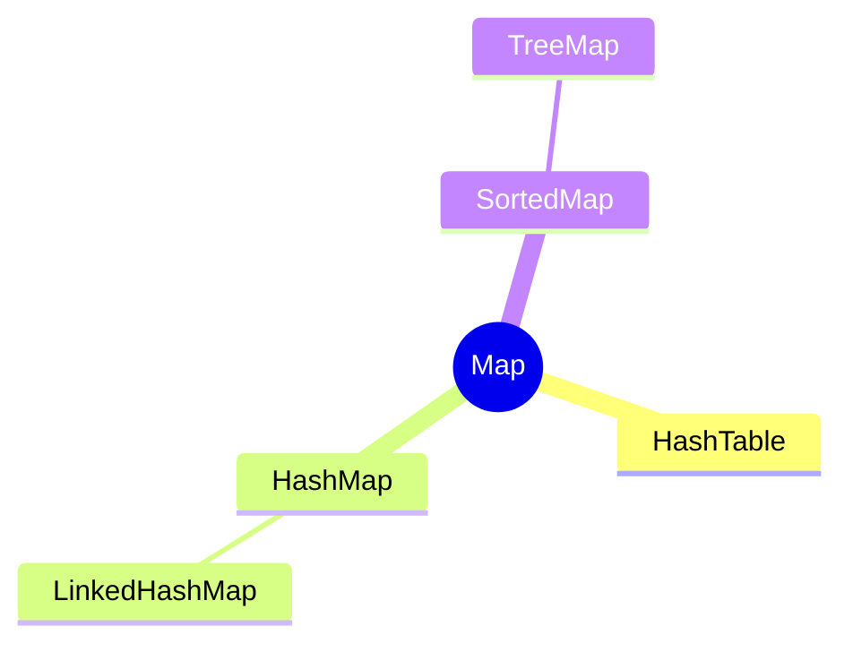

## Map : Key와 Value 쌍으로 이루어진 자료 구조

- Map 자료 구조는 key와 value의 쌍을 저장하고, key를 사용해 value를 효율적으로 검색할 수 있도록 하는 구조입니다.
    - **key(식별값)에 value(저장하고자 하는 data)를 연결**하여 저장합니다.
    - 이렇게 key와 value로 연결(mapping)되는 과정 자체를 **hashing**이라고 합니다.
    - Map은 hash 함수를 통해 key를 빠르게 검색할 수 있도록 설계되었습니다.
        - list나 배열처럼 순차적으로 해당 요소 value를 구하지 않고 key를 통해 value를 얻습니다.
        - 따라서 Map에 저장된 특정 value를 검색하는 시간 복잡도는 일반적으로 `O(1)`입니다.

- Map의 value(값)는 중복될 수 있지만, **key는 고유(unique)해야**을 합니다.
    - key를 통해 value를 얻어내야 하기 때문에 key는 중복 지정을 허용하지 않습니다.
    - 대신 key만 있으면 value를 찾을 수 있어 저장 순서를 유지할 필요가 없습니다.

- **Map**은 ADT(Abstract Data Type, 추상 자료형)로, key-value 쌍을 관리하는 자료 구조의 기본적인 연산을 정의합니다.
    - Map ADT를 구현한 다양한 자료 구조가 있습니다.




### Map의 기본 개념

- **Key** : **고유한 식별자**로, Map에서 **각 value를 식별하고 검색하는 데 사용**됩니다.
    - **key는 반드시 유일**해야 하며, 동일한 key가 두 개 이상 존재할 수 없습니다.
    - key는 value를 검색(search)하거나 갱신(update)할 때 사용됩니다.
    - 사용자는 key를 제공하여 해당 key에 대응하는 value를 찾거나 수정할 수 있습니다.

- **Value** : **값**을 의미하며, **key에 대응하는 data**입니다.
    - Map은 key-value 쌍으로 data를 저장하므로, 각 key는 하나의 value를 가집니다.
    - value는 사용자가 **실제로 저장하거나 검색하려는 data**입니다.
    - key를 통해 value에 빠르게 접근할 수 있습니다.

- **Hash 함수 (Hash Function)** : key를 입력받아 **hash 값을 출력하는 함수**로, 이 hash 값을 통해 **저장 위치를 결정**합니다.
    - hash 값은 일반적으로 key의 data type과 상관없이 **일정한 크기의 정수 값을 생성**합니다.
    - hash 함수는 key를 hash 값으로 변환하여 저장 위치를 결정합니다.
    - 좋은 hash 함수는 key를 고르게 분포시키고 충돌을 최소화합니다.

- **Bucket** : 동일한 hash 값을 가진 **key-value 쌍을 저장하는 공간**입니다.
    - hash table에서 각 bucket은 여러 개의 key-value 쌍을 저장할 수 있으며, 일반적으로 연결 List(Linked List)로 구현됩니다.
    - bucket은 **충돌을 해결하는 데에 사용**됩니다.
        - 충돌이 발생하면 동일한 hash 값을 가진 여러 key-value 쌍이 같은 bucket에 저장됩니다.
    - **충돌(collision)**은 사용하려는 bucket(사용하려는 hash 값)이 이미 사용 중인 경우 발생합니다.


### Map의 주요 연산

- **put(key, value)** : 주어진 key와 value를 Map에 저장합니다.
    - key가 이미 존재하는 경우 해당 key의 value를 새로운 값으로 갱신합니다.

- **get(key)** : 주어진 key에 대응하는 value를 반환합니다.
    - key가 존재하지 않으면 NULL 또는 특정 값을 반환할 수 있습니다.

- **remove(key)** : key-value 쌍(주어진 key + 해당 key에 대응하는 값)을 Map에서 제거합니다.


---


## HashMap 구현하기

- Map ADT를 구현한 자료 구조로 HashMap이 있습니다.

```c
#include <stdio.h>
#include <stdlib.h>
#include <string.h>

#define TABLE_SIZE 100

typedef struct {
    char *key;
    char *value;
} Entry;

typedef struct {
    Entry **entries;
} HashMap;

unsigned int hash(const char *key) {
    unsigned long int value = 0;
    unsigned int i = 0;
    unsigned int key_len = strlen(key);

    for (; i < key_len; ++i) {
        value = value * 37 + key[i];
    }
    value = value % TABLE_SIZE;
    return value;
}

Entry *create_entry(const char *key, const char *value) {
    Entry *entry = (Entry *)malloc(sizeof(Entry));
    entry->key = strdup(key);
    entry->value = strdup(value);
    return entry;
}

HashMap *create_table() {
    HashMap *hashMap = (HashMap *)malloc(sizeof(HashMap));
    hashMap->entries = (Entry **)malloc(sizeof(Entry *) * TABLE_SIZE);
    for (int i = 0; i < TABLE_SIZE; i++) {
        hashMap->entries[i] = NULL;
    }
    return hashMap;
}

void put(HashMap *hashMap, const char *key, const char *value) {
    unsigned int slot = hash(key);

    Entry *entry = hashMap->entries[slot];

    if (entry == NULL) {
        hashMap->entries[slot] = create_entry(key, value);
        return;
    }

    Entry *prev;
    while (entry != NULL) {
        if (strcmp(entry->key, key) == 0) {
            free(entry->value);
            entry->value = strdup(value);
            return;
        }
        prev = entry;
        entry = entry->next;
    }

    prev->next = create_entry(key, value);
}

char *get(HashMap *hashMap, const char *key) {
    unsigned int slot = hash(key);
    Entry *entry = hashMap->entries[slot];

    while (entry != NULL) {
        if (strcmp(entry->key, key) == 0) {
            return entry->value;
        }
        entry = entry->next;
    }

    return NULL;
}

void remove(HashMap *hashMap, const char *key) {
    unsigned int slot = hash(key);
    Entry *entry = hashMap->entries[slot];
    Entry *prev = NULL;

    while (entry != NULL) {
        if (strcmp(entry->key, key) == 0) {
            if (prev == NULL) {
                hashMap->entries[slot] = entry->next;
            } else {
                prev->next = entry->next;
            }
            free(entry->key);
            free(entry->value);
            free(entry);
            return;
        }
        prev = entry;
        entry = entry->next;
    }
}

void free_table(HashMap *hashMap) {
    for (int i = 0; i < TABLE_SIZE; i++) {
        Entry *entry = hashMap->entries[i];
        while (entry != NULL) {
            Entry *temp = entry;
            entry = entry->next;
            free(temp->key);
            free(temp->value);
            free(temp);
        }
    }
    free(hashMap->entries);
    free(hashMap);
}

int main() {
    HashMap *map = create_table();

    put(map, "name", "Alice");
    put(map, "age", "25");
    put(map, "city", "New York");

    printf("name : %s\n", get(map, "name"));
    printf("age : %s\n", get(map, "age"));
    printf("city : %s\n", get(map, "city"));

    remove(map, "age");
    printf("age after deletion : %s\n", get(map, "age"));

    free_table(map);
    return 0;
}
```


---


## Reference

- <https://healthcoding.tistory.com/51>
