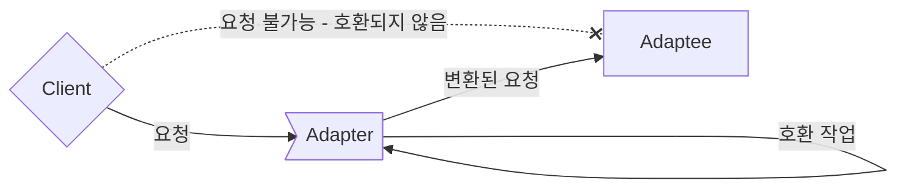
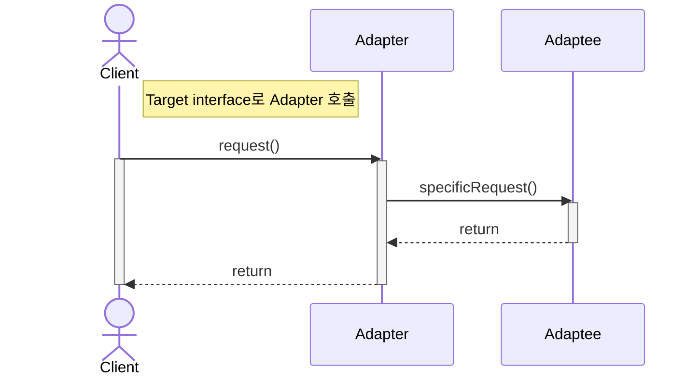
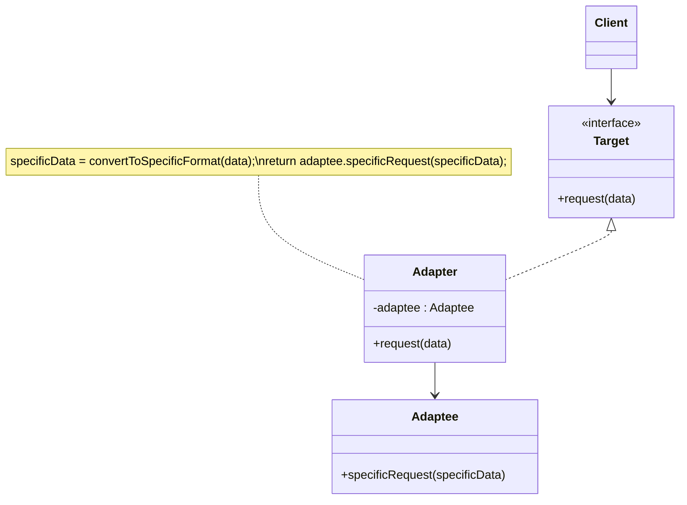
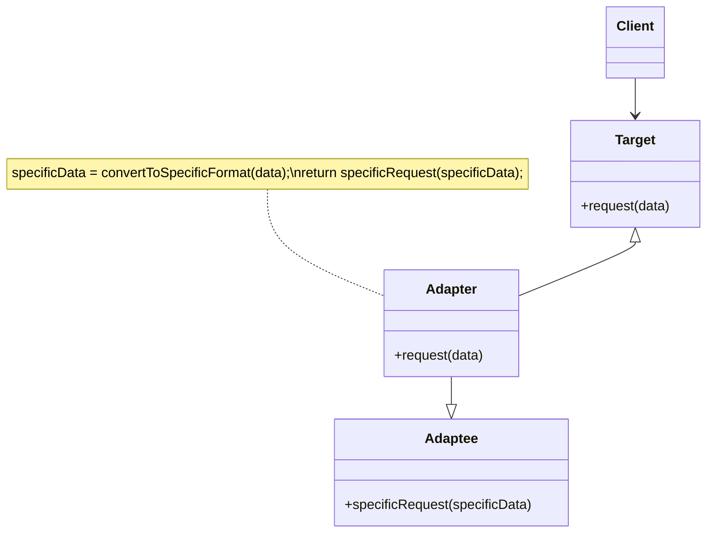
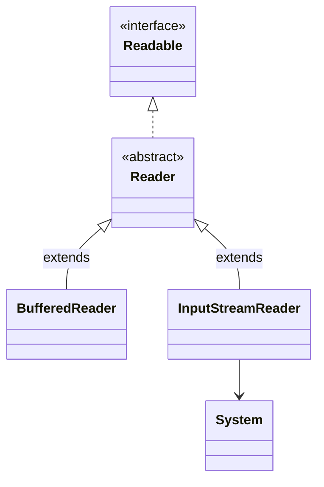

- 사용해야 하는 interface가 현재의 system과 호환되지 않는다고 해서 꼭 현재의 system을 변경해야 하는 것은 아닙니다.

- Adapter Pattern은 **서로 다른 interface를 가지는 두 객체를 연결**하여 사용할 수 있도록 하는 design pattern입니다.
    - interface가 호환되지 않아서 함께 동작할 수 없는 class들을 함께 사용할 수 있도록 변환합니다.
    - e.g., 원래 객체와 호환되지 않는 외부 library나 API를 사용해야 하는 경우, Adapter Pattern을 적용하면 기존 code를 재사용하면서 외부 library나 API를 사용할 수 있습니다.
        - 한국에서 쓰던 220V 기기들을 Voltage Power Adapter를 사용하여 110V를 쓰는 곳에 가서도 그대로 쓸 수 있는 것과 비슷합니다.
        - Adapter Pattern에서도 Adapter처럼 변환하는 역할을 하는 class를 새로 만들어야 합니다.

- Adapter Pattern은 Wrapper Pattern이라고도 합니다.
    - Adapter가 legacy interface를 감싸서 새로운 interface로 변환하기 때문입니다.



- Adapter Pattern은 서로 다른 interface를 가진 class들이 상호 작용할 수 있도록 합니다.
    - Adapter Pattern을 사용하면 class의 interface를 다른 interface로 변환할 수 있습니다.
    - 기존의 class를 수정하지 않고도 특정 interface를 변환하여 다른 code에서 그대로 사용하는 것이 가능합니다.

- interface를 변환하는 Adapter를 만들어, 호환되지 않는 interface를 사용하는 Client를 그대로 활용할 수 있습니다.
    - Client와 구현된 interface를 분리시킬 수 있습니다.
        - Client를 특정 구현이 아닌 interface에 연결시키기 때문입니다.
        - Client가 사용하는 interface(Target interface)만 제대로 지킨다면, 나중에 다른 구현을 추가하는 것도 가능합니다.
    - 나중에 interface가 바뀌더라도 변경할 부분은 Adapter에 캡슐화(encapsulation)되어 있기 때문에 Client는 바뀔 필요가 없습니다.
    - 여러 interface를 모두 지원하는 Adapter를 Two Way Adapter(다중 Adapter)라고 부릅니다.

- MVC design pattern에서도 Adapter Pattern이 사용됩니다.
    - MVC  design pattern에서는 Model과 View 사이에 Controller를 두어 Model과 View를 연결합니다.
    - 이때 Adapter Pattern을 이용하여 Model과 View의 interface를 변환하면, Controller에서 Model과 View를 쉽게 연결할 수 있습니다.

- Adapter Pattern을 다른 pattern과 결합하여 더욱 효과적으로 사용할 수 있습니다.
    - Adapter Pattern은 다른 pattern들과 결합하여 사용하기 좋습니다.
    - e.g., Builder Pattern과 Adapter Pattern을 결합하여, 새로운 객체를 생성하면서 외부 library나 API와 연결할 수 있습니다.


## Adapter Pattern & Facade pattern & Decorator Pattern

- Adapter Pattern은 Facade pattern, Decorator Pattern과 비슷합니다.
- 세 pattern 모두 객체를 감싸서 호환되지 않는 interface를 Client가 사용할 수 있게 합니다.

- 그러나 목적에 차이가 있기 때문에 다른 pattern으로 분류되어 있습니다.
    - Adapter Pattern는 한 interface를 다른 interface로 변환하는 것이 목적입니다.
    - Decorator Pattern은 interface는 바꾸지 않고 책임(기능)만 추가하는 것이 목적입니다.
    - Facade Pattern는 interface를 단순하게 바꾸는 것이 목적입니다.


---


## Class 구조

- Client는 Target interface와 Adapter를 통해 Adaptee를 사용합니다.

1. Client에서 Target interface를 통해 Adapter에 요청을 보냅니다.
2. Adapter는 Client의 요청을 Adaptee가 이해할 수 있는 방법으로 전달합니다.
    - Adapter는 Adaptee interface를 사용하여 Client의 요청을 하나 이상의 Adaptee method 호출로 변환합니다.
    - Client와 Adaptee는 분리되어 있기 때문에 서로를 알지 못합니다.
3. Adaptee는 Adapter로부터 변환된 요청을 전달받아 처리합니다.
4. Client에서 호출 결과를 받습니다.
    - Client는 중간에 Adapter가 있는지는 전혀 알지 못합니다.



- `Client` : Adaptee의 기능을 사용하려는 주체입니다.
    - Client는 Target interface만 알고 있으며, Target interface와 Adapter를 통해 Adaptee의 기능(service)를 이용합니다.

- `Target` : Client가 접근해서 사용할 고수준의 Adapter module입니다.
    - Client는 Target interface를 통해 Adaptee를 사용하게 됩니다.
    - Adapter가 구현(implements)하는 interface입니다.

- `Adapter` : Client와 Adaptee 사이에서 실질적인 호환 작업을 맡는 객체입니다.
    - Client가 Adaptee를 사용할 수 있도록 합니다.
    - Adapter는 구현 방식에 따라 **Object Adapter**와 **Class Adapter**로 나뉩니다.
        - Object Adapter는 합성(composition)을 이용하여 구현한 Adapter입니다.
        - Class Adapter는 상속(inheritance)을 이용하여 구현한 Adapter입니다.

- `Adaptee` : Client가 최종적으로 사용하고자 하는 service이자, Adapter의 호환 작업 대상(Adaptee)입니다.
    - Client에서 사용하고 싶지만 호환성 문제로 바로 사용할 수 없는 service입니다.
    - e.g., 기존 system, 외부 system, third party library 등이 Adaptee에 해당됩니다.


### Object Adapter : 합성을 이용해 구현한 Adapter



- 합성(composition)된 Adaptee 객체에게 모든 **요청을 위임**하는 방식으로 변환 작업을 합니다.
    - 합성을 활용했기 때문에 runtime 중에 Adaptee가 결정되어, 상속 방식(Class Adapter)보다 유연합니다.
    - 그러나 Adaptee 객체를 field 변수로 저장해야 하기 때문에, 공간(memory) 차지 비용이 듭니다.

```java
class Client {
    public static void main(String[] args) {
        Target adapter = new Adapter(new Adaptee());    // Adaptee를 인자로 받아 호환 작업을 처리합니다.
        adapter.request(1);    // Target interface의 명세에 따라 method를 호출하여 Adaptee를 사용합니다.
    }
}
```

```java
interface Target {
    void request(int data);    // Client는 Adaptee를 사용하기 위해 이 method에 접근합니다.
}
```

```java
class Adapter implements Target {
    Adaptee adaptee;    // Adaptee 객체를 class field로 합성(composition)합니다.

    Adapter(Adaptee adaptee) {
        this.adaptee = adaptee;    // Adapter를 생성할 때 호환시킬 기존 서비스를 설정합니다.
    }

    public void request(int data) {
        adaptee.specificRequest(data);    // Adapter의 method가 호출되면, Adaptee의 method를 호출하도록 위임합니다.
    }
}
```

```java
class Adaptee {
    void specificRequest(int specificData) {
        System.out.println("Process Adaptee service with " + specificData);
    }
}
```


### Class Adapter : 상속을 이용해 구현한 Adapter



- Adaptee class를 상속(inheritance)받아, **부모의 method를 호출**하는 방식으로 변환 작업을 합니다.
    - 상속은 기존에 구현된 code를 재사용하는 대표적인 방식입니다.
    - Adapter가 Adaptee와 Target interface 모두를 상속받기 때문에, Adapter는 객체 구현 없이 바로 Adaptee의 code를 재사용할 수 있습니다.
    - 그러나 다중 상속을 지원하지 않는 언어(e.g., Java, C#)에서는 Class Adapter를 사용할 수 없습니다.

```java
class Client {
    public static void main(String[] args) {
        Target adapter = new Adapter();    // Object Adapter와 달리 Adaptee를 인자로 받을 필요가 없습니다.
        adapter.request(1);
    }
}
```

```java
interface Target {
    void request(int data);
}
```

```java
class Adapter extends Adaptee implements Target {
    public void request(int data) {
        specificRequest(data);    // Adapter의 method가 호출되면, 상속받은 부모 class인 Adaptee의 method를 호출합니다.
    }
}
```

```java
class Adaptee {
    void specificRequest(int specificData) {
        System.out.println("Process Adaptee service with " + specificData);
    }
}
```


---


## Example : Java의 InputStreamReader

- JDK의 `InputStreamReader`는 Adapter Pattern의 대표적인 예시입니다.
- console에서 입력을 받을 때, `InputStreamReader`를 사용하여 `BufferedReader`와 `System.in`을 연결할 수 있습니다.

```java
// Client Code
BufferedReader br = new BufferedReader(new InputStreamReader(System.in));

// BufferedReader의 생성자 parameter는 Reader
public BufferedReader(Reader in) {
    this(in, defaultCharBufferSize);
}

// System.in가 반환하는 자료형은 InputStream
public final static InputStream in = null;
```

- `BufferedReader`의 생성자는 parameter로 `Reader` type을 받습니다.
    - 그래서 `BufferedReader`는 `InputStream` type을 반환하는 `System.in`을 바로 사용할 수 없습니다.
        - `InputStream`은 byte stream을 읽어 들이고, `BufferedReader`는 character input stream을 읽어 들입니다.
    - `BufferedReader`와 `System.in`는 호환되지 않습니다.

- 호환되지 않는 `BufferedReader`와 `System.in` 사이에 `InputStreamReader`를 두어 호환성을 맞출 수 있습니다.
    - `InputStreamReader`는 `InputStream` type을 `Reader` type으로 변환하여, `BufferedReader`가 `System.in`을 간접적으로 사용할 수 있게 합니다.



- `BufferedReader` class와 `InputStreamReader` class 둘 다 `Reader` type으로 참조(reference)할 수 있습니다.
    - 두 class 모두 `Reader` class를 상속받았기 때문입니다.
        - `Reader` class는 `Readable` interface를 구현한 추상 class입니다.

- `InputStreamReader` class는 `InputStream` type(`System.in`의 반환 type)을 받을 수 있는 생성자를 가지고 있습니다.
    - 따라서 instance를 생성할 때 `System.in`을 parameter로 받아서, `BufferedReader` class에 사용할 수 있는 형태로 변환하는 것이 가능합니다.

- 변환이 완료된 `InputStreamReader` instance를 최종적으로 `BufferedReader` class에서 사용합니다.

- Adapter Pattern에서 `InputStreamReader` class는 Adapter, `System.in`는 Adaptee, `Reader`는 Target interface입니다.


---


## Example : 오리 Adapter로 감싼 칠면조

- 오리처럼 걷고 꽥꽥거린다면, 반드시 오리가 아니라 오리 Adapter로 감싼 칠면조일 수도 있습니다.
    - 또, 그 반대일 수도 있습니다.

- 이 예제는 `Duck`을 `Turkey`로, `Turkey`를 `Duck`으로, `Duck`을 `Dron`으로 변환합니다.


### Client

```java
public class DuckTestDrive {
    public static void main(String[] args) {
        Duck duck = new MallardDuck();

        Turkey turkey = new WildTurkey();
        Duck turkeyAdapter = new TurkeyAdapter(turkey);

        System.out.println("The Turkey says...");
        turkey.gobble();
        turkey.fly();

        System.out.println("\nThe Duck says...");
        testDuck(duck);

        System.out.println("\nThe TurkeyAdapter says...");
        testDuck(turkeyAdapter);
        

        Drone drone = new SuperDrone();
        Duck droneAdapter = new DroneAdapter(drone);
        testDuck(droneAdapter);
    }

    static void testDuck(Duck duck) {
        duck.quack();
        duck.fly();
    }
}
```

```java
public class TurkeyTestDrive {
    public static void main(String[] args) {
        MallardDuck duck = new MallardDuck();
        Turkey duckAdapter = new DuckAdapter(duck);
 
        for (int i = 0; i < 10; i++) {
            System.out.println("The DuckAdapter says...");
            duckAdapter.gobble();
            duckAdapter.fly();
        }
    }
}
```

### Adapter

```java
public class DuckAdapter implements Turkey {
    Duck duck;
    Random rand;
 
    public DuckAdapter(Duck duck) {
        this.duck = duck;
        rand = new Random();
    }
    
    public void gobble() {
        duck.quack();
    }
  
    public void fly() {
        if (rand.nextInt(5)  == 0) {
             duck.fly();
        }
    }
}
```

```java
public class TurkeyAdapter implements Duck {
    Turkey turkey;
 
    public TurkeyAdapter(Turkey turkey) {
        this.turkey = turkey;
    }
    
    public void quack() {
        turkey.gobble();
    }
  
    public void fly() {
        for (int i = 0; i < 5; i++) {
            turkey.fly();
        }
    }
}
```

```java
public class DroneAdapter implements Duck {
    Drone drone;
 
    public DroneAdapter(Drone drone) {
        this.drone = drone;
    }
    
    public void quack() {
        drone.beep();
    }
  
    public void fly() {
        drone.spinRotors();
        drone.takeOff();
    }
}
```

### Duck

```java
public interface Duck {
    public void quack();
    public void fly();
}
```

```java
public class MallardDuck implements Duck {
    public void quack() {
        System.out.println("Quack");
    }
 
    public void fly() {
        System.out.println("I'm flying");
    }
}
```

### Turkey

```java
public interface Turkey {
    public void gobble();
    public void fly();
}
```

```java
public class WildTurkey implements Turkey {
    public void gobble() {
        System.out.println("Gobble gobble");
    }
 
    public void fly() {
        System.out.println("I'm flying a short distance");
    }
}
```

### Dron

```java
public interface Drone {
    public void beep();
    public void spinRotors();
    public void takeOff();
}
```

```java
public class SuperDrone implements Drone {
    public void beep() {
        System.out.println("Beep beep beep");
    }
    public void spinRotors() {
        System.out.println("Rotors are spinning");
    }
    public void takeOff() {
        System.out.println("Taking off");
    }
}
```


---


## Reference

- Head First Design Patterns (도서) - Eric Freeman, Elisabeth Robson, Bert Bates, Kathy Sierra
- <https://inpa.tistory.com/entry/GOF-💠-어댑터Adaptor-패턴-제대로-배워보자>
- <https://yaboong.github.io/design-pattern/2018/10/15/adapter-pattern>
- <https://refactoring.guru/ko/design-patterns/adapter>
