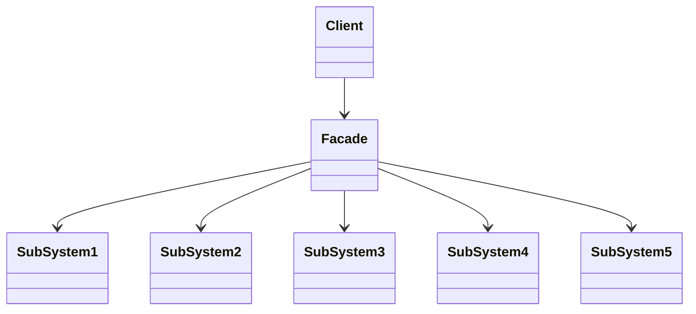
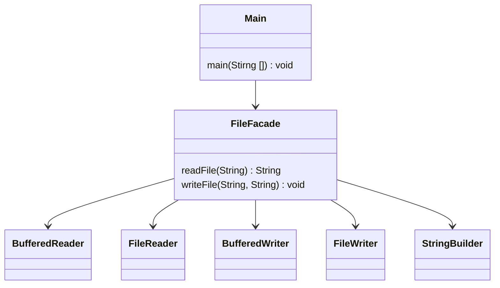
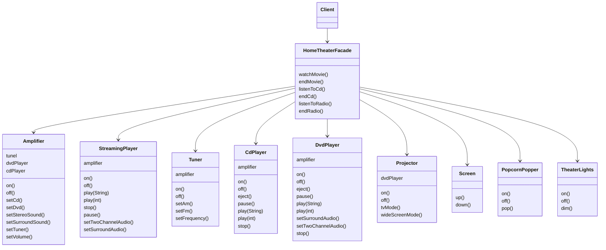

- Facade Pattern은 **복잡한 system에 대한 단순한 interface를 제공**하는 pattern입니다.
    - facade는 '건물의 정면'을 의미하는 단어입니다.
    - facade object는 자신의 뒤 편에 존재하는 subsystem들의 복잡한 기능들을 통합하여, 간략화된 기능(interface)를 client에게 제공합니다.

- Facade Pattern은 **저수준 interface(subsystem)들을 통합하여 고수준 interface를 제공**합니다.
    - 고수준의 interface가 저수준 interface들을 통합하기 때문에, 고수준 interface를 통합 interface라고 부릅니다.
    - 저수준 interface보다 더 단순화된 고수준 interface를 제공함으로써, client가 subsystem의 기능을 더 쉽게 사용할 수 있도록 합니다.
        - 통합 interface가 중간에 위치하기 때문에 client와 subsystem이 서로 긴밀하게 연결되지 않아도 됩니다.

- Facade Pattern에서는 subsystem class들을 캡슐화(encapsulation)하지 않습니다.
    - facade object로 단순화된 interface를 제공하면서도, client에서 필요로 한다면 subsystem의 모든 기능을 사용할 수 있게 합니다.
        - client가 subsystem class에 접근하여 기능을 직접 사용하는 것이 가능합니다.
    - Facade Pattern는 복잡한 추상화의 단계가 필요 없어서 **다른 pattern보다 단순한 편**입니다.

- Facade Pattern은 Adapter Pattern의 구조와 비슷하지만, 용도가 다르기 때문에 다른 pattern으로 구분됩니다.
    - 두 pattern 모두 interface를 바꿔주고, 여러 개의 class를 감쌀 수 있습니다.
    - Adapter Pattern은 interface를 변경해서 client에서 필요로 하는 interface로 적응시키기 위한 용도입니다.
    - Facade Pattern은 어떤 subsystem에 대한 단순한 interface를 제공하기 위한 용도입니다.


---


## Class 구조



- `Client` : Client는 Facade 덕분에 기능을 사용하기가 쉬워졌습니다.
- `Facade` : 더 사용하기 편한 통합 interface입니다.
- `SubSystem` : 복잡한 하위 system 입니다.


---


## Example : File Reader


- `FileFacade` class가 facade의 역할을 수행합니다.
    - `readFile`과 `writeFile` method를 제공하여 file 입출력을 단순화합니다.
    - 내부에서 복잡한 file 입출력 관련 class를 사용하며, 이를 캡슐화(encapsulation)하여 단순한 interface를 제공합니다.

- client code(`Main` class)에서는 file 입출력과 관련된 복잡한 내용을 알 필요가 없으며, 단순히 `FileFacade` class의 interface를 사용하여 file 입출력을 수행할 수 있습니다.
    - `FileFacade` class의 instance를 생성하고, `writeFile` method와 `readFile` method를 사용하여 file 내용을 읽고 씁니다.




### Facade

```java
class FileFacade {
    public String readFile(String fileName) {
        try (BufferedReader reader = new BufferedReader(new FileReader(fileName))) {
            StringBuilder stringBuilder = new StringBuilder();
            String line = null;
            while ((line = reader.readLine()) != null) {
                stringBuilder.append(line);
                stringBuilder.append(System.lineSeparator());
            }
            return stringBuilder.toString();
        } catch (IOException e) {
            e.printStackTrace();
            return null;
        }
    }

    public void writeFile(String fileName, String content) {
        try (BufferedWriter writer = new BufferedWriter(new FileWriter(fileName))) {
            writer.write(content);
        } catch (IOException e) {
            e.printStackTrace();
        }
    }
}
```


### Client

```java
public class Main {
    public static void main(String[] args) {
        FileFacade fileFacade = new FileFacade();
        String fileName = "test.txt";
        String content = "Hello, World!";

        // File 쓰기
        fileFacade.writeFile(fileName, content);

        // File 읽기
        String readContent = fileFacade.readFile(fileName);
        System.out.println(readContent);
    }
}
```


---


## Example : Home Theater



- `Client`
    - `HomeTheaterFacade`하나만 바라봅니다.

- `HomeTheaterFacade`
    - Client 대신 모든 subsystem 구성 요소를 관리해 줍니다.
    - 덕분에 Client는 단순하면서 유연해질 수 있습니다.

- `Amplifier`
    - subsystem에서도 최소 지식 원칙을 지키는 것이 좋습니다.
    - 서로 얽혀 있는 것이 많아져서 system이 너무 복잡한 것 같으면, subsystem에 Facade를 더 추가하는 것도 생각해 보아야 합니다.


- 영화 보는 복잡한 과정을 client가 맡지 않고, facade가 맡습니다.
    1. popcorn 기계 켜기.
    2. popcorn 튀기기 시작하기.
    3. 전등을 어둡게 조절하기.
    4. screen 내리기.
    5. projector 켜기.
    6. projector로 DVD 신호가 입력되도록 하기.
    7. projector를 wide screen mode로 전환하기.
    8. amp 켜기.
    9. amp 입력을 DVD로 전환하기.
    10. amp를 surround 음향 mode로 전환하기.
    11. amp volume을 중간(5)으로 설정하기.
    12. DVD player 켜기.
    13. DVD 재생하기.

### Client

```java
public class HomeTheaterTestDrive {
    public static void main(String[] args) {
        Amplifier amp = new Amplifier("Amplifier");
        Tuner tuner = new Tuner("AM/FM Tuner", amp);
        StreamingPlayer player = new StreamingPlayer("Streaming Player", amp);
        CdPlayer cd = new CdPlayer("CD Player", amp);
        Projector projector = new Projector("Projector", player);
        TheaterLights lights = new TheaterLights("Theater Ceiling Lights");
        Screen screen = new Screen("Theater Screen");
        PopcornPopper popper = new PopcornPopper("Popcorn Popper");
 
        HomeTheaterFacade homeTheater = new HomeTheaterFacade(amp, tuner, player, projector, screen, lights, popper);
 
        homeTheater.watchMovie("Raiders of the Lost Ark");
        homeTheater.endMovie();
    }
}
```

#### Facade

```java
public class HomeTheaterFacade {
    Amplifier amp;
    Tuner tuner;
    StreamingPlayer player;
    CdPlayer cd;
    Projector projector;
    TheaterLights lights;
    Screen screen;
    PopcornPopper popper;
 
    public HomeTheaterFacade(
        Amplifier amp, 
        Tuner tuner, 
        StreamingPlayer player, 
        Projector projector, 
        Screen screen,
        TheaterLights lights,
        PopcornPopper popper
    ) {
 
        this.amp = amp;
        this.tuner = tuner;
        this.player = player;
        this.projector = projector;
        this.screen = screen;
        this.lights = lights;
        this.popper = popper;
    }
 
    public void watchMovie(String movie) {
        System.out.println("Get ready to watch a movie...");
        popper.on();
        popper.pop();
        lights.dim(10);
        screen.down();
        projector.on();
        projector.wideScreenMode();
        amp.on();
        amp.setStreamingPlayer(player);
        amp.setSurroundSound();
        amp.setVolume(5);
        player.on();
        player.play(movie);
    }
 
 
    public void endMovie() {
        System.out.println("Shutting movie theater down...");
        popper.off();
        lights.on();
        screen.up();
        projector.off();
        amp.off();
        player.stop();
        player.off();
    }

    public void listenToRadio(double frequency) {
        System.out.println("Tuning in the airwaves...");
        tuner.on();
        tuner.setFrequency(frequency);
        amp.on();
        amp.setVolume(5);
        amp.setTuner(tuner);
    }

    public void endRadio() {
        System.out.println("Shutting down the tuner...");
        tuner.off();
        amp.off();
    }
}
```

#### SubSystem

```java
public class Amplifier {
    String description;
    Tuner tuner;
    StreamingPlayer player;
    
    public Amplifier(String description) {
        this.description = description;
    }
 
    public void on() {
        System.out.println(description + " on");
    }
 
    public void off() {
        System.out.println(description + " off");
    }
 
    public void setStereoSound() {
        System.out.println(description + " stereo mode on");
    }
 
    public void setSurroundSound() {
        System.out.println(description + " surround sound on (5 speakers, 1 subwoofer)");
    }
 
    public void setVolume(int level) {
        System.out.println(description + " setting volume to " + level);
    }

    public void setTuner(Tuner tuner) {
        System.out.println(description + " setting tuner to " + tuner);
        this.tuner = tuner;
    }
  
    public void setStreamingPlayer(StreamingPlayer player) {
        System.out.println(description + " setting Streaming player to " + player);
        this.player = player;
    }
 
    public String toString() {
        return description;
    }
}
```

```java
public class Tuner {
    String description;
    Amplifier amplifier;
    double frequency;

    public Tuner(String description, Amplifier amplifier) {
        this.description = description;
    }

    public void on() {
        System.out.println(description + " on");
    }

    public void off() {
        System.out.println(description + " off");
    }

    public void setFrequency(double frequency) {
        System.out.println(description + " setting frequency to " + frequency);
        this.frequency = frequency;
    }

    public void setAm() {
        System.out.println(description + " setting AM mode");
    }

    public void setFm() {
        System.out.println(description + " setting FM mode");
    }

    public String toString() {
        return description;
    }
}
```

```java
public class StreamingPlayer {
    String description;
    int currentChapter;
    Amplifier amplifier;
    String movie;
    
    public StreamingPlayer(String description, Amplifier amplifier) {
        this.description = description;
        this.amplifier = amplifier;
    }
 
    public void on() {
        System.out.println(description + " on");
    }
 
    public void off() {
        System.out.println(description + " off");
    }
 
    public void play(String movie) {
        this.movie = movie;
        currentChapter = 0;
        System.out.println(description + " playing \"" + movie + "\"");
    }

    public void play(int chapter) {
        if (movie == null) {
            System.out.println(description + " can't play chapter " + chapter + " no movie selected");
        } else {
            currentChapter = chapter;
            System.out.println(description + " playing chapter " + currentChapter + " of \"" + movie + "\"");
        }
    }

    public void stop() {
        currentChapter = 0;
        System.out.println(description + " stopped \"" + movie + "\"");
    }
 
    public void pause() {
        System.out.println(description + " paused \"" + movie + "\"");
    }

    public void setTwoChannelAudio() {
        System.out.println(description + " set two channel audio");
    }
 
    public void setSurroundAudio() {
        System.out.println(description + " set surround audio");
    }
 
    public String toString() {
        return description;
    }
}
```

```java
public class CdPlayer {
    String description;
    int currentTrack;
    Amplifier amplifier;
    String title;
    
    public CdPlayer(String description, Amplifier amplifier) {
        this.description = description;
        this.amplifier = amplifier;
    }
 
    public void on() {
        System.out.println(description + " on");
    }
 
    public void off() {
        System.out.println(description + " off");
    }

    public void eject() {
        title = null;
        System.out.println(description + " eject");
    }
 
    public void play(String title) {
        this.title = title;
        currentTrack = 0;
        System.out.println(description + " playing \"" + title + "\"");
    }

    public void play(int track) {
        if (title == null) {
            System.out.println(description + " can't play track " + currentTrack + 
                    ", no cd inserted");
        } else {
            currentTrack = track;
            System.out.println(description + " playing track " + currentTrack);
        }
    }

    public void stop() {
        currentTrack = 0;
        System.out.println(description + " stopped");
    }
 
    public void pause() {
        System.out.println(description + " paused \"" + title + "\"");
    }
 
    public String toString() {
        return description;
    }
}
```

```java
public class Projector {
    String description;
    StreamingPlayer player;
    
    public Projector(String description, StreamingPlayer player) {
        this.description = description;
        this.player = player;
    }
 
    public void on() {
        System.out.println(description + " on");
    }
 
    public void off() {
        System.out.println(description + " off");
    }

    public void wideScreenMode() {
        System.out.println(description + " in widescreen mode (16x9 aspect ratio)");
    }

    public void tvMode() {
        System.out.println(description + " in tv mode (4x3 aspect ratio)");
    }
  
        public String toString() {
                return description;
        }
}
```

```java
public class TheaterLights {
    String description;

    public TheaterLights(String description) {
        this.description = description;
    }

    public void on() {
        System.out.println(description + " on");
    }

    public void off() {
        System.out.println(description + " off");
    }

    public void dim(int level) {
        System.out.println(description + " dimming to " + level  + "%");
    }

    public String toString() {
        return description;
    }
}
```

```java
public class Screen {
    String description;

    public Screen(String description) {
        this.description = description;
    }

    public void up() {
        System.out.println(description + " going up");
    }

    public void down() {
        System.out.println(description + " going down");
    }


    public String toString() {
        return description;
    }
}
```

```java
public class PopcornPopper {
    String description;
    
    public PopcornPopper(String description) {
        this.description = description;
    }
 
    public void on() {
        System.out.println(description + " on");
    }
 
    public void off() {
        System.out.println(description + " off");
    }

    public void pop() {
        System.out.println(description + " popping popcorn!");
    }
 
  
    public String toString() {
            return description;
    }
}
```


---


## Reference

- Head First Design Patterns (도서) - Eric Freeman, Elisabeth Robson, Bert Bates, Kathy Sierra
- <https://shan0325.tistory.com/23>
