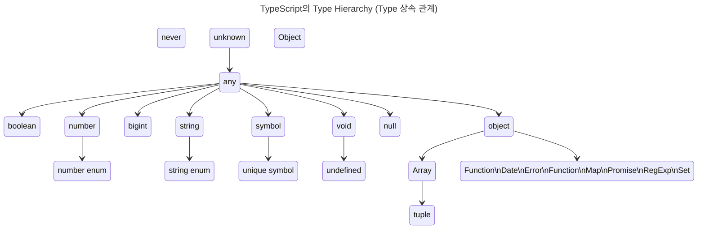

- TypeScript는 정적 Type 언어이며, JavaScript에는 없는 여러 type들을 추가로 지원합니다.
    - TypeScript를 사용함으로써 개발자는 변수, 매개 변수, 반환 값 등의 type을 명시적으로 선언할 수 있어, code의 안정성을 높이고 bug를 미리 방지할 수 있습니다.



- `unknown` Type : 모든 type의 할당이 가능한 최상위 type 중 하나입니다.
    - 어떤 값이든지 할당할 수 있지만, `unknown` type의 변수를 직접적으로 사용하기 전에 먼저 type을 좁혀야 합니다.

- `any` Type : 모든 type의 최상위 type으로, TypeScript의 type 검사를 비활성화하는 탈출구 역할을 합니다.
    - `any`는 모든 type을 할당할 수 있으며, 할당된 변수는 type check 없이 사용할 수 있습니다.

- Primitive Type : `boolean`, `number`, `bigint`, `string`, `symbol`, `void`, `null`, `undefined`가 있습니다.
    - primitive(원시) type은 모두 `any` type에서 파생되며, 각각의 고유한 특성과 용도가 있습니다.
    - `number`와 `string` type은 각각 숫자와 문자열 열거형(enum)을 포함할 수 있습니다.
    - `symbol` type은 유일한 symbol 값을 생성할 수 있으며, `unique symbol`은 상수 symbol에 사용됩니다.
    - `void` type은 함수가 값을 반환하지 않을 때 사용되며, `undefined`는 `void`의 하위 type으로, 변수가 값이 할당되지 않은 상태를 나타냅니다.

- `object` Type : 소문자로 시작하는 'object'는 **non-primitive(primitive가 아닌) type**을 나타냅니다.
    - `number`, `string`, `boolean`, `bigint`, `symbol`, `null`, `undefined`를 제외한 모든 type(**객체, 배열, 함수 등**)을 포함합니다.
    - `Array`, `Function`, `Date`, `Error`, `Map`, `Promise`, `RegExp`, `Set` 등 JavaScript의 내장 객체 type들이 여기에 속합니다.
        - `Array` type은 `tuple` type을 포함하며, `tuple`은 고정된 길이의 배열을 나타내고 각 요소의 type을 지정할 수 있습니다.

- `Object` Type : 대문자로 시작하는 'Object'는 **JavaScript의 모든 객체가 기본적으로 상속받는 최상위 class**입니다.
    - 이 type은 모든 '객체'를 나타내지만, **null을 제외한 모든 type(primitive type 포함)을 포함**합니다.
    - `Object` type은 `.toString()`이나 `.hasOwnProperty()`와 같은 JavaScript의 기본 객체 method에 접근할 수 있게 해 줍니다.
    - 그러나 TypeScript에서는 더 구체적인 type을 사용하여 type의 안전성을 보장하는 것이 좋습니다.

- `never` Type : 어떤 type도 할당될 수 없는 빈 집합입니다.
    - `never` type은 '절대 발생하지 않는 값'을 의미하며, type system에서 code의 안전성을 높이고 논리적 오류를 줄이는 데 도움을 줍니다.
        - exhaustive check(철저한 검사) 또는 type guard에서 유용하게 사용됩니다.
    - TypeScript의 `never` type은 함수가 정상적으로 종료되지 않는다는 것을 나타냅니다.
        - 함수가 예외를 발생시켜 정상적으로 반환되지 않을 때, 종료 지점에 도달하지 않고 반환 값을 생성하지 않기 때문에, 함수의 반환 type은 `never`가 됩니다.
        - 함수가 무한 loop에 빠지게 설계되었다면, 함수는 정상적인 종료 조건 없이 계속해서 실행되기 때문에, 함수의 반환 type은 `never`가 됩니다.


---


## 정적 Typing (Static Typing)

- C-family(C, Java 등) 언어는 변수를 선언할 때 변수에 할당할 값의 type에 따라 **사전에 type을 명시적으로 선언(Type declaration)하고, 선언한 type에 맞는 값을 할당**합니다.
    - 이를 **정적(Static) Typing**이라 합니다.

- JavaScript는 동적 type(dynamic typed) 언어 혹은 느슨한 type(loosely typed) 언어입니다.
    - 변수의 **type의 사전 선언 없이, 값이 할당되는 과정에서 동적으로 type을 추론(Type Inference)**합니다.
        - 동적 type 언어는 type 추론에 의해 **변수의 type이 결정된 후에도 같은 변수에 여러 type의 값을 교차하여 할당**할 수 있습니다.
    - 이를 **동적(Dynamic) Typing**이라 합니다.

- 동적 typing은 사용하기 간편하지만 code를 예측하기 힘들어 예상치 못한 오류를 만들 가능성이 높습니다.
    - 또한 IDE와 같은 도구가 변수나 매개 변수, 함수 반환 값의 type을 알 수 없어, code assist 등의 기능을 지원할 수 없게 합니다.
    
- 정적 typing은 code의 가독성, 예측성, 안정성을 향상시키며, 이는 대규모 project 개발에 크게 도움이 됩니다.


```javascript
var foo;
console.log(typeof foo);    // undefined

foo = null;
console.log(typeof foo);    // object

foo = {};
console.log(typeof foo);    // object

foo = 3;
console.log(typeof foo);    // number

foo = 3.14;
console.log(typeof foo);    // number

foo = "Hi there";
console.log(typeof foo);    // string

foo = true;
console.log(typeof foo);    // boolean
```

- TypeScript의 가장 독특한 특징은 **정적 Typing**을 지원한다는 점입니다.
- 정적 type 언어는 type을 명시적으로 선언하며, type이 결정된 후에는 type을 변경할 수 없습니다.
- 잘못된 type의 값이 할당되거나 반환되면, compiler는 이를 감지해 오류를 발생시킵니다.

```typescript
let foo: string;
let bar: number;
let baz: boolean;

foo = 'Hello';
bar = 123;
baz = 'true';    // error: Type '"true"' is not assignable to type 'boolean'.
```

- 정적 typing은 변수는 물론 함수의 매개 변수와 반환 값에도 사용할 수 있습니다.

```typescript
function add(x: number, y: number): number {
    return x + y;
}

console.log(add(10, 10));    // 20
console.log(add('10', '10'));    // error TS2345: Argument of type '"10"' is not assignable to parameter of type 'number'.
```


---


## Type 선언하기

- type 선언(type declaration)은 code 예측성을 향상시킵니다.
- type 선언은 강력한 type check를 가능하게 하여, '문법 오류'나 'type과 일치하지 않는 값의 할당' 등의 기본적인 오류를 runtime 전에 검출합니다.
    - compile 시점에 type과 문법을 검사합니다.
- VisualStudioCode와 같은 도구를 사용하면, code 작성 시점에 오류를 검출할 수 있어서 개발 효율이 대폭 향상됩니다.


### 변수 Type 선언하기

- TypeScript는 변수명 뒤에 type을 명시하는 것으로 type을 선언할 수 있습니다.

```typescript
let foo: string = 'hello';
```

- 선언한 type에 맞지 않는 값을 할당하면 compile 시점에 오류가 발생합니다.

```typescript
let bar: number = true; // error TS2322: Type 'true' is not assignable to type 'number'.
```


### 함수 Type 선언하기

- 함수의 매개 변수와 반환 값에 대한 type을 선언할 수 있습니다.
- 일반 변수와 마찬가지로 선언된 type에 일치하지 않는 값이 주어지면 오류가 발생합니다.

```typescript
// 함수 선언식
function multiply1(x: number, y: number): number {
    return x * y;
}

// 함수 표현식
const multiply2 = (x: number, y: number): number => x * y;

console.log(multiply1(10, 2));
console.log(multiply2(10, 3));

console.log(multiply1(true, 1));    // error TS2345: Argument of type 'true' is not assignable to parameter of type 'number'.
```


### 다양한 Type에 대한 사전 선언

- TypeScript는 ES5, ES6의 Superset(상위 확장)이므로 **JavaScript의 type을 그대로 사용할 수 있습니다.**
- JavaScript의 type 외에도, **TypeScript 고유의 type이 추가로 제공됩니다.**
- **type은 소문자와 대문자를 구별**하며, **TypeScript가 기본 제공하는 type은 모두 소문자**입니다.

| Type | JS | TS | 설명 |
| --- | --- | --- | --- |
| boolean | O | O | true/false 값 |
| null | O | O | 값이 없다는 것을 명시함 |
| undefined | O | O | 값을 할당하지 않은 변수의 초기값 |
| number | O | O | 숫자 값 (정수, 실수, Infinity, NaN) |
| string | O | O | 문자열 |
| symbol | O | O | 고유하고 수정 불가능한 data type (주로 객체 속성들의 식별자로 사용함) |
| object | O | O | 객체형 (참조형) |
| array |  | O | 배열 |
| tuple |  | O | 고정된 요소 수 만큼의 type을 미리 선언 후 배열을 표현 |
| enum |  | O | 열거형 (숫자 값 집합에 이름을 지정한 것) |
| any |  | O | 모든 type에 대응 가능한 type (type 추론할 수 없거나 type check가 필요 없는 변수에 사용함) |
| void |  | O | 반환 값이 없는 함수의 반환 type |
| never |  | O | 절대 발생하지 않는 값 |

```typescript
/* boolean */
let isDone: boolean = false;

/* null */
let n: null = null;

/* undefined */
let u: undefined = undefined;

/* number */
let decimal: number = 6;
let hex: number = 0xf00d;
let binary: number = 0b1010;
let octal: number = 0o744;

/* string */
let color: string = "blue";
color = 'red';
let myName: string = `Lee`;    // ES6 template 문자열
let greeting: string = `Hello, my name is ${ myName }.`;    // ES6 template 대입문

/* object */
const obj: object = {};

/* array */
let list1: any[] = [1, 'two', true];
let list2: number[] = [1, 2, 3];
let list3: Array<number> = [1, 2, 3];    // generic 배열 type

/* tuple */
let tuple: [string, number];
tuple = ['hello', 10]; // OK
tuple = [10, 'hello']; // Error
tuple = ['hello', 10, 'world', 100];    // Error
tuple.push(true);    // Error

/* enum */
enum Color1 {Red, Green, Blue};
let c1: Color1 = Color1.Green;
console.log(c1);    // 1

enum Color2 {Red = 1, Green, Blue};
let c2: Color2 = Color2.Green;
console.log(c2);    // 2

enum Color3 {Red = 1, Green = 2, Blue = 4};
let c3: Color3 = Color3.Blue;
console.log(c3);    // 4

/* any */
let notSure: any = 4;
notSure = 'maybe a string instead';
notSure = false;    // okay, definitely a boolean

/* void */
function warnUser(): void {
    console.log("This is my warning message");
}

/* never */
function infiniteLoop(): never {
    while (true) {}
}

function error(message: string): never {
    throw new Error(message);
}
```


#### Type을 대문자로 선언하는 경우 : 객체 유형

```typescript
const today: Date = new Date();    // Date type

const elem: HTMLElement = document.getElementById('myId');    // HTMLElement type

class Person { }
const person: Person = new Person();    // Person type
```

- **객체의 유형도 type으로 선언할 수 있으며**, 이 경우에 type은 대문자로 시작합니다.

```typescript
/* String : String 생성자 함수로 생성된 String wrapper 객체 type */
let objectStr: String;
objectStr = 'hello';    // OK
objectStr = new String('hello');    // OK

/* string : 원시 문자열 type */
let primitiveStr: string;
primitiveStr = 'hello';    // OK
primitiveStr = new String('hello');    // Error : 원시 type 문자열 type에 객체를 할당하면 오류 발생
// Type 'String' is not assignable to type 'string'.
// 'string' is a primitive, but 'String' is a wrapper object. Prefer using 'string' when possible.
```

- `string` type은 TypeScript가 기본으로 제공하는 원시 type인 문자열 type을 의미합니다.
- 하지만 대문자로 시작하는 `String` type은 `String` 생성자 함수로 생성된 `String` wrapper 객체 type을 의미합니다.
- 따라서 `string` type에 `String` type을 할당하면 오류가 발생합니다.
    - `String` type에는 `string` type을 할당할 수 있습니다.


---


## Type 추론 : Type 선언 생략

- 만약 **type 선언을 생략하면, 값이 할당되는 과정에서 동적으로 type이 결정**되며, 이를 **type 추론(type inference)**이라 합니다.

```typescript
let foo = 123;    // foo는 number type
foo = 'hi';    // error: Type '"hi"' is not assignable to type 'number'.
```

- 변수 foo에 type을 선언하지 않았으나, type 추론에 의해 변수의 type이 결정됩니다.
- 동적 type 언어는 type 추론에 의해 변수의 type이 결정된 후에도 같은 변수에 여러 type의 값을 교차하여 할당할 수 있습니다.
- 하지만 정적 type 언어는 type이 결정된 후에는 type을 변경할 수 없습니다.
- TypeScript는 정적 type 언어이므로, type 추론으로 type이 결정된 이후에 다른 type의 값을 할당하면 오류가 발생합니다.


### Type 추론이 불가능한 경우 : `any`

- type 선언을 생략하고 값도 할당하지 않아서 type을 추론할 수 없으면, 자동으로 `any` type이 됩니다.

```typescript
let foo;    // let foo: any

foo = 'Hello';
console.log(typeof foo);    // string

foo = true;
console.log(typeof foo);    // boolean
```

- `any` type의 변수는 JavaScript의 `var` keyword로 선언된 변수처럼, 어떤 type의 값도 재할당이 가능합니다.
- 그러나 `any` type은 TypeScript를 사용하는 장점을 없애기 때문에, 사용하지 않는 편이 좋습니다.


---


## Type Casting : 다른 Type으로 바꾸기

- 기존의 type에서 다른 type으로 type casting하려면 `as` keyword를 사용하거나 `<>` 연산자를 사용할 수 있습니다.

```typescript
const $input = document.querySelector('input["type="text"]');    // => $input: Element | null
const val = $input.value;    // TS2339: Property 'value' does not exist on type 'Element'.
```

- `document.querySelector` method는 `Element | null` type의 값을 반환합니다.
- `$input`은 `Element | null` type이며, `$input.value`를 실행하면 compile 오류가 발생합니다.
    - `Element` 또는 `null` type에는 `value`라는 property가 존재하지 않기 때문입니다.
- **`value` property는 `HTMLInputElement` type(`Element` type의 하위 type)에만 존재하므로, type casting이 필요합니다.**

```typescript
// 'as' keyword 사용
const $input = document.querySelector('input["type="text"]') as HTMLInputElement;
const val = $input.value;
```

```typescript
// '<>' 연산자 사용
const $input = <HTMLInputElement>document.querySelector('input["type="text"]');
const val = $input.value;
```


---


## Reference

- <https://poiemaweb.com/typescript-typing>
- <https://inpa.tistory.com/entry/TS-📘-타입스크립트-타입-선언-종류-💯-총정리>
