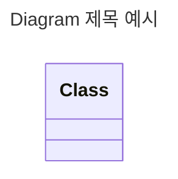
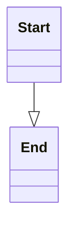
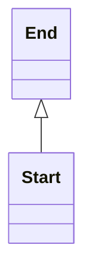
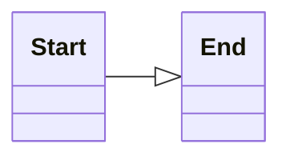
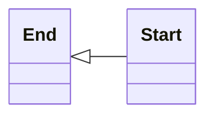
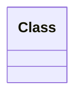

- text와 code를 작성하여 diagram을 그립니다.
    - code로 작성하기 때문에 수정이 쉽습니다.

<pre>
<code>
```mermaid

```
</code>
</pre>

- mermaid code block 안에 mermaid의 문법에 맞게 작성합니다.


---


## Diagram 제목 작성하기

```txt
---
title: [diagramTitle]
---
```

- 모든 종류의 diagram은 `title` 영역에 제목을 작성할 수 있습니다.

```txt
---
title: Diagram 제목 예시
---

classDiagram
class Class
```




---


## Diagram 방향 설정하기

- `direction` 명령어와 상하좌우를 의미하는 `T`, `B`, `L`, `R` code를 이용하여 화살표의 방향을 설정합니다.

```txt
direction [start_direction][end_direction]
```

| Code | 화살표의 방향 |
| --- | --- |
| `direction TB` | 상 -> 하 |
| `direction BT` | 하 -> 상 |
| `direction LR` | 좌 -> 우 |
| `direction RL` | 우 -> 좌 |


### 상 -> 하

```txt
classDiagram
direction TB
Start --|> End
```




### 하 -> 상

```txt
classDiagram
direction BT
Start --|> End
```




### 좌 -> 우

```txt
classDiagram
direction LR
Start --|> End
```




### 우 -> 좌

```txt
classDiagram
direction RL
Start --|> End
```




---


## 주석 작성하기

- percent 기호 두 개(`%%`)를 사용합니다.

```text
classDiagram

%% 주석입니다.
class Class
```




---


## Reference

- <https://mermaid.js.org/intro/>
