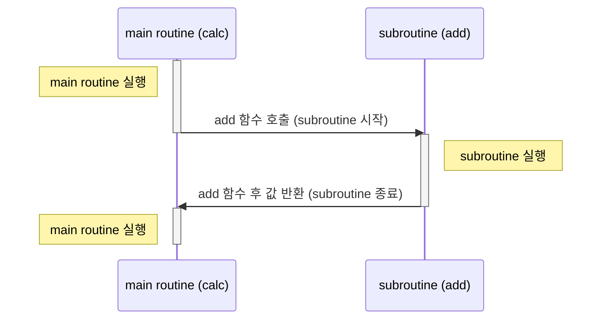
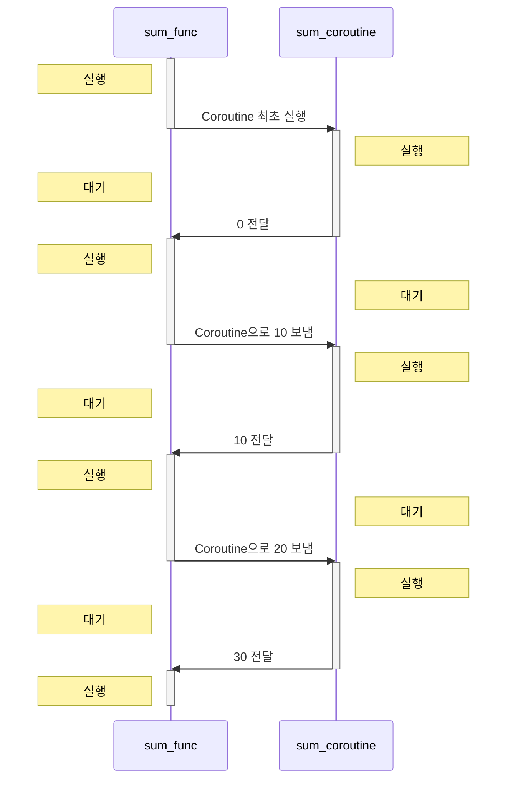

## Coroutine : Co + Routine

- Coroutine은 **상호 협력하는 routine**이라는 의미를 가지며, 동시성 programming(concurrency programming)을 지원하는 개념입니다.
    - Coroutine을 사용하여 **비동기 작업** 역시 더 간결하고 효율적인 방식으로 처리할 수 있습니다.

- Coroutine은 일반적인 함수나 routine과 유사하지만, **실행을 중단**하고 다른 작업을 수행할 수 있는 지점에서 **중단된 상태를 기억**할 수 있다는 점에서 다릅니다.
    - 일반 함수와 달리 호출 시 즉시 완료되지 않고, **필요한 시점에서 중단**할 수 있으며, 다시 호출되었을 때 **중단된 지점부터 실행을 재개**합니다.

- Coroutine은 비슷한 기능을 제공하는 Rx(ReactiveX)보다 가벼우며, 더 간결하고 배우기 쉽습니다.
    - RxJava가 점점 Kotlin의 Coroutine으로 대체되고 있는 가장 큰 이유는 RxJava의 학습 곡선(learning curve)이 가파르기 때문입니다.

- Coroutine을 사용하면 비동기 작업을 직관적이고 가독성 높게 작성할 수 있어, 복잡한 비동기 흐름을 쉽게 관리할 수 있습니다.
    - Coroutine code도 동기 code(전통적인 routine)처럼 **작업을 순차적인 순서로 작성**할 수 있기 때문에 일반적인 비동기 code보다 가독성이 좋습니다.

- UI를 개발할 때 비동기 처리는 필수적이며, 이때 Coroutine을 적용하면 비동기 logic을 쉽게 구현할 수 있습니다.
    - 예를 들어, Android에서는 UI rendering 작업과 data fetching 작업을 비동기적으로 동시에 수행하는 경우가 많습니다.


### Coroutine의 "Co-" : "함께", "공동으로", "동시에"

- Coroutine은 서로 **협력적(cooperative)**으로 실행됩니다.
    - Coroutine은 자신이 실행되는 동안 언제든지 다른 Coroutine에게 제어권을 넘길 수 있습니다.
    - 이는 Coroutine이 명시적으로 양보(yield)하는 방식으로 이루어집니다.
    - 즉, Coroutine은 자신의 실행 흐름을 중단하고 다른 Coroutine이 실행될 수 있도록 협력합니다.

- Coroutine은 **동시성(concurrency)**을 지원합니다.
    - Coroutine은 여러 작업이 병행하여 실행되는 것처럼 보이지만, 실제로는 하나의 thread에서 교대로 실행됩니다.
    - 전통적인 multithreading과 달리 thread 간의 context switching overhead가 없고, 더 가벼운 resource를 사용합니다.


### Coroutine의 "Routine" : "특정한 일을 실행하기 위한 일련의 명령"

- **routine**은 program의 일부분으로, 특정 작업을 수행하는 code block을 의미합니다.
    - routine은 일반적으로 함수나 method를 의미하며, 한 번 호출되면 끝날 때까지 계속 실행됩니다.
    - routine은 시작부터 끝까지 일련의 순차적인 작업을 수행하는 데 집중합니다.

- routine은 일반적으로 동기적으로 실행되지만, Coroutine은 비동기적으로 실행될 수 있습니다.
    - 일반적인 routine과 달리, Coroutine은 중단과 재개가 가능하여 비동기 작업을 처리하는 동안에도 다른 작업을 수행할 수 있습니다.
        - Coroutine은 중단 지점에서 다른 Coroutine에게 제어권을 넘길 수 있습니다.
  
- Coroutine은 routine의 일종(비동기적으로 실행될 수 있는 확장된 형태의 routine)으로, 비동기 작업을 순차적으로 수행할 수 있게 해줍니다.
    - routine의 논리적 단계를 유지하면서도, 비동기 작업을 효율적으로 처리할 수 있게 합니다.
    - 일련의 명령을 협력적이고 동시성 있게 실행할 수 있는 방식으로 확장합니다.


---


## Coroutine의 특징 및 장점

- Coroutine은 비선점적 multitasking과 동시성 programming을 지원하는 program 구조로, 가독성 좋은 비동기 처리 logic을 구현할 수 있다는 장점을 가지고 있습니다.
    - Coroutine을 활용하여 복잡한 비동기 작업을 효율적으로 처리하고, system 자원을 절약하며, 개발 생산성을 크게 향상시킬 수 있습니다.


### Routine 간 협력을 통한 비선점적 Multitasking

- Coroutine은 비선점적 multitasking을 통해 여러 작업을 동시에 처리할 수 있도록 합니다.
    - 이는 실행 중인 Coroutine이 스스로 제어권을 넘길 때까지 실행을 계속하며, 다른 Coroutine이 강제로 실행을 중단시키지 않는다는 의미입니다.
    - 비선점적 multitasking : 각 작업이 자신이 실행될 시점을 스스로 제어하는 방식.

- 협력적 multitasking은 예측 가능한 실행 흐름을 제공하며, 복잡한 상태 관리 없이도 **서로 간섭 없이 작업을 수행**할 수 있게 합니다.

- Coroutine은 자신이 할 일을 다 하면 명시적으로 제어권을 다른 Coroutine에 넘깁니다.
    - 이를 통해 system 자원의 낭비를 최소화하고 효율적인 실행을 보장합니다.

- routine 간 협력을 통해 자연스럽게 multitasking이 이루어지므로, 서로 간의 의존성이 높은 작업들을 효과적으로 관리할 수 있습니다.


### Context Switching 없는 경량 Thread

- Coroutine은 경량 thread(light-weight thread)로, 일반적인 thread와 달리 context switching(문맥 교환)이 필요하지 않습니다.
    - 이는 Coroutine이 실행을 중단하고 다시 시작할 때, CPU 상태를 저장하고 복원하는 작업이 필요하지 않다는 것을 의미합니다.

- context switching이 필요 없기 때문에, memory와 system 자원을 훨씬 적게 사용합니다.
    - thread 간 전환 시 발생하는 context switching은 상당한 overhead를 유발합니다.

- 이러한 특성 덕분에 Coroutine은 속도가 빠르고 memory 사용이 적으며, 수천 개의 Coroutine을 동시에 실행해도 system 자원에 큰 부담을 주지 않습니다.


### 동시성 Programming 지원

- Coroutine은 동시성 programming을 자연스럽게 지원합니다.
    - 여러 Coroutine을 병렬로 실행하여 동시에 여러 작업을 처리할 수 있습니다.
    - 동시성 programming : 여러 작업이 동시에 진행되는 것처럼 보이게 하는 기술.

- Coroutine을 사용하면 I/O Bound 작업이나 network 요청 등의 비동기 작업을 효율적으로 처리할 수 있습니다.


### 가독성 좋은 비동기 처리 Logic

- Coroutine의 가장 큰 장점 중 하나는 가독성 좋은 비동기 처리 logic을 작성할 수 있다는 점입니다.
    - 비동기 작업을 동기 code처럼 순차적으로 작성할 수 있어, code가 직관적이고 이해하기 쉬워집니다.

- callback 지옥(callback hell)이나 복잡한 상태 관리 없이도 비동기 작업을 쉽게 구현할 수 있게 해줍니다.
    - 전통적인 callback 방식이나 Promise 기반의 비동기 처리는 code가 복잡해지고 가독성이 떨어지는 문제가 있습니다.
    - Coroutine을 사용하면 비동기 logic을 마치 순차적으로 실행되는 code처럼 작성할 수 있어, code의 흐름을 쉽게 이해할 수 있습니다.

- 가독성이 좋아지면 debugging과 유지 보수가 용이해지고, 개발자의 생산성 역시 높아집니다.


---


## 일반 함수 호출과 Coroutine 비교

- **일반 함수 호출** : main routine이 subroutine을 호출하고, subroutine이 종료되면 main routine으로 돌아옵니다.

- **Coroutine** : main routine과 subroutine이 대등한 관계로, 특정 시점에 상대방의 code를 실행하며 협력하는 구조를 가집니다.
    - 특정 지점에서 실행을 일시 중지하고 나중에 재개할 수 있어 비동기/동시성 programming이 가능합니다.


### 함수 호출 (Main routine과 Subroutine)

```py
def add(a, b):
    c = a + b
    print(c)
    print("add function")

def calc():
    add(1, 2) 
    print("calc function")
    
calc()
```



- `calc` 함수가 `add` 함수를 호출하고, `add` 함수가 종료된 후 다시 `calc` 함수로 돌아옵니다.
- `add` 함수가 종료되면 해당 함수의 변수와 계산식은 모두 사라집니다.


### Coroutine

```py
def sum_coroutine():
    total = 0
    while True:
        x = (yield total)
        total += x


def sum_func():
    co = sum_coroutine()
    next(co)
    result1 = co.send(10)
    print(f"result1 --> {result1}")
    result2 = co.send(20)
    print(f"result2 --> {result2}")

sum_func()
```



- `sum_coroutine`은 한 번 실행된 후 종료되지 않고, 값을 주입받아 대기 상태로 유지됩니다.
- `main` 함수와 `sum_coroutine`의 객체 `co`가 상호 협력적으로 값을 주고받으며 작동합니다.
    - main routine과 subroutine이 대등한 관계로, 특정 시점에 상대방의 code를 실행하며 협력하는 구조를 가집니다.


---


## Rx vs Coroutine

- Rx(Reactive Extensions)와 Coroutine은 모두 비동기 programming을 쉽게 하기 위한 도구이지만, 그 접근 방식과 철학이 다릅니다.
    - 복잡한 event stream을 처리해야 하는 경우 Rx가 더 적합하고, 순차적이고 간단한 비동기 작업을 효율적으로 관리해야 하는 경우 Coroutine이 더 적합합니다.
- **Coroutine**은 비동기 작업을 순차적인 code처럼 작성할 수 있어 code 가독성이 높아집니다.

|  | Rx | Coroutine |
| --- | --- | --- |
| 설명 | **리액티브 programming**의 한 형태로, data stream과 그 stream을 처리하는 연산자에 중점을 둡니다. event 기반 비동기 programming model을 제공하며, data를 비동기적으로 생성하고 소비합니다. |  **비동기 code**를 작성하기 쉽게 해주는 구조체로, 함수의 실행을 일시 중단하고 나중에 다시 시작할 수 있는 기능을 제공합니다. 비동기 함수 호출을 동기 code처럼 작성할 수 있게 해줍니다. |
| 장점 | 강력한 연산자 세트, 복잡한 data 흐름을 쉽게 표현, 다양한 언어 지원. | 직관적인 code 작성, 기존 동기 code와 유사하게 작성 가능, 성능 효율성 높음. |
| 단점 | 학습 곡선이 가파름, 모든 상황에 적합하지 않음, code 가독성이 떨어질 수 있음. | 복잡한 data stream 처리가 어렵고, Rx처럼 강력한 연산자 세트가 부족함. |
| 사용 사례 | event stream 처리(UI event, network 응답, database 변경 등), 복잡한 비동기 data 흐름 관리, data를 filtering/변환/결합하는 복잡한 연산 수행. | 간단한 비동기 작업(network 호출, file I/O, 지연 작업 등), 순차적인 비동기 작업 실행, 동시성(concurrency) 관리를 통한 성능 최적화. |
| 요약 | 복잡한 data stream과 event 기반 비동기 작업에 적합하며, 연산자를 사용한 data 변환과 결합 기능이 강력합니다. | 간단한 비동기 작업을 동기 code처럼 작성할 수 있게 해주며, 순차적인 비동기 작업과 성능 최적화에 유리합니다. |


### Rx (Reactive Extensions) : Data Stream과 비동기 Event Sequence를 다루기 위한 Library

```kotlin
val observable = Observable.just(1, 2, 3, 4, 5)
observable
    .map { it * 2 }
    .filter { it > 5 }
    .subscribe(
        { println(it) },
        { error -> println("Error : $error") },
        { println("Completed") }
    )
```

- **Observable** : 시간에 따라 발생하는 data stream을 나타냅니다.
    - Observable은 data를 생성하고 구독자에게 data를 push합니다.

- **Observer** : Observable을 구독(subscribe)하여 data stream을 소비하는 객체입니다.
    - Observer는 Observable로부터 data event, 오류 event, 완료 event를 수신합니다.

- **Subscription** : Observer가 Observable을 구독하면 반환되는 객체입니다.
    - 구독을 취소할 수 있는 mechanism을 제공합니다.

- **Operator** : data stream을 변환, filtering, 결합하는 함수들입니다.
    - 예를 들어, `map`, `filter`, `merge`, `flatMap` 등의 연산자가 있습니다.

- **Scheduler** : Rx 연산이 실행되는 thread를 제어하는 데 사용됩니다.
    - 주로 IO 작업, 계산 작업, UI update 등을 적절한 thread에서 수행하도록 합니다.


### Coroutine : 비동기 작업을 순차적인 Code처럼 작성할 수 있게 해주는 개념

```kotlin
fun main() = runBlocking {
    val deferred = async {
        delay(1000L)
        "Hello"
    }
    println(deferred.await())
}
```

- **Coroutine** : 비동기 작업을 수행하는 경량 thread입니다.
    - blocking 없이 일시 중단하고 재개할 수 있습니다.

- **Coroutine Scope** : Coroutine이 실행되는 범위입니다.
    - Coroutine Scope는 모든 자식 Coroutine의 생명 주기를 관리합니다.
    - 대표적으로 `GlobalScope`, `CoroutineScope` 등이 있습니다.

- **Suspend Function** : 일시 중단할 수 있는 함수입니다.
    - Kotlin에서는 `suspend` keyword를 사용하여 정의합니다.
    - 다른 Coroutine을 blocking하지 않고 비동기 작업을 수행할 수 있습니다.

- **Job** : Coroutine의 생명 주기를 제어하는 객체입니다.
    - Job을 사용하여 Coroutine을 취소하거나 완료 상태를 확인할 수 있습니다.

- **Dispatcher** : Coroutine이 실행되는 thread를 제어합니다.
    - 주로 `Dispatchers.Main`, `Dispatchers.IO`, `Dispatchers.Default` 등이 사용됩니다.

- **Deferred** : 비동기 작업의 결과를 나타내는 객체입니다.
    - `await`를 사용하여 결과를 기다릴 수 있습니다.


---


## Reference

- <https://ko.wikipedia.org/wiki/Coroutine>
- <https://kotlinlang.org/docs/Coroutines-basics.html>
- <https://dev.gmarket.com/82>
- <https://velog.io/@jaebig/python-동시성-관리-3-CoroutineCoroutine>
